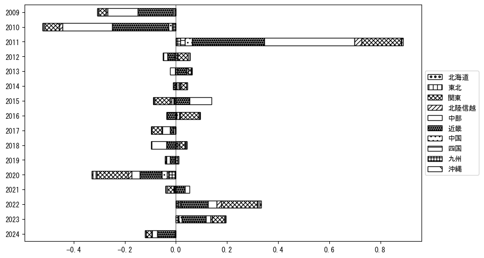
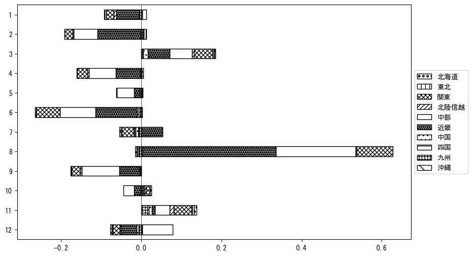

`<!DOCTYPE html>`{=html}
<html lang="ja">
<head>
    <meta charset="UTF-8">
    <meta name="description" content="">
    <link rel="stylesheet" href="../css/style.css">
    <title>宿泊者数の重心 | 三重県</title>
</head>    
<body>
<body>
<nav id ="global_navi">
    <ul>
        <li>[トップ](../index.html)</li>
        <li>[使い方](../how_to_use.html)</li>
        <li>[データについて](../on_data.html)</li>
        <li>[算出方法について](../method.html)</li>
        <li>[発展的な使い方](../developer.html)</li>
        <li>[サイトポリシー](../policy.html)</li>
    </ul>
</nav>
<ol class="breadcrumb">
    <li>[トップ](../index.html)</li>
    <li>三重県</li>
</ol>
<h1 id="h1_0">三重県</h1>

<ul>
  <li> **[１．延べ宿泊者（総数、月次）の推移](#h1_1)** 
    <ul>
      <li> [時系列グラフ](#h2_1) </li>
      <li> [基本統計量](#h2_2) </li>
    </ul>
  </li>  
</ul>

<ul>
  <li> **[２．宿泊者数の重心（年平均の推移）](#h1_2)** 
  <ul>
  <li> [重心の前年平均からの移動距離と方位、および緯度・経度](#h2_4) </li>
  <li> [運輸局別延べ宿泊者数](#h2_5) 
  <ul>
  <li> [時系列（年平均）](#h3_1) </li>
  <li> [寄与度（前年からの変化率に対する）](#h3_2) </li>
  </ul>
  </li>
  </ul>
  </li>
</ul>

<ul>
  <li> **[３．宿泊者数の重心（月別）](#h1_3)** 
  <ul>
  <li> [全期間（2008年1月～2023年12月）の平均と月別平均の比較](#h2_6) </li>
  <li> [運輸局別延べ宿泊者数](#h2_7) 
  <ul>
  <li> [月別平均（2008年1月～2023年12月）](#h3_3) </li>
  <li> [寄与度（全期間の平均から月別平均への変化率に対する）](#h3_4) </li>
  </ul>
  </li>
  </ul>
  </li>
</ul>

<ul>
<li> **[４．データのダウンロード](#h1_4)** </li>
</ul>

<h1 id="h1_1">１．延べ宿泊者（総数）の推移</h1>
<h2 id="h2_1">時系列グラフ</h2>

<figcaption>図１：三重県内の従業員数100人以上の宿泊施設での延べ宿泊者数（国外、居住地不詳を含む総数）。</figcaption>

<h2 id="h2_2">基本統計量</h2>
|  | 平均 | 標準偏差 | 最小値 | 最大値 |
|:----:|:----:|:----:|:----:|:----:|
| 2008年 | 140,254 | 36,420 | 105,499 (6月) | 238,134 (8月) |
| 2009年 | 108,093 | 32,308 | 69,938 (10月) | 177,485 (8月) |
| 2010年 | 56,595 | 21,678 | 31,879 (6月) | 115,111 (8月) |
| 2011年 | 80,700 | 21,468 | 54,192 (6月) | 126,411 (8月) |
| 2012年 | 87,239 | 21,778 | 64,165 (6月) | 142,309 (8月) |
| 2013年 | 90,239 | 24,694 | 61,902 (6月) | 140,209 (3月) |
| 2014年 | 91,983 | 18,683 | 61,342 (9月) | 129,351 (3月) |
| 2015年 | 93,573 | 16,799 | 74,770 (2月) | 128,518 (8月) |
| 2016年 | 97,878 | 33,283 | 63,485 (6月) | 190,511 (8月) |
| 2017年 | 95,836 | 23,515 | 74,937 (2月) | 163,589 (8月) |
| 2018年 | 96,827 | 31,837 | 73,884 (7月) | 186,710 (8月) |
| 2019年 | 87,462 | 20,963 | 59,270 (6月) | 121,998 (8月) |
| 2020年 | 55,446 | 35,580 | 2,751 (5月) | 122,379 (11月) |
| 2021年 | 52,514 | 28,468 | 16,259 (1月) | 103,065 (11月) |
| 2022年 | 72,566 | 22,764 | 31,663 (2月) | 115,582 (8月) |
| 2023年 | 88,949 | 18,417 | 55,949 (1月) | 128,606 (8月) |
: 表１：従業員数100人以上の宿泊施設での延べ宿泊者の総数（国外、および居住地不詳を含む）に関する基本統計量。単位は人泊。平均は１か月あたりの平均値を表す。図１に対応。

<h1 id="h1_2">２．宿泊者数の重心（年平均の推移）</h1>

<iframe src="../html/annual/三重県.html" width="1200" height="600"></iframe>
<figcaption>図２：三重県内の従業員数100人以上の宿泊施設での宿泊者数（国外、居住地不詳を除く）の重心（年平均の推移）。</figcaption>

[全画面表示](../html/annual/三重県.html)

<h2 id="h2_4">重心の前年平均からの移動距離と方位、および緯度・経度</h2>
|  | 方位 | 距離 | 緯度 | 経度 |
|:----:|:----:|:----:|:----:|:----:|
| 2008年 | --- | --- | 35.0471 | 136.5166 |
| 2009年 | 南東 | 1.3km | 35.0399 | 136.5275 |
| 2010年 | 東 | 10.7km | 35.0541 | 136.6438 |
| 2011年 | 西北西 | 2.7km | 35.0593 | 136.6144 |
| 2012年 | 東北東 | 16.1km | 35.1152 | 136.7770 |
| 2013年 | 北 | 2.9km | 35.1410 | 136.7823 |
| 2014年 | 東北東 | 5.4km | 35.1681 | 136.8317 |
| 2015年 | 西南西 | 19.1km | 35.0841 | 136.6492 |
| 2016年 | 東北東 | 20.6km | 35.1557 | 136.8576 |
| 2017年 | 西南西 | 7.3km | 35.1419 | 136.7793 |
| 2018年 | 北東 | 7.7km | 35.1947 | 136.8343 |
| 2019年 | 南西 | 3.4km | 35.1697 | 136.8121 |
| 2020年 | 南西 | 16.7km | 35.0524 | 136.6971 |
| 2021年 | 西南西 | 6.3km | 35.0256 | 136.6363 |
| 2022年 | 東北東 | 23.8km | 35.1415 | 136.8561 |
| 2023年 | 西北西 | 4.2km | 35.1599 | 136.8156 |
: 表２：重心の前年平均からの移動距離と方位、および緯度・経度。図２に対応。

<h2 id="h2_5">運輸局別延べ宿泊者数</h2>
<h3 id="h3_1">時系列（年平均）</h3>

<figcaption>図３：三重県内の従業員数100人以上の宿泊施設での１か月あたり平均宿泊者数（国外、居住地不詳を除く）の運輸局別内訳。</figcaption>

<h3 id="h3_2">寄与度（前年からの変化率に対する）</h3>

<figcaption>図４：三重県内の従業員数100人以上の宿泊施設での運輸局別宿泊者数（国外、居住地不詳を除く）から求めた寄与度。</figcaption>

<h1 id="h1_3">３．宿泊者数の重心（月別）</h3>

<iframe src="../html/monthly/三重県.html" width="1200" height="600"></iframe>
<figcaption>図５：三重県内の従業員数100人以上の宿泊施設での宿泊者数（国外、居住地不詳を除く）の重心（月別）。観測期間は2008年1月から2023年12月まで。</figcaption>

[全画面表示](../html/monthly/三重県.html)

<h2 id="h2_6">全期間（2008年1月～2023年12月）の平均と月別平均の比較</h2>
|  | 方位 | 距離 | 緯度 | 経度 |
|:----:|:----:|:----:|:----:|:----:|
| 全期間 | --- | --- | 35.1094 | 136.7269 |
| 1月 | 東南東 | 2.2km | 35.1023 | 136.7500 |
| 2月 | 北東 | 9.6km | 35.1692 | 136.8028 |
| 3月 | 北東 | 7.2km | 35.1531 | 136.7857 |
| 4月 | 北 | 3.6km | 35.1416 | 136.7284 |
| 5月 | 南東 | 1.5km | 35.0984 | 136.7364 |
| 6月 | 北西 | 2.6km | 35.1234 | 136.7040 |
| 7月 | 西南西 | 12.8km | 35.0468 | 136.6094 |
| 8月 | 南西 | 9.6km | 35.0388 | 136.6663 |
| 9月 | 南西 | 2.5km | 35.0960 | 136.7053 |
| 10月 | 北 | 2.4km | 35.1309 | 136.7230 |
| 11月 | 北北東 | 5.8km | 35.1527 | 136.7621 |
| 12月 | 南南東 | 5.9km | 35.0593 | 136.7496 |
: 表３：全期間の平均から月別平均までの移動距離と方位、および緯度・経度。図５に対応。

<h2 id="h2_7">運輸局別延べ宿泊者数</h2>
<h3 id="h3_3">月別平均（2008年1月～2023年12月）</h3>

<figcaption>図６：三重県内の従業員数100人以上の宿泊施設での宿泊者数（国外、居住地不詳を除く）の運輸局別内訳（月別）。</figcaption>

<h3 id="h3_4">寄与度（全期間の平均から月別平均への変化率に対する）</h3>

<figcaption>図７：三重県内の従業員数100人以上の宿泊施設での運輸局別宿泊者数（国外、居住地不詳を除く）から求めた寄与度（月別）。</figcaption>

</body>

<h1 id="h1_4">４．データのダウンロード</h1>
 <ul>
  <li> <a href="../csv/data_by_pref/延べ宿泊者数および重心（三重県）.csv" download>延べ宿泊者数および重心の緯度経度</a> </li>
  <li> <a href="../csv/bar_chart/運輸局別_年平均（三重県）.csv" download>運輸局別延べ宿泊者数（年平均）</a></li>
  <li> <a href="../csv/bar_chart_month/運輸局別_月別（三重県）.csv" download>運輸局別延べ宿泊者数（月別）</a></li>
  <li> <a href="../csv/contrib/前年からの変化率に対する寄与度（三重県）.csv" download>前年からの変化率に対する寄与度</a></li>
  <li> <a href="../csv/contrib_month/月別平均への変化率に対する寄与度（三重県）.csv" download>月別平均への変化率に対する寄与度</a></li>
</ul>

出典：観光庁「宿泊旅行統計調査」に収録された「施設所在地、居住地別延べ宿泊者数（従業員数100人以上の施設）」

国土地理院「白地図（[地理院タイル](https://maps.gsi.go.jp/development/ichiran.html)）」（図２と図５）

