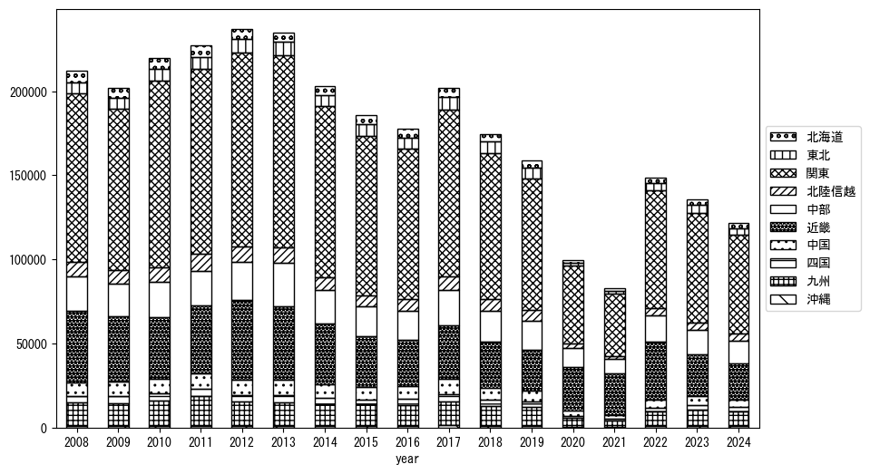

`<!DOCTYPE html>`{=html}
<html lang="ja">
<head>
    <meta charset="UTF-8">
    <meta name="description" content="">
    <link rel="stylesheet" href="../css/style.css">
    <title>宿泊者数の重心 | 京都府</title>
</head>    
<body>
<body>
<nav id ="global_navi">
    <ul>
        <li>[トップ](../index.html)</li>
        <li>[使い方](../how_to_use.html)</li>
        <li>[データについて](../on_data.html)</li>
        <li>[算出方法について](../method.html)</li>
        <li>[発展的な使い方](../developer.html)</li>
        <li>[サイトポリシー](../policy.html)</li>
    </ul>
</nav>
<ol class="breadcrumb">
    <li>[トップ](../index.html)</li>
    <li>京都府</li>
</ol>
<h1 id="h1_0">京都府</h1>

<ul>
  <li> **[１．延べ宿泊者（総数、月次）の推移](#h1_1)** 
    <ul>
      <li> [時系列グラフ](#h2_1) </li>
      <li> [基本統計量](#h2_2) </li>
    </ul>
  </li>  
</ul>

<ul>
  <li> **[２．宿泊者数の重心（年平均の推移）](#h1_2)** 
  <ul>
  <li> [重心の前年平均からの移動距離と方位、および緯度・経度](#h2_4) </li>
  <li> [運輸局別延べ宿泊者数](#h2_5) 
  <ul>
  <li> [時系列（年平均）](#h3_1) </li>
  <li> [寄与度（前年からの変化率に対する）](#h3_2) </li>
  </ul>
  </li>
  </ul>
  </li>
</ul>

<ul>
  <li> **[３．宿泊者数の重心（月別）](#h1_3)** 
  <ul>
  <li> [全期間（2008年1月～2023年12月）の平均と月別平均の比較](#h2_6) </li>
  <li> [運輸局別延べ宿泊者数](#h2_7) 
  <ul>
  <li> [月別平均（2008年1月～2023年12月）](#h3_3) </li>
  <li> [寄与度（全期間の平均から月別平均への変化率に対する）](#h3_4) </li>
  </ul>
  </li>
  </ul>
  </li>
</ul>

<ul>
<li> **[４．データのダウンロード](#h1_4)** </li>
</ul>

<h1 id="h1_1">１．延べ宿泊者（総数）の推移</h1>
<h2 id="h2_1">時系列グラフ</h2>

<figcaption>図１：京都府内の従業員数100人以上の宿泊施設での延べ宿泊者数（国外、居住地不詳を含む総数）。</figcaption>

<h2 id="h2_2">基本統計量</h2>
|  | 平均 | 標準偏差 | 最小値 | 最大値 |
|:----:|:----:|:----:|:----:|:----:|
| 2008年 | 265,879 | 40,832 | 203,462 (1月) | 323,346 (11月) |
| 2009年 | 248,057 | 47,904 | 169,724 (6月) | 312,233 (11月) |
| 2010年 | 281,329 | 51,561 | 180,617 (1月) | 338,212 (5月) |
| 2011年 | 266,099 | 43,419 | 201,266 (1月) | 346,826 (11月) |
| 2012年 | 304,976 | 49,719 | 207,541 (2月) | 382,099 (8月) |
| 2013年 | 315,299 | 59,550 | 200,654 (1月) | 373,947 (11月) |
| 2014年 | 285,746 | 42,830 | 220,509 (1月) | 345,886 (4月) |
| 2015年 | 281,183 | 40,221 | 197,606 (1月) | 327,584 (5月) |
| 2016年 | 271,170 | 25,594 | 230,295 (2月) | 308,346 (8月) |
| 2017年 | 316,155 | 43,461 | 228,243 (2月) | 365,519 (8月) |
| 2018年 | 287,287 | 29,075 | 250,921 (1月) | 337,895 (3月) |
| 2019年 | 271,015 | 44,976 | 160,392 (1月) | 331,275 (5月) |
| 2020年 | 117,088 | 78,787 | 10,974 (5月) | 272,717 (11月) |
| 2021年 | 96,619 | 59,132 | 37,461 (5月) | 213,922 (12月) |
| 2022年 | 184,916 | 74,874 | 68,268 (2月) | 318,787 (11月) |
| 2023年 | 263,219 | 45,571 | 172,782 (2月) | 322,341 (11月) |
: 表１：従業員数100人以上の宿泊施設での延べ宿泊者の総数（国外、および居住地不詳を含む）に関する基本統計量。単位は人泊。平均は１か月あたりの平均値を表す。図１に対応。

<h1 id="h1_2">２．宿泊者数の重心（年平均の推移）</h1>

<iframe src="../html/annual/京都府.html" width="1200" height="600"></iframe>
<figcaption>図２：京都府内の従業員数100人以上の宿泊施設での宿泊者数（国外、居住地不詳を除く）の重心（年平均の推移）。</figcaption>

[全画面表示](../html/annual/京都府.html)

<h2 id="h2_4">重心の前年平均からの移動距離と方位、および緯度・経度</h2>
|  | 方位 | 距離 | 緯度 | 経度 |
|:----:|:----:|:----:|:----:|:----:|
| 2008年 | --- | --- | 35.5602 | 137.5654 |
| 2009年 | 南西 | 4.2km | 35.5359 | 137.5293 |
| 2010年 | 東北東 | 12.8km | 35.5721 | 137.6637 |
| 2011年 | 西南西 | 11.0km | 35.5494 | 137.5452 |
| 2012年 | 東 | 7.3km | 35.5433 | 137.6254 |
| 2013年 | 東南東 | 3.1km | 35.5286 | 137.6543 |
| 2014年 | 北北東 | 3.7km | 35.5584 | 137.6726 |
| 2015年 | 北東 | 5.2km | 35.5869 | 137.7184 |
| 2016年 | 西 | 2.6km | 35.5831 | 137.6898 |
| 2017年 | 西南西 | 9.2km | 35.5391 | 137.6039 |
| 2018年 | 東北東 | 7.7km | 35.5708 | 137.6793 |
| 2019年 | 西南西 | 4.7km | 35.5521 | 137.6333 |
| 2020年 | 南西 | 31.2km | 35.3559 | 137.3868 |
| 2021年 | 西北西 | 5.5km | 35.3690 | 137.3285 |
| 2022年 | 東北東 | 19.0km | 35.4371 | 137.5210 |
| 2023年 | 北 | 5.9km | 35.4898 | 137.5260 |
: 表２：重心の前年平均からの移動距離と方位、および緯度・経度。図２に対応。

<h2 id="h2_5">運輸局別延べ宿泊者数</h2>
<h3 id="h3_1">時系列（年平均）</h3>

<figcaption>図３：京都府内の従業員数100人以上の宿泊施設での１か月あたり平均宿泊者数（国外、居住地不詳を除く）の運輸局別内訳。</figcaption>

<h3 id="h3_2">寄与度（前年からの変化率に対する）</h3>

<figcaption>図４：京都府内の従業員数100人以上の宿泊施設での運輸局別宿泊者数（国外、居住地不詳を除く）から求めた寄与度。</figcaption>

<h1 id="h1_3">３．宿泊者数の重心（月別）</h3>

<iframe src="../html/monthly/京都府.html" width="1200" height="600"></iframe>
<figcaption>図５：京都府内の従業員数100人以上の宿泊施設での宿泊者数（国外、居住地不詳を除く）の重心（月別）。観測期間は2008年1月から2023年12月まで。</figcaption>

[全画面表示](../html/monthly/京都府.html)

<h2 id="h2_6">全期間（2008年1月～2023年12月）の平均と月別平均の比較</h2>
|  | 方位 | 距離 | 緯度 | 経度 |
|:----:|:----:|:----:|:----:|:----:|
| 全期間 | --- | --- | 35.5207 | 137.5839 |
| 1月 | 西南西 | 37.4km | 35.3599 | 137.2220 |
| 2月 | 西南西 | 26.9km | 35.3932 | 137.3325 |
| 3月 | 東北東 | 6.1km | 35.5509 | 137.6398 |
| 4月 | 北東 | 4.5km | 35.5452 | 137.6228 |
| 5月 | 東 | 13.9km | 35.5013 | 137.7355 |
| 6月 | 東南東 | 10.6km | 35.4966 | 137.6968 |
| 7月 | 南南西 | 12.2km | 35.4196 | 137.5301 |
| 8月 | 南 | 14.9km | 35.3872 | 137.5629 |
| 9月 | 東 | 4.6km | 35.5221 | 137.6347 |
| 10月 | 北北東 | 40.1km | 35.8544 | 137.7541 |
| 11月 | 北東 | 25.3km | 35.6925 | 137.7681 |
| 12月 | 西 | 6.9km | 35.5258 | 137.5078 |
: 表３：全期間の平均から月別平均までの移動距離と方位、および緯度・経度。図５に対応。

<h2 id="h2_7">運輸局別延べ宿泊者数</h2>
<h3 id="h3_3">月別平均（2008年1月～2023年12月）</h3>

<figcaption>図６：京都府内の従業員数100人以上の宿泊施設での宿泊者数（国外、居住地不詳を除く）の運輸局別内訳（月別）。</figcaption>

<h3 id="h3_4">寄与度（全期間の平均から月別平均への変化率に対する）</h3>

<figcaption>図７：京都府内の従業員数100人以上の宿泊施設での運輸局別宿泊者数（国外、居住地不詳を除く）から求めた寄与度（月別）。</figcaption>

</body>

<h1 id="h1_4">４．データのダウンロード</h1>
 <ul>
  <li> <a href="../csv/data_by_pref/延べ宿泊者数および重心（京都府）.csv" download>延べ宿泊者数および重心の緯度経度</a> </li>
  <li> <a href="../csv/bar_chart/運輸局別_年平均（京都府）.csv" download>運輸局別延べ宿泊者数（年平均）</a></li>
  <li> <a href="../csv/bar_chart_month/運輸局別_月別（京都府）.csv" download>運輸局別延べ宿泊者数（月別）</a></li>
  <li> <a href="../csv/contrib/前年からの変化率に対する寄与度（京都府）.csv" download>前年からの変化率に対する寄与度</a></li>
  <li> <a href="../csv/contrib_month/月別平均への変化率に対する寄与度（京都府）.csv" download>月別平均への変化率に対する寄与度</a></li>
</ul>

出典：観光庁「宿泊旅行統計調査」に収録された「施設所在地、居住地別延べ宿泊者数（従業員数100人以上の施設）」

国土地理院「白地図（[地理院タイル](https://maps.gsi.go.jp/development/ichiran.html)）」（図２と図５）

