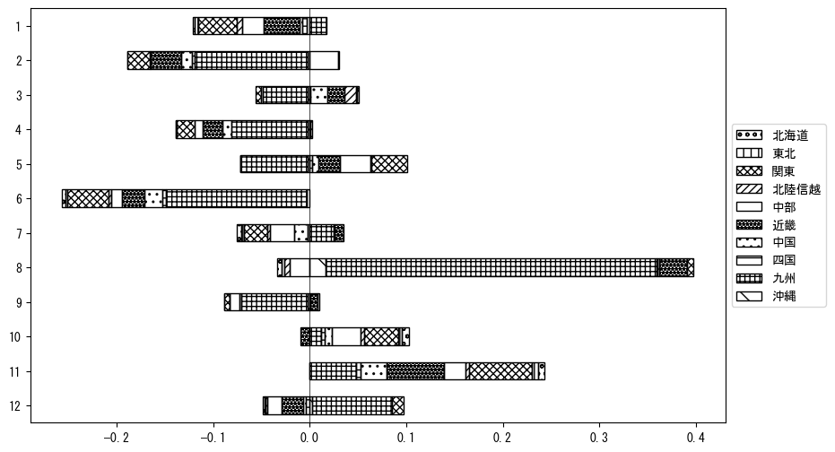

`<!DOCTYPE html>`{=html}
<html lang="ja">
<head>
    <meta charset="UTF-8">
    <meta name="description" content="">
    <link rel="stylesheet" href="../css/style.css">
    <title>宿泊者数の重心 | 佐賀県</title>
</head>    
<body>
<body>
<nav id ="global_navi">
    <ul>
        <li>[トップ](../index.html)</li>
        <li>[使い方](../how_to_use.html)</li>
        <li>[データについて](../on_data.html)</li>
        <li>[算出方法について](../method.html)</li>
        <li>[発展的な使い方](../developer.html)</li>
        <li>[サイトポリシー](../policy.html)</li>
    </ul>
</nav>
<ol class="breadcrumb">
    <li>[トップ](../index.html)</li>
    <li>佐賀県</li>
</ol>
<h1 id="h1_0">佐賀県</h1>

<ul>
  <li> **[１．延べ宿泊者（総数、月次）の推移](#h1_1)** 
    <ul>
      <li> [時系列グラフ](#h2_1) </li>
      <li> [基本統計量](#h2_2) </li>
    </ul>
  </li>  
</ul>

<ul>
  <li> **[２．宿泊者数の重心（年平均の推移）](#h1_2)** 
  <ul>
  <li> [重心の前年平均からの移動距離と方位、および緯度・経度](#h2_4) </li>
  <li> [運輸局別延べ宿泊者数](#h2_5) 
  <ul>
  <li> [時系列（年平均）](#h3_1) </li>
  <li> [寄与度（前年からの変化率に対する）](#h3_2) </li>
  </ul>
  </li>
  </ul>
  </li>
</ul>

<ul>
  <li> **[３．宿泊者数の重心（月別）](#h1_3)** 
  <ul>
  <li> [全期間（2008年1月～2023年12月）の平均と月別平均の比較](#h2_6) </li>
  <li> [運輸局別延べ宿泊者数](#h2_7) 
  <ul>
  <li> [月別平均（2008年1月～2023年12月）](#h3_3) </li>
  <li> [寄与度（全期間の平均から月別平均への変化率に対する）](#h3_4) </li>
  </ul>
  </li>
  </ul>
  </li>
</ul>

<ul>
<li> **[４．データのダウンロード](#h1_4)** </li>
</ul>

<h1 id="h1_1">１．延べ宿泊者（総数）の推移</h1>
<h2 id="h2_1">時系列グラフ</h2>

<figcaption>図１：佐賀県内の従業員数100人以上の宿泊施設での延べ宿泊者数（国外、居住地不詳を含む総数）。</figcaption>

<h2 id="h2_2">基本統計量</h2>
|  | 平均 | 標準偏差 | 最小値 | 最大値 |
|:----:|:----:|:----:|:----:|:----:|
| 2008年 | 24,600 | 4,086 | 17,509 (9月) | 31,286 (5月) |
| 2009年 | 21,882 | 4,253 | 15,323 (1月) | 30,132 (8月) |
| 2010年 | 22,840 | 4,750 | 14,360 (6月) | 31,496 (8月) |
| 2011年 | 21,987 | 4,327 | 16,357 (12月) | 32,685 (8月) |
| 2012年 | 21,588 | 4,831 | 14,652 (1月) | 29,744 (8月) |
| 2013年 | 19,025 | 3,377 | 13,991 (6月) | 25,124 (8月) |
| 2014年 | 12,949 | 4,498 | 8,574 (6月) | 22,298 (11月) |
| 2015年 | 28,473 | 3,254 | 22,985 (2月) | 34,373 (8月) |
| 2016年 | 25,055 | 4,368 | 19,751 (10月) | 34,451 (8月) |
| 2017年 | 26,000 | 4,096 | 18,766 (11月) | 33,251 (8月) |
| 2018年 | 22,135 | 5,470 | 15,454 (2月) | 32,079 (8月) |
| 2019年 | 23,145 | 6,332 | 7,953 (6月) | 31,657 (8月) |
| 2020年 | 12,220 | 8,139 | 867 (5月) | 23,828 (1月) |
| 2021年 | 10,244 | 4,100 | 4,822 (2月) | 16,979 (10月) |
| 2022年 | 14,621 | 4,584 | 4,281 (2月) | 20,209 (7月) |
| 2023年 | 15,609 | 2,944 | 10,537 (9月) | 21,919 (12月) |
: 表１：従業員数100人以上の宿泊施設での延べ宿泊者の総数（国外、および居住地不詳を含む）に関する基本統計量。単位は人。平均は１か月あたりの平均値を表す。図１に対応。

<h1 id="h1_2">２．宿泊者数の重心（年平均の推移）</h1>

<iframe src="../html/annual/佐賀県.html" width="1200" height="600"></iframe>
<figcaption>図２：佐賀県内の従業員数100人以上の宿泊施設での宿泊者数（国外、居住地不詳を除く）の重心（年平均の推移）。</figcaption>

[全画面表示](../html/annual/佐賀県.html)

<h2 id="h2_4">重心の前年平均からの移動距離と方位、および緯度・経度</h2>
|  | 方位 | 距離 | 緯度 | 経度 |
|:----:|:----:|:----:|:----:|:----:|
| 2008年 | --- | --- | 33.9369 | 132.3965 |
| 2009年 | 東 | 33.6km | 33.9710 | 132.7581 |
| 2010年 | 東北東 | 9.8km | 34.0013 | 132.8574 |
| 2011年 | 東北東 | 24.1km | 34.0601 | 133.1088 |
| 2012年 | 西南西 | 26.1km | 34.0043 | 132.8343 |
| 2013年 | 北 | 5.4km | 34.0519 | 132.8439 |
| 2014年 | 西北西 | 14.8km | 34.0946 | 132.6916 |
| 2015年 | 東 | 77.7km | 34.2173 | 133.5207 |
| 2016年 | 東北東 | 13.4km | 34.2570 | 133.6576 |
| 2017年 | 東北東 | 40.0km | 34.3761 | 134.0673 |
| 2018年 | 西南西 | 55.2km | 34.2193 | 133.4981 |
| 2019年 | 南東 | 3.5km | 34.1999 | 133.5282 |
| 2020年 | 西南西 | 108.3km | 33.8981 | 132.4131 |
| 2021年 | 北 | 2.7km | 33.9227 | 132.4129 |
| 2022年 | 東北東 | 53.4km | 34.0477 | 132.9712 |
| 2023年 | 東北東 | 49.3km | 34.2109 | 133.4679 |
: 表２：重心の前年平均からの移動距離と方位、および緯度・経度。図２に対応。

<h2 id="h2_5">運輸局別延べ宿泊者数</h2>
<h3 id="h3_1">時系列（年平均）</h3>

<figcaption>図３：佐賀県内の従業員数100人以上の宿泊施設での１か月あたり平均宿泊者数（国外、居住地不詳を除く）の運輸局別内訳。</figcaption>

<h3 id="h3_2">寄与度（前年からの変化率に対する）</h3>

<figcaption>図４：佐賀県内の従業員数100人以上の宿泊施設での運輸局別宿泊者数（国外、居住地不詳を除く）から求めた寄与度。</figcaption>

<h1 id="h1_3">３．宿泊者数の重心（月別）</h3>

<iframe src="../html/monthly/佐賀県.html" width="1200" height="600"></iframe>
<figcaption>図５：佐賀県内の従業員数100人以上の宿泊施設での宿泊者数（国外、居住地不詳を除く）の重心（月別）。観測期間は2008年1月から2023年12月まで。</figcaption>

[全画面表示](../html/monthly/佐賀県.html)

<h2 id="h2_6">全期間（2008年1月～2023年12月）の平均と月別平均の比較</h2>
|  | 方位 | 距離 | 緯度 | 経度 |
|:----:|:----:|:----:|:----:|:----:|
| 全期間 | --- | --- | 34.0918 | 133.0642 |
| 1月 | 西南西 | 62.8km | 33.9201 | 132.4159 |
| 2月 | 東北東 | 18.1km | 34.1451 | 133.2496 |
| 3月 | 東北東 | 22.2km | 34.2001 | 133.2662 |
| 4月 | 北 | 5.2km | 34.1385 | 133.0689 |
| 5月 | 東北東 | 42.6km | 34.1976 | 133.5085 |
| 6月 | 東南東 | 3.8km | 34.0845 | 133.1043 |
| 7月 | 西南西 | 39.0km | 33.9515 | 132.6770 |
| 8月 | 西南西 | 78.1km | 33.7949 | 132.2977 |
| 9月 | 東北東 | 14.8km | 34.1397 | 133.2144 |
| 10月 | 東北東 | 40.3km | 34.2407 | 133.4633 |
| 11月 | 東北東 | 61.0km | 34.2915 | 133.6813 |
| 12月 | 西南西 | 24.6km | 33.9976 | 132.8234 |
: 表３：全期間の平均から月別平均までの移動距離と方位、および緯度・経度。図５に対応。

<h2 id="h2_7">運輸局別延べ宿泊者数</h2>
<h3 id="h3_3">月別平均（2008年1月～2023年12月）</h3>

<figcaption>図６：佐賀県内の従業員数100人以上の宿泊施設での宿泊者数（国外、居住地不詳を除く）の運輸局別内訳（月別）。</figcaption>

<h3 id="h3_4">寄与度（全期間の平均から月別平均への変化率に対する）</h3>

<figcaption>図７：佐賀県内の従業員数100人以上の宿泊施設での運輸局別宿泊者数（国外、居住地不詳を除く）から求めた寄与度（月別）。</figcaption>

</body>

<h1 id="h1_4">４．データのダウンロード</h1>
 <ul>
  <li> <a href="../csv/data_by_pref/延べ宿泊者数および重心（佐賀県）.csv" download>延べ宿泊者数および重心の緯度経度</a> </li>
  <li> <a href="../csv/bar_chart/運輸局別_年平均（佐賀県）.csv" download>運輸局別延べ宿泊者数（年平均）</a></li>
  <li> <a href="../csv/bar_chart_month/運輸局別_月別（佐賀県）.csv" download>運輸局別延べ宿泊者数（月別）</a></li>
  <li> <a href="../csv/contrib/前年からの変化率に対する寄与度（佐賀県）.csv" download>前年からの変化率に対する寄与度</a></li>
  <li> <a href="../csv/contrib_month/月別平均への変化率に対する寄与度（佐賀県）.csv" download>月別平均への変化率に対する寄与度</a></li>
</ul>

出典：観光庁「宿泊旅行統計調査」に収録された「施設所在地別、居住地別延べ宿泊者数（従業員数100人以上の施設）」

国土地理院「白地図（[地理院タイル](https://maps.gsi.go.jp/development/ichiran.html)）」（図２と図５）

