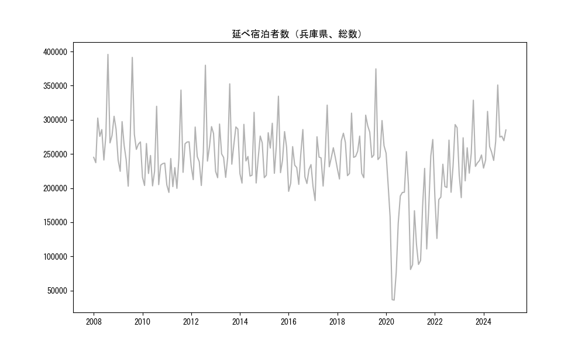
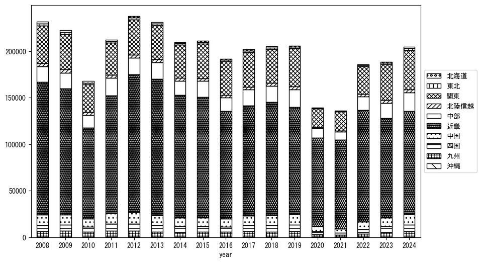
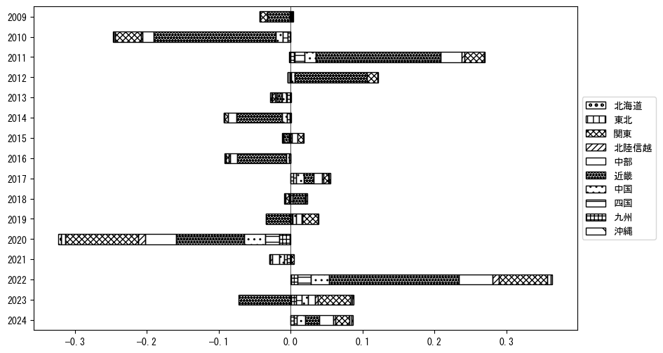
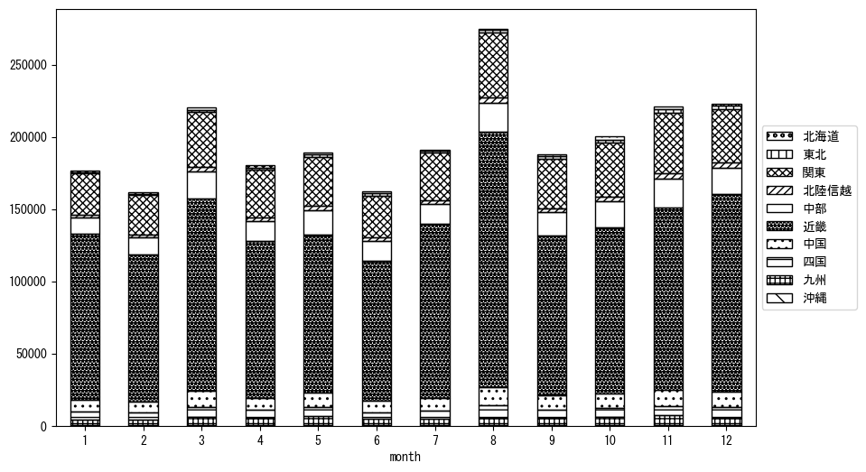
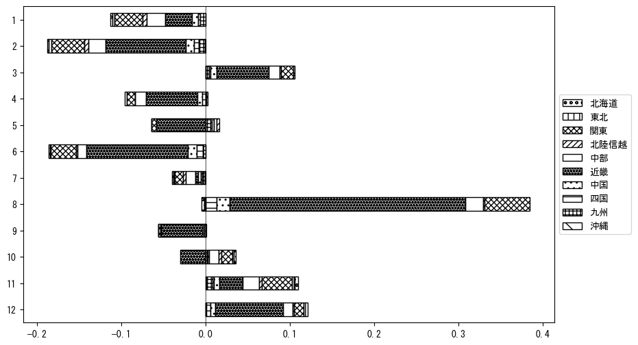

`<!DOCTYPE html>`{=html}
<html lang="ja">
<head>
    <meta charset="UTF-8">
    <meta name="description" content="">
    <link rel="stylesheet" href="../css/style.css">
    <title>宿泊者数の重心 | 兵庫県</title>
</head>    
<body>
<body>
<nav id ="global_navi">
    <ul>
        <li>[トップ](../index.html)</li>
        <li>[使い方](../how_to_use.html)</li>
        <li>[データについて](../on_data.html)</li>
        <li>[算出方法について](../method.html)</li>
        <li>[発展的な使い方](../developer.html)</li>
        <li>[サイトポリシー](../policy.html)</li>
    </ul>
</nav>
<ol class="breadcrumb">
    <li>[トップ](../index.html)</li>
    <li>兵庫県</li>
</ol>
<h1 id="h1_0">兵庫県</h1>

<ul>
  <li> **[１．延べ宿泊者（総数、月次）の推移](#h1_1)** 
    <ul>
      <li> [時系列グラフ](#h2_1) </li>
      <li> [基本統計量](#h2_2) </li>
    </ul>
  </li>  
</ul>

<ul>
  <li> **[２．宿泊者数の重心（年平均の推移）](#h1_2)** 
  <ul>
  <li> [重心の前年平均からの移動距離と方位、および緯度・経度](#h2_4) </li>
  <li> [運輸局別延べ宿泊者数](#h2_5) 
  <ul>
  <li> [時系列（年平均）](#h3_1) </li>
  <li> [寄与度（前年からの変化率に対する）](#h3_2) </li>
  </ul>
  </li>
  </ul>
  </li>
</ul>

<ul>
  <li> **[３．宿泊者数の重心（月別）](#h1_3)** 
  <ul>
  <li> [全期間（2008年1月～2023年12月）の平均と月別平均の比較](#h2_6) </li>
  <li> [運輸局別延べ宿泊者数](#h2_7) 
  <ul>
  <li> [月別平均（2008年1月～2023年12月）](#h3_3) </li>
  <li> [寄与度（全期間の平均から月別平均への変化率に対する）](#h3_4) </li>
  </ul>
  </li>
  </ul>
  </li>
</ul>

<ul>
<li> **[４．データのダウンロード](#h1_4)** </li>
</ul>

<h1 id="h1_1">１．延べ宿泊者（総数）の推移</h1>
<h2 id="h2_1">時系列グラフ</h2>

<figcaption>図１：兵庫県内の従業員数100人以上の宿泊施設での延べ宿泊者数（国外、居住地不詳を含む総数）。</figcaption>

<h2 id="h2_2">基本統計量</h2>
|  | 平均 | 標準偏差 | 最小値 | 最大値 |
|:----:|:----:|:----:|:----:|:----:|
| 2008年 | 282,921 | 41,910 | 237,230 (2月) | 395,836 (8月) |
| 2009年 | 267,022 | 46,695 | 202,782 (6月) | 391,435 (8月) |
| 2010年 | 234,397 | 32,779 | 203,261 (6月) | 319,852 (8月) |
| 2011年 | 240,345 | 42,389 | 193,641 (2月) | 343,548 (8月) |
| 2012年 | 260,413 | 46,601 | 203,834 (6月) | 379,983 (8月) |
| 2013年 | 259,650 | 40,165 | 215,163 (2月) | 352,732 (8月) |
| 2014年 | 245,704 | 34,355 | 207,351 (2月) | 310,961 (8月) |
| 2015年 | 257,816 | 36,476 | 215,254 (1月) | 334,582 (8月) |
| 2016年 | 229,365 | 26,178 | 195,264 (1月) | 285,777 (8月) |
| 2017年 | 241,479 | 36,452 | 181,718 (2月) | 321,528 (8月) |
| 2018年 | 252,409 | 29,336 | 213,333 (2月) | 309,776 (8月) |
| 2019年 | 269,426 | 44,343 | 215,172 (2月) | 374,641 (8月) |
| 2020年 | 162,074 | 74,883 | 35,892 (5月) | 253,424 (11月) |
| 2021年 | 152,872 | 67,193 | 80,724 (1月) | 271,168 (12月) |
| 2022年 | 216,718 | 49,002 | 126,190 (2月) | 293,057 (11月) |
| 2023年 | 242,336 | 35,811 | 185,992 (2月) | 328,746 (8月) |
: 表１：従業員数100人以上の宿泊施設での延べ宿泊者の総数（国外、および居住地不詳を含む）に関する基本統計量。単位は人泊。平均は１か月あたりの平均値を表す。図１に対応。

<h1 id="h1_2">２．宿泊者数の重心（年平均の推移）</h1>

<iframe src="../html/annual/兵庫県.html" width="1200" height="600"></iframe>
<figcaption>図２：兵庫県内の従業員数100人以上の宿泊施設での延べ宿泊者数（国外、居住地不詳を除く）の重心（年平均の推移）。</figcaption>

[全画面表示](../html/annual/兵庫県.html)

<h2 id="h2_4">重心の前年平均からの移動距離と方位、および緯度・経度</h2>
|  | 方位 | 距離 | 緯度 | 経度 |
|:----:|:----:|:----:|:----:|:----:|
| 2008年 | --- | --- | 34.9848 | 136.0770 |
| 2009年 | 西 | 2.4km | 34.9829 | 136.0505 |
| 2010年 | 北東 | 2.1km | 34.9963 | 136.0661 |
| 2011年 | 西南西 | 8.5km | 34.9575 | 135.9864 |
| 2012年 | 南西 | 1.4km | 34.9476 | 135.9770 |
| 2013年 | 東南東 | 2.7km | 34.9373 | 136.0039 |
| 2014年 | 東北東 | 6.0km | 34.9556 | 136.0658 |
| 2015年 | 東 | 2.6km | 34.9569 | 136.0940 |
| 2016年 | 東 | 3.7km | 34.9623 | 136.1339 |
| 2017年 | 西北西 | 2.7km | 34.9699 | 136.1053 |
| 2018年 | 西南西 | 3.0km | 34.9559 | 136.0774 |
| 2019年 | 東北東 | 8.9km | 34.9847 | 136.1683 |
| 2020年 | 西南西 | 27.0km | 34.8863 | 135.8980 |
| 2021年 | 東北東 | 8.0km | 34.9040 | 135.9831 |
| 2022年 | 北東 | 6.3km | 34.9378 | 136.0392 |
| 2023年 | 東北東 | 17.0km | 35.0000 | 136.2096 |
: 表２：重心の前年平均からの移動距離と方位、および緯度・経度。図２に対応。

<h2 id="h2_5">運輸局別延べ宿泊者数</h2>
<h3 id="h3_1">時系列（年平均）</h3>

<figcaption>図３：兵庫県内の従業員数100人以上の宿泊施設での１か月あたり平均延べ宿泊者数（国外、居住地不詳を除く）の運輸局別内訳。</figcaption>

<h3 id="h3_2">寄与度（前年からの変化率に対する）</h3>

<figcaption>図４：兵庫県内の従業員数100人以上の宿泊施設での運輸局別延べ宿泊者数（国外、居住地不詳を除く）から求めた寄与度。</figcaption>

<h1 id="h1_3">３．宿泊者数の重心（月別）</h3>

<iframe src="../html/monthly/兵庫県.html" width="1200" height="600"></iframe>
<figcaption>図５：兵庫県内の従業員数100人以上の宿泊施設での延べ宿泊者数（国外、居住地不詳を除く）の重心（月別）。観測期間は2008年1月から2023年12月まで。</figcaption>

[全画面表示](../html/monthly/兵庫県.html)

<h2 id="h2_6">全期間（2008年1月～2023年12月）の平均と月別平均の比較</h2>
|  | 方位 | 距離 | 緯度 | 経度 |
|:----:|:----:|:----:|:----:|:----:|
| 全期間 | --- | --- | 34.9575 | 136.0585 |
| 1月 | 西南西 | 7.9km | 34.9200 | 135.9854 |
| 2月 | 西南西 | 4.0km | 34.9376 | 136.0222 |
| 3月 | 北 | 0.7km | 34.9642 | 136.0585 |
| 4月 | 西 | 0.2km | 34.9574 | 136.0562 |
| 5月 | 西 | 3.8km | 34.9593 | 136.0167 |
| 6月 | 東北東 | 1.4km | 34.9637 | 136.0723 |
| 7月 | 南西 | 3.4km | 34.9348 | 136.0335 |
| 8月 | 南南西 | 5.2km | 34.9171 | 136.0291 |
| 9月 | 東北東 | 3.1km | 34.9693 | 136.0893 |
| 10月 | 北東 | 8.5km | 35.0022 | 136.1340 |
| 11月 | 東北東 | 10.0km | 35.0024 | 136.1530 |
| 12月 | 北西 | 0.8km | 34.9621 | 136.0516 |
: 表３：全期間の平均から月別平均までの移動距離と方位、および緯度・経度。図５に対応。

<h2 id="h2_7">運輸局別延べ宿泊者数</h2>
<h3 id="h3_3">月別平均（2008年1月～2023年12月）</h3>

<figcaption>図６：兵庫県内の従業員数100人以上の宿泊施設での延べ宿泊者数（国外、居住地不詳を除く）の運輸局別内訳（月別）。</figcaption>

<h3 id="h3_4">寄与度（全期間の平均から月別平均への変化率に対する）</h3>

<figcaption>図７：兵庫県内の従業員数100人以上の宿泊施設での運輸局別延べ宿泊者数（国外、居住地不詳を除く）から求めた寄与度（月別）。</figcaption>

</body>

<h1 id="h1_4">４．データのダウンロード</h1>
 <ul>
  <li> <a href="../csv/data_by_pref/延べ宿泊者数および重心（兵庫県）.csv" download>延べ宿泊者数および重心の緯度経度</a> </li>
  <li> <a href="../csv/bar_chart/運輸局別_年平均（兵庫県）.csv" download>運輸局別延べ宿泊者数（年平均）</a></li>
  <li> <a href="../csv/bar_chart_month/運輸局別_月別（兵庫県）.csv" download>運輸局別延べ宿泊者数（月別）</a></li>
  <li> <a href="../csv/contrib/前年からの変化率に対する寄与度（兵庫県）.csv" download>前年からの変化率に対する寄与度</a></li>
  <li> <a href="../csv/contrib_month/月別平均への変化率に対する寄与度（兵庫県）.csv" download>月別平均への変化率に対する寄与度</a></li>
</ul>

出典：観光庁「宿泊旅行統計調査」に収録された「施設所在地、居住地別延べ宿泊者数（従業員数100人以上の施設）」

国土地理院「白地図（[地理院タイル](https://maps.gsi.go.jp/development/ichiran.html)）」（図２と図５）

