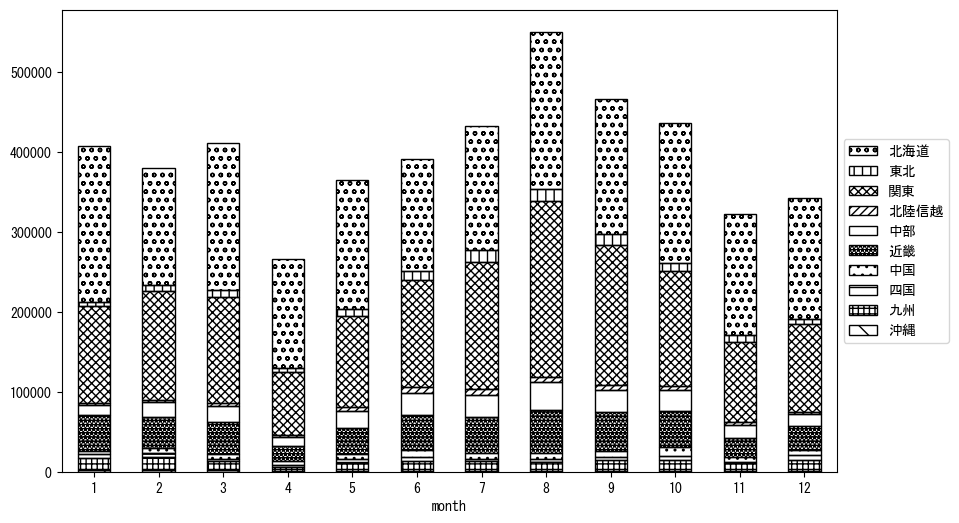

`<!DOCTYPE html>`{=html}
<html lang="ja">
<head>
    <meta charset="UTF-8">
    <meta name="description" content="">
    <link rel="stylesheet" href="../css/style.css">
    <title>宿泊者数の重心 | 北海道</title>
</head>    
<body>
<body>
<nav id ="global_navi">
    <ul>
        <li>[トップ](../index.html)</li>
        <li>[使い方](../how_to_use.html)</li>
        <li>[データについて](../on_data.html)</li>
        <li>[算出方法について](../method.html)</li>
        <li>[発展的な使い方](../developer.html)</li>
        <li>[サイトポリシー](../policy.html)</li>
    </ul>
</nav>
<ol class="breadcrumb">
    <li>[トップ](../index.html)</li>
    <li>北海道</li>
</ol>
<h1 id="h1_0">北海道</h1>

<ul>
  <li> **[１．延べ宿泊者（総数、月次）の推移](#h1_1)** 
    <ul>
      <li> [時系列グラフ](#h2_1) </li>
      <li> [基本統計量](#h2_2) </li>
    </ul>
  </li>  
</ul>

<ul>
  <li> **[２．宿泊者数の重心（年平均の推移）](#h1_2)** 
  <ul>
  <li> [重心の前年平均からの移動距離と方位、および緯度・経度](#h2_4) </li>
  <li> [運輸局別延べ宿泊者数](#h2_5) 
  <ul>
  <li> [時系列（年平均）](#h3_1) </li>
  <li> [寄与度（前年からの変化率に対する）](#h3_2) </li>
  </ul>
  </li>
  </ul>
  </li>
</ul>

<ul>
  <li> **[３．宿泊者数の重心（月別）](#h1_3)** 
  <ul>
  <li> [全期間（2008年1月～2024年12月）の平均と月別平均の比較](#h2_6) </li>
  <li> [運輸局別延べ宿泊者数](#h2_7) 
  <ul>
  <li> [月別平均（2008年1月～2024年12月）](#h3_3) </li>
  <li> [寄与度（全期間の平均から月別平均への変化率に対する）](#h3_4) </li>
  </ul>
  </li>
  </ul>
  </li>
</ul>

<ul>
<li> **[４．データのダウンロード](#h1_4)** </li>
</ul>

<h1 id="h1_1">１．延べ宿泊者（総数）の推移</h1>
<h2 id="h2_1">時系列グラフ</h2>

<figcaption>図１：北海道内の従業員数100人以上の宿泊施設での延べ宿泊者数（国外、居住地不詳を含む総数）。</figcaption>

<h2 id="h2_2">基本統計量</h2>
|  | 平均 | 標準偏差 | 最小値 | 最大値 |
|:----:|:----:|:----:|:----:|:----:|
| 2008年 | 774,908 | 136,761 | 488,982 (4月) | 1,004,598 (8月) |
| 2009年 | 711,612 | 140,141 | 431,472 (4月) | 992,433 (8月) |
| 2010年 | 560,033 | 162,522 | 276,524 (4月) | 767,679 (8月) |
| 2011年 | 498,029 | 130,068 | 249,590 (4月) | 735,823 (8月) |
| 2012年 | 522,267 | 122,903 | 299,222 (4月) | 789,739 (8月) |
| 2013年 | 618,064 | 135,140 | 389,345 (4月) | 915,801 (8月) |
| 2014年 | 622,478 | 98,933 | 381,507 (4月) | 782,848 (8月) |
| 2015年 | 639,801 | 122,631 | 412,369 (4月) | 894,598 (8月) |
| 2016年 | 622,191 | 112,556 | 399,009 (11月) | 773,119 (8月) |
| 2017年 | 630,974 | 106,053 | 411,581 (11月) | 792,734 (8月) |
| 2018年 | 622,567 | 104,341 | 464,752 (9月) | 796,806 (8月) |
| 2019年 | 643,931 | 96,112 | 457,537 (11月) | 788,781 (1月) |
| 2020年 | 283,393 | 215,996 | 40,188 (5月) | 767,530 (1月) |
| 2021年 | 222,325 | 90,483 | 113,187 (6月) | 429,221 (12月) |
| 2022年 | 387,537 | 103,539 | 186,143 (2月) | 550,249 (8月) |
| 2023年 | 507,989 | 100,175 | 313,256 (4月) | 677,551 (8月) |
| 2024年 | 537,240 | 103,245 | 345,344 (4月) | 742,630 (8月) |
: 表１：従業員数100人以上の宿泊施設での延べ宿泊者の総数（国外、および居住地不詳を含む）に関する基本統計量。単位は人泊。平均は１か月あたりの平均値を表す。図１に対応。

<h1 id="h1_2">２．宿泊者数の重心（年平均の推移）</h1>

<iframe src="../html/annual/北海道.html" width="1200" height="600"></iframe>
<figcaption>図２：北海道内の従業員数100人以上の宿泊施設での延べ宿泊者数（国外、居住地不詳を除く）の重心（年平均の推移）。</figcaption>

[全画面表示](../html/annual/北海道.html)

<h2 id="h2_4">重心の前年平均からの移動距離と方位、および緯度・経度</h2>
|  | 方位 | 距離 | 緯度 | 経度 |
|:----:|:----:|:----:|:----:|:----:|
| 2008年 | --- | --- | 38.5206 | 139.1922 |
| 2009年 | 東 | 5.4km | 38.5202 | 139.2541 |
| 2010年 | 西 | 1.8km | 38.5222 | 139.2332 |
| 2011年 | 北北東 | 26.9km | 38.7344 | 139.3818 |
| 2012年 | 南南西 | 25.2km | 38.5207 | 139.2846 |
| 2013年 | 北 | 14.8km | 38.6521 | 139.3144 |
| 2014年 | 北北東 | 15.0km | 38.7785 | 139.3767 |
| 2015年 | 南南西 | 29.3km | 38.5453 | 139.2179 |
| 2016年 | 北 | 3.5km | 38.5768 | 139.2226 |
| 2017年 | 南南西 | 28.4km | 38.3568 | 139.0576 |
| 2018年 | 東 | 5.1km | 38.3577 | 139.1164 |
| 2019年 | 北北東 | 15.6km | 38.4906 | 139.1729 |
| 2020年 | 北北東 | 163.6km | 39.8503 | 139.9017 |
| 2021年 | 東 | 4.3km | 39.8501 | 139.9523 |
| 2022年 | 南南西 | 112.2km | 38.9346 | 139.3996 |
| 2023年 | 南南西 | 73.2km | 38.3407 | 139.0355 |
| 2024年 | 北北東 | 2.1km | 38.3587 | 139.0437 |
: 表２：重心の前年平均からの移動距離と方位、および緯度・経度。図２に対応。

<h2 id="h2_5">運輸局別延べ宿泊者数</h2>
<h3 id="h3_1">時系列（年平均）</h3>

<figcaption>図３：北海道内の従業員数100人以上の宿泊施設での１か月あたり平均延べ宿泊者数（国外、居住地不詳を除く）の運輸局別内訳。</figcaption>

<h3 id="h3_2">寄与度（前年からの変化率に対する）</h3>

<figcaption>図４：北海道内の従業員数100人以上の宿泊施設での運輸局別延べ宿泊者数（国外、居住地不詳を除く）から求めた寄与度。</figcaption>

<h1 id="h1_3">３．宿泊者数の重心（月別）</h3>

<iframe src="../html/monthly/北海道.html" width="1200" height="600"></iframe>
<figcaption>図５：北海道内の従業員数100人以上の宿泊施設での延べ宿泊者数（国外、居住地不詳を除く）の重心（月別）。観測期間は2008年1月から2024年12月まで。</figcaption>

[全画面表示](../html/monthly/北海道.html)

<h2 id="h2_6">全期間（2008年1月～2024年12月）の平均と月別平均の比較</h2>
|  | 方位 | 距離 | 緯度 | 経度 |
|:----:|:----:|:----:|:----:|:----:|
| 全期間 | --- | --- | 38.7006 | 139.3034 |
| 1月 | 北 | 42.1km | 39.0790 | 139.3399 |
| 2月 | 南南西 | 38.6km | 38.3972 | 139.0862 |
| 3月 | 北北東 | 30.4km | 38.9552 | 139.4321 |
| 4月 | 北北東 | 91.5km | 39.4599 | 139.7149 |
| 5月 | 北北東 | 30.8km | 38.9632 | 139.4166 |
| 6月 | 南南西 | 44.8km | 38.3340 | 139.0871 |
| 7月 | 南南西 | 44.0km | 38.3124 | 139.2040 |
| 8月 | 南 | 42.1km | 38.3232 | 139.3457 |
| 9月 | 南 | 43.5km | 38.3158 | 139.2106 |
| 10月 | 南南西 | 30.5km | 38.4702 | 139.1132 |
| 11月 | 北北東 | 38.2km | 39.0251 | 139.4485 |
| 12月 | 北西 | 9.6km | 38.7721 | 139.2416 |
: 表３：全期間の平均から月別平均までの移動距離と方位、および緯度・経度。図５に対応。

<h2 id="h2_7">運輸局別延べ宿泊者数</h2>
<h3 id="h3_3">月別平均（2008年1月～2024年12月）</h3>

<figcaption>図６：北海道内の従業員数100人以上の宿泊施設での延べ宿泊者数（国外、居住地不詳を除く）の運輸局別内訳（月別）。</figcaption>

<h3 id="h3_4">寄与度（全期間の平均から月別平均への変化率に対する）</h3>

<figcaption>図７：北海道内の従業員数100人以上の宿泊施設での運輸局別延べ宿泊者数（国外、居住地不詳を除く）から求めた寄与度（月別）。</figcaption>

</body>

<h1 id="h1_4">４．データのダウンロード</h1>
 <ul>
  <li> <a href="../csv/data_by_pref/延べ宿泊者数および重心（北海道）.csv" download>延べ宿泊者数および重心の緯度経度</a> </li>
  <li> <a href="../csv/bar_chart/運輸局別_年平均（北海道）.csv" download>運輸局別延べ宿泊者数（年平均）</a></li>
  <li> <a href="../csv/bar_chart_month/運輸局別_月別（北海道）.csv" download>運輸局別延べ宿泊者数（月別）</a></li>
  <li> <a href="../csv/contrib/前年からの変化率に対する寄与度（北海道）.csv" download>前年からの変化率に対する寄与度</a></li>
  <li> <a href="../csv/contrib_month/月別平均への変化率に対する寄与度（北海道）.csv" download>月別平均への変化率に対する寄与度</a></li>
</ul>

出典：観光庁「宿泊旅行統計調査」に収録された「施設所在地、居住地別延べ宿泊者数（従業員数100人以上の施設）」

国土地理院「白地図（[地理院タイル](https://maps.gsi.go.jp/development/ichiran.html)）」（図２と図５）

