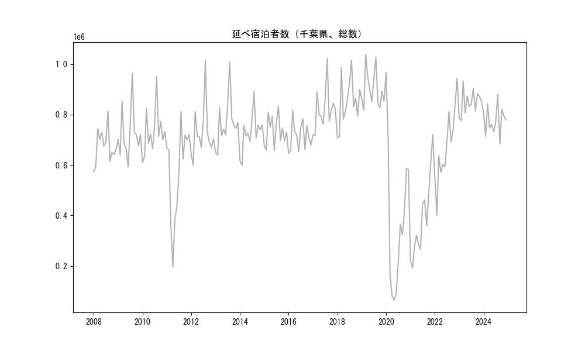
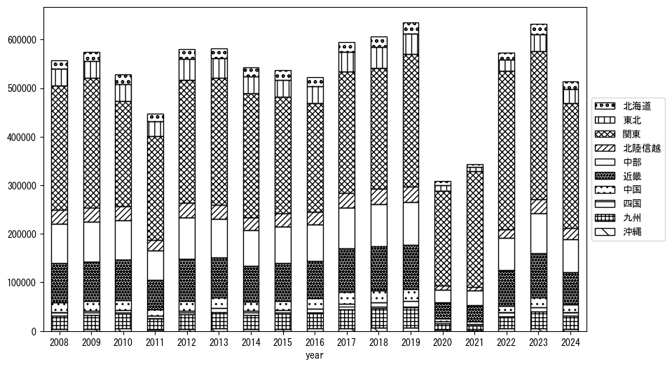
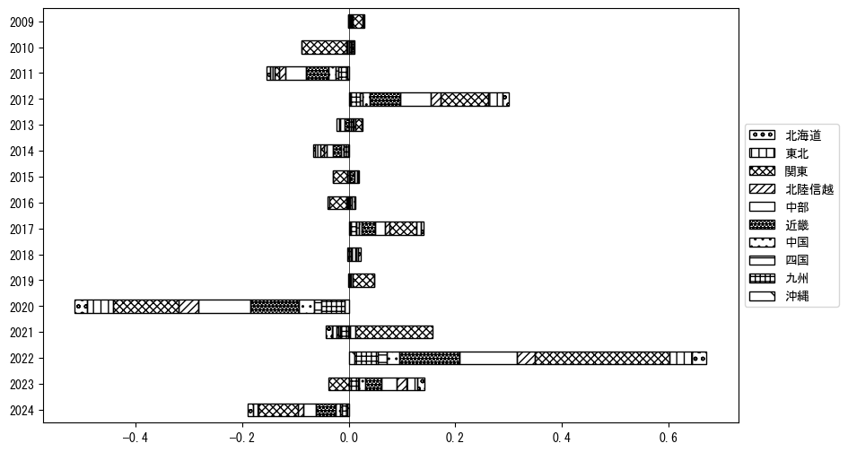
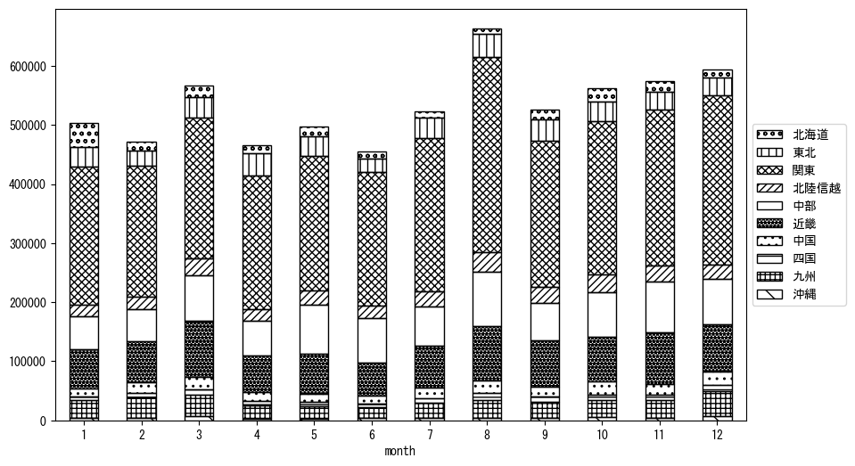
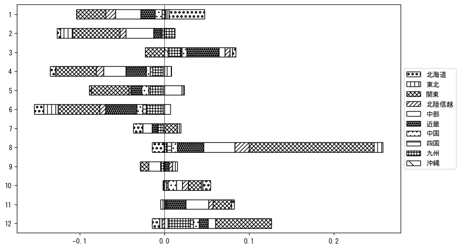

`<!DOCTYPE html>`{=html}
<html lang="ja">
<head>
    <meta charset="UTF-8">
    <meta name="description" content="">
    <link rel="stylesheet" href="../css/style.css">
    <title>宿泊者数の重心 | 千葉県</title>
</head>    
<body>
<body>
<nav id ="global_navi">
    <ul>
        <li>[トップ](../index.html)</li>
        <li>[使い方](../how_to_use.html)</li>
        <li>[データについて](../on_data.html)</li>
        <li>[算出方法について](../method.html)</li>
        <li>[発展的な使い方](../developer.html)</li>
        <li>[サイトポリシー](../policy.html)</li>
    </ul>
</nav>
<ol class="breadcrumb">
    <li>[トップ](../index.html)</li>
    <li>千葉県</li>
</ol>
<h1 id="h1_0">千葉県</h1>

<ul>
  <li> **[１．延べ宿泊者（総数、月次）の推移](#h1_1)** 
    <ul>
      <li> [時系列グラフ](#h2_1) </li>
      <li> [基本統計量](#h2_2) </li>
    </ul>
  </li>  
</ul>

<ul>
  <li> **[２．宿泊者数の重心（年平均の推移）](#h1_2)** 
  <ul>
  <li> [重心の前年平均からの移動距離と方位、および緯度・経度](#h2_4) </li>
  <li> [運輸局別延べ宿泊者数](#h2_5) 
  <ul>
  <li> [時系列（年平均）](#h3_1) </li>
  <li> [寄与度（前年からの変化率に対する）](#h3_2) </li>
  </ul>
  </li>
  </ul>
  </li>
</ul>

<ul>
  <li> **[３．宿泊者数の重心（月別）](#h1_3)** 
  <ul>
  <li> [全期間（2008年1月～2023年12月）の平均と月別平均の比較](#h2_6) </li>
  <li> [運輸局別延べ宿泊者数](#h2_7) 
  <ul>
  <li> [月別平均（2008年1月～2023年12月）](#h3_3) </li>
  <li> [寄与度（全期間の平均から月別平均への変化率に対する）](#h3_4) </li>
  </ul>
  </li>
  </ul>
  </li>
</ul>

<ul>
<li> **[４．データのダウンロード](#h1_4)** </li>
</ul>

<h1 id="h1_1">１．延べ宿泊者（総数）の推移</h1>
<h2 id="h2_1">時系列グラフ</h2>

<figcaption>図１：千葉県内の従業員数100人以上の宿泊施設での延べ宿泊者数（国外、居住地不詳を含む総数）。</figcaption>

<h2 id="h2_2">基本統計量</h2>
|  | 平均 | 標準偏差 | 最小値 | 最大値 |
|:----:|:----:|:----:|:----:|:----:|
| 2008年 | 674,432 | 67,572 | 573,333 (1月) | 814,334 (8月) |
| 2009年 | 725,740 | 99,395 | 591,717 (6月) | 964,264 (8月) |
| 2010年 | 730,571 | 91,180 | 610,465 (1月) | 951,246 (8月) |
| 2011年 | 572,122 | 184,046 | 194,843 (4月) | 812,714 (8月) |
| 2012年 | 727,590 | 106,096 | 599,430 (2月) | 1,013,334 (8月) |
| 2013年 | 766,856 | 96,893 | 640,052 (2月) | 1,007,680 (8月) |
| 2014年 | 728,684 | 76,228 | 598,190 (2月) | 892,553 (8月) |
| 2015年 | 735,168 | 59,087 | 657,989 (6月) | 833,562 (8月) |
| 2016年 | 713,452 | 55,627 | 645,975 (1月) | 816,535 (3月) |
| 2017年 | 818,896 | 82,645 | 718,069 (2月) | 1,022,718 (8月) |
| 2018年 | 849,107 | 96,686 | 706,754 (1月) | 1,015,180 (8月) |
| 2019年 | 900,070 | 74,501 | 818,027 (2月) | 1,038,596 (3月) |
| 2020年 | 378,755 | 283,460 | 64,610 (5月) | 966,537 (1月) |
| 2021年 | 386,844 | 161,894 | 192,578 (2月) | 720,803 (12月) |
| 2022年 | 673,264 | 147,416 | 400,043 (2月) | 943,062 (12月) |
| 2023年 | 847,881 | 47,979 | 775,971 (2月) | 933,572 (3月) |
: 表１：従業員数100人以上の宿泊施設での延べ宿泊者の総数（国外、および居住地不詳を含む）に関する基本統計量。単位は人泊。平均は１か月あたりの平均値を表す。図１に対応。

<h1 id="h1_2">２．宿泊者数の重心（年平均の推移）</h1>

<iframe src="../html/annual/千葉県.html" width="1200" height="600"></iframe>
<figcaption>図２：千葉県内の従業員数100人以上の宿泊施設での宿泊者数（国外、居住地不詳を除く）の重心（年平均の推移）。</figcaption>

[全画面表示](../html/annual/千葉県.html)

<h2 id="h2_4">重心の前年平均からの移動距離と方位、および緯度・経度</h2>
|  | 方位 | 距離 | 緯度 | 経度 |
|:----:|:----:|:----:|:----:|:----:|
| 2008年 | --- | --- | 35.7409 | 137.8930 |
| 2009年 | 南東 | 0.3km | 35.7386 | 137.8951 |
| 2010年 | 西 | 19.3km | 35.7299 | 137.6818 |
| 2011年 | 東 | 36.4km | 35.7694 | 138.0811 |
| 2012年 | 西 | 19.6km | 35.7862 | 137.8648 |
| 2013年 | 南西 | 5.7km | 35.7487 | 137.8210 |
| 2014年 | 東 | 7.6km | 35.7455 | 137.9049 |
| 2015年 | 西 | 8.9km | 35.7325 | 137.8080 |
| 2016年 | 西南西 | 11.9km | 35.6973 | 137.6833 |
| 2017年 | 西南西 | 6.3km | 35.6764 | 137.6183 |
| 2018年 | 北西 | 3.2km | 35.6973 | 137.5945 |
| 2019年 | 東南東 | 5.0km | 35.6880 | 137.6488 |
| 2020年 | 東 | 82.5km | 35.6352 | 138.5573 |
| 2021年 | 東 | 14.1km | 35.6196 | 138.7115 |
| 2022年 | 西 | 47.6km | 35.6234 | 138.1860 |
| 2023年 | 西北西 | 28.4km | 35.6957 | 137.8846 |
: 表２：重心の前年平均からの移動距離と方位、および緯度・経度。図２に対応。

<h2 id="h2_5">運輸局別延べ宿泊者数</h2>
<h3 id="h3_1">時系列（年平均）</h3>

<figcaption>図３：千葉県内の従業員数100人以上の宿泊施設での１か月あたり平均宿泊者数（国外、居住地不詳を除く）の運輸局別内訳。</figcaption>

<h3 id="h3_2">寄与度（前年からの変化率に対する）</h3>

<figcaption>図４：千葉県内の従業員数100人以上の宿泊施設での運輸局別宿泊者数（国外、居住地不詳を除く）から求めた寄与度。</figcaption>

<h1 id="h1_3">３．宿泊者数の重心（月別）</h3>

<iframe src="../html/monthly/千葉県.html" width="1200" height="600"></iframe>
<figcaption>図５：千葉県内の従業員数100人以上の宿泊施設での宿泊者数（国外、居住地不詳を除く）の重心（月別）。観測期間は2008年1月から2023年12月まで。</figcaption>

[全画面表示](../html/monthly/千葉県.html)

<h2 id="h2_6">全期間（2008年1月～2023年12月）の平均と月別平均の比較</h2>
|  | 方位 | 距離 | 緯度 | 経度 |
|:----:|:----:|:----:|:----:|:----:|
| 全期間 | --- | --- | 35.7078 | 137.9271 |
| 1月 | 北北東 | 47.8km | 36.1075 | 138.1251 |
| 2月 | 西南西 | 20.4km | 35.6230 | 137.7275 |
| 3月 | 西南西 | 25.4km | 35.6185 | 137.6693 |
| 4月 | 東北東 | 20.3km | 35.7795 | 138.1333 |
| 5月 | 東北東 | 12.7km | 35.7559 | 138.0550 |
| 6月 | 東南東 | 14.8km | 35.6707 | 138.0847 |
| 7月 | 東南東 | 8.0km | 35.6754 | 138.0058 |
| 8月 | 南南東 | 12.4km | 35.6050 | 137.9803 |
| 9月 | 北 | 3.5km | 35.7396 | 137.9280 |
| 10月 | 北西 | 5.2km | 35.7468 | 137.8950 |
| 11月 | 西南西 | 8.5km | 35.6768 | 137.8414 |
| 12月 | 南西 | 32.6km | 35.4948 | 137.6799 |
: 表３：全期間の平均から月別平均までの移動距離と方位、および緯度・経度。図５に対応。

<h2 id="h2_7">運輸局別延べ宿泊者数</h2>
<h3 id="h3_3">月別平均（2008年1月～2023年12月）</h3>

<figcaption>図６：千葉県内の従業員数100人以上の宿泊施設での宿泊者数（国外、居住地不詳を除く）の運輸局別内訳（月別）。</figcaption>

<h3 id="h3_4">寄与度（全期間の平均から月別平均への変化率に対する）</h3>

<figcaption>図７：千葉県内の従業員数100人以上の宿泊施設での運輸局別宿泊者数（国外、居住地不詳を除く）から求めた寄与度（月別）。</figcaption>

</body>

<h1 id="h1_4">４．データのダウンロード</h1>
 <ul>
  <li> <a href="../csv/data_by_pref/延べ宿泊者数および重心（千葉県）.csv" download>延べ宿泊者数および重心の緯度経度</a> </li>
  <li> <a href="../csv/bar_chart/運輸局別_年平均（千葉県）.csv" download>運輸局別延べ宿泊者数（年平均）</a></li>
  <li> <a href="../csv/bar_chart_month/運輸局別_月別（千葉県）.csv" download>運輸局別延べ宿泊者数（月別）</a></li>
  <li> <a href="../csv/contrib/前年からの変化率に対する寄与度（千葉県）.csv" download>前年からの変化率に対する寄与度</a></li>
  <li> <a href="../csv/contrib_month/月別平均への変化率に対する寄与度（千葉県）.csv" download>月別平均への変化率に対する寄与度</a></li>
</ul>

出典：観光庁「宿泊旅行統計調査」に収録された「施設所在地、居住地別延べ宿泊者数（従業員数100人以上の施設）」

国土地理院「白地図（[地理院タイル](https://maps.gsi.go.jp/development/ichiran.html)）」（図２と図５）

