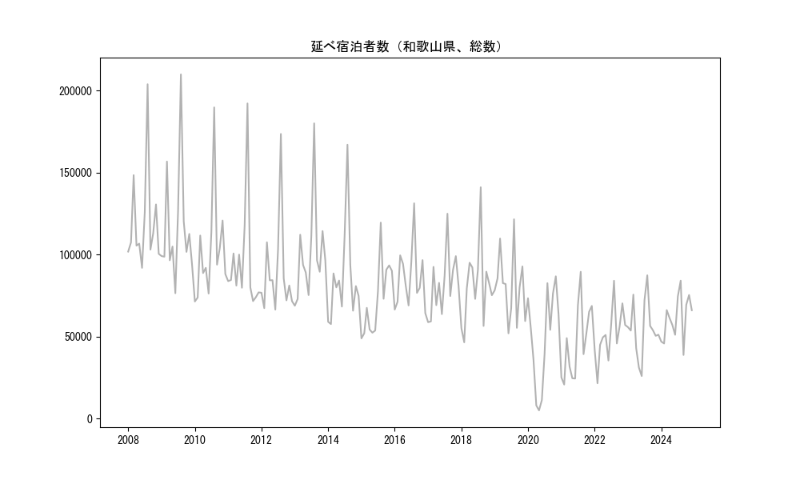
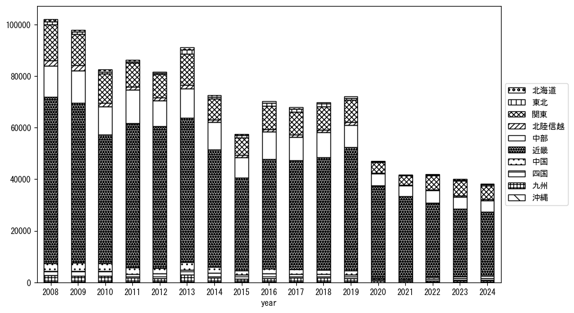
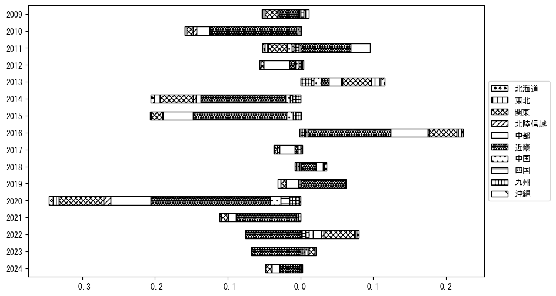
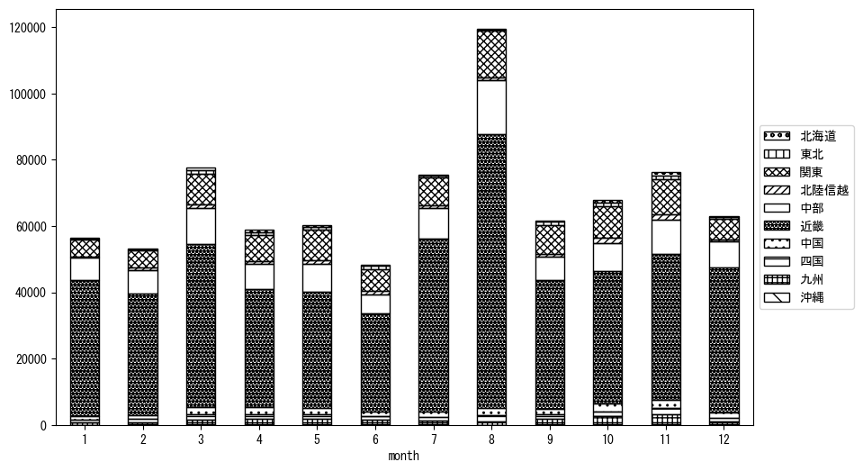
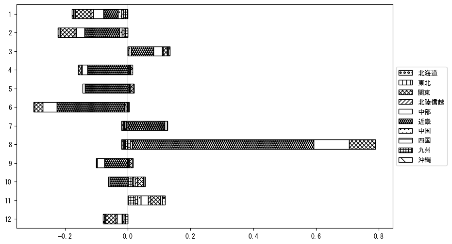

`<!DOCTYPE html>`{=html}
<html lang="ja">
<head>
    <meta charset="UTF-8">
    <meta name="description" content="">
    <link rel="stylesheet" href="../css/style.css">
    <title>宿泊者数の重心 | 和歌山県</title>
</head>    
<body>
<body>
<nav id ="global_navi">
    <ul>
        <li>[トップ](../index.html)</li>
        <li>[使い方](../how_to_use.html)</li>
        <li>[データについて](../on_data.html)</li>
        <li>[算出方法について](../method.html)</li>
        <li>[発展的な使い方](../developer.html)</li>
        <li>[サイトポリシー](../policy.html)</li>
    </ul>
</nav>
<ol class="breadcrumb">
    <li>[トップ](../index.html)</li>
    <li>和歌山県</li>
</ol>
<h1 id="h1_0">和歌山県</h1>

<ul>
  <li> **[１．延べ宿泊者（総数、月次）の推移](#h1_1)** 
    <ul>
      <li> [時系列グラフ](#h2_1) </li>
      <li> [基本統計量](#h2_2) </li>
    </ul>
  </li>  
</ul>

<ul>
  <li> **[２．宿泊者数の重心（年平均の推移）](#h1_2)** 
  <ul>
  <li> [重心の前年平均からの移動距離と方位、および緯度・経度](#h2_4) </li>
  <li> [運輸局別延べ宿泊者数](#h2_5) 
  <ul>
  <li> [時系列（年平均）](#h3_1) </li>
  <li> [寄与度（前年からの変化率に対する）](#h3_2) </li>
  </ul>
  </li>
  </ul>
  </li>
</ul>

<ul>
  <li> **[３．宿泊者数の重心（月別）](#h1_3)** 
  <ul>
  <li> [全期間（2008年1月～2023年12月）の平均と月別平均の比較](#h2_6) </li>
  <li> [運輸局別延べ宿泊者数](#h2_7) 
  <ul>
  <li> [月別平均（2008年1月～2023年12月）](#h3_3) </li>
  <li> [寄与度（全期間の平均から月別平均への変化率に対する）](#h3_4) </li>
  </ul>
  </li>
  </ul>
  </li>
</ul>

<ul>
<li> **[４．データのダウンロード](#h1_4)** </li>
</ul>

<h1 id="h1_1">１．延べ宿泊者（総数）の推移</h1>
<h2 id="h2_1">時系列グラフ</h2>

<figcaption>図１：和歌山県内の従業員数100人以上の宿泊施設での延べ宿泊者数（国外、居住地不詳を含む総数）。</figcaption>

<h2 id="h2_2">基本統計量</h2>
|  | 平均 | 標準偏差 | 最小値 | 最大値 |
|:----:|:----:|:----:|:----:|:----:|
| 2008年 | 119,830 | 30,731 | 91,840 (6月) | 203,862 (8月) |
| 2009年 | 116,418 | 35,639 | 76,372 (6月) | 209,863 (8月) |
| 2010年 | 101,930 | 31,951 | 71,319 (1月) | 189,741 (8月) |
| 2011年 | 95,157 | 33,348 | 71,559 (10月) | 192,161 (8月) |
| 2012年 | 89,438 | 29,450 | 66,372 (6月) | 173,543 (8月) |
| 2013年 | 99,987 | 29,396 | 68,741 (1月) | 180,005 (8月) |
| 2014年 | 85,920 | 29,784 | 57,547 (2月) | 166,972 (8月) |
| 2015年 | 72,688 | 22,184 | 48,809 (1月) | 119,454 (8月) |
| 2016年 | 85,402 | 19,113 | 64,242 (12月) | 131,227 (8月) |
| 2017年 | 81,888 | 18,977 | 58,690 (1月) | 124,896 (8月) |
| 2018年 | 81,316 | 24,619 | 46,413 (2月) | 141,020 (8月) |
| 2019年 | 80,473 | 20,884 | 51,894 (6月) | 121,485 (8月) |
| 2020年 | 49,236 | 29,346 | 4,881 (5月) | 86,677 (11月) |
| 2021年 | 46,462 | 22,546 | 20,648 (2月) | 89,450 (8月) |
| 2022年 | 51,179 | 16,028 | 21,437 (2月) | 83,995 (8月) |
| 2023年 | 54,624 | 17,503 | 25,831 (6月) | 87,290 (8月) |
: 表１：従業員数100人以上の宿泊施設での延べ宿泊者の総数（国外、および居住地不詳を含む）に関する基本統計量。単位は人。平均は１か月あたりの平均値を表す。図１に対応。

<h1 id="h1_2">２．宿泊者数の重心（年平均の推移）</h1>

<iframe src="../html/annual/和歌山県.html" width="1200" height="600"></iframe>
<figcaption>図２：和歌山県内の従業員数100人以上の宿泊施設での宿泊者数（国外、居住地不詳を除く）の重心（年平均の推移）。</figcaption>

[全画面表示](../html/annual/和歌山県.html)

<h2 id="h2_4">重心の前年平均からの移動距離と方位、および緯度・経度</h2>
|  | 方位 | 距離 | 緯度 | 経度 |
|:----:|:----:|:----:|:----:|:----:|
| 2008年 | --- | --- | 34.9383 | 136.1265 |
| 2009年 | 西南西 | 7.2km | 34.9150 | 136.0533 |
| 2010年 | 東南東 | 1.6km | 34.9081 | 136.0683 |
| 2011年 | 南西 | 10.7km | 34.8511 | 135.9734 |
| 2012年 | 南西 | 1.4km | 34.8436 | 135.9607 |
| 2013年 | 北東 | 17.6km | 34.9557 | 136.0974 |
| 2014年 | 西南西 | 12.7km | 34.8949 | 135.9794 |
| 2015年 | 東 | 3.3km | 34.8910 | 136.0147 |
| 2016年 | 東北東 | 14.8km | 34.9571 | 136.1552 |
| 2017年 | 西南西 | 2.6km | 34.9519 | 136.1271 |
| 2018年 | 南 | 2.7km | 34.9278 | 136.1214 |
| 2019年 | 西南西 | 4.9km | 34.9193 | 136.0692 |
| 2020年 | 南西 | 23.0km | 34.7808 | 135.8822 |
| 2021年 | 東南東 | 2.2km | 34.7721 | 135.9039 |
| 2022年 | 北東 | 20.3km | 34.8747 | 136.0870 |
| 2023年 | 北東 | 6.8km | 34.9113 | 136.1471 |
: 表２：重心の前年平均からの移動距離と方位、および緯度・経度。図２に対応。

<h2 id="h2_5">運輸局別延べ宿泊者数</h2>
<h3 id="h3_1">時系列（年平均）</h3>

<figcaption>図３：和歌山県内の従業員数100人以上の宿泊施設での１か月あたり平均宿泊者数（国外、居住地不詳を除く）の運輸局別内訳。</figcaption>

<h3 id="h3_2">寄与度（前年からの変化率に対する）</h3>

<figcaption>図４：和歌山県内の従業員数100人以上の宿泊施設での運輸局別宿泊者数（国外、居住地不詳を除く）から求めた寄与度。</figcaption>

<h1 id="h1_3">３．宿泊者数の重心（月別）</h3>

<iframe src="../html/monthly/和歌山県.html" width="1200" height="600"></iframe>
<figcaption>図５：和歌山県内の従業員数100人以上の宿泊施設での宿泊者数（国外、居住地不詳を除く）の重心（月別）。観測期間は2008年1月から2023年12月まで。</figcaption>

[全画面表示](../html/monthly/和歌山県.html)

<h2 id="h2_6">全期間（2008年1月～2023年12月）の平均と月別平均の比較</h2>
|  | 方位 | 距離 | 緯度 | 経度 |
|:----:|:----:|:----:|:----:|:----:|
| 全期間 | --- | --- | 34.8933 | 136.0479 |
| 1月 | 南西 | 17.0km | 34.7969 | 135.9035 |
| 2月 | 南西 | 8.8km | 34.8437 | 135.9723 |
| 3月 | 北東 | 7.1km | 34.9464 | 136.0914 |
| 4月 | 北北東 | 7.4km | 34.9546 | 136.0801 |
| 5月 | 東北東 | 10.2km | 34.9429 | 136.1424 |
| 6月 | 北東 | 4.4km | 34.9248 | 136.0775 |
| 7月 | 南南西 | 5.6km | 34.8475 | 136.0218 |
| 8月 | 南東 | 6.3km | 34.8467 | 136.0866 |
| 9月 | 東 | 3.3km | 34.8909 | 136.0834 |
| 10月 | 北北東 | 6.0km | 34.9396 | 136.0825 |
| 11月 | 北北東 | 8.8km | 34.9652 | 136.0876 |
| 12月 | 南西 | 12.3km | 34.8204 | 135.9459 |
: 表３：全期間の平均から月別平均までの移動距離と方位、および緯度・経度。図５に対応。

<h2 id="h2_7">運輸局別延べ宿泊者数</h2>
<h3 id="h3_3">月別平均（2008年1月～2023年12月）</h3>

<figcaption>図６：和歌山県内の従業員数100人以上の宿泊施設での宿泊者数（国外、居住地不詳を除く）の運輸局別内訳（月別）。</figcaption>

<h3 id="h3_4">寄与度（全期間の平均から月別平均への変化率に対する）</h3>

<figcaption>図７：和歌山県内の従業員数100人以上の宿泊施設での運輸局別宿泊者数（国外、居住地不詳を除く）から求めた寄与度（月別）。</figcaption>

</body>

<h1 id="h1_4">４．データのダウンロード</h1>
 <ul>
  <li> <a href="../csv/data_by_pref/延べ宿泊者数および重心（和歌山県）.csv" download>延べ宿泊者数および重心の緯度経度</a> </li>
  <li> <a href="../csv/bar_chart/運輸局別_年平均（和歌山県）.csv" download>運輸局別延べ宿泊者数（年平均）</a></li>
  <li> <a href="../csv/bar_chart_month/運輸局別_月別（和歌山県）.csv" download>運輸局別延べ宿泊者数（月別）</a></li>
  <li> <a href="../csv/contrib/前年からの変化率に対する寄与度（和歌山県）.csv" download>前年からの変化率に対する寄与度</a></li>
  <li> <a href="../csv/contrib_month/月別平均への変化率に対する寄与度（和歌山県）.csv" download>月別平均への変化率に対する寄与度</a></li>
</ul>

出典：観光庁「宿泊旅行統計調査」に収録された「施設所在地別、居住地別延べ宿泊者数（従業員数100人以上の施設）」

国土地理院「白地図（[地理院タイル](https://maps.gsi.go.jp/development/ichiran.html)）」（図２と図５）

