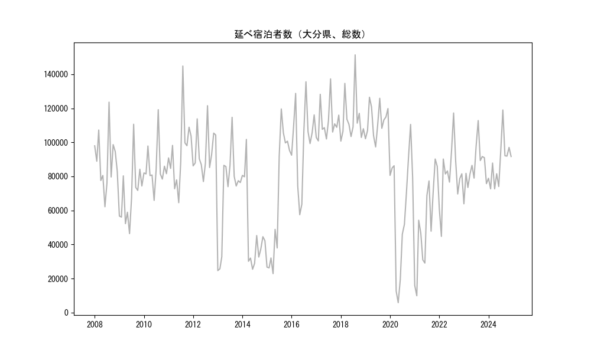
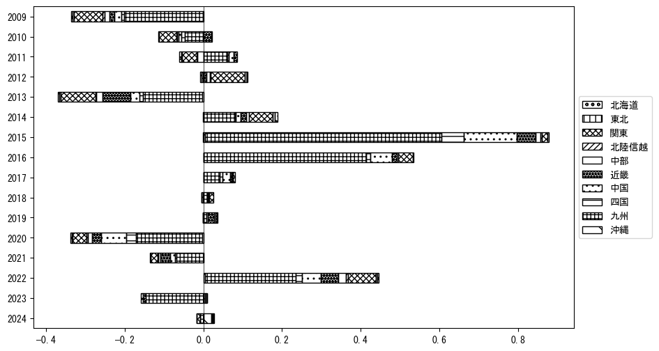
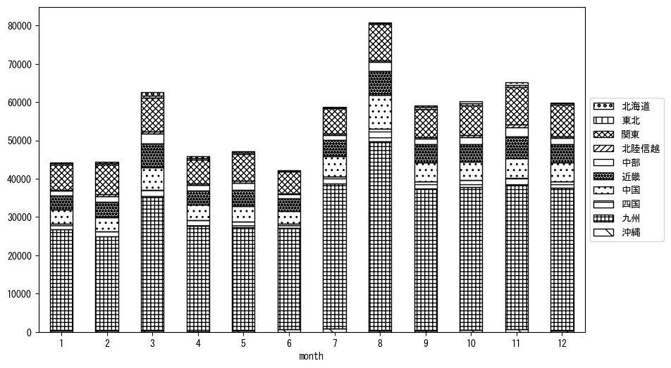

`<!DOCTYPE html>`{=html}
<html lang="ja">
<head>
    <meta charset="UTF-8">
    <meta name="description" content="">
    <link rel="stylesheet" href="../css/style.css">
    <title>宿泊者数の重心 | 大分県</title>
</head>    
<body>
<body>
<nav id ="global_navi">
    <ul>
        <li>[トップ](../index.html)</li>
        <li>[使い方](../how_to_use.html)</li>
        <li>[データについて](../on_data.html)</li>
        <li>[算出方法について](../method.html)</li>
        <li>[発展的な使い方](../developer.html)</li>
        <li>[サイトポリシー](../policy.html)</li>
    </ul>
</nav>
<ol class="breadcrumb">
    <li>[トップ](../index.html)</li>
    <li>大分県</li>
</ol>
<h1 id="h1_0">大分県</h1>

<ul>
  <li> **[１．延べ宿泊者（総数、月次）の推移](#h1_1)** 
    <ul>
      <li> [時系列グラフ](#h2_1) </li>
      <li> [基本統計量](#h2_2) </li>
    </ul>
  </li>  
</ul>

<ul>
  <li> **[２．宿泊者数の重心（年平均の推移）](#h1_2)** 
  <ul>
  <li> [重心の前年平均からの移動距離と方位、および緯度・経度](#h2_4) </li>
  <li> [運輸局別延べ宿泊者数](#h2_5) 
  <ul>
  <li> [時系列（年平均）](#h3_1) </li>
  <li> [寄与度（前年からの変化率に対する）](#h3_2) </li>
  </ul>
  </li>
  </ul>
  </li>
</ul>

<ul>
  <li> **[３．宿泊者数の重心（月別）](#h1_3)** 
  <ul>
  <li> [全期間（2008年1月～2023年12月）の平均と月別平均の比較](#h2_6) </li>
  <li> [運輸局別延べ宿泊者数](#h2_7) 
  <ul>
  <li> [月別平均（2008年1月～2023年12月）](#h3_3) </li>
  <li> [寄与度（全期間の平均から月別平均への変化率に対する）](#h3_4) </li>
  </ul>
  </li>
  </ul>
  </li>
</ul>

<ul>
<li> **[４．データのダウンロード](#h1_4)** </li>
</ul>

<h1 id="h1_1">１．延べ宿泊者（総数）の推移</h1>
<h2 id="h2_1">時系列グラフ</h2>

<figcaption>図１：大分県内の従業員数100人以上の宿泊施設での延べ宿泊者数（国外、居住地不詳を含む総数）。</figcaption>

<h2 id="h2_2">基本統計量</h2>
|  | 平均 | 標準偏差 | 最小値 | 最大値 |
|:----:|:----:|:----:|:----:|:----:|
| 2008年 | 89,154 | 16,375 | 62,153 (6月) | 123,614 (8月) |
| 2009年 | 69,362 | 17,483 | 46,369 (6月) | 110,616 (8月) |
| 2010年 | 84,930 | 12,889 | 65,894 (6月) | 119,176 (8月) |
| 2011年 | 94,405 | 20,598 | 64,543 (6月) | 144,831 (8月) |
| 2012年 | 94,926 | 13,302 | 76,959 (6月) | 121,543 (8月) |
| 2013年 | 69,905 | 27,689 | 24,617 (1月) | 114,705 (8月) |
| 2014年 | 48,367 | 24,880 | 25,433 (6月) | 101,718 (3月) |
| 2015年 | 67,263 | 37,536 | 22,856 (4月) | 119,617 (8月) |
| 2016年 | 99,703 | 24,154 | 57,454 (5月) | 135,597 (8月) |
| 2017年 | 111,826 | 10,890 | 100,840 (2月) | 137,289 (8月) |
| 2018年 | 114,076 | 14,715 | 100,726 (1月) | 151,385 (8月) |
| 2019年 | 112,472 | 9,391 | 97,300 (6月) | 126,481 (3月) |
| 2020年 | 61,644 | 34,138 | 5,799 (5月) | 110,514 (11月) |
| 2021年 | 52,253 | 26,902 | 9,866 (2月) | 90,209 (11月) |
| 2022年 | 80,666 | 17,894 | 44,757 (2月) | 117,254 (8月) |
| 2023年 | 85,342 | 12,635 | 63,885 (1月) | 112,785 (8月) |
: 表１：従業員数100人以上の宿泊施設での延べ宿泊者の総数（国外、および居住地不詳を含む）に関する基本統計量。単位は人泊。平均は１か月あたりの平均値を表す。図１に対応。

<h1 id="h1_2">２．宿泊者数の重心（年平均の推移）</h1>

<iframe src="../html/annual/大分県.html" width="1200" height="600"></iframe>
<figcaption>図２：大分県内の従業員数100人以上の宿泊施設での延べ宿泊者数（国外、居住地不詳を除く）の重心（年平均の推移）。</figcaption>

[全画面表示](../html/annual/大分県.html)

<h2 id="h2_4">重心の前年平均からの移動距離と方位、および緯度・経度</h2>
|  | 方位 | 距離 | 緯度 | 経度 |
|:----:|:----:|:----:|:----:|:----:|
| 2008年 | --- | --- | 34.2436 | 133.8600 |
| 2009年 | 東北東 | 10.2km | 34.2629 | 133.9686 |
| 2010年 | 西南西 | 5.8km | 34.2497 | 133.9076 |
| 2011年 | 西南西 | 45.9km | 34.0838 | 133.4517 |
| 2012年 | 東北東 | 55.7km | 34.2622 | 134.0169 |
| 2013年 | 西南西 | 25.6km | 34.1757 | 133.7595 |
| 2014年 | 東北東 | 21.5km | 34.2648 | 133.9661 |
| 2015年 | 西南西 | 68.8km | 34.0788 | 133.2539 |
| 2016年 | 西南西 | 80.7km | 33.8148 | 132.4410 |
| 2017年 | 南 | 1.3km | 33.8027 | 132.4407 |
| 2018年 | 東北東 | 10.6km | 33.8394 | 132.5466 |
| 2019年 | 東北東 | 4.8km | 33.8515 | 132.5966 |
| 2020年 | 西 | 15.5km | 33.8301 | 132.4313 |
| 2021年 | 南南西 | 2.5km | 33.8091 | 132.4216 |
| 2022年 | 東北東 | 27.7km | 33.8998 | 132.7006 |
| 2023年 | 東北東 | 24.3km | 33.9738 | 132.9482 |
: 表２：重心の前年平均からの移動距離と方位、および緯度・経度。図２に対応。

<h2 id="h2_5">運輸局別延べ宿泊者数</h2>
<h3 id="h3_1">時系列（年平均）</h3>

<figcaption>図３：大分県内の従業員数100人以上の宿泊施設での１か月あたり平均延べ宿泊者数（国外、居住地不詳を除く）の運輸局別内訳。</figcaption>

<h3 id="h3_2">寄与度（前年からの変化率に対する）</h3>

<figcaption>図４：大分県内の従業員数100人以上の宿泊施設での運輸局別延べ宿泊者数（国外、居住地不詳を除く）から求めた寄与度。</figcaption>

<h1 id="h1_3">３．宿泊者数の重心（月別）</h3>

<iframe src="../html/monthly/大分県.html" width="1200" height="600"></iframe>
<figcaption>図５：大分県内の従業員数100人以上の宿泊施設での延べ宿泊者数（国外、居住地不詳を除く）の重心（月別）。観測期間は2008年1月から2023年12月まで。</figcaption>

[全画面表示](../html/monthly/大分県.html)

<h2 id="h2_6">全期間（2008年1月～2023年12月）の平均と月別平均の比較</h2>
|  | 方位 | 距離 | 緯度 | 経度 |
|:----:|:----:|:----:|:----:|:----:|
| 全期間 | --- | --- | 34.0277 | 133.1694 |
| 1月 | 南南西 | 1.5km | 34.0145 | 133.1646 |
| 2月 | 東北東 | 37.7km | 34.1593 | 133.5462 |
| 3月 | 北東 | 30.5km | 34.1986 | 133.4287 |
| 4月 | 北東 | 17.3km | 34.1289 | 133.3123 |
| 5月 | 東北東 | 13.1km | 34.0651 | 133.3040 |
| 6月 | 南西 | 12.3km | 33.9496 | 133.0745 |
| 7月 | 西南西 | 35.6km | 33.8891 | 132.8217 |
| 8月 | 西南西 | 33.5km | 33.8918 | 132.8463 |
| 9月 | 西南西 | 13.9km | 33.9828 | 133.0291 |
| 10月 | 西南西 | 11.0km | 33.9974 | 133.0564 |
| 11月 | 東北東 | 21.1km | 34.0907 | 133.3850 |
| 12月 | 南西 | 12.0km | 33.9642 | 133.0645 |
: 表３：全期間の平均から月別平均までの移動距離と方位、および緯度・経度。図５に対応。

<h2 id="h2_7">運輸局別延べ宿泊者数</h2>
<h3 id="h3_3">月別平均（2008年1月～2023年12月）</h3>

<figcaption>図６：大分県内の従業員数100人以上の宿泊施設での延べ宿泊者数（国外、居住地不詳を除く）の運輸局別内訳（月別）。</figcaption>

<h3 id="h3_4">寄与度（全期間の平均から月別平均への変化率に対する）</h3>

<figcaption>図７：大分県内の従業員数100人以上の宿泊施設での運輸局別延べ宿泊者数（国外、居住地不詳を除く）から求めた寄与度（月別）。</figcaption>

</body>

<h1 id="h1_4">４．データのダウンロード</h1>
 <ul>
  <li> <a href="../csv/data_by_pref/延べ宿泊者数および重心（大分県）.csv" download>延べ宿泊者数および重心の緯度経度</a> </li>
  <li> <a href="../csv/bar_chart/運輸局別_年平均（大分県）.csv" download>運輸局別延べ宿泊者数（年平均）</a></li>
  <li> <a href="../csv/bar_chart_month/運輸局別_月別（大分県）.csv" download>運輸局別延べ宿泊者数（月別）</a></li>
  <li> <a href="../csv/contrib/前年からの変化率に対する寄与度（大分県）.csv" download>前年からの変化率に対する寄与度</a></li>
  <li> <a href="../csv/contrib_month/月別平均への変化率に対する寄与度（大分県）.csv" download>月別平均への変化率に対する寄与度</a></li>
</ul>

出典：観光庁「宿泊旅行統計調査」に収録された「施設所在地、居住地別延べ宿泊者数（従業員数100人以上の施設）」

国土地理院「白地図（[地理院タイル](https://maps.gsi.go.jp/development/ichiran.html)）」（図２と図５）

