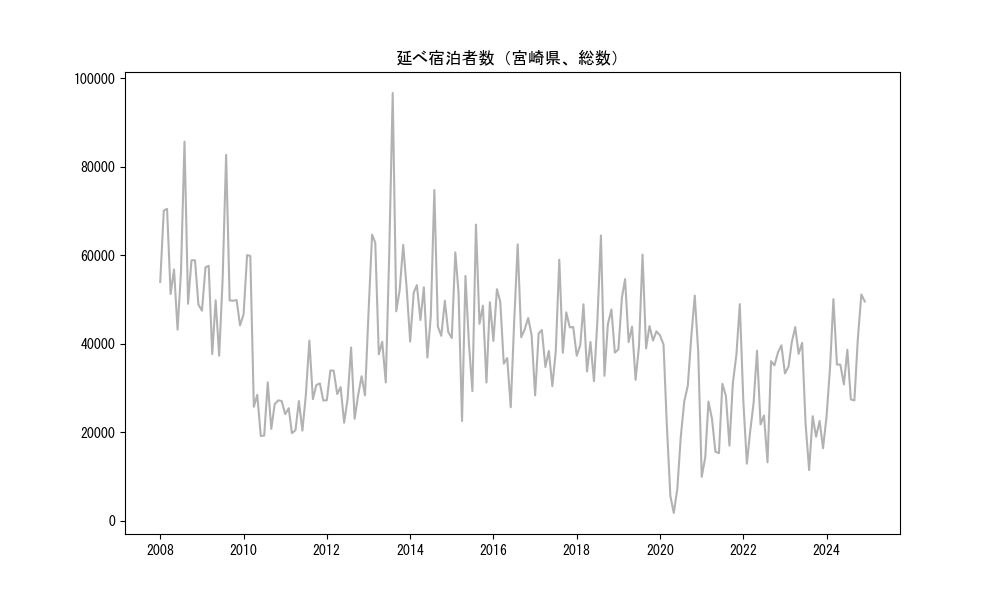

`<!DOCTYPE html>`{=html}
<html lang="ja">
<head>
    <meta charset="UTF-8">
    <meta name="description" content="">
    <link rel="stylesheet" href="../css/style.css">
    <title>宿泊者数の重心 | 宮崎県</title>
</head>    
<body>
<body>
<nav id ="global_navi">
    <ul>
        <li>[トップ](../index.html)</li>
        <li>[使い方](../how_to_use.html)</li>
        <li>[データについて](../on_data.html)</li>
        <li>[算出方法について](../method.html)</li>
        <li>[発展的な使い方](../developer.html)</li>
        <li>[サイトポリシー](../policy.html)</li>
    </ul>
</nav>
<ol class="breadcrumb">
    <li>[トップ](../index.html)</li>
    <li>宮崎県</li>
</ol>
<h1 id="h1_0">宮崎県</h1>

<ul>
  <li> **[１．延べ宿泊者（総数、月次）の推移](#h1_1)** 
    <ul>
      <li> [時系列グラフ](#h2_1) </li>
      <li> [基本統計量](#h2_2) </li>
    </ul>
  </li>  
</ul>

<ul>
  <li> **[２．宿泊者数の重心（年平均の推移）](#h1_2)** 
  <ul>
  <li> [重心の前年平均からの移動距離と方位、および緯度・経度](#h2_4) </li>
  <li> [運輸局別延べ宿泊者数](#h2_5) 
  <ul>
  <li> [時系列（年平均）](#h3_1) </li>
  <li> [寄与度（前年からの変化率に対する）](#h3_2) </li>
  </ul>
  </li>
  </ul>
  </li>
</ul>

<ul>
  <li> **[３．宿泊者数の重心（月別）](#h1_3)** 
  <ul>
  <li> [全期間（2008年1月～2023年12月）の平均と月別平均の比較](#h2_6) </li>
  <li> [運輸局別延べ宿泊者数](#h2_7) 
  <ul>
  <li> [月別平均（2008年1月～2023年12月）](#h3_3) </li>
  <li> [寄与度（全期間の平均から月別平均への変化率に対する）](#h3_4) </li>
  </ul>
  </li>
  </ul>
  </li>
</ul>

<ul>
<li> **[４．データのダウンロード](#h1_4)** </li>
</ul>

<h1 id="h1_1">１．延べ宿泊者（総数）の推移</h1>
<h2 id="h2_1">時系列グラフ</h2>

<figcaption>図１：宮崎県内の従業員数100人以上の宿泊施設での延べ宿泊者数（国外、居住地不詳を含む総数）。</figcaption>

<h2 id="h2_2">基本統計量</h2>
|  | 平均 | 標準偏差 | 最小値 | 最大値 |
|:----:|:----:|:----:|:----:|:----:|
| 2008年 | 58,588 | 11,739 | 43,173 (6月) | 85,667 (8月) |
| 2009年 | 51,468 | 11,774 | 37,294 (6月) | 82,658 (8月) |
| 2010年 | 32,645 | 14,632 | 19,149 (6月) | 60,035 (2月) |
| 2011年 | 26,882 | 5,795 | 19,789 (3月) | 40,703 (8月) |
| 2012年 | 29,581 | 4,782 | 22,142 (6月) | 39,143 (8月) |
| 2013年 | 54,584 | 16,992 | 31,252 (6月) | 96,648 (8月) |
| 2014年 | 48,268 | 9,789 | 36,867 (6月) | 74,724 (8月) |
| 2015年 | 45,091 | 13,111 | 22,539 (4月) | 66,910 (8月) |
| 2016年 | 43,342 | 9,159 | 25,643 (6月) | 62,442 (8月) |
| 2017年 | 40,587 | 8,063 | 28,321 (1月) | 58,997 (8月) |
| 2018年 | 42,009 | 9,096 | 31,534 (6月) | 64,442 (8月) |
| 2019年 | 43,817 | 7,752 | 31,841 (6月) | 60,147 (8月) |
| 2020年 | 27,074 | 16,195 | 1,752 (5月) | 50,869 (11月) |
| 2021年 | 24,899 | 11,310 | 9,913 (1月) | 48,938 (12月) |
| 2022年 | 27,708 | 9,674 | 12,896 (2月) | 39,634 (12月) |
| 2023年 | 28,734 | 10,811 | 11,456 (8月) | 43,768 (4月) |
: 表１：従業員数100人以上の宿泊施設での延べ宿泊者の総数（国外、および居住地不詳を含む）に関する基本統計量。単位は人泊。平均は１か月あたりの平均値を表す。図１に対応。

<h1 id="h1_2">２．宿泊者数の重心（年平均の推移）</h1>

<iframe src="../html/annual/宮崎県.html" width="1200" height="600"></iframe>
<figcaption>図２：宮崎県内の従業員数100人以上の宿泊施設での延べ宿泊者数（国外、居住地不詳を除く）の重心（年平均の推移）。</figcaption>

[全画面表示](../html/annual/宮崎県.html)

<h2 id="h2_4">重心の前年平均からの移動距離と方位、および緯度・経度</h2>
|  | 方位 | 距離 | 緯度 | 経度 |
|:----:|:----:|:----:|:----:|:----:|
| 2008年 | --- | --- | 33.7601 | 133.5394 |
| 2009年 | 西南西 | 17.9km | 33.6808 | 133.3709 |
| 2010年 | 東 | 52.4km | 33.7672 | 133.9272 |
| 2011年 | 南南東 | 4.7km | 33.7317 | 133.9541 |
| 2012年 | 北東 | 38.0km | 33.9214 | 134.2955 |
| 2013年 | 西南西 | 104.3km | 33.6185 | 133.2300 |
| 2014年 | 北東 | 57.6km | 33.9344 | 133.7240 |
| 2015年 | 南 | 22.5km | 33.7311 | 133.7222 |
| 2016年 | 南西 | 9.4km | 33.6765 | 133.6445 |
| 2017年 | 南西 | 23.6km | 33.5351 | 133.4547 |
| 2018年 | 南西 | 17.7km | 33.4416 | 133.3001 |
| 2019年 | 西 | 9.0km | 33.4280 | 133.2046 |
| 2020年 | 西南西 | 55.0km | 33.1869 | 132.6883 |
| 2021年 | 西南西 | 43.9km | 32.9996 | 132.2737 |
| 2022年 | 東北東 | 51.2km | 33.2176 | 132.7578 |
| 2023年 | 北東 | 25.4km | 33.3734 | 132.9577 |
: 表２：重心の前年平均からの移動距離と方位、および緯度・経度。図２に対応。

<h2 id="h2_5">運輸局別延べ宿泊者数</h2>
<h3 id="h3_1">時系列（年平均）</h3>

<figcaption>図３：宮崎県内の従業員数100人以上の宿泊施設での１か月あたり平均延べ宿泊者数（国外、居住地不詳を除く）の運輸局別内訳。</figcaption>

<h3 id="h3_2">寄与度（前年からの変化率に対する）</h3>

<figcaption>図４：宮崎県内の従業員数100人以上の宿泊施設での運輸局別延べ宿泊者数（国外、居住地不詳を除く）から求めた寄与度。</figcaption>

<h1 id="h1_3">３．宿泊者数の重心（月別）</h3>

<iframe src="../html/monthly/宮崎県.html" width="1200" height="600"></iframe>
<figcaption>図５：宮崎県内の従業員数100人以上の宿泊施設での延べ宿泊者数（国外、居住地不詳を除く）の重心（月別）。観測期間は2008年1月から2023年12月まで。</figcaption>

[全画面表示](../html/monthly/宮崎県.html)

<h2 id="h2_6">全期間（2008年1月～2023年12月）の平均と月別平均の比較</h2>
|  | 方位 | 距離 | 緯度 | 経度 |
|:----:|:----:|:----:|:----:|:----:|
| 全期間 | --- | --- | 33.5627 | 133.3778 |
| 1月 | 東北東 | 5.9km | 33.5885 | 133.4333 |
| 2月 | 北東 | 83.9km | 34.1570 | 133.9393 |
| 3月 | 北東 | 50.0km | 33.9169 | 133.7119 |
| 4月 | 東北東 | 32.8km | 33.6985 | 133.6914 |
| 5月 | 南西 | 18.2km | 33.4285 | 133.2659 |
| 6月 | 南西 | 44.1km | 33.2562 | 133.0764 |
| 7月 | 南西 | 48.8km | 33.2596 | 132.9978 |
| 8月 | 西南西 | 64.8km | 33.3034 | 132.7532 |
| 9月 | 南西 | 29.8km | 33.3799 | 133.1434 |
| 10月 | 東北東 | 17.6km | 33.6248 | 133.5525 |
| 11月 | 東北東 | 32.7km | 33.7257 | 133.6715 |
| 12月 | 南南西 | 18.1km | 33.4140 | 133.2970 |
: 表３：全期間の平均から月別平均までの移動距離と方位、および緯度・経度。図５に対応。

<h2 id="h2_7">運輸局別延べ宿泊者数</h2>
<h3 id="h3_3">月別平均（2008年1月～2023年12月）</h3>

<figcaption>図６：宮崎県内の従業員数100人以上の宿泊施設での延べ宿泊者数（国外、居住地不詳を除く）の運輸局別内訳（月別）。</figcaption>

<h3 id="h3_4">寄与度（全期間の平均から月別平均への変化率に対する）</h3>

<figcaption>図７：宮崎県内の従業員数100人以上の宿泊施設での運輸局別延べ宿泊者数（国外、居住地不詳を除く）から求めた寄与度（月別）。</figcaption>

</body>

<h1 id="h1_4">４．データのダウンロード</h1>
 <ul>
  <li> <a href="../csv/data_by_pref/延べ宿泊者数および重心（宮崎県）.csv" download>延べ宿泊者数および重心の緯度経度</a> </li>
  <li> <a href="../csv/bar_chart/運輸局別_年平均（宮崎県）.csv" download>運輸局別延べ宿泊者数（年平均）</a></li>
  <li> <a href="../csv/bar_chart_month/運輸局別_月別（宮崎県）.csv" download>運輸局別延べ宿泊者数（月別）</a></li>
  <li> <a href="../csv/contrib/前年からの変化率に対する寄与度（宮崎県）.csv" download>前年からの変化率に対する寄与度</a></li>
  <li> <a href="../csv/contrib_month/月別平均への変化率に対する寄与度（宮崎県）.csv" download>月別平均への変化率に対する寄与度</a></li>
</ul>

出典：観光庁「宿泊旅行統計調査」に収録された「施設所在地、居住地別延べ宿泊者数（従業員数100人以上の施設）」

国土地理院「白地図（[地理院タイル](https://maps.gsi.go.jp/development/ichiran.html)）」（図２と図５）

