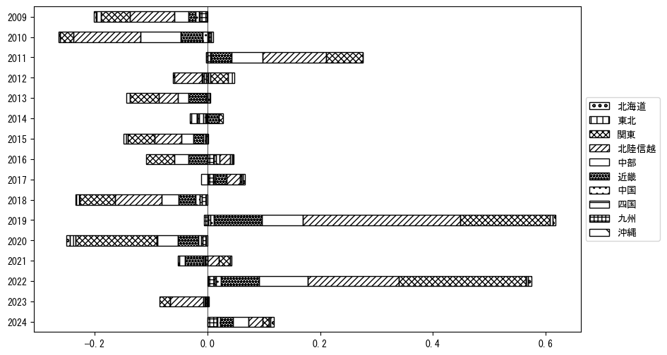

`<!DOCTYPE html>`{=html}
<html lang="ja">
<head>
    <meta charset="UTF-8">
    <meta name="description" content="">
    <link rel="stylesheet" href="../css/style.css">
    <title>宿泊者数の重心 | 富山県</title>
</head>    
<body>
<body>
<nav id ="global_navi">
    <ul>
        <li>[トップ](../index.html)</li>
        <li>[使い方](../how_to_use.html)</li>
        <li>[データについて](../on_data.html)</li>
        <li>[算出方法について](../method.html)</li>
        <li>[発展的な使い方](../developer.html)</li>
        <li>[サイトポリシー](../policy.html)</li>
    </ul>
</nav>
<ol class="breadcrumb">
    <li>[トップ](../index.html)</li>
    <li>富山県</li>
</ol>
<h1 id="h1_0">富山県</h1>

<ul>
  <li> **[１．延べ宿泊者（総数、月次）の推移](#h1_1)** 
    <ul>
      <li> [時系列グラフ](#h2_1) </li>
      <li> [基本統計量](#h2_2) </li>
    </ul>
  </li>  
</ul>

<ul>
  <li> **[２．宿泊者数の重心（年平均の推移）](#h1_2)** 
  <ul>
  <li> [重心の前年平均からの移動距離と方位、および緯度・経度](#h2_4) </li>
  <li> [運輸局別延べ宿泊者数](#h2_5) 
  <ul>
  <li> [時系列（年平均）](#h3_1) </li>
  <li> [寄与度（前年からの変化率に対する）](#h3_2) </li>
  </ul>
  </li>
  </ul>
  </li>
</ul>

<ul>
  <li> **[３．宿泊者数の重心（月別）](#h1_3)** 
  <ul>
  <li> [全期間（2008年1月～2024年12月）の平均と月別平均の比較](#h2_6) </li>
  <li> [運輸局別延べ宿泊者数](#h2_7) 
  <ul>
  <li> [月別平均（2008年1月～2024年12月）](#h3_3) </li>
  <li> [寄与度（全期間の平均から月別平均への変化率に対する）](#h3_4) </li>
  </ul>
  </li>
  </ul>
  </li>
</ul>

<ul>
<li> **[４．データのダウンロード](#h1_4)** </li>
</ul>

<h1 id="h1_1">１．延べ宿泊者（総数）の推移</h1>
<h2 id="h2_1">時系列グラフ</h2>

<figcaption>図１：富山県内の従業員数100人以上の宿泊施設での延べ宿泊者数（国外、居住地不詳を含む総数）。</figcaption>

<h2 id="h2_2">基本統計量</h2>
|  | 平均 | 標準偏差 | 最小値 | 最大値 |
|:----:|:----:|:----:|:----:|:----:|
| 2008年 | 45,625 | 9,123 | 31,088 (1月) | 59,482 (8月) |
| 2009年 | 35,063 | 8,156 | 23,259 (1月) | 48,042 (10月) |
| 2010年 | 29,534 | 7,425 | 20,444 (6月) | 41,994 (10月) |
| 2011年 | 28,607 | 10,621 | 14,830 (1月) | 46,753 (10月) |
| 2012年 | 29,791 | 7,175 | 20,811 (1月) | 46,055 (8月) |
| 2013年 | 27,601 | 8,204 | 14,731 (1月) | 39,881 (8月) |
| 2014年 | 25,146 | 5,590 | 19,305 (4月) | 38,971 (8月) |
| 2015年 | 21,931 | 5,341 | 8,723 (5月) | 30,123 (8月) |
| 2016年 | 31,610 | 5,414 | 23,679 (1月) | 40,395 (8月) |
| 2017年 | 32,010 | 9,685 | 15,862 (2月) | 46,486 (8月) |
| 2018年 | 28,353 | 8,977 | 13,387 (2月) | 40,292 (8月) |
| 2019年 | 32,211 | 8,765 | 17,863 (7月) | 45,656 (11月) |
| 2020年 | 20,137 | 11,600 | 1,135 (5月) | 40,272 (11月) |
| 2021年 | 19,583 | 9,412 | 6,511 (2月) | 36,376 (11月) |
| 2022年 | 31,540 | 8,588 | 15,628 (2月) | 44,106 (11月) |
| 2023年 | 31,132 | 5,489 | 19,011 (1月) | 42,204 (11月) |
| 2024年 | 36,319 | 8,099 | 19,830 (1月) | 46,558 (8月) |
: 表１：従業員数100人以上の宿泊施設での延べ宿泊者の総数（国外、および居住地不詳を含む）に関する基本統計量。単位は人泊。平均は１か月あたりの平均値を表す。図１に対応。

<h1 id="h1_2">２．宿泊者数の重心（年平均の推移）</h1>

<iframe src="../html/annual/富山県.html" width="1200" height="600"></iframe>
<figcaption>図２：富山県内の従業員数100人以上の宿泊施設での延べ宿泊者数（国外、居住地不詳を除く）の重心（年平均の推移）。</figcaption>

[全画面表示](../html/annual/富山県.html)

<h2 id="h2_4">重心の前年平均からの移動距離と方位、および緯度・経度</h2>
|  | 方位 | 距離 | 緯度 | 経度 |
|:----:|:----:|:----:|:----:|:----:|
| 2008年 | --- | --- | 35.8742 | 137.5978 |
| 2009年 | 東 | 8.5km | 35.8598 | 137.6903 |
| 2010年 | 東南東 | 16.6km | 35.7811 | 137.8461 |
| 2011年 | 北西 | 9.0km | 35.8285 | 137.7650 |
| 2012年 | 東南東 | 14.6km | 35.7908 | 137.9203 |
| 2013年 | 西 | 3.5km | 35.7941 | 137.8819 |
| 2014年 | 南 | 5.0km | 35.7493 | 137.8910 |
| 2015年 | 南南東 | 4.0km | 35.7142 | 137.9008 |
| 2016年 | 北西 | 10.3km | 35.7821 | 137.8235 |
| 2017年 | 西 | 15.6km | 35.7615 | 137.6529 |
| 2018年 | 東北東 | 10.8km | 35.7807 | 137.7699 |
| 2019年 | 北 | 13.0km | 35.8972 | 137.7531 |
| 2020年 | 西北西 | 15.5km | 35.9397 | 137.5900 |
| 2021年 | 北東 | 14.0km | 36.0240 | 137.7061 |
| 2022年 | 南東 | 5.7km | 35.9837 | 137.7461 |
| 2023年 | 東 | 6.0km | 35.9781 | 137.8123 |
| 2024年 | 西 | 15.6km | 35.9539 | 137.6417 |
: 表２：重心の前年平均からの移動距離と方位、および緯度・経度。図２に対応。

<h2 id="h2_5">運輸局別延べ宿泊者数</h2>
<h3 id="h3_1">時系列（年平均）</h3>

<figcaption>図３：富山県内の従業員数100人以上の宿泊施設での１か月あたり平均延べ宿泊者数（国外、居住地不詳を除く）の運輸局別内訳。</figcaption>

<h3 id="h3_2">寄与度（前年からの変化率に対する）</h3>

<figcaption>図４：富山県内の従業員数100人以上の宿泊施設での運輸局別延べ宿泊者数（国外、居住地不詳を除く）から求めた寄与度。</figcaption>

<h1 id="h1_3">３．宿泊者数の重心（月別）</h3>

<iframe src="../html/monthly/富山県.html" width="1200" height="600"></iframe>
<figcaption>図５：富山県内の従業員数100人以上の宿泊施設での延べ宿泊者数（国外、居住地不詳を除く）の重心（月別）。観測期間は2008年1月から2024年12月まで。</figcaption>

[全画面表示](../html/monthly/富山県.html)

<h2 id="h2_6">全期間（2008年1月～2024年12月）の平均と月別平均の比較</h2>
|  | 方位 | 距離 | 緯度 | 経度 |
|:----:|:----:|:----:|:----:|:----:|
| 全期間 | --- | --- | 35.8525 | 137.7641 |
| 1月 | 北西 | 12.6km | 35.9380 | 137.6725 |
| 2月 | 西北西 | 13.8km | 35.9100 | 137.6291 |
| 3月 | 西北西 | 11.8km | 35.8944 | 137.6446 |
| 4月 | 南東 | 8.0km | 35.7930 | 137.8136 |
| 5月 | 南南西 | 14.9km | 35.7272 | 137.7063 |
| 6月 | 北西 | 2.0km | 35.8657 | 137.7484 |
| 7月 | 東 | 7.7km | 35.8406 | 137.8483 |
| 8月 | 東南東 | 13.4km | 35.7874 | 137.8890 |
| 9月 | 東 | 17.4km | 35.8600 | 137.9564 |
| 10月 | 南東 | 6.9km | 35.8104 | 137.8204 |
| 11月 | 南南東 | 1.1km | 35.8433 | 137.7676 |
| 12月 | 北西 | 14.5km | 35.9601 | 137.6727 |
: 表３：全期間の平均から月別平均までの移動距離と方位、および緯度・経度。図５に対応。

<h2 id="h2_7">運輸局別延べ宿泊者数</h2>
<h3 id="h3_3">月別平均（2008年1月～2024年12月）</h3>

<figcaption>図６：富山県内の従業員数100人以上の宿泊施設での延べ宿泊者数（国外、居住地不詳を除く）の運輸局別内訳（月別）。</figcaption>

<h3 id="h3_4">寄与度（全期間の平均から月別平均への変化率に対する）</h3>

<figcaption>図７：富山県内の従業員数100人以上の宿泊施設での運輸局別延べ宿泊者数（国外、居住地不詳を除く）から求めた寄与度（月別）。</figcaption>

</body>

<h1 id="h1_4">４．データのダウンロード</h1>
 <ul>
  <li> <a href="../csv/data_by_pref/延べ宿泊者数および重心（富山県）.csv" download>延べ宿泊者数および重心の緯度経度</a> </li>
  <li> <a href="../csv/bar_chart/運輸局別_年平均（富山県）.csv" download>運輸局別延べ宿泊者数（年平均）</a></li>
  <li> <a href="../csv/bar_chart_month/運輸局別_月別（富山県）.csv" download>運輸局別延べ宿泊者数（月別）</a></li>
  <li> <a href="../csv/contrib/前年からの変化率に対する寄与度（富山県）.csv" download>前年からの変化率に対する寄与度</a></li>
  <li> <a href="../csv/contrib_month/月別平均への変化率に対する寄与度（富山県）.csv" download>月別平均への変化率に対する寄与度</a></li>
</ul>

出典：観光庁「宿泊旅行統計調査」に収録された「施設所在地、居住地別延べ宿泊者数（従業員数100人以上の施設）」

国土地理院「白地図（[地理院タイル](https://maps.gsi.go.jp/development/ichiran.html)）」（図２と図５）

