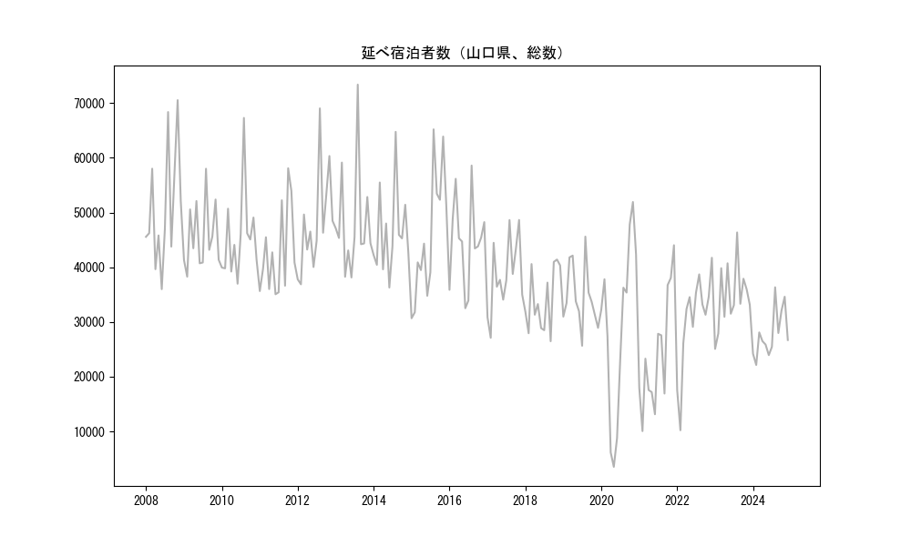
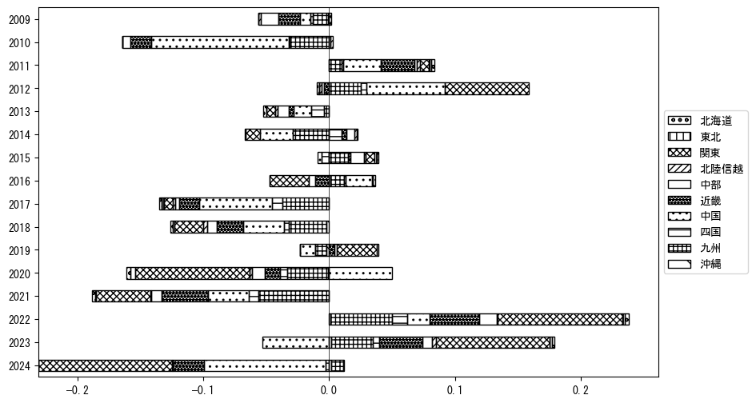

`<!DOCTYPE html>`{=html}
<html lang="ja">
<head>
    <meta charset="UTF-8">
    <meta name="description" content="">
    <link rel="stylesheet" href="../css/style.css">
    <title>宿泊者数の重心 | 山口県</title>
</head>    
<body>
<body>
<nav id ="global_navi">
    <ul>
        <li>[トップ](../index.html)</li>
        <li>[使い方](../how_to_use.html)</li>
        <li>[データについて](../on_data.html)</li>
        <li>[算出方法について](../method.html)</li>
        <li>[発展的な使い方](../developer.html)</li>
        <li>[サイトポリシー](../policy.html)</li>
    </ul>
</nav>
<ol class="breadcrumb">
    <li>[トップ](../index.html)</li>
    <li>山口県</li>
</ol>
<h1 id="h1_0">山口県</h1>

<ul>
  <li> **[１．延べ宿泊者（総数、月次）の推移](#h1_1)** 
    <ul>
      <li> [時系列グラフ](#h2_1) </li>
      <li> [基本統計量](#h2_2) </li>
    </ul>
  </li>  
</ul>

<ul>
  <li> **[２．宿泊者数の重心（年平均の推移）](#h1_2)** 
  <ul>
  <li> [重心の前年平均からの移動距離と方位、および緯度・経度](#h2_4) </li>
  <li> [運輸局別延べ宿泊者数](#h2_5) 
  <ul>
  <li> [時系列（年平均）](#h3_1) </li>
  <li> [寄与度（前年からの変化率に対する）](#h3_2) </li>
  </ul>
  </li>
  </ul>
  </li>
</ul>

<ul>
  <li> **[３．宿泊者数の重心（月別）](#h1_3)** 
  <ul>
  <li> [全期間（2008年1月～2024年12月）の平均と月別平均の比較](#h2_6) </li>
  <li> [運輸局別延べ宿泊者数](#h2_7) 
  <ul>
  <li> [月別平均（2008年1月～2024年12月）](#h3_3) </li>
  <li> [寄与度（全期間の平均から月別平均への変化率に対する）](#h3_4) </li>
  </ul>
  </li>
  </ul>
  </li>
</ul>

<ul>
<li> **[４．データのダウンロード](#h1_4)** </li>
</ul>

<h1 id="h1_1">１．延べ宿泊者（総数）の推移</h1>
<h2 id="h2_1">時系列グラフ</h2>

<figcaption>図１：山口県内の従業員数100人以上の宿泊施設での延べ宿泊者数（国外、居住地不詳を含む総数）。</figcaption>

<h2 id="h2_2">基本統計量</h2>
|  | 平均 | 標準偏差 | 最小値 | 最大値 |
|:----:|:----:|:----:|:----:|:----:|
| 2008年 | 50,821 | 10,739 | 35,998 (6月) | 70,527 (11月) |
| 2009年 | 45,653 | 6,127 | 38,279 (2月) | 57,998 (8月) |
| 2010年 | 45,481 | 8,033 | 36,993 (6月) | 67,282 (8月) |
| 2011年 | 42,651 | 8,070 | 35,069 (6月) | 58,086 (10月) |
| 2012年 | 48,005 | 9,299 | 36,883 (2月) | 69,026 (8月) |
| 2013年 | 47,975 | 9,824 | 38,132 (6月) | 73,363 (8月) |
| 2014年 | 46,321 | 7,803 | 36,293 (6月) | 64,738 (8月) |
| 2015年 | 45,602 | 11,650 | 30,679 (1月) | 65,193 (8月) |
| 2016年 | 44,731 | 7,974 | 32,511 (6月) | 58,582 (8月) |
| 2017年 | 38,553 | 6,671 | 27,107 (2月) | 48,639 (11月) |
| 2018年 | 34,060 | 5,716 | 26,483 (9月) | 41,409 (11月) |
| 2019年 | 34,552 | 5,847 | 25,657 (7月) | 45,596 (8月) |
| 2020年 | 29,370 | 16,108 | 3,537 (5月) | 51,919 (11月) |
| 2021年 | 24,200 | 10,763 | 10,065 (2月) | 44,027 (12月) |
| 2022年 | 30,407 | 8,851 | 10,218 (2月) | 41,735 (12月) |
| 2023年 | 34,647 | 5,878 | 25,083 (1月) | 46,356 (8月) |
| 2024年 | 27,826 | 4,363 | 22,145 (2月) | 36,341 (8月) |
: 表１：従業員数100人以上の宿泊施設での延べ宿泊者の総数（国外、および居住地不詳を含む）に関する基本統計量。単位は人泊。平均は１か月あたりの平均値を表す。図１に対応。

<h1 id="h1_2">２．宿泊者数の重心（年平均の推移）</h1>

<iframe src="../html/annual/山口県.html" width="1200" height="600"></iframe>
<figcaption>図２：山口県内の従業員数100人以上の宿泊施設での延べ宿泊者数（国外、居住地不詳を除く）の重心（年平均の推移）。</figcaption>

[全画面表示](../html/annual/山口県.html)

<h2 id="h2_4">重心の前年平均からの移動距離と方位、および緯度・経度</h2>
|  | 方位 | 距離 | 緯度 | 経度 |
|:----:|:----:|:----:|:----:|:----:|
| 2008年 | --- | --- | 34.4534 | 133.5997 |
| 2009年 | 北 | 0.6km | 34.4590 | 133.6007 |
| 2010年 | 東北東 | 28.4km | 34.5094 | 133.9036 |
| 2011年 | 北 | 2.1km | 34.5279 | 133.9025 |
| 2012年 | 東 | 13.2km | 34.5472 | 134.0449 |
| 2013年 | 西南西 | 2.9km | 34.5344 | 134.0169 |
| 2014年 | 東北東 | 10.0km | 34.5572 | 134.1223 |
| 2015年 | 北東 | 3.7km | 34.5782 | 134.1535 |
| 2016年 | 西 | 26.1km | 34.5351 | 133.8738 |
| 2017年 | 東 | 14.0km | 34.5344 | 134.0268 |
| 2018年 | 北北東 | 3.2km | 34.5610 | 134.0394 |
| 2019年 | 東北東 | 21.1km | 34.6218 | 134.2570 |
| 2020年 | 西南西 | 55.7km | 34.4951 | 133.6698 |
| 2021年 | 西 | 29.3km | 34.4565 | 133.3546 |
| 2022年 | 東北東 | 49.8km | 34.5564 | 133.8831 |
| 2023年 | 東 | 56.8km | 34.6499 | 134.4915 |
| 2024年 | 西南西 | 48.3km | 34.5126 | 133.9924 |
: 表２：重心の前年平均からの移動距離と方位、および緯度・経度。図２に対応。

<h2 id="h2_5">運輸局別延べ宿泊者数</h2>
<h3 id="h3_1">時系列（年平均）</h3>

<figcaption>図３：山口県内の従業員数100人以上の宿泊施設での１か月あたり平均延べ宿泊者数（国外、居住地不詳を除く）の運輸局別内訳。</figcaption>

<h3 id="h3_2">寄与度（前年からの変化率に対する）</h3>

<figcaption>図４：山口県内の従業員数100人以上の宿泊施設での運輸局別延べ宿泊者数（国外、居住地不詳を除く）から求めた寄与度。</figcaption>

<h1 id="h1_3">３．宿泊者数の重心（月別）</h3>

<iframe src="../html/monthly/山口県.html" width="1200" height="600"></iframe>
<figcaption>図５：山口県内の従業員数100人以上の宿泊施設での延べ宿泊者数（国外、居住地不詳を除く）の重心（月別）。観測期間は2008年1月から2024年12月まで。</figcaption>

[全画面表示](../html/monthly/山口県.html)

<h2 id="h2_6">全期間（2008年1月～2024年12月）の平均と月別平均の比較</h2>
|  | 方位 | 距離 | 緯度 | 経度 |
|:----:|:----:|:----:|:----:|:----:|
| 全期間 | --- | --- | 34.5347 | 133.9372 |
| 1月 | 西南西 | 37.9km | 34.4500 | 133.5376 |
| 2月 | 西南西 | 23.0km | 34.4664 | 133.7004 |
| 3月 | 北東 | 2.0km | 34.5456 | 133.9545 |
| 4月 | 東北東 | 15.7km | 34.5930 | 134.0931 |
| 5月 | 東北東 | 25.0km | 34.5998 | 134.1981 |
| 6月 | 東北東 | 6.3km | 34.5554 | 134.0011 |
| 7月 | 西南西 | 7.8km | 34.5065 | 133.8595 |
| 8月 | 東 | 9.1km | 34.5358 | 134.0360 |
| 9月 | 東 | 23.3km | 34.5707 | 134.1872 |
| 10月 | 北北東 | 4.0km | 34.5652 | 133.9609 |
| 11月 | 東北東 | 14.5km | 34.5607 | 134.0922 |
| 12月 | 西南西 | 29.6km | 34.4669 | 133.6260 |
: 表３：全期間の平均から月別平均までの移動距離と方位、および緯度・経度。図５に対応。

<h2 id="h2_7">運輸局別延べ宿泊者数</h2>
<h3 id="h3_3">月別平均（2008年1月～2024年12月）</h3>

<figcaption>図６：山口県内の従業員数100人以上の宿泊施設での延べ宿泊者数（国外、居住地不詳を除く）の運輸局別内訳（月別）。</figcaption>

<h3 id="h3_4">寄与度（全期間の平均から月別平均への変化率に対する）</h3>

<figcaption>図７：山口県内の従業員数100人以上の宿泊施設での運輸局別延べ宿泊者数（国外、居住地不詳を除く）から求めた寄与度（月別）。</figcaption>

</body>

<h1 id="h1_4">４．データのダウンロード</h1>
 <ul>
  <li> <a href="../csv/data_by_pref/延べ宿泊者数および重心（山口県）.csv" download>延べ宿泊者数および重心の緯度経度</a> </li>
  <li> <a href="../csv/bar_chart/運輸局別_年平均（山口県）.csv" download>運輸局別延べ宿泊者数（年平均）</a></li>
  <li> <a href="../csv/bar_chart_month/運輸局別_月別（山口県）.csv" download>運輸局別延べ宿泊者数（月別）</a></li>
  <li> <a href="../csv/contrib/前年からの変化率に対する寄与度（山口県）.csv" download>前年からの変化率に対する寄与度</a></li>
  <li> <a href="../csv/contrib_month/月別平均への変化率に対する寄与度（山口県）.csv" download>月別平均への変化率に対する寄与度</a></li>
</ul>

出典：観光庁「宿泊旅行統計調査」に収録された「施設所在地、居住地別延べ宿泊者数（従業員数100人以上の施設）」

国土地理院「白地図（[地理院タイル](https://maps.gsi.go.jp/development/ichiran.html)）」（図２と図５）

