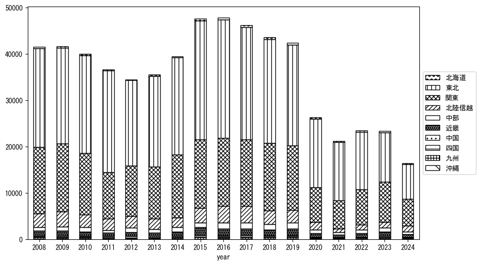
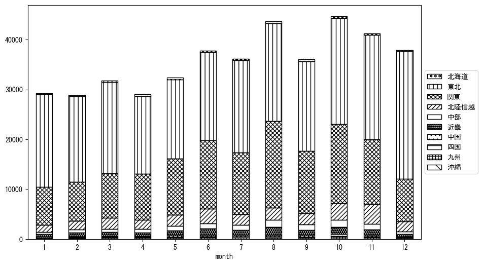

`<!DOCTYPE html>`{=html}
<html lang="ja">
<head>
    <meta charset="UTF-8">
    <meta name="description" content="">
    <link rel="stylesheet" href="../css/style.css">
    <title>宿泊者数の重心 | 山形県</title>
</head>    
<body>
<body>
<nav id ="global_navi">
    <ul>
        <li>[トップ](../index.html)</li>
        <li>[使い方](../how_to_use.html)</li>
        <li>[データについて](../on_data.html)</li>
        <li>[算出方法について](../method.html)</li>
        <li>[発展的な使い方](../developer.html)</li>
        <li>[サイトポリシー](../policy.html)</li>
    </ul>
</nav>
<ol class="breadcrumb">
    <li>[トップ](../index.html)</li>
    <li>山形県</li>
</ol>
<h1 id="h1_0">山形県</h1>

<ul>
  <li> **[１．延べ宿泊者（総数、月次）の推移](#h1_1)** 
    <ul>
      <li> [時系列グラフ](#h2_1) </li>
      <li> [基本統計量](#h2_2) </li>
    </ul>
  </li>  
</ul>

<ul>
  <li> **[２．宿泊者数の重心（年平均の推移）](#h1_2)** 
  <ul>
  <li> [重心の前年平均からの移動距離と方位、および緯度・経度](#h2_4) </li>
  <li> [運輸局別延べ宿泊者数](#h2_5) 
  <ul>
  <li> [時系列（年平均）](#h3_1) </li>
  <li> [寄与度（前年からの変化率に対する）](#h3_2) </li>
  </ul>
  </li>
  </ul>
  </li>
</ul>

<ul>
  <li> **[３．宿泊者数の重心（月別）](#h1_3)** 
  <ul>
  <li> [全期間（2008年1月～2023年12月）の平均と月別平均の比較](#h2_6) </li>
  <li> [運輸局別延べ宿泊者数](#h2_7) 
  <ul>
  <li> [月別平均（2008年1月～2023年12月）](#h3_3) </li>
  <li> [寄与度（全期間の平均から月別平均への変化率に対する）](#h3_4) </li>
  </ul>
  </li>
  </ul>
  </li>
</ul>

<ul>
<li> **[４．データのダウンロード](#h1_4)** </li>
</ul>

<h1 id="h1_1">１．延べ宿泊者（総数）の推移</h1>
<h2 id="h2_1">時系列グラフ</h2>

<figcaption>図１：山形県内の従業員数100人以上の宿泊施設での延べ宿泊者数（国外、居住地不詳を含む総数）。</figcaption>

<h2 id="h2_2">基本統計量</h2>
|  | 平均 | 標準偏差 | 最小値 | 最大値 |
|:----:|:----:|:----:|:----:|:----:|
| 2008年 | 43,199 | 4,314 | 35,552 (4月) | 50,772 (6月) |
| 2009年 | 42,339 | 6,820 | 31,789 (4月) | 53,357 (10月) |
| 2010年 | 43,380 | 10,090 | 30,660 (1月) | 61,440 (12月) |
| 2011年 | 41,195 | 10,675 | 23,152 (3月) | 56,499 (8月) |
| 2012年 | 41,784 | 6,128 | 32,266 (2月) | 50,893 (8月) |
| 2013年 | 38,685 | 6,023 | 30,747 (1月) | 46,138 (11月) |
| 2014年 | 40,719 | 6,816 | 32,103 (2月) | 51,861 (8月) |
| 2015年 | 50,992 | 6,808 | 41,660 (4月) | 61,754 (10月) |
| 2016年 | 54,374 | 6,744 | 44,593 (2月) | 67,364 (10月) |
| 2017年 | 54,794 | 8,498 | 42,330 (2月) | 71,211 (8月) |
| 2018年 | 50,237 | 7,772 | 39,310 (2月) | 66,376 (8月) |
| 2019年 | 50,445 | 6,138 | 41,086 (2月) | 61,878 (8月) |
| 2020年 | 32,328 | 16,230 | 6,165 (5月) | 54,609 (11月) |
| 2021年 | 26,413 | 7,819 | 15,110 (1月) | 41,934 (11月) |
| 2022年 | 30,089 | 8,004 | 17,105 (2月) | 42,511 (10月) |
| 2023年 | 32,069 | 6,826 | 19,642 (9月) | 41,827 (8月) |
: 表１：従業員数100人以上の宿泊施設での延べ宿泊者の総数（国外、および居住地不詳を含む）に関する基本統計量。単位は人泊。平均は１か月あたりの平均値を表す。図１に対応。

<h1 id="h1_2">２．宿泊者数の重心（年平均の推移）</h1>

<iframe src="../html/annual/山形県.html" width="1200" height="600"></iframe>
<figcaption>図２：山形県内の従業員数100人以上の宿泊施設での延べ宿泊者数（国外、居住地不詳を除く）の重心（年平均の推移）。</figcaption>

[全画面表示](../html/annual/山形県.html)

<h2 id="h2_4">重心の前年平均からの移動距離と方位、および緯度・経度</h2>
|  | 方位 | 距離 | 緯度 | 経度 |
|:----:|:----:|:----:|:----:|:----:|
| 2008年 | --- | --- | 37.2232 | 139.7543 |
| 2009年 | 西南西 | 1.6km | 37.2169 | 139.7385 |
| 2010年 | 北北東 | 5.2km | 37.2611 | 139.7582 |
| 2011年 | 北北東 | 31.8km | 37.5356 | 139.8613 |
| 2012年 | 南南西 | 29.1km | 37.2866 | 139.7587 |
| 2013年 | 東 | 5.6km | 37.2892 | 139.8216 |
| 2014年 | 南 | 5.3km | 37.2420 | 139.8166 |
| 2015年 | 西北西 | 9.4km | 37.2855 | 139.7259 |
| 2016年 | 北東 | 3.4km | 37.3088 | 139.7510 |
| 2017年 | 南南西 | 3.0km | 37.2858 | 139.7340 |
| 2018年 | 南 | 4.8km | 37.2423 | 139.7357 |
| 2019年 | 南西 | 5.1km | 37.2072 | 139.6988 |
| 2020年 | 北北東 | 14.6km | 37.3338 | 139.7441 |
| 2021年 | 東北東 | 7.3km | 37.3495 | 139.8242 |
| 2022年 | 南西 | 17.6km | 37.2247 | 139.7012 |
| 2023年 | 南南西 | 19.1km | 37.0778 | 139.5903 |
: 表２：重心の前年平均からの移動距離と方位、および緯度・経度。図２に対応。

<h2 id="h2_5">運輸局別延べ宿泊者数</h2>
<h3 id="h3_1">時系列（年平均）</h3>

<figcaption>図３：山形県内の従業員数100人以上の宿泊施設での１か月あたり平均延べ宿泊者数（国外、居住地不詳を除く）の運輸局別内訳。</figcaption>

<h3 id="h3_2">寄与度（前年からの変化率に対する）</h3>

<figcaption>図４：山形県内の従業員数100人以上の宿泊施設での運輸局別延べ宿泊者数（国外、居住地不詳を除く）から求めた寄与度。</figcaption>

<h1 id="h1_3">３．宿泊者数の重心（月別）</h3>

<iframe src="../html/monthly/山形県.html" width="1200" height="600"></iframe>
<figcaption>図５：山形県内の従業員数100人以上の宿泊施設での延べ宿泊者数（国外、居住地不詳を除く）の重心（月別）。観測期間は2008年1月から2023年12月まで。</figcaption>

[全画面表示](../html/monthly/山形県.html)

<h2 id="h2_6">全期間（2008年1月～2023年12月）の平均と月別平均の比較</h2>
|  | 方位 | 距離 | 緯度 | 経度 |
|:----:|:----:|:----:|:----:|:----:|
| 全期間 | --- | --- | 37.2731 | 139.7509 |
| 1月 | 北東 | 26.8km | 37.4657 | 139.9341 |
| 2月 | 北北東 | 16.0km | 37.4054 | 139.8233 |
| 3月 | 北北東 | 16.3km | 37.4117 | 139.8133 |
| 4月 | 北北西 | 2.6km | 37.2938 | 139.7377 |
| 5月 | 南西 | 13.0km | 37.1811 | 139.6604 |
| 6月 | 南南西 | 18.2km | 37.1279 | 139.6561 |
| 7月 | 南南西 | 10.0km | 37.1857 | 139.7247 |
| 8月 | 南南西 | 27.5km | 37.0344 | 139.6671 |
| 9月 | 南南西 | 10.4km | 37.1884 | 139.7005 |
| 10月 | 南西 | 18.8km | 37.1374 | 139.6249 |
| 11月 | 西 | 5.4km | 37.2751 | 139.6905 |
| 12月 | 北北東 | 38.7km | 37.5709 | 139.9782 |
: 表３：全期間の平均から月別平均までの移動距離と方位、および緯度・経度。図５に対応。

<h2 id="h2_7">運輸局別延べ宿泊者数</h2>
<h3 id="h3_3">月別平均（2008年1月～2023年12月）</h3>

<figcaption>図６：山形県内の従業員数100人以上の宿泊施設での延べ宿泊者数（国外、居住地不詳を除く）の運輸局別内訳（月別）。</figcaption>

<h3 id="h3_4">寄与度（全期間の平均から月別平均への変化率に対する）</h3>

<figcaption>図７：山形県内の従業員数100人以上の宿泊施設での運輸局別延べ宿泊者数（国外、居住地不詳を除く）から求めた寄与度（月別）。</figcaption>

</body>

<h1 id="h1_4">４．データのダウンロード</h1>
 <ul>
  <li> <a href="../csv/data_by_pref/延べ宿泊者数および重心（山形県）.csv" download>延べ宿泊者数および重心の緯度経度</a> </li>
  <li> <a href="../csv/bar_chart/運輸局別_年平均（山形県）.csv" download>運輸局別延べ宿泊者数（年平均）</a></li>
  <li> <a href="../csv/bar_chart_month/運輸局別_月別（山形県）.csv" download>運輸局別延べ宿泊者数（月別）</a></li>
  <li> <a href="../csv/contrib/前年からの変化率に対する寄与度（山形県）.csv" download>前年からの変化率に対する寄与度</a></li>
  <li> <a href="../csv/contrib_month/月別平均への変化率に対する寄与度（山形県）.csv" download>月別平均への変化率に対する寄与度</a></li>
</ul>

出典：観光庁「宿泊旅行統計調査」に収録された「施設所在地、居住地別延べ宿泊者数（従業員数100人以上の施設）」

国土地理院「白地図（[地理院タイル](https://maps.gsi.go.jp/development/ichiran.html)）」（図２と図５）

