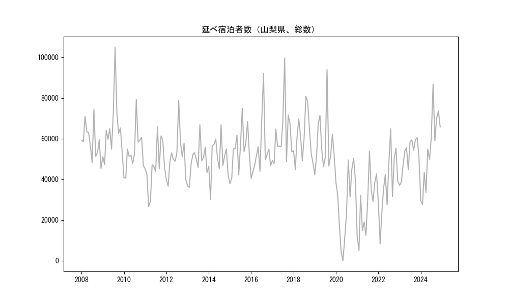
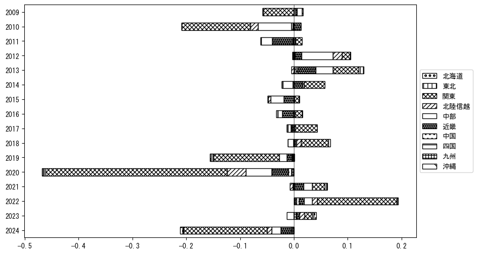
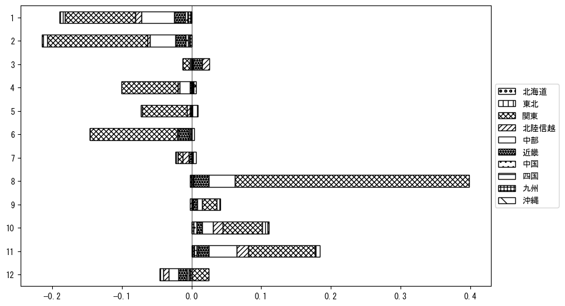

`<!DOCTYPE html>`{=html}
<html lang="ja">
<head>
    <meta charset="UTF-8">
    <meta name="description" content="">
    <link rel="stylesheet" href="../css/style.css">
    <title>宿泊者数の重心 | 山梨県</title>
</head>    
<body>
<body>
<nav id ="global_navi">
    <ul>
        <li>[トップ](../index.html)</li>
        <li>[使い方](../how_to_use.html)</li>
        <li>[データについて](../on_data.html)</li>
        <li>[算出方法について](../method.html)</li>
        <li>[発展的な使い方](../developer.html)</li>
        <li>[サイトポリシー](../policy.html)</li>
    </ul>
</nav>
<ol class="breadcrumb">
    <li>[トップ](../index.html)</li>
    <li>山梨県</li>
</ol>
<h1 id="h1_0">山梨県</h1>

<ul>
  <li> **[１．延べ宿泊者（総数、月次）の推移](#h1_1)** 
    <ul>
      <li> [時系列グラフ](#h2_1) </li>
      <li> [基本統計量](#h2_2) </li>
    </ul>
  </li>  
</ul>

<ul>
  <li> **[２．宿泊者数の重心（年平均の推移）](#h1_2)** 
  <ul>
  <li> [重心の前年平均からの移動距離と方位、および緯度・経度](#h2_4) </li>
  <li> [運輸局別延べ宿泊者数](#h2_5) 
  <ul>
  <li> [時系列（年平均）](#h3_1) </li>
  <li> [寄与度（前年からの変化率に対する）](#h3_2) </li>
  </ul>
  </li>
  </ul>
  </li>
</ul>

<ul>
  <li> **[３．宿泊者数の重心（月別）](#h1_3)** 
  <ul>
  <li> [全期間（2008年1月～2023年12月）の平均と月別平均の比較](#h2_6) </li>
  <li> [運輸局別延べ宿泊者数](#h2_7) 
  <ul>
  <li> [月別平均（2008年1月～2023年12月）](#h3_3) </li>
  <li> [寄与度（全期間の平均から月別平均への変化率に対する）](#h3_4) </li>
  </ul>
  </li>
  </ul>
  </li>
</ul>

<ul>
<li> **[４．データのダウンロード](#h1_4)** </li>
</ul>

<h1 id="h1_1">１．延べ宿泊者（総数）の推移</h1>
<h2 id="h2_1">時系列グラフ</h2>

<figcaption>図１：山梨県内の従業員数100人以上の宿泊施設での延べ宿泊者数（国外、居住地不詳を含む総数）。</figcaption>

<h2 id="h2_2">基本統計量</h2>
|  | 平均 | 標準偏差 | 最小値 | 最大値 |
|:----:|:----:|:----:|:----:|:----:|
| 2008年 | 58,618 | 8,588 | 45,418 (12月) | 74,334 (8月) |
| 2009年 | 64,448 | 15,011 | 47,321 (2月) | 104,922 (8月) |
| 2010年 | 53,670 | 10,379 | 40,628 (2月) | 79,228 (8月) |
| 2011年 | 46,473 | 11,600 | 26,576 (3月) | 65,843 (8月) |
| 2012年 | 51,316 | 11,057 | 36,635 (2月) | 78,846 (8月) |
| 2013年 | 48,926 | 8,304 | 36,097 (2月) | 66,884 (8月) |
| 2014年 | 50,617 | 9,543 | 30,098 (2月) | 66,765 (8月) |
| 2015年 | 54,717 | 10,876 | 37,867 (1月) | 74,971 (8月) |
| 2016年 | 53,886 | 14,073 | 40,488 (1月) | 91,991 (8月) |
| 2017年 | 61,693 | 14,487 | 47,789 (2月) | 99,636 (8月) |
| 2018年 | 60,318 | 11,510 | 44,786 (2月) | 80,790 (8月) |
| 2019年 | 57,491 | 14,377 | 42,343 (1月) | 93,949 (8月) |
| 2020年 | 28,511 | 17,299 | 0 (5月) | 50,279 (11月) |
| 2021年 | 26,981 | 14,539 | 4,969 (2月) | 53,735 (8月) |
| 2022年 | 37,912 | 15,518 | 8,244 (2月) | 64,867 (8月) |
| 2023年 | 51,624 | 8,179 | 37,032 (1月) | 60,543 (11月) |
: 表１：従業員数100人以上の宿泊施設での延べ宿泊者の総数（国外、および居住地不詳を含む）に関する基本統計量。単位は人泊。平均は１か月あたりの平均値を表す。図１に対応。

<h1 id="h1_2">２．宿泊者数の重心（年平均の推移）</h1>

<iframe src="../html/annual/山梨県.html" width="1200" height="600"></iframe>
<figcaption>図２：山梨県内の従業員数100人以上の宿泊施設での延べ宿泊者数（国外、居住地不詳を除く）の重心（年平均の推移）。延べ宿泊者数が0であるため、2020年5月の重心は欠損。</figcaption>

[全画面表示](../html/annual/山梨県.html)

<h2 id="h2_4">重心の前年平均からの移動距離と方位、および緯度・経度</h2>
|  | 方位 | 距離 | 緯度 | 経度 |
|:----:|:----:|:----:|:----:|:----:|
| 2008年 | --- | --- | 35.6269 | 138.8451 |
| 2009年 | 西 | 10.0km | 35.6124 | 138.7360 |
| 2010年 | 東南東 | 0.4km | 35.6106 | 138.7403 |
| 2011年 | 東北東 | 16.5km | 35.6567 | 138.9134 |
| 2012年 | 西 | 13.2km | 35.6498 | 138.7679 |
| 2013年 | 西南西 | 15.8km | 35.5997 | 138.6046 |
| 2014年 | 東北東 | 4.0km | 35.6067 | 138.6475 |
| 2015年 | 東北東 | 10.4km | 35.6260 | 138.7598 |
| 2016年 | 東北東 | 8.6km | 35.6433 | 138.8523 |
| 2017年 | 東北東 | 8.6km | 35.6623 | 138.9448 |
| 2018年 | 東北東 | 3.4km | 35.6702 | 138.9814 |
| 2019年 | 南西 | 2.7km | 35.6534 | 138.9600 |
| 2020年 | 東南東 | 11.1km | 35.6209 | 139.0759 |
| 2021年 | 西北西 | 6.6km | 35.6349 | 139.0048 |
| 2022年 | 南南東 | 1.2km | 35.6247 | 139.0093 |
| 2023年 | 北北西 | 5.2km | 35.6669 | 138.9852 |
: 表２：重心の前年平均からの移動距離と方位、および緯度・経度。図２に対応。

<h2 id="h2_5">運輸局別延べ宿泊者数</h2>
<h3 id="h3_1">時系列（年平均）</h3>

<figcaption>図３：山梨県内の従業員数100人以上の宿泊施設での１か月あたり平均延べ宿泊者数（国外、居住地不詳を除く）の運輸局別内訳。</figcaption>

<h3 id="h3_2">寄与度（前年からの変化率に対する）</h3>

<figcaption>図４：山梨県内の従業員数100人以上の宿泊施設での運輸局別延べ宿泊者数（国外、居住地不詳を除く）から求めた寄与度。</figcaption>

<h1 id="h1_3">３．宿泊者数の重心（月別）</h3>

<iframe src="../html/monthly/山梨県.html" width="1200" height="600"></iframe>
<figcaption>図５：山梨県内の従業員数100人以上の宿泊施設での延べ宿泊者数（国外、居住地不詳を除く）の重心（月別）。観測期間は2008年1月から2023年12月まで。延べ宿泊者数が0であるため、2020年5月の重心は欠損。</figcaption>

[全画面表示](../html/monthly/山梨県.html)

<h2 id="h2_6">全期間（2008年1月～2023年12月）の平均と月別平均の比較</h2>
|  | 方位 | 距離 | 緯度 | 経度 |
|:----:|:----:|:----:|:----:|:----:|
| 全期間 | --- | --- | 35.6354 | 138.8632 |
| 1月 | 東北東 | 6.3km | 35.6470 | 138.9315 |
| 2月 | 北西 | 1.3km | 35.6435 | 138.8536 |
| 3月 | 西 | 9.6km | 35.6296 | 138.7577 |
| 4月 | 西北西 | 4.0km | 35.6457 | 138.8214 |
| 5月 | 西南西 | 4.4km | 35.6251 | 138.8165 |
| 6月 | 北西 | 0.9km | 35.6418 | 138.8570 |
| 7月 | 南南東 | 3.2km | 35.6081 | 138.8741 |
| 8月 | 東南東 | 13.1km | 35.6040 | 139.0029 |
| 9月 | 東北東 | 2.6km | 35.6422 | 138.8911 |
| 10月 | 北西 | 5.5km | 35.6747 | 138.8255 |
| 11月 | 西 | 5.9km | 35.6450 | 138.7987 |
| 12月 | 東南東 | 5.9km | 35.6175 | 138.9251 |
: 表３：全期間の平均から月別平均までの移動距離と方位、および緯度・経度。図５に対応。

<h2 id="h2_7">運輸局別延べ宿泊者数</h2>
<h3 id="h3_3">月別平均（2008年1月～2023年12月）</h3>

<figcaption>図６：山梨県内の従業員数100人以上の宿泊施設での延べ宿泊者数（国外、居住地不詳を除く）の運輸局別内訳（月別）。</figcaption>

<h3 id="h3_4">寄与度（全期間の平均から月別平均への変化率に対する）</h3>

<figcaption>図７：山梨県内の従業員数100人以上の宿泊施設での運輸局別延べ宿泊者数（国外、居住地不詳を除く）から求めた寄与度（月別）。</figcaption>

</body>

<h1 id="h1_4">４．データのダウンロード</h1>
 <ul>
  <li> <a href="../csv/data_by_pref/延べ宿泊者数および重心（山梨県）.csv" download>延べ宿泊者数および重心の緯度経度</a> </li>
  <li> <a href="../csv/bar_chart/運輸局別_年平均（山梨県）.csv" download>運輸局別延べ宿泊者数（年平均）</a></li>
  <li> <a href="../csv/bar_chart_month/運輸局別_月別（山梨県）.csv" download>運輸局別延べ宿泊者数（月別）</a></li>
  <li> <a href="../csv/contrib/前年からの変化率に対する寄与度（山梨県）.csv" download>前年からの変化率に対する寄与度</a></li>
  <li> <a href="../csv/contrib_month/月別平均への変化率に対する寄与度（山梨県）.csv" download>月別平均への変化率に対する寄与度</a></li>
</ul>

出典：観光庁「宿泊旅行統計調査」に収録された「施設所在地、居住地別延べ宿泊者数（従業員数100人以上の施設）」

国土地理院「白地図（[地理院タイル](https://maps.gsi.go.jp/development/ichiran.html)）」（図２と図５）

