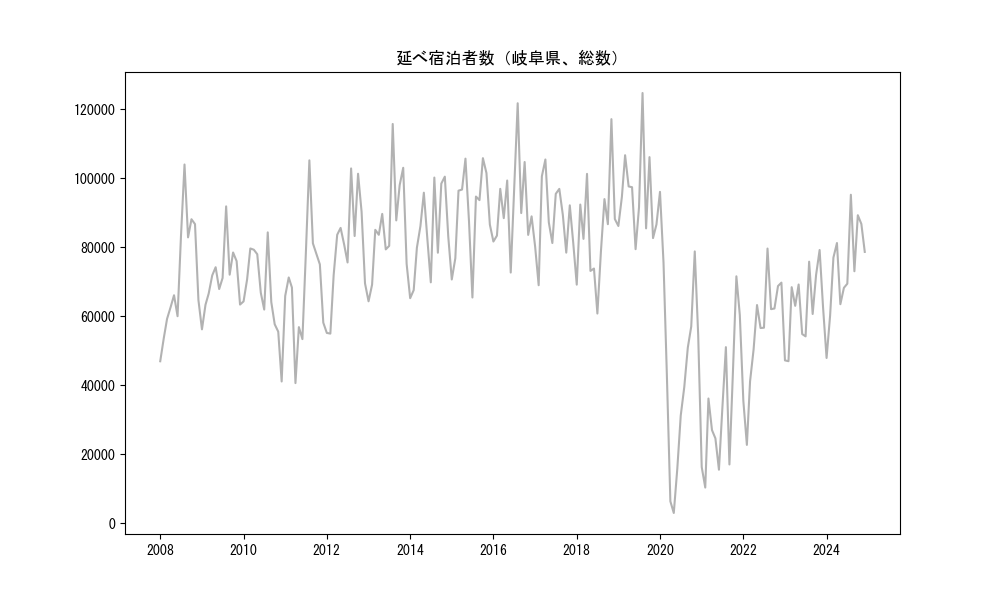
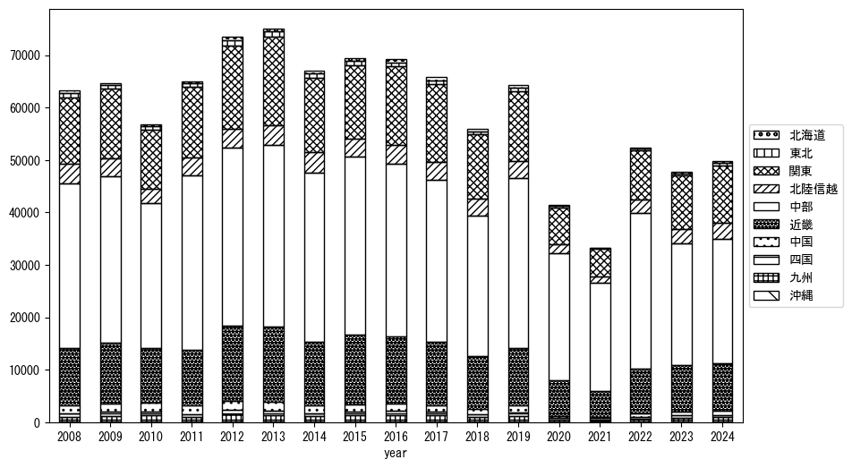
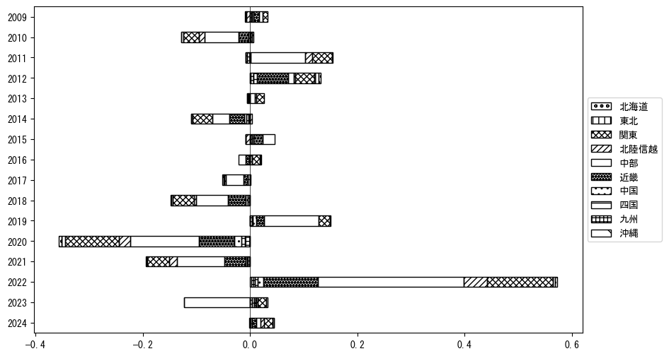

`<!DOCTYPE html>`{=html}
<html lang="ja">
<head>
    <meta charset="UTF-8">
    <meta name="description" content="">
    <link rel="stylesheet" href="../css/style.css">
    <title>宿泊者数の重心 | 岐阜県</title>
</head>    
<body>
<body>
<nav id ="global_navi">
    <ul>
        <li>[トップ](../index.html)</li>
        <li>[使い方](../how_to_use.html)</li>
        <li>[データについて](../on_data.html)</li>
        <li>[算出方法について](../method.html)</li>
        <li>[発展的な使い方](../developer.html)</li>
        <li>[サイトポリシー](../policy.html)</li>
    </ul>
</nav>
<ol class="breadcrumb">
    <li>[トップ](../index.html)</li>
    <li>岐阜県</li>
</ol>
<h1 id="h1_0">岐阜県</h1>

<ul>
  <li> **[１．延べ宿泊者（総数、月次）の推移](#h1_1)** 
    <ul>
      <li> [時系列グラフ](#h2_1) </li>
      <li> [基本統計量](#h2_2) </li>
    </ul>
  </li>  
</ul>

<ul>
  <li> **[２．宿泊者数の重心（年平均の推移）](#h1_2)** 
  <ul>
  <li> [重心の前年平均からの移動距離と方位、および緯度・経度](#h2_4) </li>
  <li> [運輸局別延べ宿泊者数](#h2_5) 
  <ul>
  <li> [時系列（年平均）](#h3_1) </li>
  <li> [寄与度（前年からの変化率に対する）](#h3_2) </li>
  </ul>
  </li>
  </ul>
  </li>
</ul>

<ul>
  <li> **[３．宿泊者数の重心（月別）](#h1_3)** 
  <ul>
  <li> [全期間（2008年1月～2024年12月）の平均と月別平均の比較](#h2_6) </li>
  <li> [運輸局別延べ宿泊者数](#h2_7) 
  <ul>
  <li> [月別平均（2008年1月～2024年12月）](#h3_3) </li>
  <li> [寄与度（全期間の平均から月別平均への変化率に対する）](#h3_4) </li>
  </ul>
  </li>
  </ul>
  </li>
</ul>

<ul>
<li> **[４．データのダウンロード](#h1_4)** </li>
</ul>

<h1 id="h1_1">１．延べ宿泊者（総数）の推移</h1>
<h2 id="h2_1">時系列グラフ</h2>

<figcaption>図１：岐阜県内の従業員数100人以上の宿泊施設での延べ宿泊者数（国外、居住地不詳を含む総数）。</figcaption>

<h2 id="h2_2">基本統計量</h2>
|  | 平均 | 標準偏差 | 最小値 | 最大値 |
|:----:|:----:|:----:|:----:|:----:|
| 2008年 | 71,543 | 17,016 | 46,994 (1月) | 104,005 (8月) |
| 2009年 | 71,103 | 9,004 | 56,242 (1月) | 91,873 (8月) |
| 2010年 | 66,980 | 12,338 | 41,131 (12月) | 84,336 (8月) |
| 2011年 | 69,368 | 16,477 | 40,663 (4月) | 105,214 (8月) |
| 2012年 | 79,598 | 15,287 | 55,001 (2月) | 102,866 (8月) |
| 2013年 | 85,969 | 14,415 | 64,362 (1月) | 115,749 (8月) |
| 2014年 | 83,978 | 12,648 | 65,267 (1月) | 100,484 (11月) |
| 2015年 | 90,142 | 13,208 | 65,464 (7月) | 105,837 (10月) |
| 2016年 | 92,384 | 12,789 | 72,697 (6月) | 121,750 (8月) |
| 2017年 | 88,133 | 10,533 | 69,023 (2月) | 105,455 (4月) |
| 2018年 | 84,835 | 15,346 | 60,821 (7月) | 117,147 (11月) |
| 2019年 | 94,947 | 12,791 | 79,466 (6月) | 124,721 (8月) |
| 2020年 | 46,050 | 29,013 | 3,026 (5月) | 96,084 (1月) |
| 2021年 | 33,925 | 19,365 | 10,398 (2月) | 71,609 (11月) |
| 2022年 | 55,760 | 16,001 | 22,757 (2月) | 79,654 (8月) |
| 2023年 | 62,878 | 10,579 | 47,010 (2月) | 79,231 (11月) |
| 2024年 | 74,235 | 13,362 | 47,944 (1月) | 95,241 (8月) |
: 表１：従業員数100人以上の宿泊施設での延べ宿泊者の総数（国外、および居住地不詳を含む）に関する基本統計量。単位は人泊。平均は１か月あたりの平均値を表す。図１に対応。

<h1 id="h1_2">２．宿泊者数の重心（年平均の推移）</h1>

<iframe src="../html/annual/岐阜県.html" width="1200" height="600"></iframe>
<figcaption>図２：岐阜県内の従業員数100人以上の宿泊施設での延べ宿泊者数（国外、居住地不詳を除く）の重心（年平均の推移）。</figcaption>

[全画面表示](../html/annual/岐阜県.html)

<h2 id="h2_4">重心の前年平均からの移動距離と方位、および緯度・経度</h2>
|  | 方位 | 距離 | 緯度 | 経度 |
|:----:|:----:|:----:|:----:|:----:|
| 2008年 | --- | --- | 35.3620 | 137.0611 |
| 2009年 | 南南西 | 3.3km | 35.3365 | 137.0415 |
| 2010年 | 西南西 | 8.1km | 35.3075 | 136.9596 |
| 2011年 | 東北東 | 10.9km | 35.3501 | 137.0672 |
| 2012年 | 南西 | 1.0km | 35.3432 | 137.0602 |
| 2013年 | 東 | 4.4km | 35.3426 | 137.1083 |
| 2014年 | 北北東 | 4.9km | 35.3849 | 137.1231 |
| 2015年 | 南西 | 7.9km | 35.3396 | 137.0555 |
| 2016年 | 東北東 | 5.6km | 35.3563 | 137.1131 |
| 2017年 | 東南東 | 2.5km | 35.3459 | 137.1369 |
| 2018年 | 北北東 | 2.2km | 35.3643 | 137.1458 |
| 2019年 | 西南西 | 4.7km | 35.3489 | 137.0974 |
| 2020年 | 西南西 | 8.8km | 35.3076 | 137.0143 |
| 2021年 | 東 | 4.2km | 35.3057 | 137.0606 |
| 2022年 | 東北東 | 1.7km | 35.3118 | 137.0775 |
| 2023年 | 東北東 | 3.7km | 35.3270 | 137.1132 |
| 2024年 | 北東 | 4.0km | 35.3540 | 137.1421 |
: 表２：重心の前年平均からの移動距離と方位、および緯度・経度。図２に対応。

<h2 id="h2_5">運輸局別延べ宿泊者数</h2>
<h3 id="h3_1">時系列（年平均）</h3>

<figcaption>図３：岐阜県内の従業員数100人以上の宿泊施設での１か月あたり平均延べ宿泊者数（国外、居住地不詳を除く）の運輸局別内訳。</figcaption>

<h3 id="h3_2">寄与度（前年からの変化率に対する）</h3>

<figcaption>図４：岐阜県内の従業員数100人以上の宿泊施設での運輸局別延べ宿泊者数（国外、居住地不詳を除く）から求めた寄与度。</figcaption>

<h1 id="h1_3">３．宿泊者数の重心（月別）</h3>

<iframe src="../html/monthly/岐阜県.html" width="1200" height="600"></iframe>
<figcaption>図５：岐阜県内の従業員数100人以上の宿泊施設での延べ宿泊者数（国外、居住地不詳を除く）の重心（月別）。観測期間は2008年1月から2024年12月まで。</figcaption>

[全画面表示](../html/monthly/岐阜県.html)

<h2 id="h2_6">全期間（2008年1月～2024年12月）の平均と月別平均の比較</h2>
|  | 方位 | 距離 | 緯度 | 経度 |
|:----:|:----:|:----:|:----:|:----:|
| 全期間 | --- | --- | 35.3405 | 137.0810 |
| 1月 | 南西 | 19.5km | 35.2360 | 136.9084 |
| 2月 | 南西 | 18.4km | 35.2367 | 136.9238 |
| 3月 | 西南西 | 11.5km | 35.3003 | 136.9649 |
| 4月 | 北北東 | 3.9km | 35.3744 | 137.0905 |
| 5月 | 北東 | 3.3km | 35.3638 | 137.1028 |
| 6月 | 北北東 | 5.4km | 35.3874 | 137.0979 |
| 7月 | 東北東 | 9.0km | 35.3761 | 137.1702 |
| 8月 | 東 | 24.0km | 35.3503 | 137.3442 |
| 9月 | 東北東 | 8.5km | 35.3705 | 137.1673 |
| 10月 | 北 | 6.8km | 35.4013 | 137.0877 |
| 11月 | 北東 | 5.1km | 35.3783 | 137.1126 |
| 12月 | 西南西 | 7.9km | 35.3103 | 137.0018 |
: 表３：全期間の平均から月別平均までの移動距離と方位、および緯度・経度。図５に対応。

<h2 id="h2_7">運輸局別延べ宿泊者数</h2>
<h3 id="h3_3">月別平均（2008年1月～2024年12月）</h3>

<figcaption>図６：岐阜県内の従業員数100人以上の宿泊施設での延べ宿泊者数（国外、居住地不詳を除く）の運輸局別内訳（月別）。</figcaption>

<h3 id="h3_4">寄与度（全期間の平均から月別平均への変化率に対する）</h3>

<figcaption>図７：岐阜県内の従業員数100人以上の宿泊施設での運輸局別延べ宿泊者数（国外、居住地不詳を除く）から求めた寄与度（月別）。</figcaption>

</body>

<h1 id="h1_4">４．データのダウンロード</h1>
 <ul>
  <li> <a href="../csv/data_by_pref/延べ宿泊者数および重心（岐阜県）.csv" download>延べ宿泊者数および重心の緯度経度</a> </li>
  <li> <a href="../csv/bar_chart/運輸局別_年平均（岐阜県）.csv" download>運輸局別延べ宿泊者数（年平均）</a></li>
  <li> <a href="../csv/bar_chart_month/運輸局別_月別（岐阜県）.csv" download>運輸局別延べ宿泊者数（月別）</a></li>
  <li> <a href="../csv/contrib/前年からの変化率に対する寄与度（岐阜県）.csv" download>前年からの変化率に対する寄与度</a></li>
  <li> <a href="../csv/contrib_month/月別平均への変化率に対する寄与度（岐阜県）.csv" download>月別平均への変化率に対する寄与度</a></li>
</ul>

出典：観光庁「宿泊旅行統計調査」に収録された「施設所在地、居住地別延べ宿泊者数（従業員数100人以上の施設）」

国土地理院「白地図（[地理院タイル](https://maps.gsi.go.jp/development/ichiran.html)）」（図２と図５）

