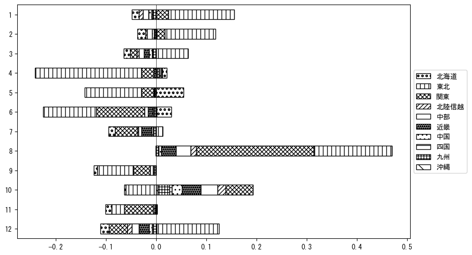

`<!DOCTYPE html>`{=html}
<html lang="ja">
<head>
    <meta charset="UTF-8">
    <meta name="description" content="">
    <link rel="stylesheet" href="../css/style.css">
    <title>宿泊者数の重心 | 岩手県</title>
</head>    
<body>
<body>
<nav id ="global_navi">
    <ul>
        <li>[トップ](../index.html)</li>
        <li>[使い方](../how_to_use.html)</li>
        <li>[データについて](../on_data.html)</li>
        <li>[算出方法について](../method.html)</li>
        <li>[発展的な使い方](../developer.html)</li>
        <li>[サイトポリシー](../policy.html)</li>
    </ul>
</nav>
<ol class="breadcrumb">
    <li>[トップ](../index.html)</li>
    <li>岩手県</li>
</ol>
<h1 id="h1_0">岩手県</h1>

<ul>
  <li> **[１．延べ宿泊者（総数、月次）の推移](#h1_1)** 
    <ul>
      <li> [時系列グラフ](#h2_1) </li>
      <li> [基本統計量](#h2_2) </li>
    </ul>
  </li>  
</ul>

<ul>
  <li> **[２．宿泊者数の重心（年平均の推移）](#h1_2)** 
  <ul>
  <li> [重心の前年平均からの移動距離と方位、および緯度・経度](#h2_4) </li>
  <li> [運輸局別延べ宿泊者数](#h2_5) 
  <ul>
  <li> [時系列（年平均）](#h3_1) </li>
  <li> [寄与度（前年からの変化率に対する）](#h3_2) </li>
  </ul>
  </li>
  </ul>
  </li>
</ul>

<ul>
  <li> **[３．宿泊者数の重心（月別）](#h1_3)** 
  <ul>
  <li> [全期間（2008年1月～2024年12月）の平均と月別平均の比較](#h2_6) </li>
  <li> [運輸局別延べ宿泊者数](#h2_7) 
  <ul>
  <li> [月別平均（2008年1月～2024年12月）](#h3_3) </li>
  <li> [寄与度（全期間の平均から月別平均への変化率に対する）](#h3_4) </li>
  </ul>
  </li>
  </ul>
  </li>
</ul>

<ul>
<li> **[４．データのダウンロード](#h1_4)** </li>
</ul>

<h1 id="h1_1">１．延べ宿泊者（総数）の推移</h1>
<h2 id="h2_1">時系列グラフ</h2>

<figcaption>図１：岩手県内の従業員数100人以上の宿泊施設での延べ宿泊者数（国外、居住地不詳を含む総数）。</figcaption>

<h2 id="h2_2">基本統計量</h2>
|  | 平均 | 標準偏差 | 最小値 | 最大値 |
|:----:|:----:|:----:|:----:|:----:|
| 2008年 | 94,447 | 13,823 | 76,959 (6月) | 120,647 (8月) |
| 2009年 | 77,867 | 15,205 | 58,504 (6月) | 115,060 (8月) |
| 2010年 | 86,667 | 16,228 | 68,745 (6月) | 130,989 (8月) |
| 2011年 | 82,281 | 21,863 | 45,569 (3月) | 130,063 (8月) |
| 2012年 | 76,243 | 15,464 | 52,423 (4月) | 115,775 (8月) |
| 2013年 | 65,834 | 12,351 | 54,222 (9月) | 98,406 (8月) |
| 2014年 | 67,488 | 13,071 | 49,469 (7月) | 90,212 (8月) |
| 2015年 | 60,844 | 12,972 | 45,632 (7月) | 88,455 (8月) |
| 2016年 | 49,275 | 11,530 | 36,831 (6月) | 69,002 (10月) |
| 2017年 | 52,985 | 11,229 | 38,669 (6月) | 78,128 (8月) |
| 2018年 | 52,187 | 13,963 | 35,650 (6月) | 74,940 (8月) |
| 2019年 | 52,502 | 15,706 | 27,853 (9月) | 77,734 (8月) |
| 2020年 | 38,886 | 24,153 | 4,402 (5月) | 82,772 (1月) |
| 2021年 | 27,983 | 9,465 | 9,605 (9月) | 42,060 (12月) |
| 2022年 | 33,842 | 9,098 | 20,328 (6月) | 52,092 (8月) |
| 2023年 | 35,180 | 9,357 | 21,749 (11月) | 51,647 (8月) |
| 2024年 | 41,185 | 8,654 | 30,648 (4月) | 60,396 (8月) |
: 表１：従業員数100人以上の宿泊施設での延べ宿泊者の総数（国外、および居住地不詳を含む）に関する基本統計量。単位は人泊。平均は１か月あたりの平均値を表す。図１に対応。

<h1 id="h1_2">２．宿泊者数の重心（年平均の推移）</h1>

<iframe src="../html/annual/岩手県.html" width="1200" height="600"></iframe>
<figcaption>図２：岩手県内の従業員数100人以上の宿泊施設での延べ宿泊者数（国外、居住地不詳を除く）の重心（年平均の推移）。</figcaption>

[全画面表示](../html/annual/岩手県.html)

<h2 id="h2_4">重心の前年平均からの移動距離と方位、および緯度・経度</h2>
|  | 方位 | 距離 | 緯度 | 経度 |
|:----:|:----:|:----:|:----:|:----:|
| 2008年 | --- | --- | 38.0931 | 140.0620 |
| 2009年 | 西南西 | 11.5km | 38.0549 | 139.9408 |
| 2010年 | 南南東 | 2.9km | 38.0292 | 139.9480 |
| 2011年 | 北東 | 34.4km | 38.2520 | 140.2207 |
| 2012年 | 南西 | 23.7km | 38.0828 | 140.0554 |
| 2013年 | 北西 | 7.5km | 38.1326 | 139.9974 |
| 2014年 | 南南西 | 25.2km | 37.9391 | 139.8468 |
| 2015年 | 北北東 | 27.8km | 38.1499 | 140.0174 |
| 2016年 | 西北西 | 6.8km | 38.1748 | 139.9469 |
| 2017年 | 東 | 12.3km | 38.1703 | 140.0871 |
| 2018年 | 北北東 | 9.1km | 38.2508 | 140.1079 |
| 2019年 | 西南西 | 9.7km | 38.2245 | 140.0028 |
| 2020年 | 北東 | 39.3km | 38.4950 | 140.2933 |
| 2021年 | 北北東 | 18.5km | 38.6388 | 140.3995 |
| 2022年 | 南南西 | 47.1km | 38.2798 | 140.1110 |
| 2023年 | 南南西 | 45.3km | 37.9060 | 139.9045 |
| 2024年 | 南西 | 8.5km | 37.8598 | 139.8269 |
: 表２：重心の前年平均からの移動距離と方位、および緯度・経度。図２に対応。

<h2 id="h2_5">運輸局別延べ宿泊者数</h2>
<h3 id="h3_1">時系列（年平均）</h3>

<figcaption>図３：岩手県内の従業員数100人以上の宿泊施設での１か月あたり平均延べ宿泊者数（国外、居住地不詳を除く）の運輸局別内訳。</figcaption>

<h3 id="h3_2">寄与度（前年からの変化率に対する）</h3>

<figcaption>図４：岩手県内の従業員数100人以上の宿泊施設での運輸局別延べ宿泊者数（国外、居住地不詳を除く）から求めた寄与度。</figcaption>

<h1 id="h1_3">３．宿泊者数の重心（月別）</h3>

<iframe src="../html/monthly/岩手県.html" width="1200" height="600"></iframe>
<figcaption>図５：岩手県内の従業員数100人以上の宿泊施設での延べ宿泊者数（国外、居住地不詳を除く）の重心（月別）。観測期間は2008年1月から2024年12月まで。</figcaption>

[全画面表示](../html/monthly/岩手県.html)

<h2 id="h2_6">全期間（2008年1月～2024年12月）の平均と月別平均の比較</h2>
|  | 方位 | 距離 | 緯度 | 経度 |
|:----:|:----:|:----:|:----:|:----:|
| 全期間 | --- | --- | 38.1608 | 140.0452 |
| 1月 | 北東 | 25.5km | 38.3099 | 140.2669 |
| 2月 | 東北東 | 12.8km | 38.1942 | 140.1848 |
| 3月 | 北東 | 29.0km | 38.3454 | 140.2788 |
| 4月 | 南西 | 34.6km | 37.9333 | 139.7749 |
| 5月 | 北 | 25.1km | 38.3854 | 140.0753 |
| 6月 | 北北東 | 36.1km | 38.4753 | 140.1500 |
| 7月 | 北東 | 24.5km | 38.3223 | 140.2358 |
| 8月 | 南南西 | 52.2km | 37.7124 | 139.8645 |
| 9月 | 南 | 6.0km | 38.1074 | 140.0371 |
| 10月 | 南西 | 99.0km | 37.4970 | 139.2943 |
| 11月 | 北北西 | 5.3km | 38.2027 | 140.0165 |
| 12月 | 北東 | 42.0km | 38.4441 | 140.3633 |
: 表３：全期間の平均から月別平均までの移動距離と方位、および緯度・経度。図５に対応。

<h2 id="h2_7">運輸局別延べ宿泊者数</h2>
<h3 id="h3_3">月別平均（2008年1月～2024年12月）</h3>

<figcaption>図６：岩手県内の従業員数100人以上の宿泊施設での延べ宿泊者数（国外、居住地不詳を除く）の運輸局別内訳（月別）。</figcaption>

<h3 id="h3_4">寄与度（全期間の平均から月別平均への変化率に対する）</h3>

<figcaption>図７：岩手県内の従業員数100人以上の宿泊施設での運輸局別延べ宿泊者数（国外、居住地不詳を除く）から求めた寄与度（月別）。</figcaption>

</body>

<h1 id="h1_4">４．データのダウンロード</h1>
 <ul>
  <li> <a href="../csv/data_by_pref/延べ宿泊者数および重心（岩手県）.csv" download>延べ宿泊者数および重心の緯度経度</a> </li>
  <li> <a href="../csv/bar_chart/運輸局別_年平均（岩手県）.csv" download>運輸局別延べ宿泊者数（年平均）</a></li>
  <li> <a href="../csv/bar_chart_month/運輸局別_月別（岩手県）.csv" download>運輸局別延べ宿泊者数（月別）</a></li>
  <li> <a href="../csv/contrib/前年からの変化率に対する寄与度（岩手県）.csv" download>前年からの変化率に対する寄与度</a></li>
  <li> <a href="../csv/contrib_month/月別平均への変化率に対する寄与度（岩手県）.csv" download>月別平均への変化率に対する寄与度</a></li>
</ul>

出典：観光庁「宿泊旅行統計調査」に収録された「施設所在地、居住地別延べ宿泊者数（従業員数100人以上の施設）」

国土地理院「白地図（[地理院タイル](https://maps.gsi.go.jp/development/ichiran.html)）」（図２と図５）

