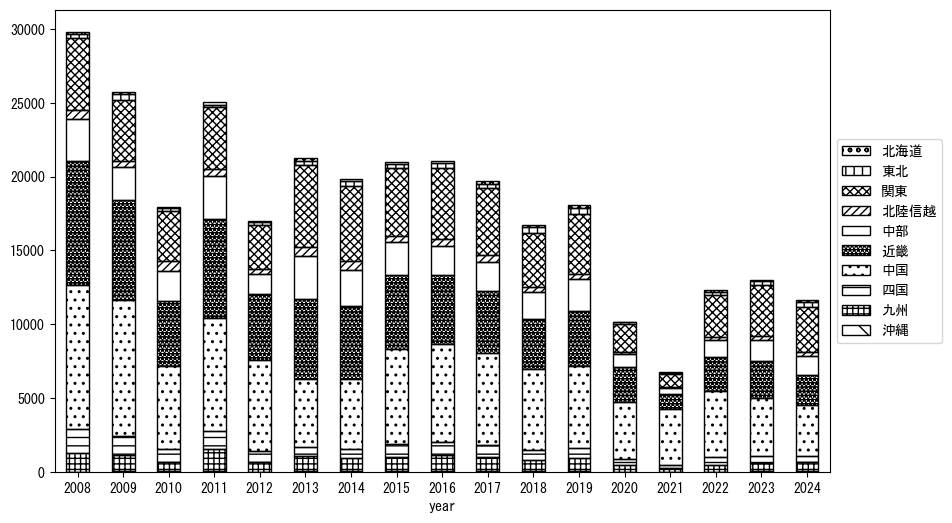

`<!DOCTYPE html>`{=html}
<html lang="ja">
<head>
    <meta charset="UTF-8">
    <meta name="description" content="">
    <link rel="stylesheet" href="../css/style.css">
    <title>宿泊者数の重心 | 島根県</title>
</head>    
<body>
<body>
<nav id ="global_navi">
    <ul>
        <li>[トップ](../index.html)</li>
        <li>[使い方](../how_to_use.html)</li>
        <li>[データについて](../on_data.html)</li>
        <li>[算出方法について](../method.html)</li>
        <li>[発展的な使い方](../developer.html)</li>
        <li>[サイトポリシー](../policy.html)</li>
    </ul>
</nav>
<ol class="breadcrumb">
    <li>[トップ](../index.html)</li>
    <li>島根県</li>
</ol>
<h1 id="h1_0">島根県</h1>

<ul>
  <li> **[１．延べ宿泊者（総数、月次）の推移](#h1_1)** 
    <ul>
      <li> [時系列グラフ](#h2_1) </li>
      <li> [基本統計量](#h2_2) </li>
    </ul>
  </li>  
</ul>

<ul>
  <li> **[２．宿泊者数の重心（年平均の推移）](#h1_2)** 
  <ul>
  <li> [重心の前年平均からの移動距離と方位、および緯度・経度](#h2_4) </li>
  <li> [運輸局別延べ宿泊者数](#h2_5) 
  <ul>
  <li> [時系列（年平均）](#h3_1) </li>
  <li> [寄与度（前年からの変化率に対する）](#h3_2) </li>
  </ul>
  </li>
  </ul>
  </li>
</ul>

<ul>
  <li> **[３．宿泊者数の重心（月別）](#h1_3)** 
  <ul>
  <li> [全期間（2008年1月～2023年12月）の平均と月別平均の比較](#h2_6) </li>
  <li> [運輸局別延べ宿泊者数](#h2_7) 
  <ul>
  <li> [月別平均（2008年1月～2023年12月）](#h3_3) </li>
  <li> [寄与度（全期間の平均から月別平均への変化率に対する）](#h3_4) </li>
  </ul>
  </li>
  </ul>
  </li>
</ul>

<ul>
<li> **[４．データのダウンロード](#h1_4)** </li>
</ul>

<h1 id="h1_1">１．延べ宿泊者（総数）の推移</h1>
<h2 id="h2_1">時系列グラフ</h2>

<figcaption>図１：島根県内の従業員数100人以上の宿泊施設での延べ宿泊者数（国外、居住地不詳を含む総数）。</figcaption>

<h2 id="h2_2">基本統計量</h2>
|  | 平均 | 標準偏差 | 最小値 | 最大値 |
|:----:|:----:|:----:|:----:|:----:|
| 2008年 | 30,630 | 4,989 | 23,486 (1月) | 39,047 (8月) |
| 2009年 | 25,819 | 4,670 | 19,919 (2月) | 35,500 (11月) |
| 2010年 | 26,560 | 5,364 | 20,780 (7月) | 38,002 (11月) |
| 2011年 | 25,085 | 6,116 | 16,725 (1月) | 34,514 (10月) |
| 2012年 | 17,048 | 5,949 | 8,167 (7月) | 28,360 (11月) |
| 2013年 | 22,295 | 5,127 | 12,324 (1月) | 28,596 (8月) |
| 2014年 | 20,215 | 3,250 | 15,322 (1月) | 24,815 (11月) |
| 2015年 | 21,587 | 3,649 | 16,129 (1月) | 27,892 (8月) |
| 2016年 | 21,860 | 2,850 | 18,216 (12月) | 26,797 (11月) |
| 2017年 | 20,586 | 4,697 | 12,317 (7月) | 27,364 (11月) |
| 2018年 | 17,735 | 5,839 | 9,925 (2月) | 26,987 (11月) |
| 2019年 | 19,120 | 5,731 | 11,163 (2月) | 27,232 (11月) |
| 2020年 | 10,403 | 6,683 | 407 (5月) | 22,360 (11月) |
| 2021年 | 6,737 | 5,322 | 1,248 (2月) | 17,840 (12月) |
| 2022年 | 12,432 | 6,170 | 2,393 (2月) | 23,748 (11月) |
| 2023年 | 13,709 | 5,746 | 4,263 (4月) | 22,660 (3月) |
: 表１：従業員数100人以上の宿泊施設での延べ宿泊者の総数（国外、および居住地不詳を含む）に関する基本統計量。単位は人泊。平均は１か月あたりの平均値を表す。図１に対応。

<h1 id="h1_2">２．宿泊者数の重心（年平均の推移）</h1>

<iframe src="../html/annual/島根県.html" width="1200" height="600"></iframe>
<figcaption>図２：島根県内の従業員数100人以上の宿泊施設での宿泊者数（国外、居住地不詳を除く）の重心（年平均の推移）。</figcaption>

[全画面表示](../html/annual/島根県.html)

<h2 id="h2_4">重心の前年平均からの移動距離と方位、および緯度・経度</h2>
|  | 方位 | 距離 | 緯度 | 経度 |
|:----:|:----:|:----:|:----:|:----:|
| 2008年 | --- | --- | 35.0559 | 135.2786 |
| 2009年 | 西北西 | 8.5km | 35.0863 | 135.1930 |
| 2010年 | 東北東 | 31.9km | 35.1516 | 135.5332 |
| 2011年 | 西南西 | 32.1km | 35.0298 | 135.2144 |
| 2012年 | 北北東 | 11.1km | 35.1156 | 135.2766 |
| 2013年 | 東 | 66.7km | 35.1776 | 136.0048 |
| 2014年 | 北北東 | 4.7km | 35.2174 | 136.0225 |
| 2015年 | 西南西 | 43.6km | 35.1071 | 135.5626 |
| 2016年 | 北北東 | 4.9km | 35.1490 | 135.5781 |
| 2017年 | 北東 | 5.3km | 35.1821 | 135.6209 |
| 2018年 | 西 | 1.5km | 35.1821 | 135.6043 |
| 2019年 | 東 | 5.4km | 35.1883 | 135.6628 |
| 2020年 | 西南西 | 58.3km | 35.0098 | 135.0612 |
| 2021年 | 西北西 | 40.2km | 35.1079 | 134.6365 |
| 2022年 | 東 | 80.6km | 35.1474 | 135.5195 |
| 2023年 | 東 | 23.7km | 35.1692 | 135.7782 |
: 表２：重心の前年平均からの移動距離と方位、および緯度・経度。図２に対応。

<h2 id="h2_5">運輸局別延べ宿泊者数</h2>
<h3 id="h3_1">時系列（年平均）</h3>

<figcaption>図３：島根県内の従業員数100人以上の宿泊施設での１か月あたり平均宿泊者数（国外、居住地不詳を除く）の運輸局別内訳。</figcaption>

<h3 id="h3_2">寄与度（前年からの変化率に対する）</h3>

<figcaption>図４：島根県内の従業員数100人以上の宿泊施設での運輸局別宿泊者数（国外、居住地不詳を除く）から求めた寄与度。</figcaption>

<h1 id="h1_3">３．宿泊者数の重心（月別）</h3>

<iframe src="../html/monthly/島根県.html" width="1200" height="600"></iframe>
<figcaption>図５：島根県内の従業員数100人以上の宿泊施設での宿泊者数（国外、居住地不詳を除く）の重心（月別）。観測期間は2008年1月から2023年12月まで。</figcaption>

[全画面表示](../html/monthly/島根県.html)

<h2 id="h2_6">全期間（2008年1月～2023年12月）の平均と月別平均の比較</h2>
|  | 方位 | 距離 | 緯度 | 経度 |
|:----:|:----:|:----:|:----:|:----:|
| 全期間 | --- | --- | 35.1298 | 135.4717 |
| 1月 | 西 | 52.6km | 35.0745 | 134.8989 |
| 2月 | 西 | 37.0km | 35.0888 | 135.0691 |
| 3月 | 西 | 17.1km | 35.1037 | 135.2870 |
| 4月 | 西北西 | 4.9km | 35.1430 | 135.4203 |
| 5月 | 東 | 31.6km | 35.1629 | 135.8159 |
| 6月 | 東北東 | 9.9km | 35.1635 | 135.5726 |
| 7月 | 南南西 | 5.7km | 35.0861 | 135.4397 |
| 8月 | 東南東 | 20.3km | 35.0883 | 135.6888 |
| 9月 | 東 | 23.6km | 35.1341 | 135.7304 |
| 10月 | 東北東 | 32.7km | 35.2012 | 135.8195 |
| 11月 | 東 | 37.2km | 35.1697 | 135.8766 |
| 12月 | 西 | 39.2km | 35.1421 | 135.0414 |
: 表３：全期間の平均から月別平均までの移動距離と方位、および緯度・経度。図５に対応。

<h2 id="h2_7">運輸局別延べ宿泊者数</h2>
<h3 id="h3_3">月別平均（2008年1月～2023年12月）</h3>

<figcaption>図６：島根県内の従業員数100人以上の宿泊施設での宿泊者数（国外、居住地不詳を除く）の運輸局別内訳（月別）。</figcaption>

<h3 id="h3_4">寄与度（全期間の平均から月別平均への変化率に対する）</h3>

<figcaption>図７：島根県内の従業員数100人以上の宿泊施設での運輸局別宿泊者数（国外、居住地不詳を除く）から求めた寄与度（月別）。</figcaption>

</body>

<h1 id="h1_4">４．データのダウンロード</h1>
 <ul>
  <li> <a href="../csv/data_by_pref/延べ宿泊者数および重心（島根県）.csv" download>延べ宿泊者数および重心の緯度経度</a> </li>
  <li> <a href="../csv/bar_chart/運輸局別_年平均（島根県）.csv" download>運輸局別延べ宿泊者数（年平均）</a></li>
  <li> <a href="../csv/bar_chart_month/運輸局別_月別（島根県）.csv" download>運輸局別延べ宿泊者数（月別）</a></li>
  <li> <a href="../csv/contrib/前年からの変化率に対する寄与度（島根県）.csv" download>前年からの変化率に対する寄与度</a></li>
  <li> <a href="../csv/contrib_month/月別平均への変化率に対する寄与度（島根県）.csv" download>月別平均への変化率に対する寄与度</a></li>
</ul>

出典：観光庁「宿泊旅行統計調査」に収録された「施設所在地、居住地別延べ宿泊者数（従業員数100人以上の施設）」

国土地理院「白地図（[地理院タイル](https://maps.gsi.go.jp/development/ichiran.html)）」（図２と図５）

