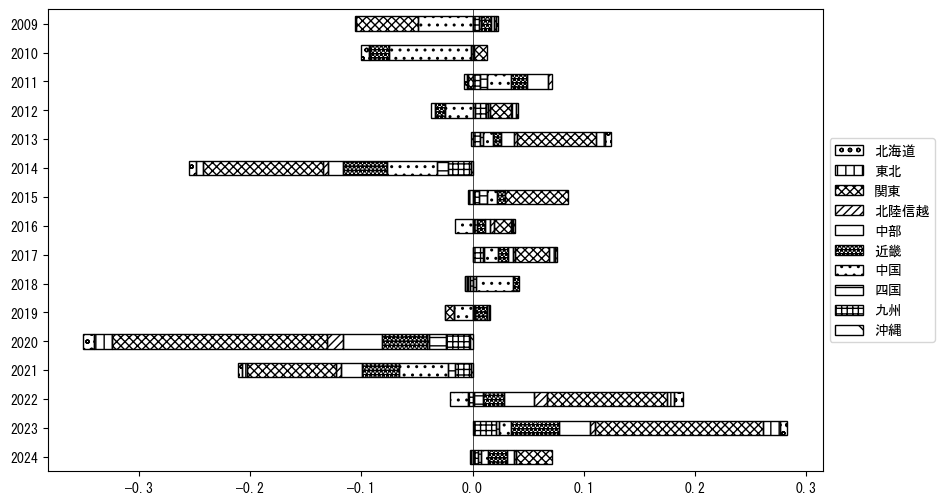

`<!DOCTYPE html>`{=html}
<html lang="ja">
<head>
    <meta charset="UTF-8">
    <meta name="description" content="">
    <link rel="stylesheet" href="../css/style.css">
    <title>宿泊者数の重心 | 広島県</title>
</head>    
<body>
<body>
<nav id ="global_navi">
    <ul>
        <li>[トップ](../index.html)</li>
        <li>[使い方](../how_to_use.html)</li>
        <li>[データについて](../on_data.html)</li>
        <li>[算出方法について](../method.html)</li>
        <li>[発展的な使い方](../developer.html)</li>
        <li>[サイトポリシー](../policy.html)</li>
    </ul>
</nav>
<ol class="breadcrumb">
    <li>[トップ](../index.html)</li>
    <li>広島県</li>
</ol>
<h1 id="h1_0">広島県</h1>

<ul>
  <li> **[１．延べ宿泊者（総数、月次）の推移](#h1_1)** 
    <ul>
      <li> [時系列グラフ](#h2_1) </li>
      <li> [基本統計量](#h2_2) </li>
    </ul>
  </li>  
</ul>

<ul>
  <li> **[２．宿泊者数の重心（年平均の推移）](#h1_2)** 
  <ul>
  <li> [重心の前年平均からの移動距離と方位、および緯度・経度](#h2_4) </li>
  <li> [運輸局別延べ宿泊者数](#h2_5) 
  <ul>
  <li> [時系列（年平均）](#h3_1) </li>
  <li> [寄与度（前年からの変化率に対する）](#h3_2) </li>
  </ul>
  </li>
  </ul>
  </li>
</ul>

<ul>
  <li> **[３．宿泊者数の重心（月別）](#h1_3)** 
  <ul>
  <li> [全期間（2008年1月～2023年12月）の平均と月別平均の比較](#h2_6) </li>
  <li> [運輸局別延べ宿泊者数](#h2_7) 
  <ul>
  <li> [月別平均（2008年1月～2023年12月）](#h3_3) </li>
  <li> [寄与度（全期間の平均から月別平均への変化率に対する）](#h3_4) </li>
  </ul>
  </li>
  </ul>
  </li>
</ul>

<ul>
<li> **[４．データのダウンロード](#h1_4)** </li>
</ul>

<h1 id="h1_1">１．延べ宿泊者（総数）の推移</h1>
<h2 id="h2_1">時系列グラフ</h2>

<figcaption>図１：広島県内の従業員数100人以上の宿泊施設での延べ宿泊者数（国外、居住地不詳を含む総数）。</figcaption>

<h2 id="h2_2">基本統計量</h2>
|  | 平均 | 標準偏差 | 最小値 | 最大値 |
|:----:|:----:|:----:|:----:|:----:|
| 2008年 | 125,724 | 20,149 | 99,994 (1月) | 167,485 (8月) |
| 2009年 | 110,055 | 19,304 | 78,180 (1月) | 144,934 (8月) |
| 2010年 | 109,249 | 16,103 | 88,145 (6月) | 138,203 (8月) |
| 2011年 | 103,756 | 13,767 | 82,925 (1月) | 129,698 (8月) |
| 2012年 | 106,779 | 15,129 | 85,103 (1月) | 136,038 (8月) |
| 2013年 | 123,043 | 24,632 | 91,211 (1月) | 179,316 (8月) |
| 2014年 | 95,790 | 15,591 | 68,076 (2月) | 121,851 (8月) |
| 2015年 | 108,854 | 19,792 | 77,319 (2月) | 149,264 (8月) |
| 2016年 | 116,170 | 22,863 | 68,329 (1月) | 149,490 (8月) |
| 2017年 | 125,182 | 18,517 | 90,406 (2月) | 148,227 (11月) |
| 2018年 | 130,393 | 16,389 | 99,630 (1月) | 155,398 (5月) |
| 2019年 | 133,545 | 15,898 | 107,943 (2月) | 158,713 (5月) |
| 2020年 | 68,553 | 35,861 | 8,353 (5月) | 122,599 (11月) |
| 2021年 | 52,280 | 26,689 | 26,772 (6月) | 111,616 (12月) |
| 2022年 | 63,692 | 23,870 | 23,352 (2月) | 92,935 (11月) |
| 2023年 | 106,697 | 18,840 | 75,935 (1月) | 134,253 (8月) |
: 表１：従業員数100人以上の宿泊施設での延べ宿泊者の総数（国外、および居住地不詳を含む）に関する基本統計量。単位は人。平均は１か月あたりの平均値を表す。図１に対応。

<h1 id="h1_2">２．宿泊者数の重心（年平均の推移）</h1>

<iframe src="../html/annual/広島県.html" width="1200" height="600"></iframe>
<figcaption>図２：広島県内の従業員数100人以上の宿泊施設での宿泊者数（国外、居住地不詳を除く）の重心（年平均の推移）。</figcaption>

[全画面表示](../html/annual/広島県.html)

<h2 id="h2_4">重心の前年平均からの移動距離と方位、および緯度・経度</h2>
|  | 方位 | 距離 | 緯度 | 経度 |
|:----:|:----:|:----:|:----:|:----:|
| 2008年 | --- | --- | 35.1272 | 135.9144 |
| 2009年 | 西北西 | 6.4km | 35.1447 | 135.8479 |
| 2010年 | 東 | 27.6km | 35.1574 | 136.1506 |
| 2011年 | 西南西 | 16.9km | 35.0913 | 135.9835 |
| 2012年 | 東北東 | 13.6km | 35.1320 | 136.1244 |
| 2013年 | 東北東 | 21.7km | 35.2186 | 136.3378 |
| 2014年 | 西南西 | 7.6km | 35.1962 | 136.2592 |
| 2015年 | 東 | 8.8km | 35.1892 | 136.3554 |
| 2016年 | 東北東 | 8.7km | 35.2160 | 136.4449 |
| 2017年 | 北東 | 2.5km | 35.2305 | 136.4655 |
| 2018年 | 西南西 | 12.3km | 35.2022 | 136.3350 |
| 2019年 | 東北東 | 3.9km | 35.2145 | 136.3751 |
| 2020年 | 西南西 | 87.8km | 34.9522 | 135.4672 |
| 2021年 | 西南西 | 19.6km | 34.9027 | 135.2611 |
| 2022年 | 東北東 | 48.1km | 35.0506 | 135.7561 |
| 2023年 | 東北東 | 48.3km | 35.1863 | 136.2592 |
: 表２：重心の前年平均からの移動距離と方位、および緯度・経度。図２に対応。

<h2 id="h2_5">運輸局別延べ宿泊者数</h2>
<h3 id="h3_1">時系列（年平均）</h3>

<figcaption>図３：広島県内の従業員数100人以上の宿泊施設での１か月あたり平均宿泊者数（国外、居住地不詳を除く）の運輸局別内訳。</figcaption>

<h3 id="h3_2">寄与度（前年からの変化率に対する）</h3>

<figcaption>図４：広島県内の従業員数100人以上の宿泊施設での運輸局別宿泊者数（国外、居住地不詳を除く）から求めた寄与度。</figcaption>

<h1 id="h1_3">３．宿泊者数の重心（月別）</h3>

<iframe src="../html/monthly/広島県.html" width="1200" height="600"></iframe>
<figcaption>図５：広島県内の従業員数100人以上の宿泊施設での宿泊者数（国外、居住地不詳を除く）の重心（月別）。観測期間は2008年1月から2023年12月まで。</figcaption>

[全画面表示](../html/monthly/広島県.html)

<h2 id="h2_6">全期間（2008年1月～2023年12月）の平均と月別平均の比較</h2>
|  | 方位 | 距離 | 緯度 | 経度 |
|:----:|:----:|:----:|:----:|:----:|
| 全期間 | --- | --- | 35.1382 | 136.0836 |
| 1月 | 西南西 | 38.0km | 35.0206 | 135.6926 |
| 2月 | 西南西 | 26.8km | 35.0459 | 135.8122 |
| 3月 | 東 | 8.5km | 35.1417 | 136.1763 |
| 4月 | 西南西 | 8.3km | 35.1152 | 135.9973 |
| 5月 | 東 | 6.0km | 35.1384 | 136.1493 |
| 6月 | 西南西 | 4.6km | 35.1172 | 136.0401 |
| 7月 | 南西 | 18.5km | 35.0354 | 135.9236 |
| 8月 | 南東 | 10.7km | 35.0632 | 136.1572 |
| 9月 | 東 | 15.8km | 35.1595 | 136.2551 |
| 10月 | 北東 | 44.6km | 35.3992 | 136.4558 |
| 11月 | 東北東 | 40.4km | 35.3322 | 136.4586 |
| 12月 | 西南西 | 18.9km | 35.0902 | 135.8849 |
: 表３：全期間の平均から月別平均までの移動距離と方位、および緯度・経度。図５に対応。

<h2 id="h2_7">運輸局別延べ宿泊者数</h2>
<h3 id="h3_3">月別平均（2008年1月～2023年12月）</h3>

<figcaption>図６：広島県内の従業員数100人以上の宿泊施設での宿泊者数（国外、居住地不詳を除く）の運輸局別内訳（月別）。</figcaption>

<h3 id="h3_4">寄与度（全期間の平均から月別平均への変化率に対する）</h3>

<figcaption>図７：広島県内の従業員数100人以上の宿泊施設での運輸局別宿泊者数（国外、居住地不詳を除く）から求めた寄与度（月別）。</figcaption>

</body>

<h1 id="h1_4">４．データのダウンロード</h1>
 <ul>
  <li> <a href="../csv/data_by_pref/延べ宿泊者数および重心（広島県）.csv" download>延べ宿泊者数および重心の緯度経度</a> </li>
  <li> <a href="../csv/bar_chart/運輸局別_年平均（広島県）.csv" download>運輸局別延べ宿泊者数（年平均）</a></li>
  <li> <a href="../csv/bar_chart_month/運輸局別_月別（広島県）.csv" download>運輸局別延べ宿泊者数（月別）</a></li>
  <li> <a href="../csv/contrib/前年からの変化率に対する寄与度（広島県）.csv" download>前年からの変化率に対する寄与度</a></li>
  <li> <a href="../csv/contrib_month/月別平均への変化率に対する寄与度（広島県）.csv" download>月別平均への変化率に対する寄与度</a></li>
</ul>

出典：観光庁「宿泊旅行統計調査」に収録された「施設所在地別、居住地別延べ宿泊者数（従業員数100人以上の施設）」

国土地理院「白地図（[地理院タイル](https://maps.gsi.go.jp/development/ichiran.html)）」（図２と図５）

