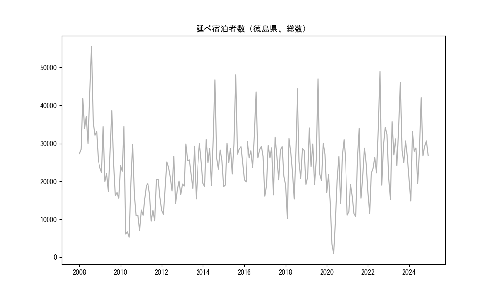
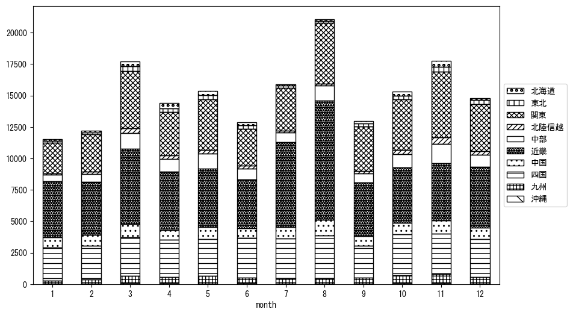
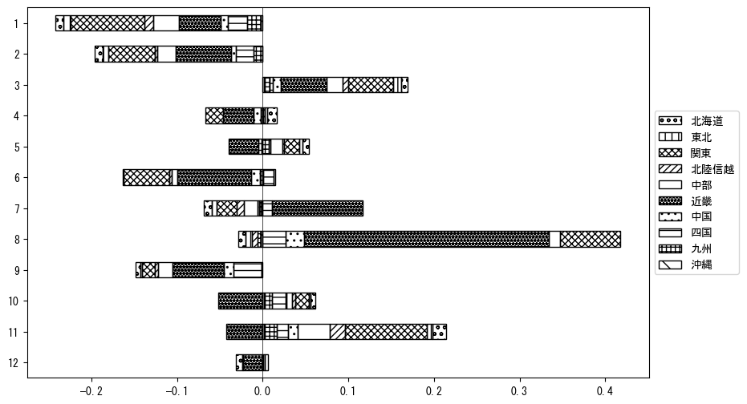

`<!DOCTYPE html>`{=html}
<html lang="ja">
<head>
    <meta charset="UTF-8">
    <meta name="description" content="">
    <link rel="stylesheet" href="../css/style.css">
    <title>宿泊者数の重心 | 徳島県</title>
</head>    
<body>
<body>
<nav id ="global_navi">
    <ul>
        <li>[トップ](../index.html)</li>
        <li>[使い方](../how_to_use.html)</li>
        <li>[データについて](../on_data.html)</li>
        <li>[算出方法について](../method.html)</li>
        <li>[発展的な使い方](../developer.html)</li>
        <li>[サイトポリシー](../policy.html)</li>
    </ul>
</nav>
<ol class="breadcrumb">
    <li>[トップ](../index.html)</li>
    <li>徳島県</li>
</ol>
<h1 id="h1_0">徳島県</h1>

<ul>
  <li> **[１．延べ宿泊者（総数、月次）の推移](#h1_1)** 
    <ul>
      <li> [時系列グラフ](#h2_1) </li>
      <li> [基本統計量](#h2_2) </li>
    </ul>
  </li>  
</ul>

<ul>
  <li> **[２．宿泊者数の重心（年平均の推移）](#h1_2)** 
  <ul>
  <li> [重心の前年平均からの移動距離と方位、および緯度・経度](#h2_4) </li>
  <li> [運輸局別延べ宿泊者数](#h2_5) 
  <ul>
  <li> [時系列（年平均）](#h3_1) </li>
  <li> [寄与度（前年からの変化率に対する）](#h3_2) </li>
  </ul>
  </li>
  </ul>
  </li>
</ul>

<ul>
  <li> **[３．宿泊者数の重心（月別）](#h1_3)** 
  <ul>
  <li> [全期間（2008年1月～2024年12月）の平均と月別平均の比較](#h2_6) </li>
  <li> [運輸局別延べ宿泊者数](#h2_7) 
  <ul>
  <li> [月別平均（2008年1月～2024年12月）](#h3_3) </li>
  <li> [寄与度（全期間の平均から月別平均への変化率に対する）](#h3_4) </li>
  </ul>
  </li>
  </ul>
  </li>
</ul>

<ul>
<li> **[４．データのダウンロード](#h1_4)** </li>
</ul>

<h1 id="h1_1">１．延べ宿泊者（総数）の推移</h1>
<h2 id="h2_1">時系列グラフ</h2>

<figcaption>図１：徳島県内の従業員数100人以上の宿泊施設での延べ宿泊者数（国外、居住地不詳を含む総数）。</figcaption>

<h2 id="h2_2">基本統計量</h2>
|  | 平均 | 標準偏差 | 最小値 | 最大値 |
|:----:|:----:|:----:|:----:|:----:|
| 2008年 | 35,326 | 8,425 | 25,477 (12月) | 55,655 (8月) |
| 2009年 | 23,343 | 7,262 | 15,480 (12月) | 38,617 (8月) |
| 2010年 | 16,166 | 9,913 | 5,317 (6月) | 34,453 (3月) |
| 2011年 | 15,172 | 4,141 | 9,509 (7月) | 20,555 (11月) |
| 2012年 | 18,664 | 4,848 | 11,298 (2月) | 26,565 (8月) |
| 2013年 | 23,574 | 4,915 | 15,315 (9月) | 29,961 (11月) |
| 2014年 | 26,848 | 7,623 | 18,655 (2月) | 46,767 (8月) |
| 2015年 | 27,585 | 7,601 | 18,644 (1月) | 48,079 (8月) |
| 2016年 | 27,872 | 6,181 | 19,872 (2月) | 43,607 (8月) |
| 2017年 | 24,455 | 5,457 | 16,145 (1月) | 31,680 (7月) |
| 2018年 | 25,079 | 8,707 | 10,137 (2月) | 44,499 (8月) |
| 2019年 | 26,619 | 8,006 | 19,211 (6月) | 47,019 (8月) |
| 2020年 | 17,611 | 9,480 | 870 (5月) | 31,032 (11月) |
| 2021年 | 19,206 | 7,765 | 10,726 (6月) | 34,017 (8月) |
| 2022年 | 26,699 | 9,883 | 11,452 (2月) | 48,936 (8月) |
| 2023年 | 28,638 | 7,827 | 15,204 (2月) | 46,097 (8月) |
| 2024年 | 27,349 | 6,993 | 14,752 (2月) | 42,127 (8月) |
: 表１：従業員数100人以上の宿泊施設での延べ宿泊者の総数（国外、および居住地不詳を含む）に関する基本統計量。単位は人泊。平均は１か月あたりの平均値を表す。図１に対応。

<h1 id="h1_2">２．宿泊者数の重心（年平均の推移）</h1>

<iframe src="../html/annual/徳島県.html" width="1200" height="600"></iframe>
<figcaption>図２：徳島県内の従業員数100人以上の宿泊施設での延べ宿泊者数（国外、居住地不詳を除く）の重心（年平均の推移）。</figcaption>

[全画面表示](../html/annual/徳島県.html)

<h2 id="h2_4">重心の前年平均からの移動距離と方位、および緯度・経度</h2>
|  | 方位 | 距離 | 緯度 | 経度 |
|:----:|:----:|:----:|:----:|:----:|
| 2008年 | --- | --- | 34.9944 | 136.1226 |
| 2009年 | 西南西 | 8.8km | 34.9685 | 136.0316 |
| 2010年 | 東北東 | 24.0km | 35.0140 | 136.2891 |
| 2011年 | 南西 | 17.4km | 34.9096 | 136.1470 |
| 2012年 | 北東 | 27.3km | 35.0862 | 136.3549 |
| 2013年 | 南西 | 4.5km | 35.0559 | 136.3216 |
| 2014年 | 西南西 | 26.4km | 34.9623 | 136.0551 |
| 2015年 | 北東 | 3.9km | 34.9869 | 136.0860 |
| 2016年 | 東北東 | 15.9km | 35.0629 | 136.2340 |
| 2017年 | 南東 | 3.8km | 35.0389 | 136.2632 |
| 2018年 | 東 | 7.8km | 35.0438 | 136.3489 |
| 2019年 | 東北東 | 5.8km | 35.0560 | 136.4103 |
| 2020年 | 西南西 | 54.1km | 34.8191 | 135.8930 |
| 2021年 | 南西 | 7.2km | 34.7659 | 135.8476 |
| 2022年 | 東北東 | 42.0km | 34.9612 | 136.2406 |
| 2023年 | 北東 | 24.1km | 35.0884 | 136.4543 |
| 2024年 | 北東 | 12.4km | 35.1670 | 136.5505 |
: 表２：重心の前年平均からの移動距離と方位、および緯度・経度。図２に対応。

<h2 id="h2_5">運輸局別延べ宿泊者数</h2>
<h3 id="h3_1">時系列（年平均）</h3>

<figcaption>図３：徳島県内の従業員数100人以上の宿泊施設での１か月あたり平均延べ宿泊者数（国外、居住地不詳を除く）の運輸局別内訳。</figcaption>

<h3 id="h3_2">寄与度（前年からの変化率に対する）</h3>

<figcaption>図４：徳島県内の従業員数100人以上の宿泊施設での運輸局別延べ宿泊者数（国外、居住地不詳を除く）から求めた寄与度。</figcaption>

<h1 id="h1_3">３．宿泊者数の重心（月別）</h3>

<iframe src="../html/monthly/徳島県.html" width="1200" height="600"></iframe>
<figcaption>図５：徳島県内の従業員数100人以上の宿泊施設での延べ宿泊者数（国外、居住地不詳を除く）の重心（月別）。観測期間は2008年1月から2024年12月まで。</figcaption>

[全画面表示](../html/monthly/徳島県.html)

<h2 id="h2_6">全期間（2008年1月～2024年12月）の平均と月別平均の比較</h2>
|  | 方位 | 距離 | 緯度 | 経度 |
|:----:|:----:|:----:|:----:|:----:|
| 全期間 | --- | --- | 34.9989 | 136.2147 |
| 1月 | 南西 | 24.2km | 34.8743 | 135.9973 |
| 2月 | 南西 | 14.6km | 34.9109 | 136.0958 |
| 3月 | 東北東 | 12.4km | 35.0600 | 136.3285 |
| 4月 | 北北東 | 8.8km | 35.0740 | 136.2460 |
| 5月 | 北東 | 9.3km | 35.0617 | 136.2816 |
| 6月 | 西南西 | 11.9km | 34.9712 | 136.0890 |
| 7月 | 南西 | 19.3km | 34.8796 | 136.0608 |
| 8月 | 南南西 | 10.0km | 34.9138 | 136.1770 |
| 9月 | 東 | 9.0km | 35.0055 | 136.3135 |
| 10月 | 北北東 | 6.9km | 35.0515 | 136.2559 |
| 11月 | 北東 | 35.9km | 35.2048 | 136.5183 |
| 12月 | 南 | 2.2km | 34.9792 | 136.2131 |
: 表３：全期間の平均から月別平均までの移動距離と方位、および緯度・経度。図５に対応。

<h2 id="h2_7">運輸局別延べ宿泊者数</h2>
<h3 id="h3_3">月別平均（2008年1月～2024年12月）</h3>

<figcaption>図６：徳島県内の従業員数100人以上の宿泊施設での延べ宿泊者数（国外、居住地不詳を除く）の運輸局別内訳（月別）。</figcaption>

<h3 id="h3_4">寄与度（全期間の平均から月別平均への変化率に対する）</h3>

<figcaption>図７：徳島県内の従業員数100人以上の宿泊施設での運輸局別延べ宿泊者数（国外、居住地不詳を除く）から求めた寄与度（月別）。</figcaption>

</body>

<h1 id="h1_4">４．データのダウンロード</h1>
 <ul>
  <li> <a href="../csv/data_by_pref/延べ宿泊者数および重心（徳島県）.csv" download>延べ宿泊者数および重心の緯度経度</a> </li>
  <li> <a href="../csv/bar_chart/運輸局別_年平均（徳島県）.csv" download>運輸局別延べ宿泊者数（年平均）</a></li>
  <li> <a href="../csv/bar_chart_month/運輸局別_月別（徳島県）.csv" download>運輸局別延べ宿泊者数（月別）</a></li>
  <li> <a href="../csv/contrib/前年からの変化率に対する寄与度（徳島県）.csv" download>前年からの変化率に対する寄与度</a></li>
  <li> <a href="../csv/contrib_month/月別平均への変化率に対する寄与度（徳島県）.csv" download>月別平均への変化率に対する寄与度</a></li>
</ul>

出典：観光庁「宿泊旅行統計調査」に収録された「施設所在地、居住地別延べ宿泊者数（従業員数100人以上の施設）」

国土地理院「白地図（[地理院タイル](https://maps.gsi.go.jp/development/ichiran.html)）」（図２と図５）

