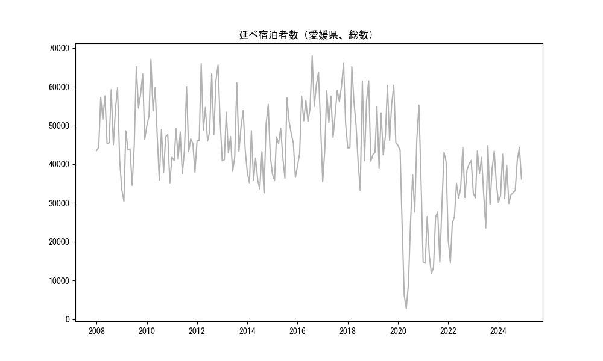
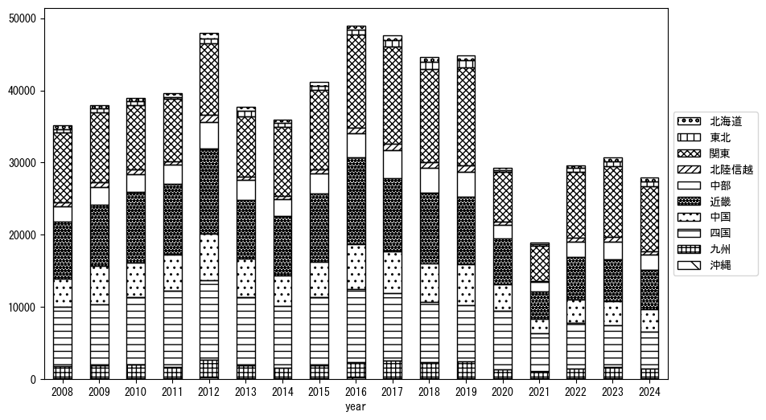
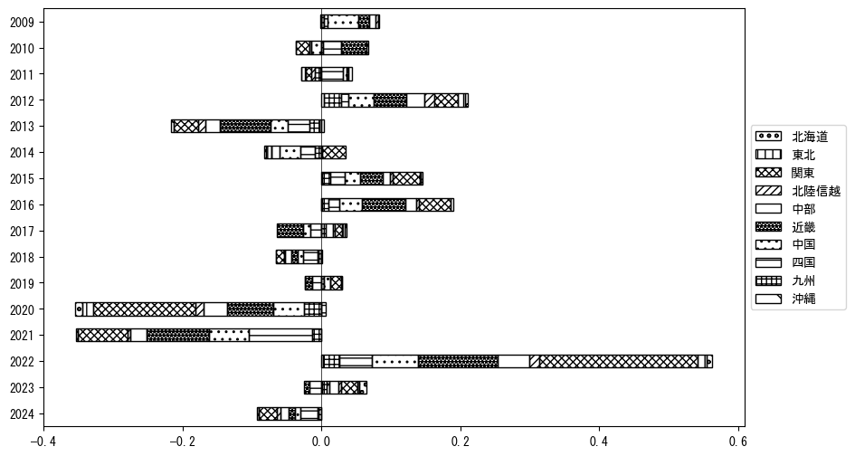
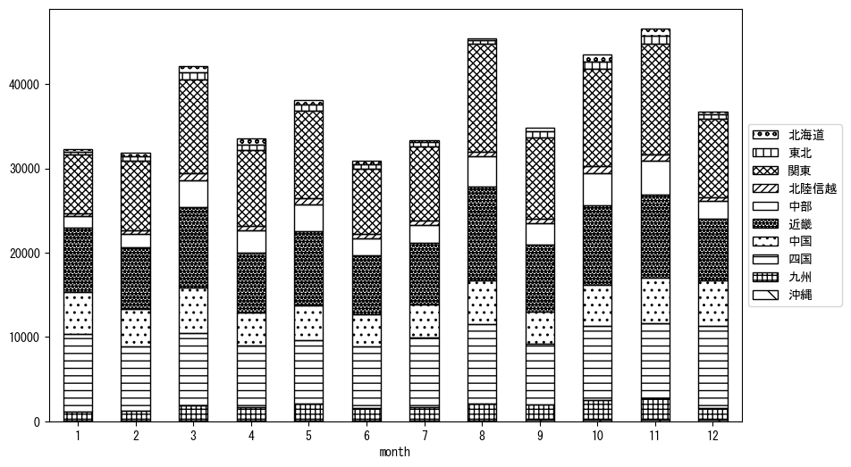

`<!DOCTYPE html>`{=html}
<html lang="ja">
<head>
    <meta charset="UTF-8">
    <meta name="description" content="">
    <link rel="stylesheet" href="../css/style.css">
    <title>宿泊者数の重心 | 愛媛県</title>
</head>    
<body>
<body>
<nav id ="global_navi">
    <ul>
        <li>[トップ](../index.html)</li>
        <li>[使い方](../how_to_use.html)</li>
        <li>[データについて](../on_data.html)</li>
        <li>[算出方法について](../method.html)</li>
        <li>[発展的な使い方](../developer.html)</li>
        <li>[サイトポリシー](../policy.html)</li>
    </ul>
</nav>
<ol class="breadcrumb">
    <li>[トップ](../index.html)</li>
    <li>愛媛県</li>
</ol>
<h1 id="h1_0">愛媛県</h1>

<ul>
  <li> **[１．延べ宿泊者（総数、月次）の推移](#h1_1)** 
    <ul>
      <li> [時系列グラフ](#h2_1) </li>
      <li> [基本統計量](#h2_2) </li>
    </ul>
  </li>  
</ul>

<ul>
  <li> **[２．宿泊者数の重心（年平均の推移）](#h1_2)** 
  <ul>
  <li> [重心の前年平均からの移動距離と方位、および緯度・経度](#h2_4) </li>
  <li> [運輸局別延べ宿泊者数](#h2_5) 
  <ul>
  <li> [時系列（年平均）](#h3_1) </li>
  <li> [寄与度（前年からの変化率に対する）](#h3_2) </li>
  </ul>
  </li>
  </ul>
  </li>
</ul>

<ul>
  <li> **[３．宿泊者数の重心（月別）](#h1_3)** 
  <ul>
  <li> [全期間（2008年1月～2023年12月）の平均と月別平均の比較](#h2_6) </li>
  <li> [運輸局別延べ宿泊者数](#h2_7) 
  <ul>
  <li> [月別平均（2008年1月～2023年12月）](#h3_3) </li>
  <li> [寄与度（全期間の平均から月別平均への変化率に対する）](#h3_4) </li>
  </ul>
  </li>
  </ul>
  </li>
</ul>

<ul>
<li> **[４．データのダウンロード](#h1_4)** </li>
</ul>

<h1 id="h1_1">１．延べ宿泊者（総数）の推移</h1>
<h2 id="h2_1">時系列グラフ</h2>

<figcaption>図１：愛媛県内の従業員数100人以上の宿泊施設での延べ宿泊者数（国外、居住地不詳を含む総数）。</figcaption>

<h2 id="h2_2">基本統計量</h2>
|  | 平均 | 標準偏差 | 最小値 | 最大値 |
|:----:|:----:|:----:|:----:|:----:|
| 2008年 | 50,389 | 6,929 | 41,154 (12月) | 59,737 (11月) |
| 2009年 | 47,243 | 11,328 | 30,501 (2月) | 65,196 (8月) |
| 2010年 | 48,582 | 9,408 | 35,205 (12月) | 67,120 (3月) |
| 2011年 | 44,656 | 6,074 | 37,576 (6月) | 60,021 (8月) |
| 2012年 | 53,782 | 8,078 | 45,971 (6月) | 65,984 (3月) |
| 2013年 | 46,408 | 6,784 | 38,154 (6月) | 61,033 (8月) |
| 2014年 | 41,046 | 7,278 | 32,616 (9月) | 55,446 (11月) |
| 2015年 | 44,301 | 6,778 | 35,827 (2月) | 57,141 (8月) |
| 2016年 | 54,222 | 8,064 | 39,551 (1月) | 67,957 (8月) |
| 2017年 | 53,167 | 8,363 | 35,443 (1月) | 66,192 (11月) |
| 2018年 | 49,550 | 10,354 | 33,237 (7月) | 65,180 (3月) |
| 2019年 | 49,176 | 7,383 | 38,908 (4月) | 60,412 (11月) |
| 2020年 | 29,842 | 17,112 | 2,724 (5月) | 55,273 (11月) |
| 2021年 | 23,260 | 10,727 | 11,719 (5月) | 43,078 (11月) |
| 2022年 | 31,821 | 8,916 | 14,599 (2月) | 44,393 (8月) |
| 2023年 | 36,199 | 6,583 | 23,550 (7月) | 44,831 (8月) |
: 表１：従業員数100人以上の宿泊施設での延べ宿泊者の総数（国外、および居住地不詳を含む）に関する基本統計量。単位は人泊。平均は１か月あたりの平均値を表す。図１に対応。

<h1 id="h1_2">２．宿泊者数の重心（年平均の推移）</h1>

<iframe src="../html/annual/愛媛県.html" width="1200" height="600"></iframe>
<figcaption>図２：愛媛県内の従業員数100人以上の宿泊施設での宿泊者数（国外、居住地不詳を除く）の重心（年平均の推移）。</figcaption>

[全画面表示](../html/annual/愛媛県.html)

<h2 id="h2_4">重心の前年平均からの移動距離と方位、および緯度・経度</h2>
|  | 方位 | 距離 | 緯度 | 経度 |
|:----:|:----:|:----:|:----:|:----:|
| 2008年 | --- | --- | 34.8894 | 135.7591 |
| 2009年 | 西南西 | 10.1km | 34.8694 | 135.6512 |
| 2010年 | 西南西 | 13.4km | 34.8389 | 135.5092 |
| 2011年 | 西南西 | 6.3km | 34.8132 | 135.4480 |
| 2012年 | 北 | 2.9km | 34.8396 | 135.4488 |
| 2013年 | 北東 | 5.0km | 34.8682 | 135.4915 |
| 2014年 | 東 | 25.3km | 34.9091 | 135.7641 |
| 2015年 | 南南西 | 0.6km | 34.9043 | 135.7607 |
| 2016年 | 東 | 1.5km | 34.9034 | 135.7772 |
| 2017年 | 東北東 | 14.0km | 34.9685 | 135.9085 |
| 2018年 | 東北東 | 10.9km | 35.0103 | 136.0166 |
| 2019年 | 北東 | 7.4km | 35.0482 | 136.0835 |
| 2020年 | 西南西 | 75.2km | 34.7315 | 135.3556 |
| 2021年 | 東北東 | 19.4km | 34.7924 | 135.5537 |
| 2022年 | 東北東 | 46.2km | 34.9637 | 136.0149 |
| 2023年 | 北東 | 19.6km | 35.0756 | 136.1804 |
: 表２：重心の前年平均からの移動距離と方位、および緯度・経度。図２に対応。

<h2 id="h2_5">運輸局別延べ宿泊者数</h2>
<h3 id="h3_1">時系列（年平均）</h3>

<figcaption>図３：愛媛県内の従業員数100人以上の宿泊施設での１か月あたり平均宿泊者数（国外、居住地不詳を除く）の運輸局別内訳。</figcaption>

<h3 id="h3_2">寄与度（前年からの変化率に対する）</h3>

<figcaption>図４：愛媛県内の従業員数100人以上の宿泊施設での運輸局別宿泊者数（国外、居住地不詳を除く）から求めた寄与度。</figcaption>

<h1 id="h1_3">３．宿泊者数の重心（月別）</h3>

<iframe src="../html/monthly/愛媛県.html" width="1200" height="600"></iframe>
<figcaption>図５：愛媛県内の従業員数100人以上の宿泊施設での宿泊者数（国外、居住地不詳を除く）の重心（月別）。観測期間は2008年1月から2023年12月まで。</figcaption>

[全画面表示](../html/monthly/愛媛県.html)

<h2 id="h2_6">全期間（2008年1月～2023年12月）の平均と月別平均の比較</h2>
|  | 方位 | 距離 | 緯度 | 経度 |
|:----:|:----:|:----:|:----:|:----:|
| 全期間 | --- | --- | 34.9016 | 135.7327 |
| 1月 | 西南西 | 46.1km | 34.7358 | 135.2704 |
| 2月 | 西南西 | 9.9km | 34.8766 | 135.6283 |
| 3月 | 北東 | 15.8km | 34.9912 | 135.8671 |
| 4月 | 北東 | 15.3km | 34.9911 | 135.8597 |
| 5月 | 東北東 | 11.2km | 34.9439 | 135.8441 |
| 6月 | 西南西 | 10.8km | 34.8688 | 135.6212 |
| 7月 | 南西 | 12.5km | 34.8194 | 135.6395 |
| 8月 | 東南東 | 10.8km | 34.8557 | 135.8363 |
| 9月 | 東北東 | 13.0km | 34.9396 | 135.8674 |
| 10月 | 北東 | 16.3km | 34.9938 | 135.8720 |
| 11月 | 東北東 | 24.6km | 35.0070 | 135.9698 |
| 12月 | 西南西 | 23.0km | 34.7962 | 135.5162 |
: 表３：全期間の平均から月別平均までの移動距離と方位、および緯度・経度。図５に対応。

<h2 id="h2_7">運輸局別延べ宿泊者数</h2>
<h3 id="h3_3">月別平均（2008年1月～2023年12月）</h3>

<figcaption>図６：愛媛県内の従業員数100人以上の宿泊施設での宿泊者数（国外、居住地不詳を除く）の運輸局別内訳（月別）。</figcaption>

<h3 id="h3_4">寄与度（全期間の平均から月別平均への変化率に対する）</h3>

<figcaption>図７：愛媛県内の従業員数100人以上の宿泊施設での運輸局別宿泊者数（国外、居住地不詳を除く）から求めた寄与度（月別）。</figcaption>

</body>

<h1 id="h1_4">４．データのダウンロード</h1>
 <ul>
  <li> <a href="../csv/data_by_pref/延べ宿泊者数および重心（愛媛県）.csv" download>延べ宿泊者数および重心の緯度経度</a> </li>
  <li> <a href="../csv/bar_chart/運輸局別_年平均（愛媛県）.csv" download>運輸局別延べ宿泊者数（年平均）</a></li>
  <li> <a href="../csv/bar_chart_month/運輸局別_月別（愛媛県）.csv" download>運輸局別延べ宿泊者数（月別）</a></li>
  <li> <a href="../csv/contrib/前年からの変化率に対する寄与度（愛媛県）.csv" download>前年からの変化率に対する寄与度</a></li>
  <li> <a href="../csv/contrib_month/月別平均への変化率に対する寄与度（愛媛県）.csv" download>月別平均への変化率に対する寄与度</a></li>
</ul>

出典：観光庁「宿泊旅行統計調査」に収録された「施設所在地、居住地別延べ宿泊者数（従業員数100人以上の施設）」

国土地理院「白地図（[地理院タイル](https://maps.gsi.go.jp/development/ichiran.html)）」（図２と図５）

