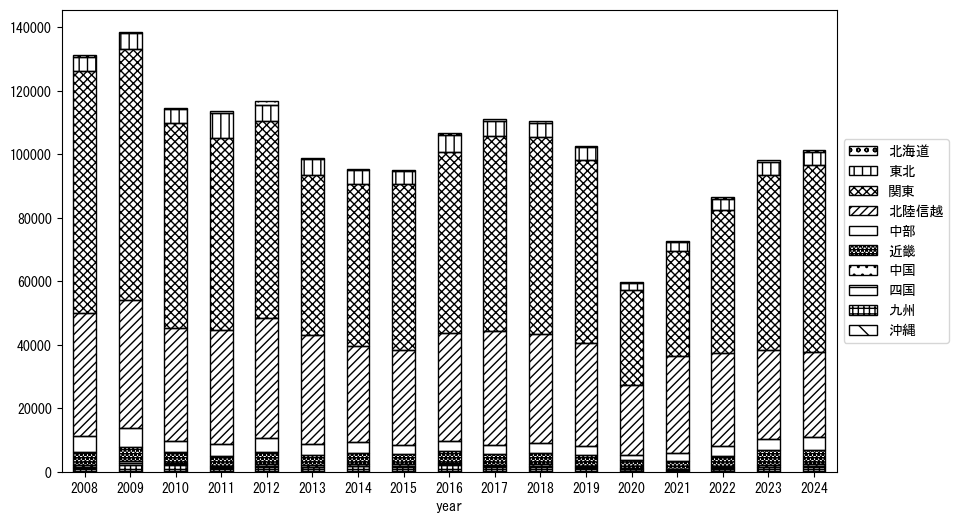
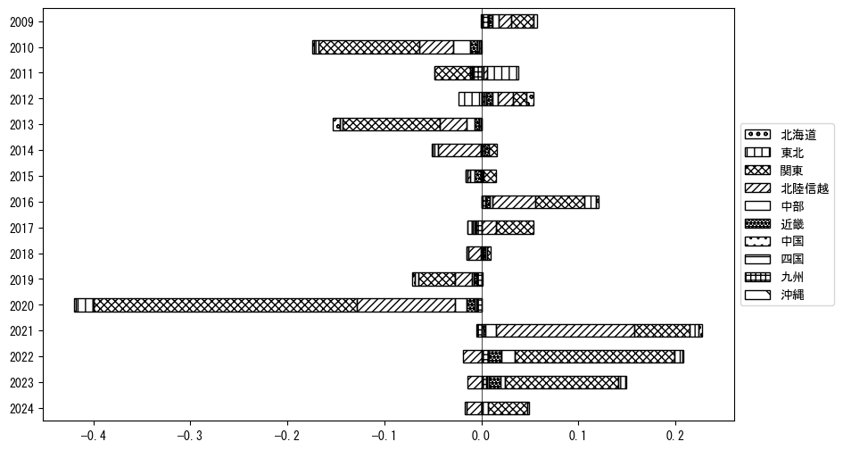

`<!DOCTYPE html>`{=html}
<html lang="ja">
<head>
    <meta charset="UTF-8">
    <meta name="description" content="">
    <link rel="stylesheet" href="../css/style.css">
    <title>宿泊者数の重心 | 新潟県</title>
</head>    
<body>
<body>
<nav id ="global_navi">
    <ul>
        <li>[トップ](../index.html)</li>
        <li>[使い方](../how_to_use.html)</li>
        <li>[データについて](../on_data.html)</li>
        <li>[算出方法について](../method.html)</li>
        <li>[発展的な使い方](../developer.html)</li>
        <li>[サイトポリシー](../policy.html)</li>
    </ul>
</nav>
<ol class="breadcrumb">
    <li>[トップ](../index.html)</li>
    <li>新潟県</li>
</ol>
<h1 id="h1_0">新潟県</h1>

<ul>
  <li> **[１．延べ宿泊者（総数、月次）の推移](#h1_1)** 
    <ul>
      <li> [時系列グラフ](#h2_1) </li>
      <li> [基本統計量](#h2_2) </li>
    </ul>
  </li>  
</ul>

<ul>
  <li> **[２．宿泊者数の重心（年平均の推移）](#h1_2)** 
  <ul>
  <li> [重心の前年平均からの移動距離と方位、および緯度・経度](#h2_4) </li>
  <li> [運輸局別延べ宿泊者数](#h2_5) 
  <ul>
  <li> [時系列（年平均）](#h3_1) </li>
  <li> [寄与度（前年からの変化率に対する）](#h3_2) </li>
  </ul>
  </li>
  </ul>
  </li>
</ul>

<ul>
  <li> **[３．宿泊者数の重心（月別）](#h1_3)** 
  <ul>
  <li> [全期間（2008年1月～2024年12月）の平均と月別平均の比較](#h2_6) </li>
  <li> [運輸局別延べ宿泊者数](#h2_7) 
  <ul>
  <li> [月別平均（2008年1月～2024年12月）](#h3_3) </li>
  <li> [寄与度（全期間の平均から月別平均への変化率に対する）](#h3_4) </li>
  </ul>
  </li>
  </ul>
  </li>
</ul>

<ul>
<li> **[４．データのダウンロード](#h1_4)** </li>
</ul>

<h1 id="h1_1">１．延べ宿泊者（総数）の推移</h1>
<h2 id="h2_1">時系列グラフ</h2>

<figcaption>図１：新潟県内の従業員数100人以上の宿泊施設での延べ宿泊者数（国外、居住地不詳を含む総数）。</figcaption>

<h2 id="h2_2">基本統計量</h2>
|  | 平均 | 標準偏差 | 最小値 | 最大値 |
|:----:|:----:|:----:|:----:|:----:|
| 2008年 | 144,999 | 46,676 | 96,563 (4月) | 254,812 (8月) |
| 2009年 | 143,744 | 41,904 | 93,245 (4月) | 243,201 (8月) |
| 2010年 | 126,031 | 38,864 | 85,120 (4月) | 185,050 (2月) |
| 2011年 | 122,299 | 47,715 | 65,868 (4月) | 237,417 (8月) |
| 2012年 | 131,716 | 34,859 | 97,533 (4月) | 226,841 (8月) |
| 2013年 | 101,994 | 19,845 | 84,743 (5月) | 138,533 (8月) |
| 2014年 | 98,652 | 22,834 | 73,121 (9月) | 137,157 (8月) |
| 2015年 | 100,777 | 24,564 | 61,219 (4月) | 135,161 (8月) |
| 2016年 | 113,262 | 23,527 | 84,375 (6月) | 154,565 (8月) |
| 2017年 | 123,734 | 41,013 | 79,028 (6月) | 228,316 (8月) |
| 2018年 | 135,137 | 44,831 | 77,960 (6月) | 216,863 (8月) |
| 2019年 | 128,562 | 50,570 | 80,666 (6月) | 226,064 (1月) |
| 2020年 | 72,503 | 59,414 | 11,829 (5月) | 215,492 (1月) |
| 2021年 | 78,331 | 28,309 | 43,507 (6月) | 120,841 (12月) |
| 2022年 | 97,288 | 24,524 | 66,351 (4月) | 143,142 (8月) |
| 2023年 | 120,540 | 40,711 | 70,037 (4月) | 184,888 (8月) |
| 2024年 | 132,659 | 44,040 | 75,126 (6月) | 199,994 (1月) |
: 表１：従業員数100人以上の宿泊施設での延べ宿泊者の総数（国外、および居住地不詳を含む）に関する基本統計量。単位は人泊。平均は１か月あたりの平均値を表す。図１に対応。

<h1 id="h1_2">２．宿泊者数の重心（年平均の推移）</h1>

<iframe src="../html/annual/新潟県.html" width="1200" height="600"></iframe>
<figcaption>図２：新潟県内の従業員数100人以上の宿泊施設での延べ宿泊者数（国外、居住地不詳を除く）の重心（年平均の推移）。</figcaption>

[全画面表示](../html/annual/新潟県.html)

<h2 id="h2_4">重心の前年平均からの移動距離と方位、および緯度・経度</h2>
|  | 方位 | 距離 | 緯度 | 経度 |
|:----:|:----:|:----:|:----:|:----:|
| 2008年 | --- | --- | 36.4088 | 139.1060 |
| 2009年 | 西南西 | 8.9km | 36.3680 | 139.0210 |
| 2010年 | 北北東 | 9.8km | 36.4503 | 139.0608 |
| 2011年 | 北北東 | 15.7km | 36.5694 | 139.1554 |
| 2012年 | 西南西 | 8.6km | 36.5272 | 139.0743 |
| 2013年 | 北西 | 2.9km | 36.5448 | 139.0501 |
| 2014年 | 南南西 | 10.4km | 36.4533 | 139.0227 |
| 2015年 | 東 | 4.6km | 36.4533 | 139.0737 |
| 2016年 | 北西 | 3.6km | 36.4791 | 139.0488 |
| 2017年 | 東北東 | 4.5km | 36.4903 | 139.0975 |
| 2018年 | 南南西 | 2.3km | 36.4719 | 139.0852 |
| 2019年 | 東北東 | 2.4km | 36.4787 | 139.1110 |
| 2020年 | 北北西 | 23.9km | 36.6821 | 139.0237 |
| 2021年 | 東南東 | 4.8km | 36.6631 | 139.0723 |
| 2022年 | 南 | 20.5km | 36.4807 | 139.0371 |
| 2023年 | 南南西 | 13.7km | 36.3614 | 138.9956 |
| 2024年 | 南 | 7.2km | 36.2971 | 139.0011 |
: 表２：重心の前年平均からの移動距離と方位、および緯度・経度。図２に対応。

<h2 id="h2_5">運輸局別延べ宿泊者数</h2>
<h3 id="h3_1">時系列（年平均）</h3>

<figcaption>図３：新潟県内の従業員数100人以上の宿泊施設での１か月あたり平均延べ宿泊者数（国外、居住地不詳を除く）の運輸局別内訳。</figcaption>

<h3 id="h3_2">寄与度（前年からの変化率に対する）</h3>

<figcaption>図４：新潟県内の従業員数100人以上の宿泊施設での運輸局別延べ宿泊者数（国外、居住地不詳を除く）から求めた寄与度。</figcaption>

<h1 id="h1_3">３．宿泊者数の重心（月別）</h3>

<iframe src="../html/monthly/新潟県.html" width="1200" height="600"></iframe>
<figcaption>図５：新潟県内の従業員数100人以上の宿泊施設での延べ宿泊者数（国外、居住地不詳を除く）の重心（月別）。観測期間は2008年1月から2024年12月まで。</figcaption>

[全画面表示](../html/monthly/新潟県.html)

<h2 id="h2_6">全期間（2008年1月～2024年12月）の平均と月別平均の比較</h2>
|  | 方位 | 距離 | 緯度 | 経度 |
|:----:|:----:|:----:|:----:|:----:|
| 全期間 | --- | --- | 36.4811 | 139.0610 |
| 1月 | 南南西 | 35.8km | 36.1783 | 138.9243 |
| 2月 | 南南東 | 29.0km | 36.2285 | 139.1442 |
| 3月 | 東南東 | 16.2km | 36.4178 | 139.2238 |
| 4月 | 北北西 | 8.8km | 36.5553 | 139.0267 |
| 5月 | 北北西 | 9.6km | 36.5601 | 139.0163 |
| 6月 | 北北西 | 25.5km | 36.7035 | 138.9903 |
| 7月 | 東北東 | 6.1km | 36.4946 | 139.1271 |
| 8月 | 南東 | 21.5km | 36.3371 | 139.2213 |
| 9月 | 北西 | 9.1km | 36.5382 | 138.9882 |
| 10月 | 西 | 15.9km | 36.4809 | 138.8837 |
| 11月 | 北北西 | 18.1km | 36.6378 | 139.0029 |
| 12月 | 北北東 | 20.9km | 36.6416 | 139.1827 |
: 表３：全期間の平均から月別平均までの移動距離と方位、および緯度・経度。図５に対応。

<h2 id="h2_7">運輸局別延べ宿泊者数</h2>
<h3 id="h3_3">月別平均（2008年1月～2024年12月）</h3>

<figcaption>図６：新潟県内の従業員数100人以上の宿泊施設での延べ宿泊者数（国外、居住地不詳を除く）の運輸局別内訳（月別）。</figcaption>

<h3 id="h3_4">寄与度（全期間の平均から月別平均への変化率に対する）</h3>

<figcaption>図７：新潟県内の従業員数100人以上の宿泊施設での運輸局別延べ宿泊者数（国外、居住地不詳を除く）から求めた寄与度（月別）。</figcaption>

</body>

<h1 id="h1_4">４．データのダウンロード</h1>
 <ul>
  <li> <a href="../csv/data_by_pref/延べ宿泊者数および重心（新潟県）.csv" download>延べ宿泊者数および重心の緯度経度</a> </li>
  <li> <a href="../csv/bar_chart/運輸局別_年平均（新潟県）.csv" download>運輸局別延べ宿泊者数（年平均）</a></li>
  <li> <a href="../csv/bar_chart_month/運輸局別_月別（新潟県）.csv" download>運輸局別延べ宿泊者数（月別）</a></li>
  <li> <a href="../csv/contrib/前年からの変化率に対する寄与度（新潟県）.csv" download>前年からの変化率に対する寄与度</a></li>
  <li> <a href="../csv/contrib_month/月別平均への変化率に対する寄与度（新潟県）.csv" download>月別平均への変化率に対する寄与度</a></li>
</ul>

出典：観光庁「宿泊旅行統計調査」に収録された「施設所在地、居住地別延べ宿泊者数（従業員数100人以上の施設）」

国土地理院「白地図（[地理院タイル](https://maps.gsi.go.jp/development/ichiran.html)）」（図２と図５）

