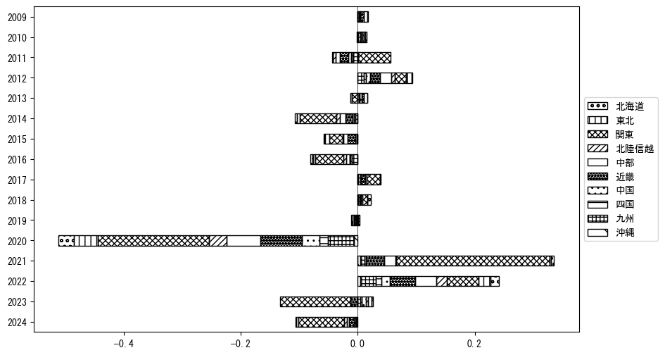

`<!DOCTYPE html>`{=html}
<html lang="ja">
<head>
    <meta charset="UTF-8">
    <meta name="description" content="">
    <link rel="stylesheet" href="../css/style.css">
    <title>宿泊者数の重心 | 東京都</title>
</head>    
<body>
<body>
<nav id ="global_navi">
    <ul>
        <li>[トップ](../index.html)</li>
        <li>[使い方](../how_to_use.html)</li>
        <li>[データについて](../on_data.html)</li>
        <li>[算出方法について](../method.html)</li>
        <li>[発展的な使い方](../developer.html)</li>
        <li>[サイトポリシー](../policy.html)</li>
    </ul>
</nav>
<ol class="breadcrumb">
    <li>[トップ](../index.html)</li>
    <li>東京都</li>
</ol>
<h1 id="h1_0">東京都</h1>

<ul>
  <li> **[１．延べ宿泊者（総数、月次）の推移](#h1_1)** 
    <ul>
      <li> [時系列グラフ](#h2_1) </li>
      <li> [基本統計量](#h2_2) </li>
    </ul>
  </li>  
</ul>

<ul>
  <li> **[２．宿泊者数の重心（年平均の推移）](#h1_2)** 
  <ul>
  <li> [重心の前年平均からの移動距離と方位、および緯度・経度](#h2_4) </li>
  <li> [運輸局別延べ宿泊者数](#h2_5) 
  <ul>
  <li> [時系列（年平均）](#h3_1) </li>
  <li> [寄与度（前年からの変化率に対する）](#h3_2) </li>
  </ul>
  </li>
  </ul>
  </li>
</ul>

<ul>
  <li> **[３．宿泊者数の重心（月別）](#h1_3)** 
  <ul>
  <li> [全期間（2008年1月～2023年12月）の平均と月別平均の比較](#h2_6) </li>
  <li> [運輸局別延べ宿泊者数](#h2_7) 
  <ul>
  <li> [月別平均（2008年1月～2023年12月）](#h3_3) </li>
  <li> [寄与度（全期間の平均から月別平均への変化率に対する）](#h3_4) </li>
  </ul>
  </li>
  </ul>
  </li>
</ul>

<ul>
<li> **[４．データのダウンロード](#h1_4)** </li>
</ul>

<h1 id="h1_1">１．延べ宿泊者（総数）の推移</h1>
<h2 id="h2_1">時系列グラフ</h2>

<figcaption>図１：東京都内の従業員数100人以上の宿泊施設での延べ宿泊者数（国外、居住地不詳を含む総数）。</figcaption>

<h2 id="h2_2">基本統計量</h2>
|  | 平均 | 標準偏差 | 最小値 | 最大値 |
|:----:|:----:|:----:|:----:|:----:|
| 2008年 | 1,104,259 | 105,315 | 891,975 (1月) | 1,284,966 (8月) |
| 2009年 | 1,101,058 | 105,063 | 933,895 (2月) | 1,308,190 (8月) |
| 2010年 | 1,142,668 | 78,247 | 1,014,747 (9月) | 1,294,517 (3月) |
| 2011年 | 997,131 | 191,110 | 614,573 (4月) | 1,239,499 (12月) |
| 2012年 | 1,167,334 | 75,032 | 1,045,454 (2月) | 1,307,857 (8月) |
| 2013年 | 1,251,400 | 125,575 | 1,021,483 (1月) | 1,489,654 (8月) |
| 2014年 | 1,239,034 | 120,886 | 1,019,930 (1月) | 1,418,130 (8月) |
| 2015年 | 1,283,541 | 79,778 | 1,159,636 (1月) | 1,408,475 (8月) |
| 2016年 | 1,251,156 | 90,635 | 1,131,519 (11月) | 1,393,870 (4月) |
| 2017年 | 1,334,796 | 148,581 | 1,076,108 (2月) | 1,542,464 (4月) |
| 2018年 | 1,384,369 | 128,961 | 1,151,868 (2月) | 1,549,889 (8月) |
| 2019年 | 1,430,846 | 134,826 | 1,240,310 (1月) | 1,642,131 (4月) |
| 2020年 | 444,614 | 366,519 | 77,555 (5月) | 1,390,801 (1月) |
| 2021年 | 498,513 | 170,737 | 284,605 (1月) | 840,300 (12月) |
| 2022年 | 723,673 | 228,848 | 468,429 (2月) | 1,286,530 (12月) |
| 2023年 | 1,186,212 | 173,748 | 913,316 (2月) | 1,439,243 (12月) |
: 表１：従業員数100人以上の宿泊施設での延べ宿泊者の総数（国外、および居住地不詳を含む）に関する基本統計量。単位は人泊。平均は１か月あたりの平均値を表す。図１に対応。

<h1 id="h1_2">２．宿泊者数の重心（年平均の推移）</h1>

<iframe src="../html/annual/東京都.html" width="1200" height="600"></iframe>
<figcaption>図２：東京都内の従業員数100人以上の宿泊施設での延べ宿泊者数（国外、居住地不詳を除く）の重心（年平均の推移）。</figcaption>

[全画面表示](../html/annual/東京都.html)

<h2 id="h2_4">重心の前年平均からの移動距離と方位、および緯度・経度</h2>
|  | 方位 | 距離 | 緯度 | 経度 |
|:----:|:----:|:----:|:----:|:----:|
| 2008年 | --- | --- | 35.7516 | 137.9133 |
| 2009年 | 西南西 | 3.7km | 35.7389 | 137.8752 |
| 2010年 | 西 | 4.3km | 35.7449 | 137.8285 |
| 2011年 | 東 | 21.9km | 35.7663 | 138.0688 |
| 2012年 | 西 | 11.0km | 35.7632 | 137.9469 |
| 2013年 | 西南西 | 8.4km | 35.7279 | 137.8644 |
| 2014年 | 西北西 | 4.0km | 35.7350 | 137.8213 |
| 2015年 | 南南西 | 2.0km | 35.7191 | 137.8102 |
| 2016年 | 南西 | 3.3km | 35.7028 | 137.7802 |
| 2017年 | 南南西 | 2.0km | 35.6851 | 137.7737 |
| 2018年 | 北北東 | 3.6km | 35.7167 | 137.7815 |
| 2019年 | 南東 | 2.1km | 35.7022 | 137.7959 |
| 2020年 | 東 | 64.0km | 35.6390 | 138.4981 |
| 2021年 | 南南西 | 3.2km | 35.6130 | 138.4819 |
| 2022年 | 西 | 34.1km | 35.6254 | 138.1056 |
| 2023年 | 西 | 22.7km | 35.6613 | 137.8589 |
: 表２：重心の前年平均からの移動距離と方位、および緯度・経度。図２に対応。

<h2 id="h2_5">運輸局別延べ宿泊者数</h2>
<h3 id="h3_1">時系列（年平均）</h3>

<figcaption>図３：東京都内の従業員数100人以上の宿泊施設での１か月あたり平均延べ宿泊者数（国外、居住地不詳を除く）の運輸局別内訳。</figcaption>

<h3 id="h3_2">寄与度（前年からの変化率に対する）</h3>

<figcaption>図４：東京都内の従業員数100人以上の宿泊施設での運輸局別延べ宿泊者数（国外、居住地不詳を除く）から求めた寄与度。</figcaption>

<h1 id="h1_3">３．宿泊者数の重心（月別）</h3>

<iframe src="../html/monthly/東京都.html" width="1200" height="600"></iframe>
<figcaption>図５：東京都内の従業員数100人以上の宿泊施設での延べ宿泊者数（国外、居住地不詳を除く）の重心（月別）。観測期間は2008年1月から2023年12月まで。</figcaption>

[全画面表示](../html/monthly/東京都.html)

<h2 id="h2_6">全期間（2008年1月～2023年12月）の平均と月別平均の比較</h2>
|  | 方位 | 距離 | 緯度 | 経度 |
|:----:|:----:|:----:|:----:|:----:|
| 全期間 | --- | --- | 35.7058 | 137.9503 |
| 1月 | 東北東 | 5.3km | 35.7315 | 137.9998 |
| 2月 | 西南西 | 10.7km | 35.6791 | 137.8363 |
| 3月 | 西 | 10.3km | 35.7064 | 137.8363 |
| 4月 | 東北東 | 19.2km | 35.7801 | 138.1416 |
| 5月 | 北東 | 10.1km | 35.7684 | 138.0306 |
| 6月 | 南南西 | 3.1km | 35.6801 | 137.9360 |
| 7月 | 南 | 4.3km | 35.6671 | 137.9544 |
| 8月 | 南南東 | 8.8km | 35.6369 | 137.9981 |
| 9月 | 北西 | 2.4km | 35.7236 | 137.9354 |
| 10月 | 西 | 7.2km | 35.7148 | 137.8716 |
| 11月 | 西北西 | 8.9km | 35.7346 | 137.8581 |
| 12月 | 南東 | 8.2km | 35.6468 | 138.0053 |
: 表３：全期間の平均から月別平均までの移動距離と方位、および緯度・経度。図５に対応。

<h2 id="h2_7">運輸局別延べ宿泊者数</h2>
<h3 id="h3_3">月別平均（2008年1月～2023年12月）</h3>

<figcaption>図６：東京都内の従業員数100人以上の宿泊施設での延べ宿泊者数（国外、居住地不詳を除く）の運輸局別内訳（月別）。</figcaption>

<h3 id="h3_4">寄与度（全期間の平均から月別平均への変化率に対する）</h3>

<figcaption>図７：東京都内の従業員数100人以上の宿泊施設での運輸局別延べ宿泊者数（国外、居住地不詳を除く）から求めた寄与度（月別）。</figcaption>

</body>

<h1 id="h1_4">４．データのダウンロード</h1>
 <ul>
  <li> <a href="../csv/data_by_pref/延べ宿泊者数および重心（東京都）.csv" download>延べ宿泊者数および重心の緯度経度</a> </li>
  <li> <a href="../csv/bar_chart/運輸局別_年平均（東京都）.csv" download>運輸局別延べ宿泊者数（年平均）</a></li>
  <li> <a href="../csv/bar_chart_month/運輸局別_月別（東京都）.csv" download>運輸局別延べ宿泊者数（月別）</a></li>
  <li> <a href="../csv/contrib/前年からの変化率に対する寄与度（東京都）.csv" download>前年からの変化率に対する寄与度</a></li>
  <li> <a href="../csv/contrib_month/月別平均への変化率に対する寄与度（東京都）.csv" download>月別平均への変化率に対する寄与度</a></li>
</ul>

出典：観光庁「宿泊旅行統計調査」に収録された「施設所在地、居住地別延べ宿泊者数（従業員数100人以上の施設）」

国土地理院「白地図（[地理院タイル](https://maps.gsi.go.jp/development/ichiran.html)）」（図２と図５）

