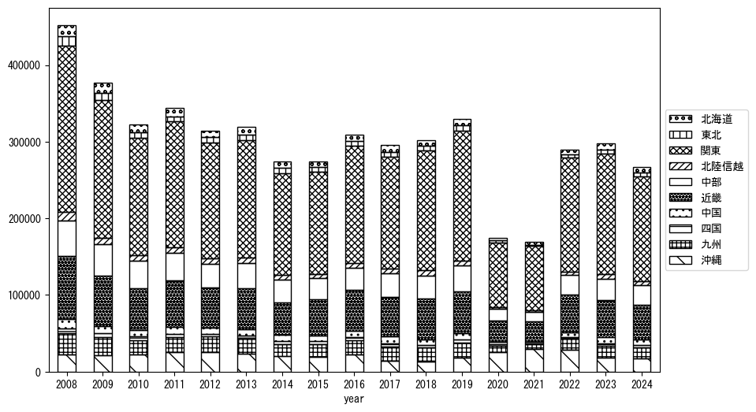
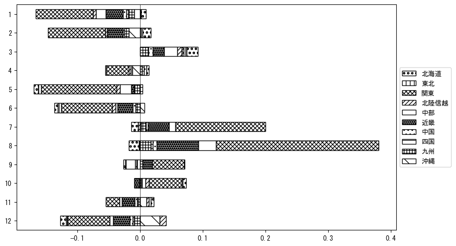

`<!DOCTYPE html>`{=html}
<html lang="ja">
<head>
    <meta charset="UTF-8">
    <meta name="description" content="">
    <link rel="stylesheet" href="../css/style.css">
    <title>宿泊者数の重心 | 沖縄県</title>
</head>    
<body>
<body>
<nav id ="global_navi">
    <ul>
        <li>[トップ](../index.html)</li>
        <li>[使い方](../how_to_use.html)</li>
        <li>[データについて](../on_data.html)</li>
        <li>[算出方法について](../method.html)</li>
        <li>[発展的な使い方](../developer.html)</li>
        <li>[サイトポリシー](../policy.html)</li>
    </ul>
</nav>
<ol class="breadcrumb">
    <li>[トップ](../index.html)</li>
    <li>沖縄県</li>
</ol>
<h1 id="h1_0">沖縄県</h1>

<ul>
  <li> **[１．延べ宿泊者（総数、月次）の推移](#h1_1)** 
    <ul>
      <li> [時系列グラフ](#h2_1) </li>
      <li> [基本統計量](#h2_2) </li>
    </ul>
  </li>  
</ul>

<ul>
  <li> **[２．宿泊者数の重心（年平均の推移）](#h1_2)** 
  <ul>
  <li> [重心の前年平均からの移動距離と方位、および緯度・経度](#h2_4) </li>
  <li> [運輸局別延べ宿泊者数](#h2_5) 
  <ul>
  <li> [時系列（年平均）](#h3_1) </li>
  <li> [寄与度（前年からの変化率に対する）](#h3_2) </li>
  </ul>
  </li>
  </ul>
  </li>
</ul>

<ul>
  <li> **[３．宿泊者数の重心（月別）](#h1_3)** 
  <ul>
  <li> [全期間（2008年1月～2023年12月）の平均と月別平均の比較](#h2_6) </li>
  <li> [運輸局別延べ宿泊者数](#h2_7) 
  <ul>
  <li> [月別平均（2008年1月～2023年12月）](#h3_3) </li>
  <li> [寄与度（全期間の平均から月別平均への変化率に対する）](#h3_4) </li>
  </ul>
  </li>
  </ul>
  </li>
</ul>

<ul>
<li> **[４．データのダウンロード](#h1_4)** </li>
</ul>

<h1 id="h1_1">１．延べ宿泊者（総数）の推移</h1>
<h2 id="h2_1">時系列グラフ</h2>

<figcaption>図１：沖縄県内の従業員数100人以上の宿泊施設での延べ宿泊者数（国外、居住地不詳を含む総数）。</figcaption>

<h2 id="h2_2">基本統計量</h2>
|  | 平均 | 標準偏差 | 最小値 | 最大値 |
|:----:|:----:|:----:|:----:|:----:|
| 2008年 | 492,190 | 102,878 | 377,246 (12月) | 710,284 (8月) |
| 2009年 | 391,880 | 66,887 | 310,950 (12月) | 535,267 (8月) |
| 2010年 | 362,545 | 75,124 | 281,734 (12月) | 534,240 (8月) |
| 2011年 | 366,957 | 64,702 | 267,627 (4月) | 500,640 (8月) |
| 2012年 | 361,743 | 63,662 | 280,679 (1月) | 509,872 (8月) |
| 2013年 | 392,571 | 99,304 | 262,080 (11月) | 589,598 (8月) |
| 2014年 | 326,027 | 97,068 | 221,716 (5月) | 524,517 (8月) |
| 2015年 | 366,611 | 55,864 | 289,411 (1月) | 472,869 (8月) |
| 2016年 | 422,753 | 58,353 | 338,636 (12月) | 526,335 (7月) |
| 2017年 | 396,129 | 56,676 | 308,231 (12月) | 486,806 (7月) |
| 2018年 | 396,560 | 61,096 | 280,864 (1月) | 483,642 (8月) |
| 2019年 | 419,483 | 76,657 | 327,445 (9月) | 529,571 (8月) |
| 2020年 | 194,990 | 116,873 | 7,774 (5月) | 346,431 (1月) |
| 2021年 | 183,076 | 65,253 | 96,662 (1月) | 304,032 (12月) |
| 2022年 | 324,941 | 115,200 | 120,886 (2月) | 461,477 (8月) |
| 2023年 | 388,876 | 58,681 | 306,454 (1月) | 514,647 (7月) |
: 表１：従業員数100人以上の宿泊施設での延べ宿泊者の総数（国外、および居住地不詳を含む）に関する基本統計量。単位は人泊。平均は１か月あたりの平均値を表す。図１に対応。

<h1 id="h1_2">２．宿泊者数の重心（年平均の推移）</h1>

<iframe src="../html/annual/沖縄県.html" width="1200" height="600"></iframe>
<figcaption>図２：沖縄県内の従業員数100人以上の宿泊施設での宿泊者数（国外、居住地不詳を除く）の重心（年平均の推移）。</figcaption>

[全画面表示](../html/annual/沖縄県.html)

<h2 id="h2_4">重心の前年平均からの移動距離と方位、および緯度・経度</h2>
|  | 方位 | 距離 | 緯度 | 経度 |
|:----:|:----:|:----:|:----:|:----:|
| 2008年 | --- | --- | 35.1498 | 137.1832 |
| 2009年 | 南西 | 8.4km | 35.0965 | 137.1173 |
| 2010年 | 南西 | 19.0km | 34.9631 | 136.9870 |
| 2011年 | 南南西 | 10.3km | 34.8860 | 136.9246 |
| 2012年 | 南西 | 12.8km | 34.8018 | 136.8292 |
| 2013年 | 北東 | 16.7km | 34.9127 | 136.9531 |
| 2014年 | 南 | 2.5km | 34.8902 | 136.9530 |
| 2015年 | 北 | 1.8km | 34.9063 | 136.9553 |
| 2016年 | 南南西 | 4.5km | 34.8664 | 136.9444 |
| 2017年 | 北東 | 36.3km | 35.1232 | 137.1899 |
| 2018年 | 東北東 | 12.9km | 35.1539 | 137.3266 |
| 2019年 | 南西 | 14.3km | 35.0574 | 137.2219 |
| 2020年 | 南西 | 158.4km | 33.9774 | 136.0931 |
| 2021年 | 東南東 | 5.5km | 33.9527 | 136.1441 |
| 2022年 | 北東 | 85.1km | 34.5319 | 136.7491 |
| 2023年 | 北東 | 65.4km | 34.9763 | 137.2190 |
: 表２：重心の前年平均からの移動距離と方位、および緯度・経度。図２に対応。

<h2 id="h2_5">運輸局別延べ宿泊者数</h2>
<h3 id="h3_1">時系列（年平均）</h3>

<figcaption>図３：沖縄県内の従業員数100人以上の宿泊施設での１か月あたり平均宿泊者数（国外、居住地不詳を除く）の運輸局別内訳。</figcaption>

<h3 id="h3_2">寄与度（前年からの変化率に対する）</h3>

<figcaption>図４：沖縄県内の従業員数100人以上の宿泊施設での運輸局別宿泊者数（国外、居住地不詳を除く）から求めた寄与度。</figcaption>

<h1 id="h1_3">３．宿泊者数の重心（月別）</h3>

<iframe src="../html/monthly/沖縄県.html" width="1200" height="600"></iframe>
<figcaption>図５：沖縄県内の従業員数100人以上の宿泊施設での宿泊者数（国外、居住地不詳を除く）の重心（月別）。観測期間は2008年1月から2023年12月まで。</figcaption>

[全画面表示](../html/monthly/沖縄県.html)

<h2 id="h2_6">全期間（2008年1月～2023年12月）の平均と月別平均の比較</h2>
|  | 方位 | 距離 | 緯度 | 経度 |
|:----:|:----:|:----:|:----:|:----:|
| 全期間 | --- | --- | 34.8279 | 136.9244 |
| 1月 | 北北東 | 14.1km | 34.9478 | 136.9761 |
| 2月 | 北北東 | 24.8km | 35.0459 | 136.9830 |
| 3月 | 北 | 18.1km | 34.9907 | 136.9332 |
| 4月 | 北 | 10.2km | 34.9200 | 136.9244 |
| 5月 | 南西 | 40.9km | 34.6006 | 136.5725 |
| 6月 | 南西 | 52.3km | 34.4849 | 136.5324 |
| 7月 | 東 | 17.6km | 34.8161 | 137.1168 |
| 8月 | 東 | 31.9km | 34.8765 | 137.2687 |
| 9月 | 東北東 | 15.2km | 34.8630 | 137.0852 |
| 10月 | 北東 | 26.6km | 34.9755 | 137.1538 |
| 11月 | 北北東 | 6.6km | 34.8789 | 136.9607 |
| 12月 | 南西 | 45.0km | 34.5342 | 136.5862 |
: 表３：全期間の平均から月別平均までの移動距離と方位、および緯度・経度。図５に対応。

<h2 id="h2_7">運輸局別延べ宿泊者数</h2>
<h3 id="h3_3">月別平均（2008年1月～2023年12月）</h3>

<figcaption>図６：沖縄県内の従業員数100人以上の宿泊施設での宿泊者数（国外、居住地不詳を除く）の運輸局別内訳（月別）。</figcaption>

<h3 id="h3_4">寄与度（全期間の平均から月別平均への変化率に対する）</h3>

<figcaption>図７：沖縄県内の従業員数100人以上の宿泊施設での運輸局別宿泊者数（国外、居住地不詳を除く）から求めた寄与度（月別）。</figcaption>

</body>

<h1 id="h1_4">４．データのダウンロード</h1>
 <ul>
  <li> <a href="../csv/data_by_pref/延べ宿泊者数および重心（沖縄県）.csv" download>延べ宿泊者数および重心の緯度経度</a> </li>
  <li> <a href="../csv/bar_chart/運輸局別_年平均（沖縄県）.csv" download>運輸局別延べ宿泊者数（年平均）</a></li>
  <li> <a href="../csv/bar_chart_month/運輸局別_月別（沖縄県）.csv" download>運輸局別延べ宿泊者数（月別）</a></li>
  <li> <a href="../csv/contrib/前年からの変化率に対する寄与度（沖縄県）.csv" download>前年からの変化率に対する寄与度</a></li>
  <li> <a href="../csv/contrib_month/月別平均への変化率に対する寄与度（沖縄県）.csv" download>月別平均への変化率に対する寄与度</a></li>
</ul>

出典：観光庁「宿泊旅行統計調査」に収録された「施設所在地、居住地別延べ宿泊者数（従業員数100人以上の施設）」

国土地理院「白地図（[地理院タイル](https://maps.gsi.go.jp/development/ichiran.html)）」（図２と図５）

