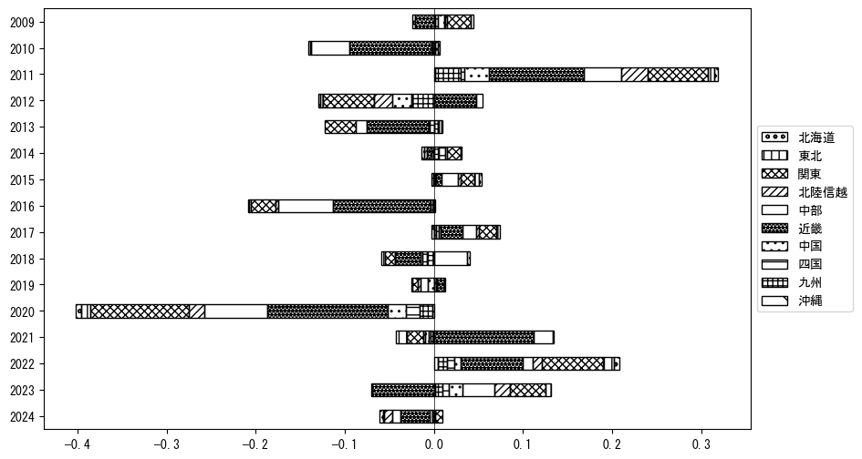
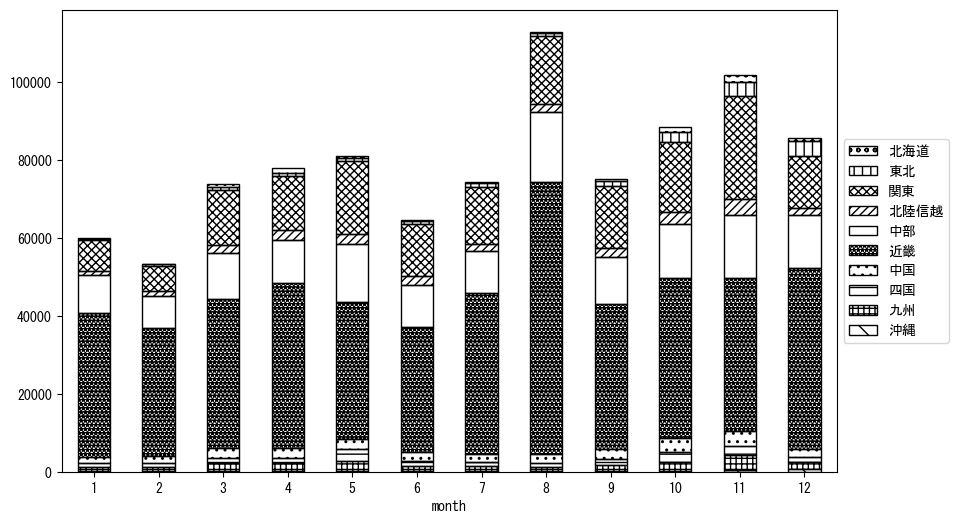

`<!DOCTYPE html>`{=html}
<html lang="ja">
<head>
    <meta charset="UTF-8">
    <meta name="description" content="">
    <link rel="stylesheet" href="../css/style.css">
    <title>宿泊者数の重心 | 滋賀県</title>
</head>    
<body>
<body>
<nav id ="global_navi">
    <ul>
        <li>[トップ](../index.html)</li>
        <li>[使い方](../how_to_use.html)</li>
        <li>[データについて](../on_data.html)</li>
        <li>[算出方法について](../method.html)</li>
        <li>[発展的な使い方](../developer.html)</li>
        <li>[サイトポリシー](../policy.html)</li>
    </ul>
</nav>
<ol class="breadcrumb">
    <li>[トップ](../index.html)</li>
    <li>滋賀県</li>
</ol>
<h1 id="h1_0">滋賀県</h1>

<ul>
  <li> **[１．延べ宿泊者（総数、月次）の推移](#h1_1)** 
    <ul>
      <li> [時系列グラフ](#h2_1) </li>
      <li> [基本統計量](#h2_2) </li>
    </ul>
  </li>  
</ul>

<ul>
  <li> **[２．宿泊者数の重心（年平均の推移）](#h1_2)** 
  <ul>
  <li> [重心の前年平均からの移動距離と方位、および緯度・経度](#h2_4) </li>
  <li> [運輸局別延べ宿泊者数](#h2_5) 
  <ul>
  <li> [時系列（年平均）](#h3_1) </li>
  <li> [寄与度（前年からの変化率に対する）](#h3_2) </li>
  </ul>
  </li>
  </ul>
  </li>
</ul>

<ul>
  <li> **[３．宿泊者数の重心（月別）](#h1_3)** 
  <ul>
  <li> [全期間（2008年1月～2023年12月）の平均と月別平均の比較](#h2_6) </li>
  <li> [運輸局別延べ宿泊者数](#h2_7) 
  <ul>
  <li> [月別平均（2008年1月～2023年12月）](#h3_3) </li>
  <li> [寄与度（全期間の平均から月別平均への変化率に対する）](#h3_4) </li>
  </ul>
  </li>
  </ul>
  </li>
</ul>

<ul>
<li> **[４．データのダウンロード](#h1_4)** </li>
</ul>

<h1 id="h1_1">１．延べ宿泊者（総数）の推移</h1>
<h2 id="h2_1">時系列グラフ</h2>

<figcaption>図１：滋賀県内の従業員数100人以上の宿泊施設での延べ宿泊者数（国外、居住地不詳を含む総数）。</figcaption>

<h2 id="h2_2">基本統計量</h2>
|  | 平均 | 標準偏差 | 最小値 | 最大値 |
|:----:|:----:|:----:|:----:|:----:|
| 2008年 | 115,247 | 25,859 | 79,139 (2月) | 166,274 (8月) |
| 2009年 | 102,089 | 26,935 | 65,151 (2月) | 149,370 (8月) |
| 2010年 | 100,542 | 17,023 | 75,765 (2月) | 123,356 (8月) |
| 2011年 | 112,395 | 25,719 | 76,988 (1月) | 154,599 (11月) |
| 2012年 | 104,866 | 19,135 | 79,553 (2月) | 148,585 (8月) |
| 2013年 | 96,919 | 25,034 | 63,357 (2月) | 147,068 (8月) |
| 2014年 | 100,717 | 19,614 | 73,792 (9月) | 120,961 (4月) |
| 2015年 | 109,870 | 24,378 | 70,426 (1月) | 155,541 (8月) |
| 2016年 | 89,827 | 15,048 | 71,939 (2月) | 125,386 (4月) |
| 2017年 | 97,512 | 19,765 | 62,369 (1月) | 134,611 (8月) |
| 2018年 | 93,342 | 16,127 | 65,063 (2月) | 117,311 (8月) |
| 2019年 | 92,366 | 14,974 | 68,257 (2月) | 124,904 (8月) |
| 2020年 | 48,162 | 24,387 | 8,682 (5月) | 78,200 (11月) |
| 2021年 | 50,664 | 25,325 | 25,147 (1月) | 88,025 (11月) |
| 2022年 | 63,808 | 27,184 | 29,123 (2月) | 107,911 (11月) |
| 2023年 | 77,412 | 20,668 | 51,509 (6月) | 112,074 (8月) |
: 表１：従業員数100人以上の宿泊施設での延べ宿泊者の総数（国外、および居住地不詳を含む）に関する基本統計量。単位は人。平均は１か月あたりの平均値を表す。図１に対応。

<h1 id="h1_2">２．宿泊者数の重心（年平均の推移）</h1>

<iframe src="../html/annual/滋賀県.html" width="1200" height="600"></iframe>
<figcaption>図２：滋賀県内の従業員数100人以上の宿泊施設での宿泊者数（国外、居住地不詳を除く）の重心（年平均の推移）。</figcaption>

[全画面表示](../html/annual/滋賀県.html)

<h2 id="h2_4">重心の前年平均からの移動距離と方位、および緯度・経度</h2>
|  | 方位 | 距離 | 緯度 | 経度 |
|:----:|:----:|:----:|:----:|:----:|
| 2008年 | --- | --- | 35.1146 | 136.4608 |
| 2009年 | 東 | 6.5km | 35.1142 | 136.5324 |
| 2010年 | 東北東 | 11.1km | 35.1594 | 136.6413 |
| 2011年 | 西 | 8.6km | 35.1710 | 136.5484 |
| 2012年 | 南南西 | 4.2km | 35.1384 | 136.5244 |
| 2013年 | 西 | 8.1km | 35.1469 | 136.4360 |
| 2014年 | 南東 | 3.5km | 35.1262 | 136.4657 |
| 2015年 | 北東 | 8.3km | 35.1685 | 136.5410 |
| 2016年 | 北北東 | 2.4km | 35.1877 | 136.5519 |
| 2017年 | 南 | 3.9km | 35.1529 | 136.5468 |
| 2018年 | 北東 | 9.7km | 35.2100 | 136.6274 |
| 2019年 | 西南西 | 3.3km | 35.1946 | 136.5966 |
| 2020年 | 西 | 9.0km | 35.1967 | 136.4975 |
| 2021年 | 南西 | 17.5km | 35.1061 | 136.3403 |
| 2022年 | 東北東 | 5.9km | 35.1229 | 136.4019 |
| 2023年 | 東北東 | 11.5km | 35.1639 | 136.5182 |
: 表２：重心の前年平均からの移動距離と方位、および緯度・経度。図２に対応。

<h2 id="h2_5">運輸局別延べ宿泊者数</h2>
<h3 id="h3_1">時系列（年平均）</h3>

<figcaption>図３：滋賀県内の従業員数100人以上の宿泊施設での１か月あたり平均宿泊者数（国外、居住地不詳を除く）の運輸局別内訳。</figcaption>

<h3 id="h3_2">寄与度（前年からの変化率に対する）</h3>

<figcaption>図４：滋賀県内の従業員数100人以上の宿泊施設での運輸局別宿泊者数（国外、居住地不詳を除く）から求めた寄与度。</figcaption>

<h1 id="h1_3">３．宿泊者数の重心（月別）</h3>

<iframe src="../html/monthly/滋賀県.html" width="1200" height="600"></iframe>
<figcaption>図５：滋賀県内の従業員数100人以上の宿泊施設での宿泊者数（国外、居住地不詳を除く）の重心（月別）。観測期間は2008年1月から2023年12月まで。</figcaption>

[全画面表示](../html/monthly/滋賀県.html)

<h2 id="h2_6">全期間（2008年1月～2023年12月）の平均と月別平均の比較</h2>
|  | 方位 | 距離 | 緯度 | 経度 |
|:----:|:----:|:----:|:----:|:----:|
| 全期間 | --- | --- | 35.1546 | 136.5144 |
| 1月 | 西南西 | 27.9km | 35.0293 | 136.2491 |
| 2月 | 西南西 | 34.6km | 35.0189 | 136.1723 |
| 3月 | 北北西 | 4.1km | 35.1861 | 136.4918 |
| 4月 | 西北西 | 3.7km | 35.1634 | 136.4755 |
| 5月 | 東南東 | 13.6km | 35.1305 | 136.6605 |
| 6月 | 南南東 | 3.5km | 35.1286 | 136.5353 |
| 7月 | 東北東 | 1.5km | 35.1609 | 136.5292 |
| 8月 | 南西 | 16.2km | 35.0513 | 136.3892 |
| 9月 | 東北東 | 10.5km | 35.1892 | 136.6215 |
| 10月 | 北東 | 16.8km | 35.2664 | 136.6387 |
| 11月 | 東北東 | 37.6km | 35.3265 | 136.8706 |
| 12月 | 北北東 | 6.0km | 35.2044 | 136.5392 |
: 表３：全期間の平均から月別平均までの移動距離と方位、および緯度・経度。図５に対応。

<h2 id="h2_7">運輸局別延べ宿泊者数</h2>
<h3 id="h3_3">月別平均（2008年1月～2023年12月）</h3>

<figcaption>図６：滋賀県内の従業員数100人以上の宿泊施設での宿泊者数（国外、居住地不詳を除く）の運輸局別内訳（月別）。</figcaption>

<h3 id="h3_4">寄与度（全期間の平均から月別平均への変化率に対する）</h3>

<figcaption>図７：滋賀県内の従業員数100人以上の宿泊施設での運輸局別宿泊者数（国外、居住地不詳を除く）から求めた寄与度（月別）。</figcaption>

</body>

<h1 id="h1_4">４．データのダウンロード</h1>
 <ul>
  <li> <a href="../csv/data_by_pref/延べ宿泊者数および重心（滋賀県）.csv" download>延べ宿泊者数および重心の緯度経度</a> </li>
  <li> <a href="../csv/bar_chart/運輸局別_年平均（滋賀県）.csv" download>運輸局別延べ宿泊者数（年平均）</a></li>
  <li> <a href="../csv/bar_chart_month/運輸局別_月別（滋賀県）.csv" download>運輸局別延べ宿泊者数（月別）</a></li>
  <li> <a href="../csv/contrib/前年からの変化率に対する寄与度（滋賀県）.csv" download>前年からの変化率に対する寄与度</a></li>
  <li> <a href="../csv/contrib_month/月別平均への変化率に対する寄与度（滋賀県）.csv" download>月別平均への変化率に対する寄与度</a></li>
</ul>

出典：観光庁「宿泊旅行統計調査」に収録された「施設所在地別、居住地別延べ宿泊者数（従業員数100人以上の施設）」

国土地理院「白地図（[地理院タイル](https://maps.gsi.go.jp/development/ichiran.html)）」（図２と図５）

