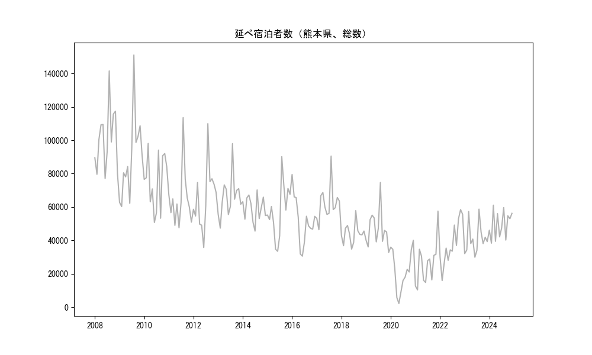
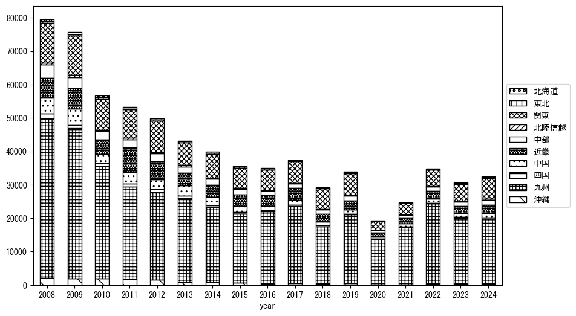
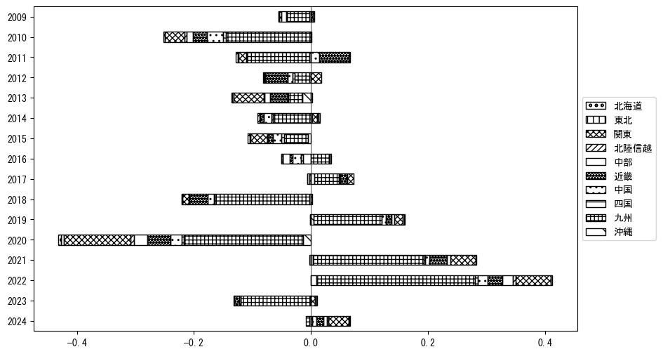

`<!DOCTYPE html>`{=html}
<html lang="ja">
<head>
    <meta charset="UTF-8">
    <meta name="description" content="">
    <link rel="stylesheet" href="../css/style.css">
    <title>宿泊者数の重心 | 熊本県</title>
</head>    
<body>
<body>
<nav id ="global_navi">
    <ul>
        <li>[トップ](../index.html)</li>
        <li>[使い方](../how_to_use.html)</li>
        <li>[データについて](../on_data.html)</li>
        <li>[算出方法について](../method.html)</li>
        <li>[発展的な使い方](../developer.html)</li>
        <li>[サイトポリシー](../policy.html)</li>
    </ul>
</nav>
<ol class="breadcrumb">
    <li>[トップ](../index.html)</li>
    <li>熊本県</li>
</ol>
<h1 id="h1_0">熊本県</h1>

<ul>
  <li> **[１．延べ宿泊者（総数、月次）の推移](#h1_1)** 
    <ul>
      <li> [時系列グラフ](#h2_1) </li>
      <li> [基本統計量](#h2_2) </li>
    </ul>
  </li>  
</ul>

<ul>
  <li> **[２．宿泊者数の重心（年平均の推移）](#h1_2)** 
  <ul>
  <li> [重心の前年平均からの移動距離と方位、および緯度・経度](#h2_4) </li>
  <li> [運輸局別延べ宿泊者数](#h2_5) 
  <ul>
  <li> [時系列（年平均）](#h3_1) </li>
  <li> [寄与度（前年からの変化率に対する）](#h3_2) </li>
  </ul>
  </li>
  </ul>
  </li>
</ul>

<ul>
  <li> **[３．宿泊者数の重心（月別）](#h1_3)** 
  <ul>
  <li> [全期間（2008年1月～2024年12月）の平均と月別平均の比較](#h2_6) </li>
  <li> [運輸局別延べ宿泊者数](#h2_7) 
  <ul>
  <li> [月別平均（2008年1月～2024年12月）](#h3_3) </li>
  <li> [寄与度（全期間の平均から月別平均への変化率に対する）](#h3_4) </li>
  </ul>
  </li>
  </ul>
  </li>
</ul>

<ul>
<li> **[４．データのダウンロード](#h1_4)** </li>
</ul>

<h1 id="h1_1">１．延べ宿泊者（総数）の推移</h1>
<h2 id="h2_1">時系列グラフ</h2>

<figcaption>図１：熊本県内の従業員数100人以上の宿泊施設での延べ宿泊者数（国外、居住地不詳を含む総数）。</figcaption>

<h2 id="h2_2">基本統計量</h2>
|  | 平均 | 標準偏差 | 最小値 | 最大値 |
|:----:|:----:|:----:|:----:|:----:|
| 2008年 | 101,005 | 18,907 | 77,095 (6月) | 141,518 (8月) |
| 2009年 | 89,554 | 25,198 | 60,300 (2月) | 151,041 (8月) |
| 2010年 | 75,643 | 16,744 | 50,775 (6月) | 98,081 (3月) |
| 2011年 | 64,712 | 17,487 | 47,591 (6月) | 113,549 (8月) |
| 2012年 | 65,652 | 18,942 | 35,755 (6月) | 109,923 (8月) |
| 2013年 | 65,910 | 12,666 | 47,383 (2月) | 97,983 (8月) |
| 2014年 | 59,249 | 7,664 | 45,599 (7月) | 70,234 (8月) |
| 2015年 | 57,478 | 16,481 | 33,507 (6月) | 90,180 (8月) |
| 2016年 | 51,522 | 14,293 | 30,621 (6月) | 79,492 (1月) |
| 2017年 | 62,076 | 10,930 | 46,447 (2月) | 90,531 (8月) |
| 2018年 | 44,153 | 6,006 | 34,818 (6月) | 57,851 (8月) |
| 2019年 | 46,804 | 11,264 | 32,785 (12月) | 74,710 (8月) |
| 2020年 | 21,960 | 12,484 | 2,223 (5月) | 40,068 (12月) |
| 2021年 | 26,077 | 13,133 | 10,380 (2月) | 57,577 (12月) |
| 2022年 | 38,044 | 13,215 | 15,990 (2月) | 58,481 (11月) |
| 2023年 | 40,808 | 9,103 | 29,937 (6月) | 58,744 (8月) |
| 2024年 | 49,560 | 8,241 | 38,383 (2月) | 61,124 (3月) |
: 表１：従業員数100人以上の宿泊施設での延べ宿泊者の総数（国外、および居住地不詳を含む）に関する基本統計量。単位は人泊。平均は１か月あたりの平均値を表す。図１に対応。

<h1 id="h1_2">２．宿泊者数の重心（年平均の推移）</h1>

<iframe src="../html/annual/熊本県.html" width="1200" height="600"></iframe>
<figcaption>図２：熊本県内の従業員数100人以上の宿泊施設での延べ宿泊者数（国外、居住地不詳を除く）の重心（年平均の推移）。</figcaption>

[全画面表示](../html/annual/熊本県.html)

<h2 id="h2_4">重心の前年平均からの移動距離と方位、および緯度・経度</h2>
|  | 方位 | 距離 | 緯度 | 経度 |
|:----:|:----:|:----:|:----:|:----:|
| 2008年 | --- | --- | 33.7242 | 132.8740 |
| 2009年 | 東北東 | 8.1km | 33.7520 | 132.9554 |
| 2010年 | 南南東 | 5.2km | 33.7107 | 132.9811 |
| 2011年 | 東北東 | 26.7km | 33.7698 | 133.2601 |
| 2012年 | 東北東 | 14.7km | 33.8135 | 133.4102 |
| 2013年 | 西 | 37.6km | 33.7865 | 133.0051 |
| 2014年 | 東北東 | 25.4km | 33.8578 | 133.2663 |
| 2015年 | 西 | 11.6km | 33.8669 | 133.1411 |
| 2016年 | 北北西 | 9.7km | 33.9494 | 133.1070 |
| 2017年 | 南西 | 13.9km | 33.8470 | 133.0197 |
| 2018年 | 東北東 | 34.7km | 33.9479 | 133.3744 |
| 2019年 | 西南西 | 22.2km | 33.8406 | 133.1712 |
| 2020年 | 西南西 | 63.4km | 33.7162 | 132.5029 |
| 2021年 | 東南東 | 10.0km | 33.6967 | 132.6081 |
| 2022年 | 南南西 | 7.3km | 33.6356 | 132.5790 |
| 2023年 | 東北東 | 38.5km | 33.7655 | 132.9638 |
| 2024年 | 東北東 | 29.7km | 33.8786 | 133.2543 |
: 表２：重心の前年平均からの移動距離と方位、および緯度・経度。図２に対応。

<h2 id="h2_5">運輸局別延べ宿泊者数</h2>
<h3 id="h3_1">時系列（年平均）</h3>

<figcaption>図３：熊本県内の従業員数100人以上の宿泊施設での１か月あたり平均延べ宿泊者数（国外、居住地不詳を除く）の運輸局別内訳。</figcaption>

<h3 id="h3_2">寄与度（前年からの変化率に対する）</h3>

<figcaption>図４：熊本県内の従業員数100人以上の宿泊施設での運輸局別延べ宿泊者数（国外、居住地不詳を除く）から求めた寄与度。</figcaption>

<h1 id="h1_3">３．宿泊者数の重心（月別）</h3>

<iframe src="../html/monthly/熊本県.html" width="1200" height="600"></iframe>
<figcaption>図５：熊本県内の従業員数100人以上の宿泊施設での延べ宿泊者数（国外、居住地不詳を除く）の重心（月別）。観測期間は2008年1月から2024年12月まで。</figcaption>

[全画面表示](../html/monthly/熊本県.html)

<h2 id="h2_6">全期間（2008年1月～2024年12月）の平均と月別平均の比較</h2>
|  | 方位 | 距離 | 緯度 | 経度 |
|:----:|:----:|:----:|:----:|:----:|
| 全期間 | --- | --- | 33.7976 | 133.0279 |
| 1月 | 南西 | 48.0km | 33.5429 | 132.6088 |
| 2月 | 東 | 13.8km | 33.7914 | 133.1768 |
| 3月 | 北東 | 28.3km | 33.9883 | 133.2317 |
| 4月 | 西北西 | 18.3km | 33.8465 | 132.8387 |
| 5月 | 北北東 | 9.2km | 33.8687 | 133.0784 |
| 6月 | 東北東 | 30.0km | 33.9311 | 133.3101 |
| 7月 | 北東 | 12.5km | 33.8849 | 133.1137 |
| 8月 | 西 | 26.5km | 33.7719 | 132.7433 |
| 9月 | 北北東 | 9.3km | 33.8726 | 133.0734 |
| 10月 | 東 | 13.2km | 33.8170 | 133.1687 |
| 11月 | 東 | 23.3km | 33.8052 | 133.2797 |
| 12月 | 南西 | 48.4km | 33.4507 | 132.7112 |
: 表３：全期間の平均から月別平均までの移動距離と方位、および緯度・経度。図５に対応。

<h2 id="h2_7">運輸局別延べ宿泊者数</h2>
<h3 id="h3_3">月別平均（2008年1月～2024年12月）</h3>

<figcaption>図６：熊本県内の従業員数100人以上の宿泊施設での延べ宿泊者数（国外、居住地不詳を除く）の運輸局別内訳（月別）。</figcaption>

<h3 id="h3_4">寄与度（全期間の平均から月別平均への変化率に対する）</h3>

<figcaption>図７：熊本県内の従業員数100人以上の宿泊施設での運輸局別延べ宿泊者数（国外、居住地不詳を除く）から求めた寄与度（月別）。</figcaption>

</body>

<h1 id="h1_4">４．データのダウンロード</h1>
 <ul>
  <li> <a href="../csv/data_by_pref/延べ宿泊者数および重心（熊本県）.csv" download>延べ宿泊者数および重心の緯度経度</a> </li>
  <li> <a href="../csv/bar_chart/運輸局別_年平均（熊本県）.csv" download>運輸局別延べ宿泊者数（年平均）</a></li>
  <li> <a href="../csv/bar_chart_month/運輸局別_月別（熊本県）.csv" download>運輸局別延べ宿泊者数（月別）</a></li>
  <li> <a href="../csv/contrib/前年からの変化率に対する寄与度（熊本県）.csv" download>前年からの変化率に対する寄与度</a></li>
  <li> <a href="../csv/contrib_month/月別平均への変化率に対する寄与度（熊本県）.csv" download>月別平均への変化率に対する寄与度</a></li>
</ul>

出典：観光庁「宿泊旅行統計調査」に収録された「施設所在地、居住地別延べ宿泊者数（従業員数100人以上の施設）」

国土地理院「白地図（[地理院タイル](https://maps.gsi.go.jp/development/ichiran.html)）」（図２と図５）

