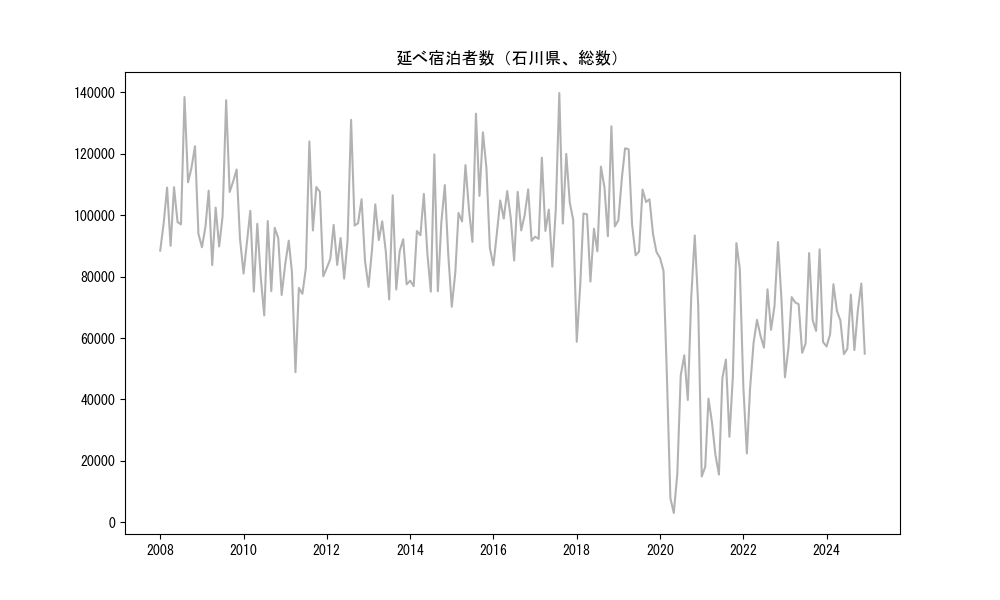
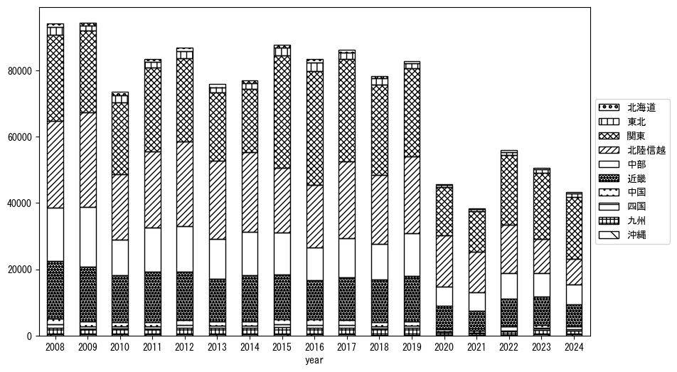
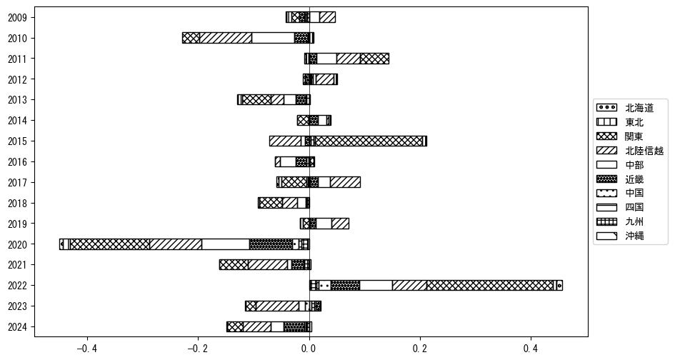
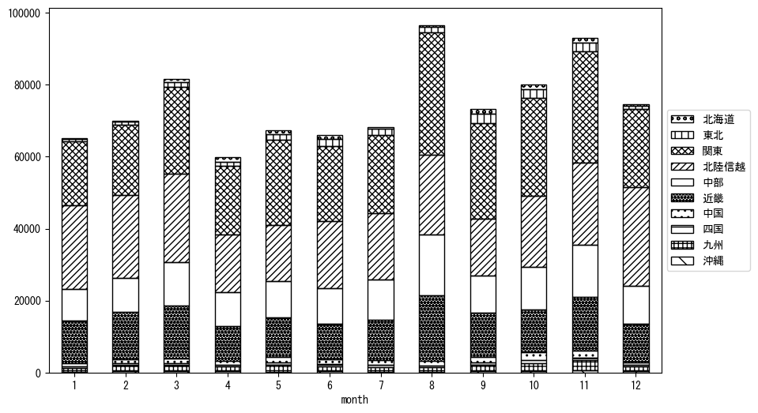
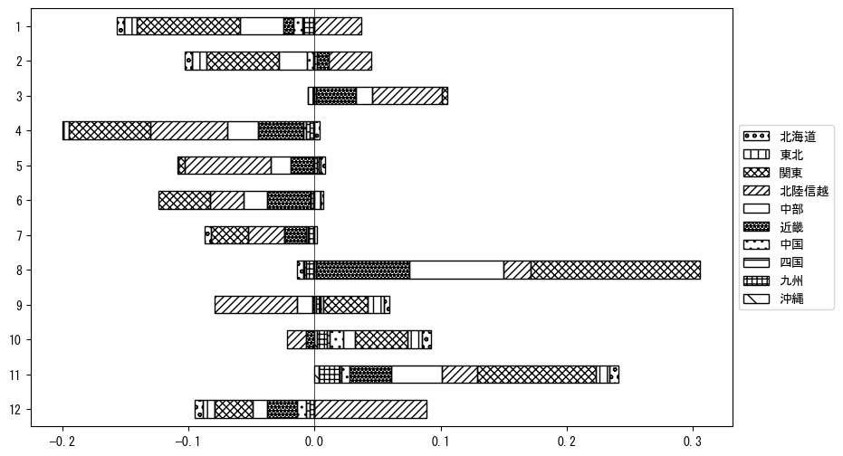

`<!DOCTYPE html>`{=html}
<html lang="ja">
<head>
    <meta charset="UTF-8">
    <meta name="description" content="">
    <link rel="stylesheet" href="../css/style.css">
    <title>宿泊者数の重心 | 石川県</title>
</head>    
<body>
<body>
<nav id ="global_navi">
    <ul>
        <li>[トップ](../index.html)</li>
        <li>[使い方](../how_to_use.html)</li>
        <li>[データについて](../on_data.html)</li>
        <li>[算出方法について](../method.html)</li>
        <li>[発展的な使い方](../developer.html)</li>
        <li>[サイトポリシー](../policy.html)</li>
    </ul>
</nav>
<ol class="breadcrumb">
    <li>[トップ](../index.html)</li>
    <li>石川県</li>
</ol>
<h1 id="h1_0">石川県</h1>

<ul>
  <li> **[１．延べ宿泊者（総数、月次）の推移](#h1_1)** 
    <ul>
      <li> [時系列グラフ](#h2_1) </li>
      <li> [基本統計量](#h2_2) </li>
    </ul>
  </li>  
</ul>

<ul>
  <li> **[２．宿泊者数の重心（年平均の推移）](#h1_2)** 
  <ul>
  <li> [重心の前年平均からの移動距離と方位、および緯度・経度](#h2_4) </li>
  <li> [運輸局別延べ宿泊者数](#h2_5) 
  <ul>
  <li> [時系列（年平均）](#h3_1) </li>
  <li> [寄与度（前年からの変化率に対する）](#h3_2) </li>
  </ul>
  </li>
  </ul>
  </li>
</ul>

<ul>
  <li> **[３．宿泊者数の重心（月別）](#h1_3)** 
  <ul>
  <li> [全期間（2008年1月～2023年12月）の平均と月別平均の比較](#h2_6) </li>
  <li> [運輸局別延べ宿泊者数](#h2_7) 
  <ul>
  <li> [月別平均（2008年1月～2023年12月）](#h3_3) </li>
  <li> [寄与度（全期間の平均から月別平均への変化率に対する）](#h3_4) </li>
  </ul>
  </li>
  </ul>
  </li>
</ul>

<ul>
<li> **[４．データのダウンロード](#h1_4)** </li>
</ul>

<h1 id="h1_1">１．延べ宿泊者（総数）の推移</h1>
<h2 id="h2_1">時系列グラフ</h2>

<figcaption>図１：石川県内の従業員数100人以上の宿泊施設での延べ宿泊者数（国外、居住地不詳を含む総数）。</figcaption>

<h2 id="h2_2">基本統計量</h2>
|  | 平均 | 標準偏差 | 最小値 | 最大値 |
|:----:|:----:|:----:|:----:|:----:|
| 2008年 | 105,849 | 14,716 | 88,477 (1月) | 138,495 (8月) |
| 2009年 | 102,726 | 14,565 | 83,772 (4月) | 137,466 (8月) |
| 2010年 | 85,790 | 11,580 | 67,368 (7月) | 101,438 (3月) |
| 2011年 | 87,964 | 19,536 | 48,868 (4月) | 124,052 (8月) |
| 2012年 | 94,030 | 13,889 | 79,364 (6月) | 131,063 (8月) |
| 2013年 | 88,365 | 11,039 | 72,575 (7月) | 106,479 (8月) |
| 2014年 | 91,928 | 14,674 | 75,106 (7月) | 119,831 (8月) |
| 2015年 | 102,560 | 18,380 | 70,197 (1月) | 133,069 (8月) |
| 2016年 | 98,060 | 8,424 | 83,667 (1月) | 108,432 (11月) |
| 2017年 | 103,782 | 15,407 | 83,235 (6月) | 139,810 (8月) |
| 2018年 | 95,247 | 18,552 | 58,786 (1月) | 128,977 (11月) |
| 2019年 | 102,156 | 12,250 | 86,962 (6月) | 121,819 (3月) |
| 2020年 | 51,900 | 30,763 | 3,028 (5月) | 93,420 (11月) |
| 2021年 | 40,999 | 25,029 | 14,912 (1月) | 90,937 (11月) |
| 2022年 | 60,440 | 17,799 | 22,409 (2月) | 91,262 (11月) |
| 2023年 | 66,415 | 12,725 | 47,236 (1月) | 88,898 (11月) |
: 表１：従業員数100人以上の宿泊施設での延べ宿泊者の総数（国外、および居住地不詳を含む）に関する基本統計量。単位は人泊。平均は１か月あたりの平均値を表す。図１に対応。

<h1 id="h1_2">２．宿泊者数の重心（年平均の推移）</h1>

<iframe src="../html/annual/石川県.html" width="1200" height="600"></iframe>
<figcaption>図２：石川県内の従業員数100人以上の宿泊施設での宿泊者数（国外、居住地不詳を除く）の重心（年平均の推移）。</figcaption>

[全画面表示](../html/annual/石川県.html)

<h2 id="h2_4">重心の前年平均からの移動距離と方位、および緯度・経度</h2>
|  | 方位 | 距離 | 緯度 | 経度 |
|:----:|:----:|:----:|:----:|:----:|
| 2008年 | --- | --- | 35.7686 | 137.2949 |
| 2009年 | 北西 | 5.1km | 35.7948 | 137.2481 |
| 2010年 | 東 | 9.7km | 35.7812 | 137.3540 |
| 2011年 | 東南東 | 3.2km | 35.7667 | 137.3849 |
| 2012年 | 北北西 | 5.8km | 35.8114 | 137.3509 |
| 2013年 | 西 | 9.6km | 35.7946 | 137.2465 |
| 2014年 | 西 | 5.8km | 35.7895 | 137.1822 |
| 2015年 | 東 | 37.7km | 35.7597 | 137.5974 |
| 2016年 | 東北東 | 13.4km | 35.7926 | 137.7402 |
| 2017年 | 西 | 18.6km | 35.8086 | 137.5352 |
| 2018年 | 南西 | 1.4km | 35.8000 | 137.5236 |
| 2019年 | 西 | 10.0km | 35.7871 | 137.4139 |
| 2020年 | 北西 | 7.8km | 35.8332 | 137.3482 |
| 2021年 | 東南東 | 9.3km | 35.8073 | 137.4459 |
| 2022年 | 東 | 14.2km | 35.7838 | 137.5998 |
| 2023年 | 南南西 | 13.3km | 35.6681 | 137.5599 |
: 表２：重心の前年平均からの移動距離と方位、および緯度・経度。図２に対応。

<h2 id="h2_5">運輸局別延べ宿泊者数</h2>
<h3 id="h3_1">時系列（年平均）</h3>

<figcaption>図３：石川県内の従業員数100人以上の宿泊施設での１か月あたり平均宿泊者数（国外、居住地不詳を除く）の運輸局別内訳。</figcaption>

<h3 id="h3_2">寄与度（前年からの変化率に対する）</h3>

<figcaption>図４：石川県内の従業員数100人以上の宿泊施設での運輸局別宿泊者数（国外、居住地不詳を除く）から求めた寄与度。</figcaption>

<h1 id="h1_3">３．宿泊者数の重心（月別）</h3>

<iframe src="../html/monthly/石川県.html" width="1200" height="600"></iframe>
<figcaption>図５：石川県内の従業員数100人以上の宿泊施設での宿泊者数（国外、居住地不詳を除く）の重心（月別）。観測期間は2008年1月から2023年12月まで。</figcaption>

[全画面表示](../html/monthly/石川県.html)

<h2 id="h2_6">全期間（2008年1月～2023年12月）の平均と月別平均の比較</h2>
|  | 方位 | 距離 | 緯度 | 経度 |
|:----:|:----:|:----:|:----:|:----:|
| 全期間 | --- | --- | 35.7842 | 137.4266 |
| 1月 | 西 | 15.8km | 35.8015 | 137.2528 |
| 2月 | 西南西 | 18.5km | 35.7298 | 137.2327 |
| 3月 | 西 | 5.1km | 35.7852 | 137.3702 |
| 4月 | 北 | 4.5km | 35.8241 | 137.4342 |
| 5月 | 東南東 | 8.0km | 35.7564 | 137.5087 |
| 6月 | 北北東 | 10.6km | 35.8689 | 137.4820 |
| 7月 | 東南東 | 1.6km | 35.7811 | 137.4440 |
| 8月 | 南東 | 13.3km | 35.7049 | 137.5371 |
| 9月 | 東 | 14.5km | 35.7807 | 137.5866 |
| 10月 | 東北東 | 6.1km | 35.8003 | 137.4907 |
| 11月 | 南南東 | 3.8km | 35.7509 | 137.4374 |
| 12月 | 西北西 | 8.9km | 35.8268 | 137.3427 |
: 表３：全期間の平均から月別平均までの移動距離と方位、および緯度・経度。図５に対応。

<h2 id="h2_7">運輸局別延べ宿泊者数</h2>
<h3 id="h3_3">月別平均（2008年1月～2023年12月）</h3>

<figcaption>図６：石川県内の従業員数100人以上の宿泊施設での宿泊者数（国外、居住地不詳を除く）の運輸局別内訳（月別）。</figcaption>

<h3 id="h3_4">寄与度（全期間の平均から月別平均への変化率に対する）</h3>

<figcaption>図７：石川県内の従業員数100人以上の宿泊施設での運輸局別宿泊者数（国外、居住地不詳を除く）から求めた寄与度（月別）。</figcaption>

</body>

<h1 id="h1_4">４．データのダウンロード</h1>
 <ul>
  <li> <a href="../csv/data_by_pref/延べ宿泊者数および重心（石川県）.csv" download>延べ宿泊者数および重心の緯度経度</a> </li>
  <li> <a href="../csv/bar_chart/運輸局別_年平均（石川県）.csv" download>運輸局別延べ宿泊者数（年平均）</a></li>
  <li> <a href="../csv/bar_chart_month/運輸局別_月別（石川県）.csv" download>運輸局別延べ宿泊者数（月別）</a></li>
  <li> <a href="../csv/contrib/前年からの変化率に対する寄与度（石川県）.csv" download>前年からの変化率に対する寄与度</a></li>
  <li> <a href="../csv/contrib_month/月別平均への変化率に対する寄与度（石川県）.csv" download>月別平均への変化率に対する寄与度</a></li>
</ul>

出典：観光庁「宿泊旅行統計調査」に収録された「施設所在地、居住地別延べ宿泊者数（従業員数100人以上の施設）」

国土地理院「白地図（[地理院タイル](https://maps.gsi.go.jp/development/ichiran.html)）」（図２と図５）

