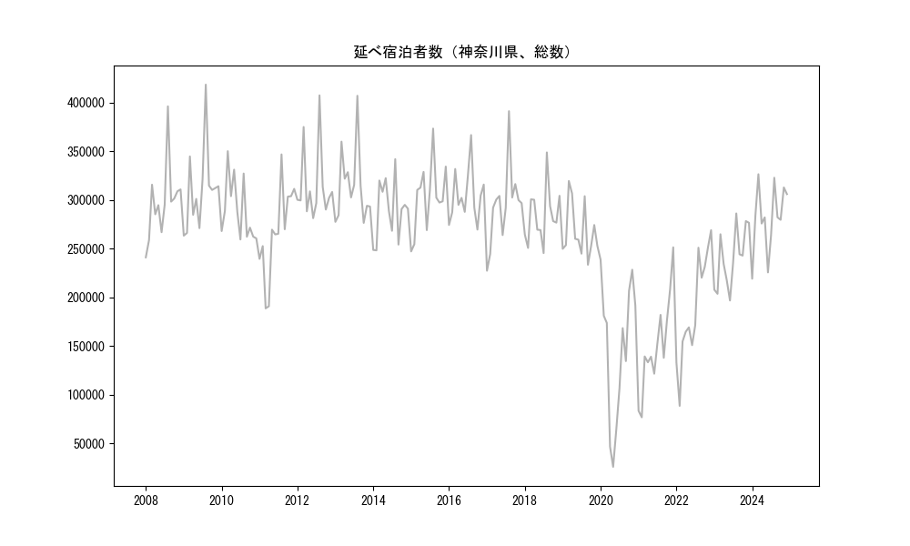

`<!DOCTYPE html>`{=html}
<html lang="ja">
<head>
    <meta charset="UTF-8">
    <meta name="description" content="">
    <link rel="stylesheet" href="../css/style.css">
    <title>宿泊者数の重心 | 神奈川県</title>
</head>    
<body>
<body>
<nav id ="global_navi">
    <ul>
        <li>[トップ](../index.html)</li>
        <li>[使い方](../how_to_use.html)</li>
        <li>[データについて](../on_data.html)</li>
        <li>[算出方法について](../method.html)</li>
        <li>[発展的な使い方](../developer.html)</li>
        <li>[サイトポリシー](../policy.html)</li>
    </ul>
</nav>
<ol class="breadcrumb">
    <li>[トップ](../index.html)</li>
    <li>神奈川県</li>
</ol>
<h1 id="h1_0">神奈川県</h1>

<ul>
  <li> **[１．延べ宿泊者（総数、月次）の推移](#h1_1)** 
    <ul>
      <li> [時系列グラフ](#h2_1) </li>
      <li> [基本統計量](#h2_2) </li>
    </ul>
  </li>  
</ul>

<ul>
  <li> **[２．宿泊者数の重心（年平均の推移）](#h1_2)** 
  <ul>
  <li> [重心の前年平均からの移動距離と方位、および緯度・経度](#h2_4) </li>
  <li> [運輸局別延べ宿泊者数](#h2_5) 
  <ul>
  <li> [時系列（年平均）](#h3_1) </li>
  <li> [寄与度（前年からの変化率に対する）](#h3_2) </li>
  </ul>
  </li>
  </ul>
  </li>
</ul>

<ul>
  <li> **[３．宿泊者数の重心（月別）](#h1_3)** 
  <ul>
  <li> [全期間（2008年1月～2023年12月）の平均と月別平均の比較](#h2_6) </li>
  <li> [運輸局別延べ宿泊者数](#h2_7) 
  <ul>
  <li> [月別平均（2008年1月～2023年12月）](#h3_3) </li>
  <li> [寄与度（全期間の平均から月別平均への変化率に対する）](#h3_4) </li>
  </ul>
  </li>
  </ul>
  </li>
</ul>

<ul>
<li> **[４．データのダウンロード](#h1_4)** </li>
</ul>

<h1 id="h1_1">１．延べ宿泊者（総数）の推移</h1>
<h2 id="h2_1">時系列グラフ</h2>

<figcaption>図１：神奈川県内の従業員数100人以上の宿泊施設での延べ宿泊者数（国外、居住地不詳を含む総数）。</figcaption>

<h2 id="h2_2">基本統計量</h2>
|  | 平均 | 標準偏差 | 最小値 | 最大値 |
|:----:|:----:|:----:|:----:|:----:|
| 2008年 | 297,688 | 38,347 | 240,976 (1月) | 396,091 (8月) |
| 2009年 | 310,102 | 42,079 | 263,254 (1月) | 418,376 (8月) |
| 2010年 | 289,312 | 31,684 | 259,334 (7月) | 350,034 (3月) |
| 2011年 | 267,119 | 46,669 | 188,576 (3月) | 346,717 (8月) |
| 2012年 | 314,188 | 37,712 | 281,234 (6月) | 407,357 (8月) |
| 2013年 | 314,548 | 37,676 | 276,363 (10月) | 406,941 (8月) |
| 2014年 | 289,689 | 30,478 | 248,157 (2月) | 341,846 (8月) |
| 2015年 | 303,154 | 34,994 | 247,056 (1月) | 373,239 (8月) |
| 2016年 | 304,230 | 27,137 | 269,481 (10月) | 366,576 (8月) |
| 2017年 | 294,171 | 40,472 | 227,216 (1月) | 391,117 (8月) |
| 2018年 | 283,412 | 28,196 | 245,332 (7月) | 348,752 (8月) |
| 2019年 | 267,453 | 27,564 | 233,367 (9月) | 319,403 (3月) |
| 2020年 | 147,118 | 71,454 | 25,797 (5月) | 238,529 (1月) |
| 2021年 | 149,971 | 49,209 | 76,652 (2月) | 251,273 (12月) |
| 2022年 | 187,801 | 55,630 | 88,416 (2月) | 268,881 (12月) |
| 2023年 | 240,624 | 30,676 | 196,639 (6月) | 286,070 (8月) |
: 表１：従業員数100人以上の宿泊施設での延べ宿泊者の総数（国外、および居住地不詳を含む）に関する基本統計量。単位は人泊。平均は１か月あたりの平均値を表す。図１に対応。

<h1 id="h1_2">２．宿泊者数の重心（年平均の推移）</h1>

<iframe src="../html/annual/神奈川県.html" width="1200" height="600"></iframe>
<figcaption>図２：神奈川県内の従業員数100人以上の宿泊施設での宿泊者数（国外、居住地不詳を除く）の重心（年平均の推移）。</figcaption>

[全画面表示](../html/annual/神奈川県.html)

<h2 id="h2_4">重心の前年平均からの移動距離と方位、および緯度・経度</h2>
|  | 方位 | 距離 | 緯度 | 経度 |
|:----:|:----:|:----:|:----:|:----:|
| 2008年 | --- | --- | 35.6590 | 138.7364 |
| 2009年 | 南南東 | 1.0km | 35.6506 | 138.7409 |
| 2010年 | 西 | 12.1km | 35.6701 | 138.6091 |
| 2011年 | 東 | 12.1km | 35.6643 | 138.7421 |
| 2012年 | 西北西 | 4.1km | 35.6843 | 138.7042 |
| 2013年 | 西 | 8.0km | 35.6968 | 138.6174 |
| 2014年 | 北北東 | 2.4km | 35.7163 | 138.6278 |
| 2015年 | 西南西 | 4.8km | 35.6998 | 138.5784 |
| 2016年 | 北東 | 0.3km | 35.7018 | 138.5802 |
| 2017年 | 西 | 4.3km | 35.6958 | 138.5329 |
| 2018年 | 東北東 | 2.1km | 35.7037 | 138.5541 |
| 2019年 | 南南東 | 1.2km | 35.6942 | 138.5601 |
| 2020年 | 東南東 | 38.5km | 35.5693 | 138.9569 |
| 2021年 | 東 | 16.1km | 35.5662 | 139.1344 |
| 2022年 | 西北西 | 13.7km | 35.6060 | 138.9916 |
| 2023年 | 西 | 22.2km | 35.6342 | 138.7489 |
: 表２：重心の前年平均からの移動距離と方位、および緯度・経度。図２に対応。

<h2 id="h2_5">運輸局別延べ宿泊者数</h2>
<h3 id="h3_1">時系列（年平均）</h3>

<figcaption>図３：神奈川県内の従業員数100人以上の宿泊施設での１か月あたり平均宿泊者数（国外、居住地不詳を除く）の運輸局別内訳。</figcaption>

<h3 id="h3_2">寄与度（前年からの変化率に対する）</h3>

<figcaption>図４：神奈川県内の従業員数100人以上の宿泊施設での運輸局別宿泊者数（国外、居住地不詳を除く）から求めた寄与度。</figcaption>

<h1 id="h1_3">３．宿泊者数の重心（月別）</h3>

<iframe src="../html/monthly/神奈川県.html" width="1200" height="600"></iframe>
<figcaption>図５：神奈川県内の従業員数100人以上の宿泊施設での宿泊者数（国外、居住地不詳を除く）の重心（月別）。観測期間は2008年1月から2023年12月まで。</figcaption>

[全画面表示](../html/monthly/神奈川県.html)

<h2 id="h2_6">全期間（2008年1月～2023年12月）の平均と月別平均の比較</h2>
|  | 方位 | 距離 | 緯度 | 経度 |
|:----:|:----:|:----:|:----:|:----:|
| 全期間 | --- | --- | 35.6633 | 138.7135 |
| 1月 | 東 | 15.9km | 35.6842 | 138.8868 |
| 2月 | 南南西 | 2.4km | 35.6449 | 138.6991 |
| 3月 | 西 | 5.4km | 35.6686 | 138.6537 |
| 4月 | 北東 | 5.1km | 35.7012 | 138.7454 |
| 5月 | 北北東 | 8.1km | 35.7343 | 138.7349 |
| 6月 | 西 | 4.9km | 35.6679 | 138.6599 |
| 7月 | 南南西 | 7.1km | 35.6048 | 138.6821 |
| 8月 | 東南東 | 11.6km | 35.6290 | 138.8341 |
| 9月 | 西 | 4.3km | 35.6595 | 138.6658 |
| 10月 | 西 | 10.1km | 35.6698 | 138.6023 |
| 11月 | 西 | 9.4km | 35.6721 | 138.6107 |
| 12月 | 南東 | 8.0km | 35.6232 | 138.7867 |
: 表３：全期間の平均から月別平均までの移動距離と方位、および緯度・経度。図５に対応。

<h2 id="h2_7">運輸局別延べ宿泊者数</h2>
<h3 id="h3_3">月別平均（2008年1月～2023年12月）</h3>

<figcaption>図６：神奈川県内の従業員数100人以上の宿泊施設での宿泊者数（国外、居住地不詳を除く）の運輸局別内訳（月別）。</figcaption>

<h3 id="h3_4">寄与度（全期間の平均から月別平均への変化率に対する）</h3>

<figcaption>図７：神奈川県内の従業員数100人以上の宿泊施設での運輸局別宿泊者数（国外、居住地不詳を除く）から求めた寄与度（月別）。</figcaption>

</body>

<h1 id="h1_4">４．データのダウンロード</h1>
 <ul>
  <li> <a href="../csv/data_by_pref/延べ宿泊者数および重心（神奈川県）.csv" download>延べ宿泊者数および重心の緯度経度</a> </li>
  <li> <a href="../csv/bar_chart/運輸局別_年平均（神奈川県）.csv" download>運輸局別延べ宿泊者数（年平均）</a></li>
  <li> <a href="../csv/bar_chart_month/運輸局別_月別（神奈川県）.csv" download>運輸局別延べ宿泊者数（月別）</a></li>
  <li> <a href="../csv/contrib/前年からの変化率に対する寄与度（神奈川県）.csv" download>前年からの変化率に対する寄与度</a></li>
  <li> <a href="../csv/contrib_month/月別平均への変化率に対する寄与度（神奈川県）.csv" download>月別平均への変化率に対する寄与度</a></li>
</ul>

出典：観光庁「宿泊旅行統計調査」に収録された「施設所在地、居住地別延べ宿泊者数（従業員数100人以上の施設）」

国土地理院「白地図（[地理院タイル](https://maps.gsi.go.jp/development/ichiran.html)）」（図２と図５）

