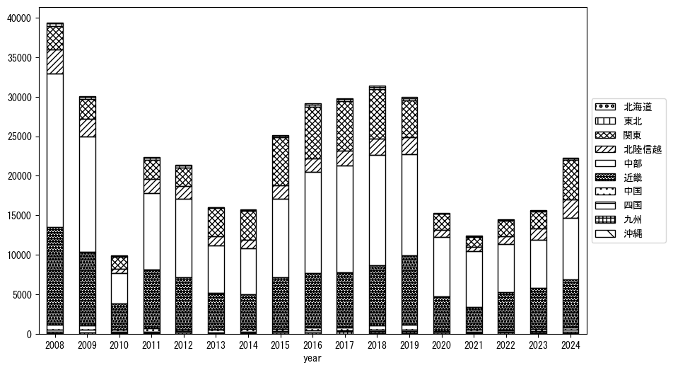
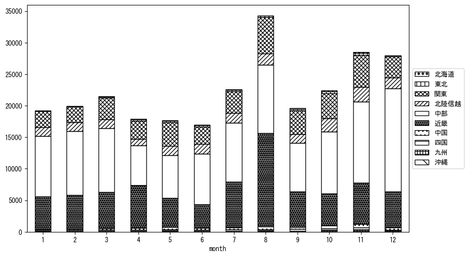
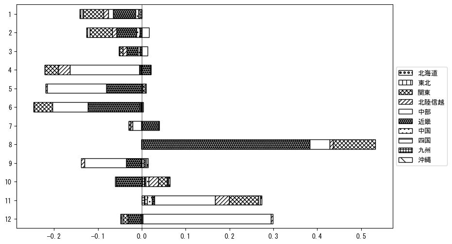

`<!DOCTYPE html>`{=html}
<html lang="ja">
<head>
    <meta charset="UTF-8">
    <meta name="description" content="">
    <link rel="stylesheet" href="../css/style.css">
    <title>宿泊者数の重心 | 福井県</title>
</head>    
<body>
<body>
<nav id ="global_navi">
    <ul>
        <li>[トップ](../index.html)</li>
        <li>[使い方](../how_to_use.html)</li>
        <li>[データについて](../on_data.html)</li>
        <li>[算出方法について](../method.html)</li>
        <li>[発展的な使い方](../developer.html)</li>
        <li>[サイトポリシー](../policy.html)</li>
    </ul>
</nav>
<ol class="breadcrumb">
    <li>[トップ](../index.html)</li>
    <li>福井県</li>
</ol>
<h1 id="h1_0">福井県</h1>

<ul>
  <li> **[１．延べ宿泊者（総数、月次）の推移](#h1_1)** 
    <ul>
      <li> [時系列グラフ](#h2_1) </li>
      <li> [基本統計量](#h2_2) </li>
    </ul>
  </li>  
</ul>

<ul>
  <li> **[２．宿泊者数の重心（年平均の推移）](#h1_2)** 
  <ul>
  <li> [重心の前年平均からの移動距離と方位、および緯度・経度](#h2_4) </li>
  <li> [運輸局別延べ宿泊者数](#h2_5) 
  <ul>
  <li> [時系列（年平均）](#h3_1) </li>
  <li> [寄与度（前年からの変化率に対する）](#h3_2) </li>
  </ul>
  </li>
  </ul>
  </li>
</ul>

<ul>
  <li> **[３．宿泊者数の重心（月別）](#h1_3)** 
  <ul>
  <li> [全期間（2008年1月～2023年12月）の平均と月別平均の比較](#h2_6) </li>
  <li> [運輸局別延べ宿泊者数](#h2_7) 
  <ul>
  <li> [月別平均（2008年1月～2023年12月）](#h3_3) </li>
  <li> [寄与度（全期間の平均から月別平均への変化率に対する）](#h3_4) </li>
  </ul>
  </li>
  </ul>
  </li>
</ul>

<ul>
<li> **[４．データのダウンロード](#h1_4)** </li>
</ul>

<h1 id="h1_1">１．延べ宿泊者（総数）の推移</h1>
<h2 id="h2_1">時系列グラフ</h2>

<figcaption>図１：福井県内の従業員数100人以上の宿泊施設での延べ宿泊者数（国外、居住地不詳を含む総数）。</figcaption>

<h2 id="h2_2">基本統計量</h2>
|  | 平均 | 標準偏差 | 最小値 | 最大値 |
|:----:|:----:|:----:|:----:|:----:|
| 2008年 | 39,856 | 8,644 | 29,819 (9月) | 57,391 (8月) |
| 2009年 | 30,579 | 6,433 | 18,114 (9月) | 38,725 (12月) |
| 2010年 | 14,439 | 4,329 | 9,131 (6月) | 25,944 (8月) |
| 2011年 | 22,715 | 10,790 | 13,361 (1月) | 49,374 (8月) |
| 2012年 | 21,855 | 6,332 | 15,964 (6月) | 39,905 (8月) |
| 2013年 | 16,581 | 7,624 | 10,577 (6月) | 37,679 (8月) |
| 2014年 | 16,022 | 4,481 | 11,338 (6月) | 28,057 (8月) |
| 2015年 | 25,711 | 8,043 | 15,826 (1月) | 39,869 (12月) |
| 2016年 | 29,518 | 6,652 | 21,831 (3月) | 43,629 (8月) |
| 2017年 | 30,642 | 6,041 | 23,965 (6月) | 41,802 (8月) |
| 2018年 | 32,848 | 6,437 | 25,549 (6月) | 47,064 (8月) |
| 2019年 | 30,676 | 5,620 | 23,690 (4月) | 43,942 (8月) |
| 2020年 | 15,414 | 9,505 | 356 (5月) | 29,025 (2月) |
| 2021年 | 12,429 | 6,906 | 4,561 (6月) | 22,542 (12月) |
| 2022年 | 14,496 | 4,651 | 6,085 (2月) | 21,000 (11月) |
| 2023年 | 15,874 | 5,178 | 9,885 (9月) | 27,518 (8月) |
: 表１：従業員数100人以上の宿泊施設での延べ宿泊者の総数（国外、および居住地不詳を含む）に関する基本統計量。単位は人泊。平均は１か月あたりの平均値を表す。図１に対応。

<h1 id="h1_2">２．宿泊者数の重心（年平均の推移）</h1>

<iframe src="../html/annual/福井県.html" width="1200" height="600"></iframe>
<figcaption>図２：福井県内の従業員数100人以上の宿泊施設での延べ宿泊者数（国外、居住地不詳を除く）の重心（年平均の推移）。</figcaption>

[全画面表示](../html/annual/福井県.html)

<h2 id="h2_4">重心の前年平均からの移動距離と方位、および緯度・経度</h2>
|  | 方位 | 距離 | 緯度 | 経度 |
|:----:|:----:|:----:|:----:|:----:|
| 2008年 | --- | --- | 35.5225 | 136.4558 |
| 2009年 | 南 | 1.2km | 35.5114 | 136.4557 |
| 2010年 | 東南東 | 30.6km | 35.4483 | 136.7840 |
| 2011年 | 西北西 | 16.3km | 35.4835 | 136.6095 |
| 2012年 | 北北西 | 8.7km | 35.5574 | 136.5786 |
| 2013年 | 東 | 36.0km | 35.5384 | 136.9746 |
| 2014年 | 南南西 | 5.0km | 35.4959 | 136.9549 |
| 2015年 | 東北東 | 10.1km | 35.5269 | 137.0595 |
| 2016年 | 北北西 | 9.0km | 35.5988 | 137.0140 |
| 2017年 | 西 | 8.7km | 35.5925 | 136.9181 |
| 2018年 | 西南西 | 4.4km | 35.5800 | 136.8722 |
| 2019年 | 西南西 | 18.9km | 35.5111 | 136.6818 |
| 2020年 | 北北西 | 4.1km | 35.5426 | 136.6585 |
| 2021年 | 西北西 | 15.7km | 35.5895 | 136.4947 |
| 2022年 | 南南東 | 19.6km | 35.4340 | 136.5966 |
| 2023年 | 南東 | 0.7km | 35.4292 | 136.6011 |
: 表２：重心の前年平均からの移動距離と方位、および緯度・経度。図２に対応。

<h2 id="h2_5">運輸局別延べ宿泊者数</h2>
<h3 id="h3_1">時系列（年平均）</h3>

<figcaption>図３：福井県内の従業員数100人以上の宿泊施設での１か月あたり平均延べ宿泊者数（国外、居住地不詳を除く）の運輸局別内訳。</figcaption>

<h3 id="h3_2">寄与度（前年からの変化率に対する）</h3>

<figcaption>図４：福井県内の従業員数100人以上の宿泊施設での運輸局別延べ宿泊者数（国外、居住地不詳を除く）から求めた寄与度。</figcaption>

<h1 id="h1_3">３．宿泊者数の重心（月別）</h3>

<iframe src="../html/monthly/福井県.html" width="1200" height="600"></iframe>
<figcaption>図５：福井県内の従業員数100人以上の宿泊施設での延べ宿泊者数（国外、居住地不詳を除く）の重心（月別）。観測期間は2008年1月から2023年12月まで。</figcaption>

[全画面表示](../html/monthly/福井県.html)

<h2 id="h2_6">全期間（2008年1月～2023年12月）の平均と月別平均の比較</h2>
|  | 方位 | 距離 | 緯度 | 経度 |
|:----:|:----:|:----:|:----:|:----:|
| 全期間 | --- | --- | 35.5226 | 136.7318 |
| 1月 | 西 | 8.3km | 35.5325 | 136.6412 |
| 2月 | 西 | 9.2km | 35.5196 | 136.6301 |
| 3月 | 東 | 9.5km | 35.5363 | 136.8354 |
| 4月 | 南南西 | 17.0km | 35.3939 | 136.6307 |
| 5月 | 東北東 | 17.7km | 35.5655 | 136.9195 |
| 6月 | 北 | 15.8km | 35.6639 | 136.7511 |
| 7月 | 南西 | 8.1km | 35.4721 | 136.6679 |
| 8月 | 南南西 | 26.1km | 35.2926 | 136.6694 |
| 9月 | 東 | 6.6km | 35.5261 | 136.8048 |
| 10月 | 北東 | 12.5km | 35.6052 | 136.8249 |
| 11月 | 東北東 | 8.2km | 35.5531 | 136.8143 |
| 12月 | 北西 | 16.0km | 35.6108 | 136.5927 |
: 表３：全期間の平均から月別平均までの移動距離と方位、および緯度・経度。図５に対応。

<h2 id="h2_7">運輸局別延べ宿泊者数</h2>
<h3 id="h3_3">月別平均（2008年1月～2023年12月）</h3>

<figcaption>図６：福井県内の従業員数100人以上の宿泊施設での延べ宿泊者数（国外、居住地不詳を除く）の運輸局別内訳（月別）。</figcaption>

<h3 id="h3_4">寄与度（全期間の平均から月別平均への変化率に対する）</h3>

<figcaption>図７：福井県内の従業員数100人以上の宿泊施設での運輸局別延べ宿泊者数（国外、居住地不詳を除く）から求めた寄与度（月別）。</figcaption>

</body>

<h1 id="h1_4">４．データのダウンロード</h1>
 <ul>
  <li> <a href="../csv/data_by_pref/延べ宿泊者数および重心（福井県）.csv" download>延べ宿泊者数および重心の緯度経度</a> </li>
  <li> <a href="../csv/bar_chart/運輸局別_年平均（福井県）.csv" download>運輸局別延べ宿泊者数（年平均）</a></li>
  <li> <a href="../csv/bar_chart_month/運輸局別_月別（福井県）.csv" download>運輸局別延べ宿泊者数（月別）</a></li>
  <li> <a href="../csv/contrib/前年からの変化率に対する寄与度（福井県）.csv" download>前年からの変化率に対する寄与度</a></li>
  <li> <a href="../csv/contrib_month/月別平均への変化率に対する寄与度（福井県）.csv" download>月別平均への変化率に対する寄与度</a></li>
</ul>

出典：観光庁「宿泊旅行統計調査」に収録された「施設所在地、居住地別延べ宿泊者数（従業員数100人以上の施設）」

国土地理院「白地図（[地理院タイル](https://maps.gsi.go.jp/development/ichiran.html)）」（図２と図５）

