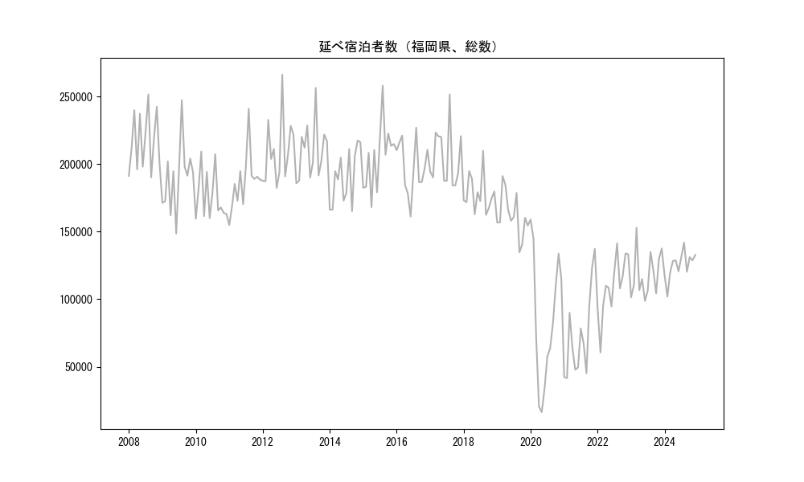
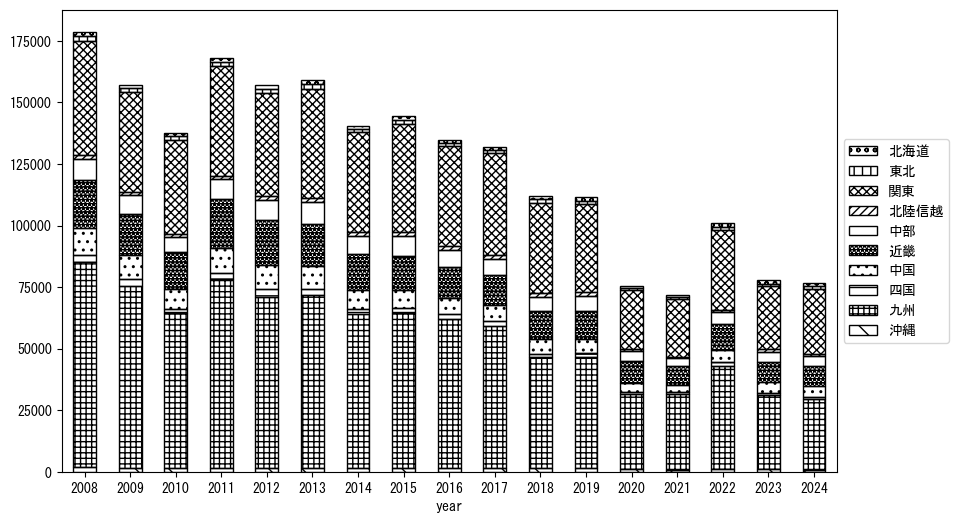
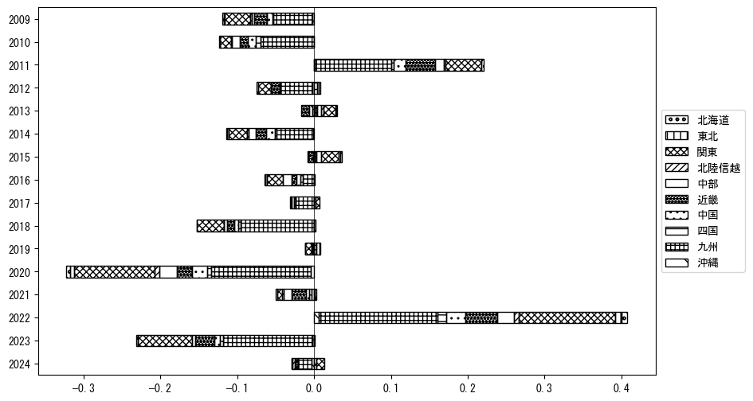
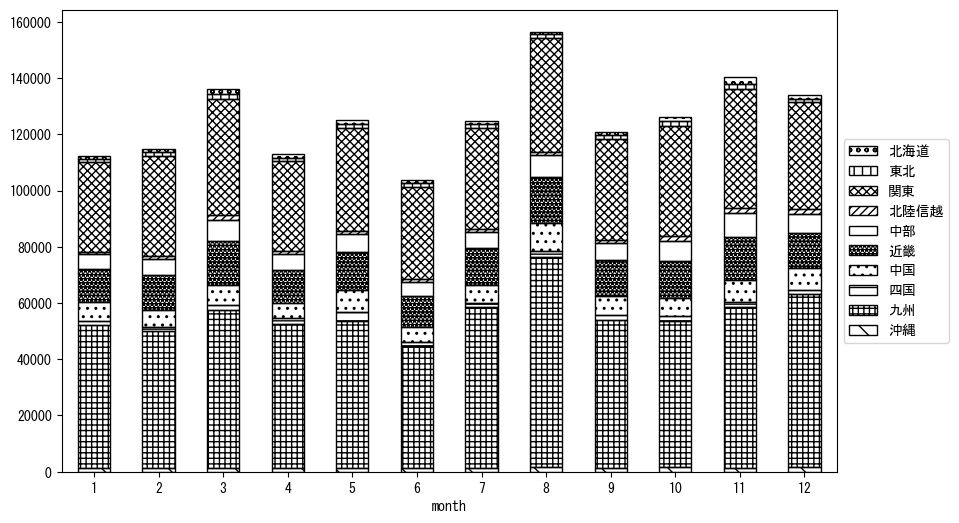
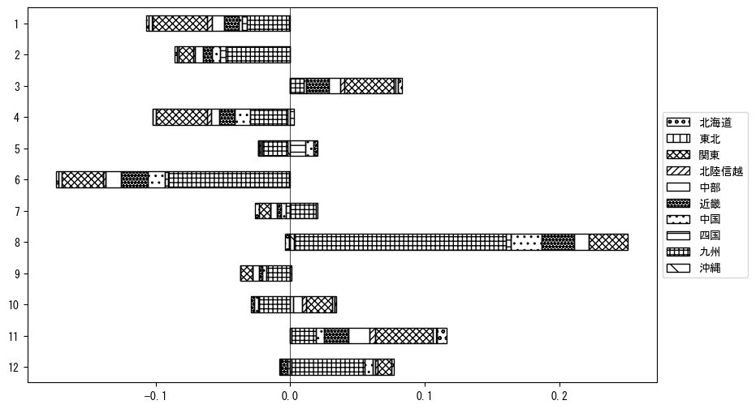

`<!DOCTYPE html>`{=html}
<html lang="ja">
<head>
    <meta charset="UTF-8">
    <meta name="description" content="">
    <link rel="stylesheet" href="../css/style.css">
    <title>宿泊者数の重心 | 福岡県</title>
</head>    
<body>
<body>
<nav id ="global_navi">
    <ul>
        <li>[トップ](../index.html)</li>
        <li>[使い方](../how_to_use.html)</li>
        <li>[データについて](../on_data.html)</li>
        <li>[算出方法について](../method.html)</li>
        <li>[発展的な使い方](../developer.html)</li>
        <li>[サイトポリシー](../policy.html)</li>
    </ul>
</nav>
<ol class="breadcrumb">
    <li>[トップ](../index.html)</li>
    <li>福岡県</li>
</ol>
<h1 id="h1_0">福岡県</h1>

<ul>
  <li> **[１．延べ宿泊者（総数、月次）の推移](#h1_1)** 
    <ul>
      <li> [時系列グラフ](#h2_1) </li>
      <li> [基本統計量](#h2_2) </li>
    </ul>
  </li>  
</ul>

<ul>
  <li> **[２．宿泊者数の重心（年平均の推移）](#h1_2)** 
  <ul>
  <li> [重心の前年平均からの移動距離と方位、および緯度・経度](#h2_4) </li>
  <li> [運輸局別延べ宿泊者数](#h2_5) 
  <ul>
  <li> [時系列（年平均）](#h3_1) </li>
  <li> [寄与度（前年からの変化率に対する）](#h3_2) </li>
  </ul>
  </li>
  </ul>
  </li>
</ul>

<ul>
  <li> **[３．宿泊者数の重心（月別）](#h1_3)** 
  <ul>
  <li> [全期間（2008年1月～2024年12月）の平均と月別平均の比較](#h2_6) </li>
  <li> [運輸局別延べ宿泊者数](#h2_7) 
  <ul>
  <li> [月別平均（2008年1月～2024年12月）](#h3_3) </li>
  <li> [寄与度（全期間の平均から月別平均への変化率に対する）](#h3_4) </li>
  </ul>
  </li>
  </ul>
  </li>
</ul>

<ul>
<li> **[４．データのダウンロード](#h1_4)** </li>
</ul>

<h1 id="h1_1">１．延べ宿泊者（総数）の推移</h1>
<h2 id="h2_1">時系列グラフ</h2>

<figcaption>図１：福岡県内の従業員数100人以上の宿泊施設での延べ宿泊者数（国外、居住地不詳を含む総数）。</figcaption>

<h2 id="h2_2">基本統計量</h2>
|  | 平均 | 標準偏差 | 最小値 | 最大値 |
|:----:|:----:|:----:|:----:|:----:|
| 2008年 | 216,878 | 21,920 | 190,274 (9月) | 251,566 (8月) |
| 2009年 | 190,146 | 25,081 | 148,529 (6月) | 247,396 (8月) |
| 2010年 | 176,179 | 18,341 | 159,554 (1月) | 209,345 (3月) |
| 2011年 | 187,269 | 21,266 | 154,923 (1月) | 241,063 (8月) |
| 2012年 | 209,456 | 24,492 | 182,441 (6月) | 266,247 (8月) |
| 2013年 | 209,664 | 20,801 | 185,868 (1月) | 256,500 (8月) |
| 2014年 | 190,736 | 20,326 | 165,116 (9月) | 217,512 (11月) |
| 2015年 | 205,511 | 24,348 | 168,150 (4月) | 258,077 (8月) |
| 2016年 | 197,818 | 19,584 | 161,228 (6月) | 227,060 (8月) |
| 2017年 | 204,869 | 21,675 | 184,228 (10月) | 251,650 (8月) |
| 2018年 | 178,181 | 13,881 | 162,412 (9月) | 209,931 (8月) |
| 2019年 | 161,948 | 16,489 | 134,737 (9月) | 191,201 (3月) |
| 2020年 | 84,124 | 48,476 | 16,391 (5月) | 159,078 (1月) |
| 2021年 | 73,403 | 32,248 | 41,514 (2月) | 137,254 (12月) |
| 2022年 | 109,531 | 22,248 | 60,574 (2月) | 141,309 (8月) |
| 2023年 | 118,293 | 17,067 | 98,737 (6月) | 152,907 (3月) |
| 2024年 | 125,217 | 10,077 | 101,852 (2月) | 141,883 (8月) |
: 表１：従業員数100人以上の宿泊施設での延べ宿泊者の総数（国外、および居住地不詳を含む）に関する基本統計量。単位は人泊。平均は１か月あたりの平均値を表す。図１に対応。

<h1 id="h1_2">２．宿泊者数の重心（年平均の推移）</h1>

<iframe src="../html/annual/福岡県.html" width="1200" height="600"></iframe>
<figcaption>図２：福岡県内の従業員数100人以上の宿泊施設での延べ宿泊者数（国外、居住地不詳を除く）の重心（年平均の推移）。</figcaption>

[全画面表示](../html/annual/福岡県.html)

<h2 id="h2_4">重心の前年平均からの移動距離と方位、および緯度・経度</h2>
|  | 方位 | 距離 | 緯度 | 経度 |
|:----:|:----:|:----:|:----:|:----:|
| 2008年 | --- | --- | 34.3244 | 134.1106 |
| 2009年 | 西南西 | 2.6km | 34.3166 | 134.0835 |
| 2010年 | 東 | 15.6km | 34.3375 | 134.2510 |
| 2011年 | 西南西 | 5.2km | 34.3263 | 134.1963 |
| 2012年 | 北東 | 8.9km | 34.3740 | 134.2738 |
| 2013年 | 東北東 | 8.9km | 34.4039 | 134.3636 |
| 2014年 | 東 | 1.5km | 34.4015 | 134.3801 |
| 2015年 | 東北東 | 12.9km | 34.4477 | 134.5087 |
| 2016年 | 西南西 | 9.1km | 34.4217 | 134.4148 |
| 2017年 | 東北東 | 10.1km | 34.4410 | 134.5224 |
| 2018年 | 東北東 | 24.3km | 34.5094 | 134.7741 |
| 2019年 | 西北西 | 3.1km | 34.5225 | 134.7442 |
| 2020年 | 西南西 | 18.1km | 34.4808 | 134.5541 |
| 2021年 | 東北東 | 9.0km | 34.5194 | 134.6399 |
| 2022年 | 東北東 | 4.8km | 34.5340 | 134.6889 |
| 2023年 | 東北東 | 18.3km | 34.6009 | 134.8709 |
| 2024年 | 東北東 | 14.0km | 34.6402 | 135.0162 |
: 表２：重心の前年平均からの移動距離と方位、および緯度・経度。図２に対応。

<h2 id="h2_5">運輸局別延べ宿泊者数</h2>
<h3 id="h3_1">時系列（年平均）</h3>

<figcaption>図３：福岡県内の従業員数100人以上の宿泊施設での１か月あたり平均延べ宿泊者数（国外、居住地不詳を除く）の運輸局別内訳。</figcaption>

<h3 id="h3_2">寄与度（前年からの変化率に対する）</h3>

<figcaption>図４：福岡県内の従業員数100人以上の宿泊施設での運輸局別延べ宿泊者数（国外、居住地不詳を除く）から求めた寄与度。</figcaption>

<h1 id="h1_3">３．宿泊者数の重心（月別）</h3>

<iframe src="../html/monthly/福岡県.html" width="1200" height="600"></iframe>
<figcaption>図５：福岡県内の従業員数100人以上の宿泊施設での延べ宿泊者数（国外、居住地不詳を除く）の重心（月別）。観測期間は2008年1月から2024年12月まで。</figcaption>

[全画面表示](../html/monthly/福岡県.html)

<h2 id="h2_6">全期間（2008年1月～2024年12月）の平均と月別平均の比較</h2>
|  | 方位 | 距離 | 緯度 | 経度 |
|:----:|:----:|:----:|:----:|:----:|
| 全期間 | --- | --- | 34.4472 | 134.4937 |
| 1月 | 西南西 | 17.3km | 34.3928 | 134.3177 |
| 2月 | 東 | 9.3km | 34.4504 | 134.5947 |
| 3月 | 東北東 | 21.7km | 34.5320 | 134.7071 |
| 4月 | 西 | 14.8km | 34.4429 | 134.3326 |
| 5月 | 東 | 3.9km | 34.4453 | 134.5365 |
| 6月 | 東北東 | 18.2km | 34.4898 | 134.6851 |
| 7月 | 西南西 | 13.7km | 34.3943 | 134.3596 |
| 8月 | 西南西 | 40.5km | 34.2950 | 134.0935 |
| 9月 | 南東 | 1.6km | 34.4376 | 134.5074 |
| 10月 | 東北東 | 21.8km | 34.5111 | 134.7180 |
| 11月 | 東北東 | 25.7km | 34.5562 | 134.7403 |
| 12月 | 西南西 | 15.2km | 34.4183 | 134.3321 |
: 表３：全期間の平均から月別平均までの移動距離と方位、および緯度・経度。図５に対応。

<h2 id="h2_7">運輸局別延べ宿泊者数</h2>
<h3 id="h3_3">月別平均（2008年1月～2024年12月）</h3>

<figcaption>図６：福岡県内の従業員数100人以上の宿泊施設での延べ宿泊者数（国外、居住地不詳を除く）の運輸局別内訳（月別）。</figcaption>

<h3 id="h3_4">寄与度（全期間の平均から月別平均への変化率に対する）</h3>

<figcaption>図７：福岡県内の従業員数100人以上の宿泊施設での運輸局別延べ宿泊者数（国外、居住地不詳を除く）から求めた寄与度（月別）。</figcaption>

</body>

<h1 id="h1_4">４．データのダウンロード</h1>
 <ul>
  <li> <a href="../csv/data_by_pref/延べ宿泊者数および重心（福岡県）.csv" download>延べ宿泊者数および重心の緯度経度</a> </li>
  <li> <a href="../csv/bar_chart/運輸局別_年平均（福岡県）.csv" download>運輸局別延べ宿泊者数（年平均）</a></li>
  <li> <a href="../csv/bar_chart_month/運輸局別_月別（福岡県）.csv" download>運輸局別延べ宿泊者数（月別）</a></li>
  <li> <a href="../csv/contrib/前年からの変化率に対する寄与度（福岡県）.csv" download>前年からの変化率に対する寄与度</a></li>
  <li> <a href="../csv/contrib_month/月別平均への変化率に対する寄与度（福岡県）.csv" download>月別平均への変化率に対する寄与度</a></li>
</ul>

出典：観光庁「宿泊旅行統計調査」に収録された「施設所在地、居住地別延べ宿泊者数（従業員数100人以上の施設）」

国土地理院「白地図（[地理院タイル](https://maps.gsi.go.jp/development/ichiran.html)）」（図２と図５）

