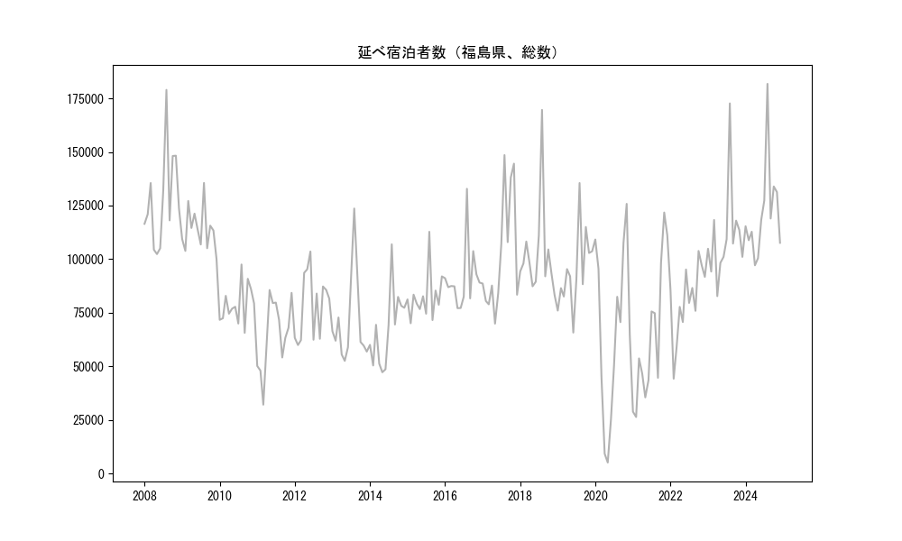
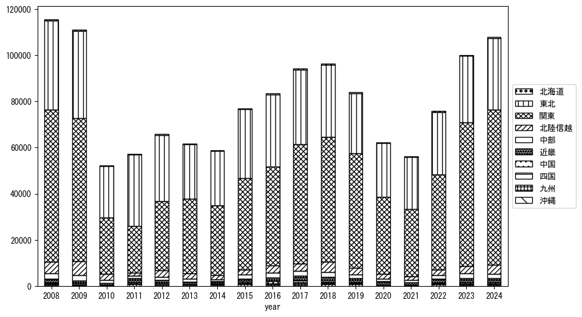

`<!DOCTYPE html>`{=html}
<html lang="ja">
<head>
    <meta charset="UTF-8">
    <meta name="description" content="">
    <link rel="stylesheet" href="../css/style.css">
    <title>宿泊者数の重心 | 福島県</title>
</head>    
<body>
<body>
<nav id ="global_navi">
    <ul>
        <li>[トップ](../index.html)</li>
        <li>[使い方](../how_to_use.html)</li>
        <li>[データについて](../on_data.html)</li>
        <li>[算出方法について](../method.html)</li>
        <li>[発展的な使い方](../developer.html)</li>
        <li>[サイトポリシー](../policy.html)</li>
    </ul>
</nav>
<ol class="breadcrumb">
    <li>[トップ](../index.html)</li>
    <li>福島県</li>
</ol>
<h1 id="h1_0">福島県</h1>

<ul>
  <li> **[１．延べ宿泊者（総数、月次）の推移](#h1_1)** 
    <ul>
      <li> [時系列グラフ](#h2_1) </li>
      <li> [基本統計量](#h2_2) </li>
    </ul>
  </li>  
</ul>

<ul>
  <li> **[２．宿泊者数の重心（年平均の推移）](#h1_2)** 
  <ul>
  <li> [重心の前年平均からの移動距離と方位、および緯度・経度](#h2_4) </li>
  <li> [運輸局別延べ宿泊者数](#h2_5) 
  <ul>
  <li> [時系列（年平均）](#h3_1) </li>
  <li> [寄与度（前年からの変化率に対する）](#h3_2) </li>
  </ul>
  </li>
  </ul>
  </li>
</ul>

<ul>
  <li> **[３．宿泊者数の重心（月別）](#h1_3)** 
  <ul>
  <li> [全期間（2008年1月～2023年12月）の平均と月別平均の比較](#h2_6) </li>
  <li> [運輸局別延べ宿泊者数](#h2_7) 
  <ul>
  <li> [月別平均（2008年1月～2023年12月）](#h3_3) </li>
  <li> [寄与度（全期間の平均から月別平均への変化率に対する）](#h3_4) </li>
  </ul>
  </li>
  </ul>
  </li>
</ul>

<ul>
<li> **[４．データのダウンロード](#h1_4)** </li>
</ul>

<h1 id="h1_1">１．延べ宿泊者（総数）の推移</h1>
<h2 id="h2_1">時系列グラフ</h2>

<figcaption>図１：福島県内の従業員数100人以上の宿泊施設での延べ宿泊者数（国外、居住地不詳を含む総数）。</figcaption>

<h2 id="h2_2">基本統計量</h2>
|  | 平均 | 標準偏差 | 最小値 | 最大値 |
|:----:|:----:|:----:|:----:|:----:|
| 2008年 | 127,802 | 22,417 | 102,345 (5月) | 178,963 (8月) |
| 2009年 | 113,852 | 10,195 | 100,033 (12月) | 135,537 (8月) |
| 2010年 | 78,774 | 9,202 | 65,582 (9月) | 97,487 (8月) |
| 2011年 | 64,632 | 16,570 | 32,081 (3月) | 85,579 (5月) |
| 2012年 | 78,446 | 15,528 | 59,904 (2月) | 103,538 (6月) |
| 2013年 | 71,078 | 21,094 | 52,514 (5月) | 123,603 (8月) |
| 2014年 | 67,523 | 17,526 | 47,209 (5月) | 106,893 (8月) |
| 2015年 | 82,334 | 11,326 | 70,070 (2月) | 112,748 (8月) |
| 2016年 | 90,804 | 15,087 | 77,107 (5月) | 132,812 (8月) |
| 2017年 | 101,593 | 27,649 | 69,905 (5月) | 148,538 (8月) |
| 2018年 | 102,421 | 22,744 | 83,225 (12月) | 169,619 (8月) |
| 2019年 | 94,485 | 18,330 | 65,714 (6月) | 135,503 (8月) |
| 2020年 | 65,875 | 40,026 | 5,061 (5月) | 125,777 (11月) |
| 2021年 | 63,372 | 32,546 | 26,314 (2月) | 121,742 (11月) |
| 2022年 | 80,547 | 16,901 | 44,195 (2月) | 103,807 (10月) |
| 2023年 | 110,094 | 22,154 | 82,718 (4月) | 172,663 (8月) |
: 表１：従業員数100人以上の宿泊施設での延べ宿泊者の総数（国外、および居住地不詳を含む）に関する基本統計量。単位は人泊。平均は１か月あたりの平均値を表す。図１に対応。

<h1 id="h1_2">２．宿泊者数の重心（年平均の推移）</h1>

<iframe src="../html/annual/福島県.html" width="1200" height="600"></iframe>
<figcaption>図２：福島県内の従業員数100人以上の宿泊施設での宿泊者数（国外、居住地不詳を除く）の重心（年平均の推移）。</figcaption>

[全画面表示](../html/annual/福島県.html)

<h2 id="h2_4">重心の前年平均からの移動距離と方位、および緯度・経度</h2>
|  | 方位 | 距離 | 緯度 | 経度 |
|:----:|:----:|:----:|:----:|:----:|
| 2008年 | --- | --- | 36.6386 | 139.8266 |
| 2009年 | 北 | 0.9km | 36.6465 | 139.8254 |
| 2010年 | 北 | 17.6km | 36.8024 | 139.8593 |
| 2011年 | 西北西 | 12.9km | 36.8567 | 139.7320 |
| 2012年 | 南東 | 11.2km | 36.7759 | 139.8080 |
| 2013年 | 南 | 10.2km | 36.6840 | 139.8165 |
| 2014年 | 北東 | 1.2km | 36.6914 | 139.8255 |
| 2015年 | 南西 | 10.5km | 36.6383 | 139.7286 |
| 2016年 | 西北西 | 2.5km | 36.6467 | 139.7030 |
| 2017年 | 南南西 | 7.0km | 36.5863 | 139.6804 |
| 2018年 | 東 | 3.1km | 36.5904 | 139.7148 |
| 2019年 | 南 | 7.7km | 36.5213 | 139.7261 |
| 2020年 | 北東 | 32.6km | 36.7640 | 139.9314 |
| 2021年 | 南南西 | 7.2km | 36.7090 | 139.8885 |
| 2022年 | 南西 | 14.0km | 36.6181 | 139.7803 |
| 2023年 | 南南西 | 16.9km | 36.4689 | 139.7436 |
: 表２：重心の前年平均からの移動距離と方位、および緯度・経度。図２に対応。

<h2 id="h2_5">運輸局別延べ宿泊者数</h2>
<h3 id="h3_1">時系列（年平均）</h3>

<figcaption>図３：福島県内の従業員数100人以上の宿泊施設での１か月あたり平均宿泊者数（国外、居住地不詳を除く）の運輸局別内訳。</figcaption>

<h3 id="h3_2">寄与度（前年からの変化率に対する）</h3>

<figcaption>図４：福島県内の従業員数100人以上の宿泊施設での運輸局別宿泊者数（国外、居住地不詳を除く）から求めた寄与度。</figcaption>

<h1 id="h1_3">３．宿泊者数の重心（月別）</h3>

<iframe src="../html/monthly/福島県.html" width="1200" height="600"></iframe>
<figcaption>図５：福島県内の従業員数100人以上の宿泊施設での宿泊者数（国外、居住地不詳を除く）の重心（月別）。観測期間は2008年1月から2023年12月まで。</figcaption>

[全画面表示](../html/monthly/福島県.html)

<h2 id="h2_6">全期間（2008年1月～2023年12月）の平均と月別平均の比較</h2>
|  | 方位 | 距離 | 緯度 | 経度 |
|:----:|:----:|:----:|:----:|:----:|
| 全期間 | --- | --- | 36.6649 | 139.7869 |
| 1月 | 東北東 | 15.7km | 36.7380 | 139.9376 |
| 2月 | 東北東 | 5.4km | 36.6888 | 139.8394 |
| 3月 | 北東 | 14.4km | 36.7660 | 139.8888 |
| 4月 | 南西 | 14.0km | 36.5873 | 139.6631 |
| 5月 | 西北西 | 3.2km | 36.6721 | 139.7522 |
| 6月 | 北 | 11.0km | 36.7636 | 139.7836 |
| 7月 | 南東 | 5.2km | 36.6367 | 139.8328 |
| 8月 | 南 | 20.5km | 36.4830 | 139.8296 |
| 9月 | 南南西 | 7.3km | 36.6095 | 139.7425 |
| 10月 | 南西 | 25.6km | 36.5310 | 139.5538 |
| 11月 | 西南西 | 10.4km | 36.6391 | 139.6747 |
| 12月 | 北北東 | 26.1km | 36.8634 | 139.9446 |
: 表３：全期間の平均から月別平均までの移動距離と方位、および緯度・経度。図５に対応。

<h2 id="h2_7">運輸局別延べ宿泊者数</h2>
<h3 id="h3_3">月別平均（2008年1月～2023年12月）</h3>

<figcaption>図６：福島県内の従業員数100人以上の宿泊施設での宿泊者数（国外、居住地不詳を除く）の運輸局別内訳（月別）。</figcaption>

<h3 id="h3_4">寄与度（全期間の平均から月別平均への変化率に対する）</h3>

<figcaption>図７：福島県内の従業員数100人以上の宿泊施設での運輸局別宿泊者数（国外、居住地不詳を除く）から求めた寄与度（月別）。</figcaption>

</body>

<h1 id="h1_4">４．データのダウンロード</h1>
 <ul>
  <li> <a href="../csv/data_by_pref/延べ宿泊者数および重心（福島県）.csv" download>延べ宿泊者数および重心の緯度経度</a> </li>
  <li> <a href="../csv/bar_chart/運輸局別_年平均（福島県）.csv" download>運輸局別延べ宿泊者数（年平均）</a></li>
  <li> <a href="../csv/bar_chart_month/運輸局別_月別（福島県）.csv" download>運輸局別延べ宿泊者数（月別）</a></li>
  <li> <a href="../csv/contrib/前年からの変化率に対する寄与度（福島県）.csv" download>前年からの変化率に対する寄与度</a></li>
  <li> <a href="../csv/contrib_month/月別平均への変化率に対する寄与度（福島県）.csv" download>月別平均への変化率に対する寄与度</a></li>
</ul>

出典：観光庁「宿泊旅行統計調査」に収録された「施設所在地、居住地別延べ宿泊者数（従業員数100人以上の施設）」

国土地理院「白地図（[地理院タイル](https://maps.gsi.go.jp/development/ichiran.html)）」（図２と図５）

