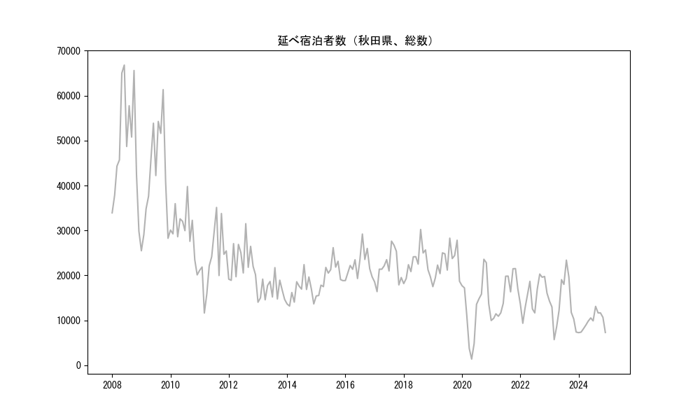
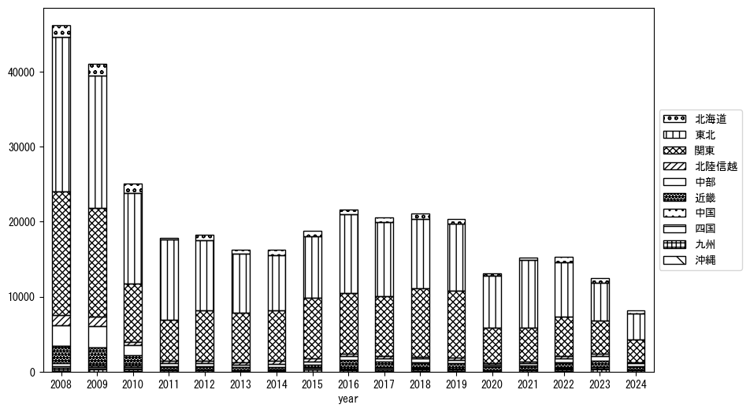
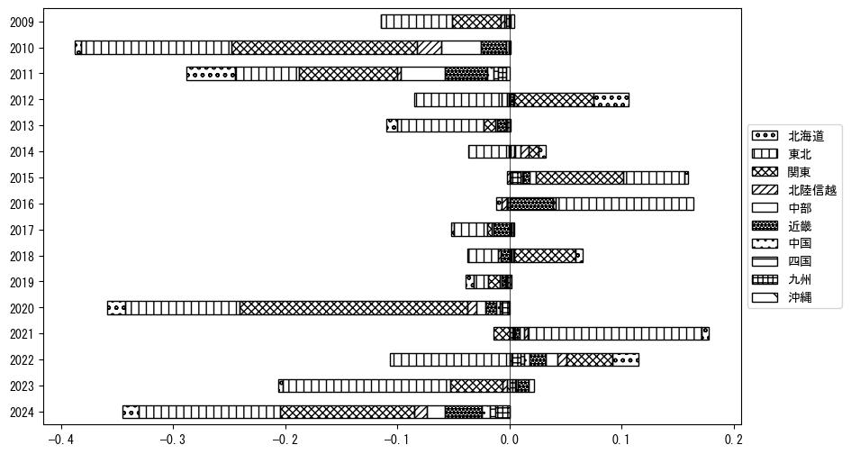
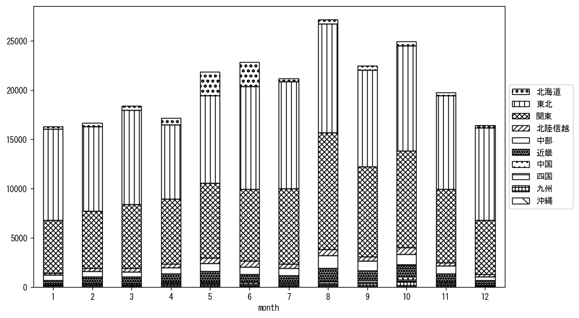
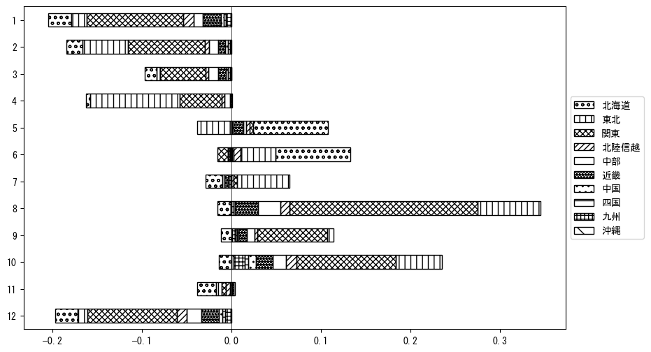

`<!DOCTYPE html>`{=html}
<html lang="ja">
<head>
    <meta charset="UTF-8">
    <meta name="description" content="">
    <link rel="stylesheet" href="../css/style.css">
    <title>宿泊者数の重心 | 秋田県</title>
</head>    
<body>
<body>
<nav id ="global_navi">
    <ul>
        <li>[トップ](../index.html)</li>
        <li>[使い方](../how_to_use.html)</li>
        <li>[データについて](../on_data.html)</li>
        <li>[算出方法について](../method.html)</li>
        <li>[発展的な使い方](../developer.html)</li>
        <li>[サイトポリシー](../policy.html)</li>
    </ul>
</nav>
<ol class="breadcrumb">
    <li>[トップ](../index.html)</li>
    <li>秋田県</li>
</ol>
<h1 id="h1_0">秋田県</h1>

<ul>
  <li> **[１．延べ宿泊者（総数、月次）の推移](#h1_1)** 
    <ul>
      <li> [時系列グラフ](#h2_1) </li>
      <li> [基本統計量](#h2_2) </li>
    </ul>
  </li>  
</ul>

<ul>
  <li> **[２．宿泊者数の重心（年平均の推移）](#h1_2)** 
  <ul>
  <li> [重心の前年平均からの移動距離と方位、および緯度・経度](#h2_4) </li>
  <li> [運輸局別延べ宿泊者数](#h2_5) 
  <ul>
  <li> [時系列（年平均）](#h3_1) </li>
  <li> [寄与度（前年からの変化率に対する）](#h3_2) </li>
  </ul>
  </li>
  </ul>
  </li>
</ul>

<ul>
  <li> **[３．宿泊者数の重心（月別）](#h1_3)** 
  <ul>
  <li> [全期間（2008年1月～2024年12月）の平均と月別平均の比較](#h2_6) </li>
  <li> [運輸局別延べ宿泊者数](#h2_7) 
  <ul>
  <li> [月別平均（2008年1月～2024年12月）](#h3_3) </li>
  <li> [寄与度（全期間の平均から月別平均への変化率に対する）](#h3_4) </li>
  </ul>
  </li>
  </ul>
  </li>
</ul>

<ul>
<li> **[４．データのダウンロード](#h1_4)** </li>
</ul>

<h1 id="h1_1">１．延べ宿泊者（総数）の推移</h1>
<h2 id="h2_1">時系列グラフ</h2>

<figcaption>図１：秋田県内の従業員数100人以上の宿泊施設での延べ宿泊者数（国外、居住地不詳を含む総数）。</figcaption>

<h2 id="h2_2">基本統計量</h2>
|  | 平均 | 標準偏差 | 最小値 | 最大値 |
|:----:|:----:|:----:|:----:|:----:|
| 2008年 | 49,050 | 12,509 | 29,859 (12月) | 66,782 (6月) |
| 2009年 | 42,097 | 11,564 | 25,493 (1月) | 61,329 (10月) |
| 2010年 | 30,148 | 5,178 | 20,126 (12月) | 39,779 (8月) |
| 2011年 | 23,787 | 6,760 | 11,640 (3月) | 35,124 (8月) |
| 2012年 | 23,277 | 4,024 | 18,915 (2月) | 31,514 (8月) |
| 2013年 | 16,772 | 2,448 | 14,044 (1月) | 21,737 (8月) |
| 2014年 | 16,655 | 2,763 | 13,187 (2月) | 22,405 (8月) |
| 2015年 | 19,920 | 3,168 | 15,443 (1月) | 26,181 (8月) |
| 2016年 | 22,440 | 2,978 | 18,864 (1月) | 29,209 (8月) |
| 2017年 | 21,797 | 3,506 | 16,395 (2月) | 27,632 (8月) |
| 2018年 | 22,786 | 3,322 | 18,184 (1月) | 30,225 (8月) |
| 2019年 | 22,809 | 3,474 | 17,502 (1月) | 28,294 (8月) |
| 2020年 | 13,367 | 7,071 | 1,393 (5月) | 23,598 (10月) |
| 2021年 | 15,360 | 4,504 | 9,977 (1月) | 21,524 (11月) |
| 2022年 | 15,596 | 3,602 | 9,365 (2月) | 20,308 (9月) |
| 2023年 | 13,625 | 5,428 | 5,727 (3月) | 23,403 (8月) |
| 2024年 | 9,706 | 1,934 | 7,276 (1月) | 13,125 (8月) |
: 表１：従業員数100人以上の宿泊施設での延べ宿泊者の総数（国外、および居住地不詳を含む）に関する基本統計量。単位は人泊。平均は１か月あたりの平均値を表す。図１に対応。

<h1 id="h1_2">２．宿泊者数の重心（年平均の推移）</h1>

<iframe src="../html/annual/秋田県.html" width="1200" height="600"></iframe>
<figcaption>図２：秋田県内の従業員数100人以上の宿泊施設での延べ宿泊者数（国外、居住地不詳を除く）の重心（年平均の推移）。</figcaption>

[全画面表示](../html/annual/秋田県.html)

<h2 id="h2_4">重心の前年平均からの移動距離と方位、および緯度・経度</h2>
|  | 方位 | 距離 | 緯度 | 経度 |
|:----:|:----:|:----:|:----:|:----:|
| 2008年 | --- | --- | 37.6165 | 139.5215 |
| 2009年 | 南南西 | 7.4km | 37.5604 | 139.4754 |
| 2010年 | 北 | 26.2km | 37.7950 | 139.4408 |
| 2011年 | 東北東 | 35.1km | 37.9124 | 139.8110 |
| 2012年 | 北東 | 1.6km | 37.9210 | 139.8257 |
| 2013年 | 南 | 19.4km | 37.7467 | 139.8103 |
| 2014年 | 南西 | 5.8km | 37.7055 | 139.7702 |
| 2015年 | 南西 | 14.4km | 37.5979 | 139.6781 |
| 2016年 | 北北西 | 13.5km | 37.7098 | 139.6182 |
| 2017年 | 南 | 5.1km | 37.6639 | 139.6134 |
| 2018年 | 南 | 12.1km | 37.5553 | 139.6245 |
| 2019年 | 南南東 | 5.6km | 37.5070 | 139.6415 |
| 2020年 | 北北東 | 22.9km | 37.7090 | 139.6962 |
| 2021年 | 北 | 34.3km | 38.0162 | 139.7335 |
| 2022年 | 南西 | 36.8km | 37.7439 | 139.4958 |
| 2023年 | 南西 | 40.6km | 37.4570 | 139.2108 |
| 2024年 | 北東 | 24.2km | 37.5964 | 139.4214 |
: 表２：重心の前年平均からの移動距離と方位、および緯度・経度。図２に対応。

<h2 id="h2_5">運輸局別延べ宿泊者数</h2>
<h3 id="h3_1">時系列（年平均）</h3>

<figcaption>図３：秋田県内の従業員数100人以上の宿泊施設での１か月あたり平均延べ宿泊者数（国外、居住地不詳を除く）の運輸局別内訳。</figcaption>

<h3 id="h3_2">寄与度（前年からの変化率に対する）</h3>

<figcaption>図４：秋田県内の従業員数100人以上の宿泊施設での運輸局別延べ宿泊者数（国外、居住地不詳を除く）から求めた寄与度。</figcaption>

<h1 id="h1_3">３．宿泊者数の重心（月別）</h3>

<iframe src="../html/monthly/秋田県.html" width="1200" height="600"></iframe>
<figcaption>図５：秋田県内の従業員数100人以上の宿泊施設での延べ宿泊者数（国外、居住地不詳を除く）の重心（月別）。観測期間は2008年1月から2024年12月まで。</figcaption>

[全画面表示](../html/monthly/秋田県.html)

<h2 id="h2_6">全期間（2008年1月～2024年12月）の平均と月別平均の比較</h2>
|  | 方位 | 距離 | 緯度 | 経度 |
|:----:|:----:|:----:|:----:|:----:|
| 全期間 | --- | --- | 37.6949 | 139.6111 |
| 1月 | 北北東 | 34.9km | 37.9827 | 139.7694 |
| 2月 | 北北東 | 7.0km | 37.7553 | 139.6327 |
| 3月 | 北北東 | 14.5km | 37.8088 | 139.6906 |
| 4月 | 南南西 | 19.8km | 37.5436 | 139.4915 |
| 5月 | 北 | 36.2km | 38.0187 | 139.6625 |
| 6月 | 北北東 | 48.2km | 38.1081 | 139.7810 |
| 7月 | 東北東 | 5.6km | 37.7084 | 139.6724 |
| 8月 | 南南西 | 48.3km | 37.2680 | 139.5044 |
| 9月 | 南南西 | 38.6km | 37.3597 | 139.4967 |
| 10月 | 南南西 | 52.1km | 37.2898 | 139.3142 |
| 11月 | 南南西 | 18.7km | 37.5308 | 139.5650 |
| 12月 | 北北東 | 32.5km | 37.9653 | 139.7526 |
: 表３：全期間の平均から月別平均までの移動距離と方位、および緯度・経度。図５に対応。

<h2 id="h2_7">運輸局別延べ宿泊者数</h2>
<h3 id="h3_3">月別平均（2008年1月～2024年12月）</h3>

<figcaption>図６：秋田県内の従業員数100人以上の宿泊施設での延べ宿泊者数（国外、居住地不詳を除く）の運輸局別内訳（月別）。</figcaption>

<h3 id="h3_4">寄与度（全期間の平均から月別平均への変化率に対する）</h3>

<figcaption>図７：秋田県内の従業員数100人以上の宿泊施設での運輸局別延べ宿泊者数（国外、居住地不詳を除く）から求めた寄与度（月別）。</figcaption>

</body>

<h1 id="h1_4">４．データのダウンロード</h1>
 <ul>
  <li> <a href="../csv/data_by_pref/延べ宿泊者数および重心（秋田県）.csv" download>延べ宿泊者数および重心の緯度経度</a> </li>
  <li> <a href="../csv/bar_chart/運輸局別_年平均（秋田県）.csv" download>運輸局別延べ宿泊者数（年平均）</a></li>
  <li> <a href="../csv/bar_chart_month/運輸局別_月別（秋田県）.csv" download>運輸局別延べ宿泊者数（月別）</a></li>
  <li> <a href="../csv/contrib/前年からの変化率に対する寄与度（秋田県）.csv" download>前年からの変化率に対する寄与度</a></li>
  <li> <a href="../csv/contrib_month/月別平均への変化率に対する寄与度（秋田県）.csv" download>月別平均への変化率に対する寄与度</a></li>
</ul>

出典：観光庁「宿泊旅行統計調査」に収録された「施設所在地、居住地別延べ宿泊者数（従業員数100人以上の施設）」

国土地理院「白地図（[地理院タイル](https://maps.gsi.go.jp/development/ichiran.html)）」（図２と図５）

