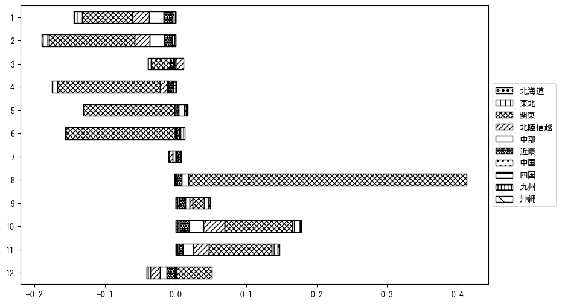

`<!DOCTYPE html>`{=html}
<html lang="ja">
<head>
    <meta charset="UTF-8">
    <meta name="description" content="">
    <link rel="stylesheet" href="../css/style.css">
    <title>宿泊者数の重心 | 群馬県</title>
</head>    
<body>
<body>
<nav id ="global_navi">
    <ul>
        <li>[トップ](../index.html)</li>
        <li>[使い方](../how_to_use.html)</li>
        <li>[データについて](../on_data.html)</li>
        <li>[算出方法について](../method.html)</li>
        <li>[発展的な使い方](../developer.html)</li>
        <li>[サイトポリシー](../policy.html)</li>
    </ul>
</nav>
<ol class="breadcrumb">
    <li>[トップ](../index.html)</li>
    <li>群馬県</li>
</ol>
<h1 id="h1_0">群馬県</h1>

<ul>
  <li> **[１．延べ宿泊者（総数、月次）の推移](#h1_1)** 
    <ul>
      <li> [時系列グラフ](#h2_1) </li>
      <li> [基本統計量](#h2_2) </li>
    </ul>
  </li>  
</ul>

<ul>
  <li> **[２．宿泊者数の重心（年平均の推移）](#h1_2)** 
  <ul>
  <li> [重心の前年平均からの移動距離と方位、および緯度・経度](#h2_4) </li>
  <li> [運輸局別延べ宿泊者数](#h2_5) 
  <ul>
  <li> [時系列（年平均）](#h3_1) </li>
  <li> [寄与度（前年からの変化率に対する）](#h3_2) </li>
  </ul>
  </li>
  </ul>
  </li>
</ul>

<ul>
  <li> **[３．宿泊者数の重心（月別）](#h1_3)** 
  <ul>
  <li> [全期間（2008年1月～2024年12月）の平均と月別平均の比較](#h2_6) </li>
  <li> [運輸局別延べ宿泊者数](#h2_7) 
  <ul>
  <li> [月別平均（2008年1月～2024年12月）](#h3_3) </li>
  <li> [寄与度（全期間の平均から月別平均への変化率に対する）](#h3_4) </li>
  </ul>
  </li>
  </ul>
  </li>
</ul>

<ul>
<li> **[４．データのダウンロード](#h1_4)** </li>
</ul>

<h1 id="h1_1">１．延べ宿泊者（総数）の推移</h1>
<h2 id="h2_1">時系列グラフ</h2>

<figcaption>図１：群馬県内の従業員数100人以上の宿泊施設での延べ宿泊者数（国外、居住地不詳を含む総数）。</figcaption>

<h2 id="h2_2">基本統計量</h2>
|  | 平均 | 標準偏差 | 最小値 | 最大値 |
|:----:|:----:|:----:|:----:|:----:|
| 2008年 | 121,020 | 20,345 | 97,312 (9月) | 153,530 (11月) |
| 2009年 | 116,558 | 23,222 | 87,829 (2月) | 177,170 (8月) |
| 2010年 | 111,067 | 15,982 | 94,501 (1月) | 150,190 (8月) |
| 2011年 | 103,509 | 33,357 | 47,192 (4月) | 175,991 (8月) |
| 2012年 | 112,083 | 30,454 | 83,370 (2月) | 194,393 (8月) |
| 2013年 | 97,765 | 14,291 | 81,797 (12月) | 134,988 (8月) |
| 2014年 | 77,387 | 12,073 | 58,269 (7月) | 94,251 (3月) |
| 2015年 | 86,820 | 12,490 | 67,579 (7月) | 114,812 (8月) |
| 2016年 | 77,615 | 8,665 | 63,786 (6月) | 94,024 (8月) |
| 2017年 | 76,089 | 11,328 | 55,836 (2月) | 93,090 (8月) |
| 2018年 | 84,518 | 22,756 | 52,365 (2月) | 115,143 (10月) |
| 2019年 | 72,307 | 12,206 | 51,889 (7月) | 94,796 (8月) |
| 2020年 | 50,347 | 26,793 | 1,476 (5月) | 84,946 (10月) |
| 2021年 | 37,151 | 19,788 | 11,288 (2月) | 67,054 (11月) |
| 2022年 | 53,437 | 14,341 | 29,748 (2月) | 80,410 (8月) |
| 2023年 | 62,174 | 9,611 | 50,227 (2月) | 74,772 (11月) |
| 2024年 | 60,511 | 15,418 | 39,060 (2月) | 95,233 (8月) |
: 表１：従業員数100人以上の宿泊施設での延べ宿泊者の総数（国外、および居住地不詳を含む）に関する基本統計量。単位は人泊。平均は１か月あたりの平均値を表す。図１に対応。

<h1 id="h1_2">２．宿泊者数の重心（年平均の推移）</h1>

<iframe src="../html/annual/群馬県.html" width="1200" height="600"></iframe>
<figcaption>図２：群馬県内の従業員数100人以上の宿泊施設での延べ宿泊者数（国外、居住地不詳を除く）の重心（年平均の推移）。</figcaption>

[全画面表示](../html/annual/群馬県.html)

<h2 id="h2_4">重心の前年平均からの移動距離と方位、および緯度・経度</h2>
|  | 方位 | 距離 | 緯度 | 経度 |
|:----:|:----:|:----:|:----:|:----:|
| 2008年 | --- | --- | 35.8865 | 139.1396 |
| 2009年 | 北西 | 3.2km | 35.9099 | 139.1182 |
| 2010年 | 東北東 | 7.4km | 35.9272 | 139.1975 |
| 2011年 | 東北東 | 14.0km | 35.9828 | 139.3363 |
| 2012年 | 北西 | 7.7km | 36.0279 | 139.2720 |
| 2013年 | 南西 | 12.0km | 35.9477 | 139.1836 |
| 2014年 | 北東 | 3.0km | 35.9672 | 139.2073 |
| 2015年 | 西北西 | 3.1km | 35.9742 | 139.1741 |
| 2016年 | 西 | 2.9km | 35.9725 | 139.1416 |
| 2017年 | 東南東 | 7.5km | 35.9585 | 139.2229 |
| 2018年 | 東 | 3.9km | 35.9638 | 139.2660 |
| 2019年 | 西 | 3.6km | 35.9655 | 139.2266 |
| 2020年 | 東 | 10.2km | 35.9559 | 139.3393 |
| 2021年 | 南 | 5.7km | 35.9044 | 139.3431 |
| 2022年 | 北西 | 6.4km | 35.9373 | 139.2844 |
| 2023年 | 西 | 9.2km | 35.9231 | 139.1839 |
| 2024年 | 東北東 | 2.5km | 35.9305 | 139.2101 |
: 表２：重心の前年平均からの移動距離と方位、および緯度・経度。図２に対応。

<h2 id="h2_5">運輸局別延べ宿泊者数</h2>
<h3 id="h3_1">時系列（年平均）</h3>

<figcaption>図３：群馬県内の従業員数100人以上の宿泊施設での１か月あたり平均延べ宿泊者数（国外、居住地不詳を除く）の運輸局別内訳。</figcaption>

<h3 id="h3_2">寄与度（前年からの変化率に対する）</h3>

<figcaption>図４：群馬県内の従業員数100人以上の宿泊施設での運輸局別延べ宿泊者数（国外、居住地不詳を除く）から求めた寄与度。</figcaption>

<h1 id="h1_3">３．宿泊者数の重心（月別）</h3>

<iframe src="../html/monthly/群馬県.html" width="1200" height="600"></iframe>
<figcaption>図５：群馬県内の従業員数100人以上の宿泊施設での延べ宿泊者数（国外、居住地不詳を除く）の重心（月別）。観測期間は2008年1月から2024年12月まで。</figcaption>

[全画面表示](../html/monthly/群馬県.html)

<h2 id="h2_6">全期間（2008年1月～2024年12月）の平均と月別平均の比較</h2>
|  | 方位 | 距離 | 緯度 | 経度 |
|:----:|:----:|:----:|:----:|:----:|
| 全期間 | --- | --- | 35.9491 | 139.2263 |
| 1月 | 東南東 | 7.9km | 35.9151 | 139.3030 |
| 2月 | 南東 | 9.3km | 35.9015 | 139.3117 |
| 3月 | 北東 | 2.1km | 35.9604 | 139.2450 |
| 4月 | 北 | 2.4km | 35.9708 | 139.2275 |
| 5月 | 西北西 | 7.2km | 35.9677 | 139.1500 |
| 6月 | 北西 | 9.1km | 36.0072 | 139.1555 |
| 7月 | 南南西 | 0.5km | 35.9449 | 139.2251 |
| 8月 | 南東 | 14.5km | 35.8722 | 139.3564 |
| 9月 | 西南西 | 4.5km | 35.9295 | 139.1832 |
| 10月 | 西北西 | 7.8km | 35.9652 | 139.1418 |
| 11月 | 北西 | 5.5km | 35.9851 | 139.1845 |
| 12月 | 北北東 | 2.3km | 35.9698 | 139.2314 |
: 表３：全期間の平均から月別平均までの移動距離と方位、および緯度・経度。図５に対応。

<h2 id="h2_7">運輸局別延べ宿泊者数</h2>
<h3 id="h3_3">月別平均（2008年1月～2024年12月）</h3>

<figcaption>図６：群馬県内の従業員数100人以上の宿泊施設での延べ宿泊者数（国外、居住地不詳を除く）の運輸局別内訳（月別）。</figcaption>

<h3 id="h3_4">寄与度（全期間の平均から月別平均への変化率に対する）</h3>

<figcaption>図７：群馬県内の従業員数100人以上の宿泊施設での運輸局別延べ宿泊者数（国外、居住地不詳を除く）から求めた寄与度（月別）。</figcaption>

</body>

<h1 id="h1_4">４．データのダウンロード</h1>
 <ul>
  <li> <a href="../csv/data_by_pref/延べ宿泊者数および重心（群馬県）.csv" download>延べ宿泊者数および重心の緯度経度</a> </li>
  <li> <a href="../csv/bar_chart/運輸局別_年平均（群馬県）.csv" download>運輸局別延べ宿泊者数（年平均）</a></li>
  <li> <a href="../csv/bar_chart_month/運輸局別_月別（群馬県）.csv" download>運輸局別延べ宿泊者数（月別）</a></li>
  <li> <a href="../csv/contrib/前年からの変化率に対する寄与度（群馬県）.csv" download>前年からの変化率に対する寄与度</a></li>
  <li> <a href="../csv/contrib_month/月別平均への変化率に対する寄与度（群馬県）.csv" download>月別平均への変化率に対する寄与度</a></li>
</ul>

出典：観光庁「宿泊旅行統計調査」に収録された「施設所在地、居住地別延べ宿泊者数（従業員数100人以上の施設）」

国土地理院「白地図（[地理院タイル](https://maps.gsi.go.jp/development/ichiran.html)）」（図２と図５）

