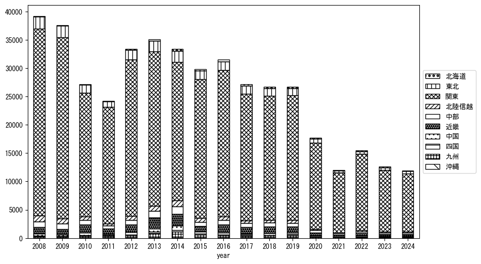
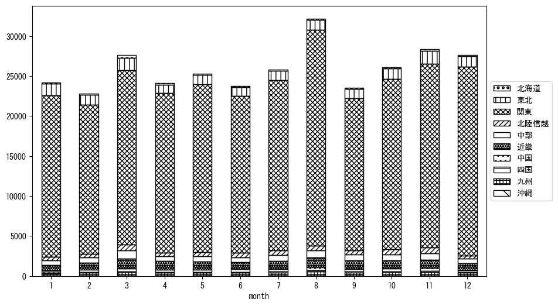

`<!DOCTYPE html>`{=html}
<html lang="ja">
<head>
    <meta charset="UTF-8">
    <meta name="description" content="">
    <link rel="stylesheet" href="../css/style.css">
    <title>宿泊者数の重心 | 茨城県</title>
</head>    
<body>
<body>
<nav id ="global_navi">
    <ul>
        <li>[トップ](../index.html)</li>
        <li>[使い方](../how_to_use.html)</li>
        <li>[データについて](../on_data.html)</li>
        <li>[算出方法について](../method.html)</li>
        <li>[発展的な使い方](../developer.html)</li>
        <li>[サイトポリシー](../policy.html)</li>
    </ul>
</nav>
<ol class="breadcrumb">
    <li>[トップ](../index.html)</li>
    <li>茨城県</li>
</ol>
<h1 id="h1_0">茨城県</h1>

<ul>
  <li> **[１．延べ宿泊者（総数、月次）の推移](#h1_1)** 
    <ul>
      <li> [時系列グラフ](#h2_1) </li>
      <li> [基本統計量](#h2_2) </li>
    </ul>
  </li>  
</ul>

<ul>
  <li> **[２．宿泊者数の重心（年平均の推移）](#h1_2)** 
  <ul>
  <li> [重心の前年平均からの移動距離と方位、および緯度・経度](#h2_4) </li>
  <li> [運輸局別延べ宿泊者数](#h2_5) 
  <ul>
  <li> [時系列（年平均）](#h3_1) </li>
  <li> [寄与度（前年からの変化率に対する）](#h3_2) </li>
  </ul>
  </li>
  </ul>
  </li>
</ul>

<ul>
  <li> **[３．宿泊者数の重心（月別）](#h1_3)** 
  <ul>
  <li> [全期間（2008年1月～2024年12月）の平均と月別平均の比較](#h2_6) </li>
  <li> [運輸局別延べ宿泊者数](#h2_7) 
  <ul>
  <li> [月別平均（2008年1月～2024年12月）](#h3_3) </li>
  <li> [寄与度（全期間の平均から月別平均への変化率に対する）](#h3_4) </li>
  </ul>
  </li>
  </ul>
  </li>
</ul>

<ul>
<li> **[４．データのダウンロード](#h1_4)** </li>
</ul>

<h1 id="h1_1">１．延べ宿泊者（総数）の推移</h1>
<h2 id="h2_1">時系列グラフ</h2>

<figcaption>図１：茨城県内の従業員数100人以上の宿泊施設での延べ宿泊者数（国外、居住地不詳を含む総数）。</figcaption>

<h2 id="h2_2">基本統計量</h2>
|  | 平均 | 標準偏差 | 最小値 | 最大値 |
|:----:|:----:|:----:|:----:|:----:|
| 2008年 | 42,982 | 3,958 | 37,765 (9月) | 51,499 (8月) |
| 2009年 | 44,164 | 6,037 | 36,954 (2月) | 52,877 (11月) |
| 2010年 | 41,091 | 6,461 | 35,311 (6月) | 57,301 (8月) |
| 2011年 | 27,093 | 5,863 | 18,675 (4月) | 37,481 (8月) |
| 2012年 | 36,009 | 5,346 | 28,309 (4月) | 44,412 (8月) |
| 2013年 | 36,525 | 2,557 | 33,400 (9月) | 42,028 (8月) |
| 2014年 | 39,941 | 4,270 | 32,026 (2月) | 48,338 (8月) |
| 2015年 | 33,194 | 2,963 | 28,958 (1月) | 39,337 (8月) |
| 2016年 | 36,396 | 4,228 | 31,722 (7月) | 44,398 (8月) |
| 2017年 | 34,519 | 5,430 | 25,901 (7月) | 43,346 (3月) |
| 2018年 | 32,805 | 3,664 | 27,357 (2月) | 37,745 (8月) |
| 2019年 | 33,688 | 4,390 | 24,543 (2月) | 39,919 (3月) |
| 2020年 | 21,493 | 8,398 | 7,392 (4月) | 32,701 (1月) |
| 2021年 | 16,788 | 5,485 | 8,263 (2月) | 26,780 (12月) |
| 2022年 | 22,752 | 4,149 | 13,705 (2月) | 28,302 (12月) |
| 2023年 | 17,732 | 1,855 | 14,095 (4月) | 20,497 (8月) |
| 2024年 | 13,757 | 1,243 | 11,738 (2月) | 15,709 (8月) |
: 表１：従業員数100人以上の宿泊施設での延べ宿泊者の総数（国外、および居住地不詳を含む）に関する基本統計量。単位は人泊。平均は１か月あたりの平均値を表す。図１に対応。

<h1 id="h1_2">２．宿泊者数の重心（年平均の推移）</h1>

<iframe src="../html/annual/茨城県.html" width="1200" height="600"></iframe>
<figcaption>図２：茨城県内の従業員数100人以上の宿泊施設での延べ宿泊者数（国外、居住地不詳を除く）の重心（年平均の推移）。</figcaption>

[全画面表示](../html/annual/茨城県.html)

<h2 id="h2_4">重心の前年平均からの移動距離と方位、および緯度・経度</h2>
|  | 方位 | 距離 | 緯度 | 経度 |
|:----:|:----:|:----:|:----:|:----:|
| 2008年 | --- | --- | 36.0160 | 139.5805 |
| 2009年 | 東 | 2.4km | 36.0157 | 139.6074 |
| 2010年 | 西南西 | 30.5km | 35.9310 | 139.2855 |
| 2011年 | 東北東 | 19.3km | 35.9820 | 139.4906 |
| 2012年 | 北西 | 2.3km | 35.9968 | 139.4722 |
| 2013年 | 西南西 | 25.1km | 35.9292 | 139.2065 |
| 2014年 | 西 | 19.3km | 35.9230 | 138.9926 |
| 2015年 | 東北東 | 47.1km | 36.0481 | 139.4916 |
| 2016年 | 北 | 0.2km | 36.0498 | 139.4919 |
| 2017年 | 東 | 3.4km | 36.0537 | 139.5297 |
| 2018年 | 西南西 | 3.0km | 36.0409 | 139.4999 |
| 2019年 | 西南西 | 2.2km | 36.0346 | 139.4773 |
| 2020年 | 東 | 16.8km | 36.0514 | 139.6623 |
| 2021年 | 東北東 | 7.5km | 36.0740 | 139.7406 |
| 2022年 | 西南西 | 7.7km | 36.0500 | 139.6609 |
| 2023年 | 北北東 | 4.4km | 36.0853 | 139.6820 |
| 2024年 | 西南西 | 1.8km | 36.0792 | 139.6641 |
: 表２：重心の前年平均からの移動距離と方位、および緯度・経度。図２に対応。

<h2 id="h2_5">運輸局別延べ宿泊者数</h2>
<h3 id="h3_1">時系列（年平均）</h3>

<figcaption>図３：茨城県内の従業員数100人以上の宿泊施設での１か月あたり平均延べ宿泊者数（国外、居住地不詳を除く）の運輸局別内訳。</figcaption>

<h3 id="h3_2">寄与度（前年からの変化率に対する）</h3>

<figcaption>図４：茨城県内の従業員数100人以上の宿泊施設での運輸局別延べ宿泊者数（国外、居住地不詳を除く）から求めた寄与度。</figcaption>

<h1 id="h1_3">３．宿泊者数の重心（月別）</h3>

<iframe src="../html/monthly/茨城県.html" width="1200" height="600"></iframe>
<figcaption>図５：茨城県内の従業員数100人以上の宿泊施設での延べ宿泊者数（国外、居住地不詳を除く）の重心（月別）。観測期間は2008年1月から2024年12月まで。</figcaption>

[全画面表示](../html/monthly/茨城県.html)

<h2 id="h2_6">全期間（2008年1月～2024年12月）の平均と月別平均の比較</h2>
|  | 方位 | 距離 | 緯度 | 経度 |
|:----:|:----:|:----:|:----:|:----:|
| 全期間 | --- | --- | 36.0212 | 139.5021 |
| 1月 | 東北東 | 13.0km | 36.0687 | 139.6337 |
| 2月 | 北西 | 1.8km | 36.0341 | 139.4903 |
| 3月 | 北西 | 7.2km | 36.0621 | 139.4405 |
| 4月 | 南西 | 5.0km | 35.9881 | 139.4638 |
| 5月 | 東南東 | 3.4km | 36.0050 | 139.5344 |
| 6月 | 北 | 1.0km | 36.0298 | 139.5040 |
| 7月 | 南南西 | 1.4km | 36.0089 | 139.4969 |
| 8月 | 南西 | 8.5km | 35.9592 | 139.4473 |
| 9月 | 西南西 | 8.1km | 35.9852 | 139.4239 |
| 10月 | 西 | 3.6km | 36.0166 | 139.4625 |
| 11月 | 北西 | 2.7km | 36.0386 | 139.4805 |
| 12月 | 東北東 | 13.7km | 36.0582 | 139.6473 |
: 表３：全期間の平均から月別平均までの移動距離と方位、および緯度・経度。図５に対応。

<h2 id="h2_7">運輸局別延べ宿泊者数</h2>
<h3 id="h3_3">月別平均（2008年1月～2024年12月）</h3>

<figcaption>図６：茨城県内の従業員数100人以上の宿泊施設での延べ宿泊者数（国外、居住地不詳を除く）の運輸局別内訳（月別）。</figcaption>

<h3 id="h3_4">寄与度（全期間の平均から月別平均への変化率に対する）</h3>

<figcaption>図７：茨城県内の従業員数100人以上の宿泊施設での運輸局別延べ宿泊者数（国外、居住地不詳を除く）から求めた寄与度（月別）。</figcaption>

</body>

<h1 id="h1_4">４．データのダウンロード</h1>
 <ul>
  <li> <a href="../csv/data_by_pref/延べ宿泊者数および重心（茨城県）.csv" download>延べ宿泊者数および重心の緯度経度</a> </li>
  <li> <a href="../csv/bar_chart/運輸局別_年平均（茨城県）.csv" download>運輸局別延べ宿泊者数（年平均）</a></li>
  <li> <a href="../csv/bar_chart_month/運輸局別_月別（茨城県）.csv" download>運輸局別延べ宿泊者数（月別）</a></li>
  <li> <a href="../csv/contrib/前年からの変化率に対する寄与度（茨城県）.csv" download>前年からの変化率に対する寄与度</a></li>
  <li> <a href="../csv/contrib_month/月別平均への変化率に対する寄与度（茨城県）.csv" download>月別平均への変化率に対する寄与度</a></li>
</ul>

出典：観光庁「宿泊旅行統計調査」に収録された「施設所在地、居住地別延べ宿泊者数（従業員数100人以上の施設）」

国土地理院「白地図（[地理院タイル](https://maps.gsi.go.jp/development/ichiran.html)）」（図２と図５）

