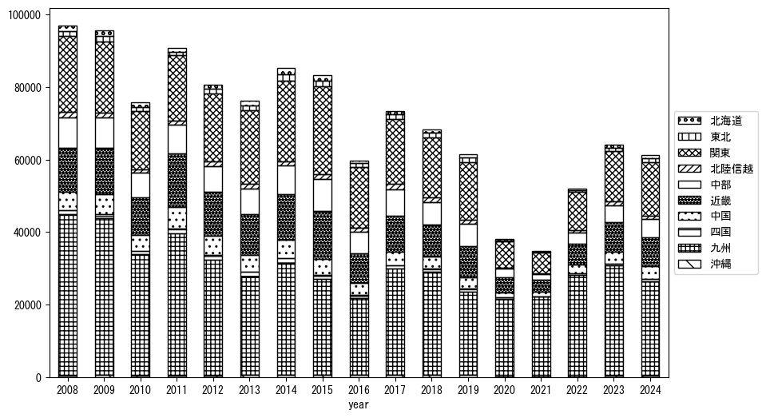
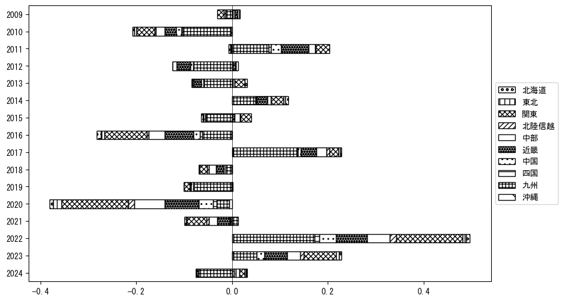
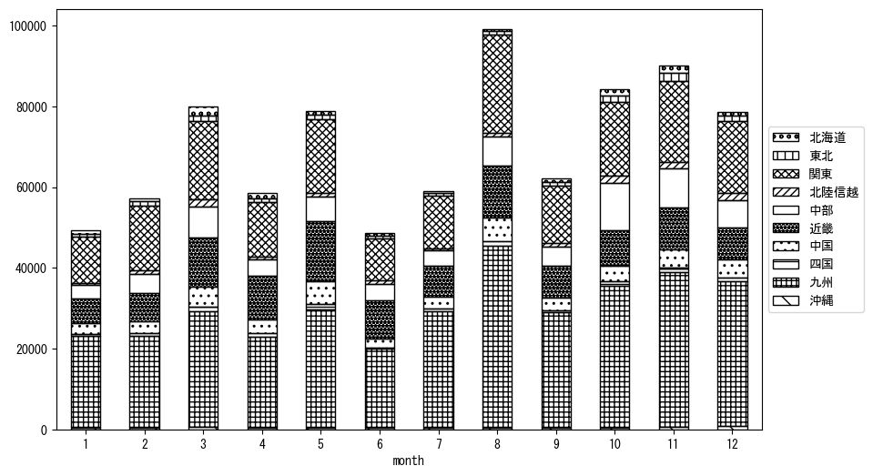
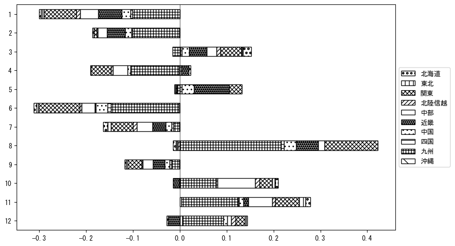

`<!DOCTYPE html>`{=html}
<html lang="ja">
<head>
    <meta charset="UTF-8">
    <meta name="description" content="">
    <link rel="stylesheet" href="../css/style.css">
    <title>宿泊者数の重心 | 長崎県</title>
</head>    
<body>
<body>
<nav id ="global_navi">
    <ul>
        <li>[トップ](../index.html)</li>
        <li>[使い方](../how_to_use.html)</li>
        <li>[データについて](../on_data.html)</li>
        <li>[算出方法について](../method.html)</li>
        <li>[発展的な使い方](../developer.html)</li>
        <li>[サイトポリシー](../policy.html)</li>
    </ul>
</nav>
<ol class="breadcrumb">
    <li>[トップ](../index.html)</li>
    <li>長崎県</li>
</ol>
<h1 id="h1_0">長崎県</h1>

<ul>
  <li> **[１．延べ宿泊者（総数、月次）の推移](#h1_1)** 
    <ul>
      <li> [時系列グラフ](#h2_1) </li>
      <li> [基本統計量](#h2_2) </li>
    </ul>
  </li>  
</ul>

<ul>
  <li> **[２．宿泊者数の重心（年平均の推移）](#h1_2)** 
  <ul>
  <li> [重心の前年平均からの移動距離と方位、および緯度・経度](#h2_4) </li>
  <li> [運輸局別延べ宿泊者数](#h2_5) 
  <ul>
  <li> [時系列（年平均）](#h3_1) </li>
  <li> [寄与度（前年からの変化率に対する）](#h3_2) </li>
  </ul>
  </li>
  </ul>
  </li>
</ul>

<ul>
  <li> **[３．宿泊者数の重心（月別）](#h1_3)** 
  <ul>
  <li> [全期間（2008年1月～2023年12月）の平均と月別平均の比較](#h2_6) </li>
  <li> [運輸局別延べ宿泊者数](#h2_7) 
  <ul>
  <li> [月別平均（2008年1月～2023年12月）](#h3_3) </li>
  <li> [寄与度（全期間の平均から月別平均への変化率に対する）](#h3_4) </li>
  </ul>
  </li>
  </ul>
  </li>
</ul>

<ul>
<li> **[４．データのダウンロード](#h1_4)** </li>
</ul>

<h1 id="h1_1">１．延べ宿泊者（総数）の推移</h1>
<h2 id="h2_1">時系列グラフ</h2>

<figcaption>図１：長崎県内の従業員数100人以上の宿泊施設での延べ宿泊者数（国外、居住地不詳を含む総数）。</figcaption>

<h2 id="h2_2">基本統計量</h2>
|  | 平均 | 標準偏差 | 最小値 | 最大値 |
|:----:|:----:|:----:|:----:|:----:|
| 2008年 | 118,200 | 22,140 | 87,482 (6月) | 159,995 (8月) |
| 2009年 | 104,800 | 23,452 | 74,378 (1月) | 154,313 (8月) |
| 2010年 | 87,938 | 19,291 | 57,091 (1月) | 118,248 (8月) |
| 2011年 | 99,322 | 20,381 | 73,058 (4月) | 133,271 (8月) |
| 2012年 | 88,170 | 19,731 | 62,162 (1月) | 118,206 (8月) |
| 2013年 | 88,471 | 19,824 | 62,339 (1月) | 133,453 (8月) |
| 2014年 | 95,713 | 21,166 | 64,687 (6月) | 128,444 (8月) |
| 2015年 | 103,426 | 21,326 | 69,076 (6月) | 132,376 (8月) |
| 2016年 | 70,232 | 19,032 | 32,918 (6月) | 94,400 (11月) |
| 2017年 | 82,927 | 24,042 | 57,683 (1月) | 132,360 (8月) |
| 2018年 | 75,641 | 22,967 | 46,643 (1月) | 129,162 (8月) |
| 2019年 | 70,865 | 14,998 | 47,658 (1月) | 93,143 (8月) |
| 2020年 | 40,440 | 30,963 | 476 (5月) | 104,766 (11月) |
| 2021年 | 36,916 | 23,676 | 9,763 (2月) | 81,747 (12月) |
| 2022年 | 68,827 | 28,025 | 16,098 (2月) | 110,742 (11月) |
| 2023年 | 91,329 | 17,992 | 60,389 (1月) | 112,340 (3月) |
: 表１：従業員数100人以上の宿泊施設での延べ宿泊者の総数（国外、および居住地不詳を含む）に関する基本統計量。単位は人泊。平均は１か月あたりの平均値を表す。図１に対応。

<h1 id="h1_2">２．宿泊者数の重心（年平均の推移）</h1>

<iframe src="../html/annual/長崎県.html" width="1200" height="600"></iframe>
<figcaption>図２：長崎県内の従業員数100人以上の宿泊施設での延べ宿泊者数（国外、居住地不詳を除く）の重心（年平均の推移）。</figcaption>

[全画面表示](../html/annual/長崎県.html)

<h2 id="h2_4">重心の前年平均からの移動距離と方位、および緯度・経度</h2>
|  | 方位 | 距離 | 緯度 | 経度 |
|:----:|:----:|:----:|:----:|:----:|
| 2008年 | --- | --- | 34.3881 | 134.0873 |
| 2009年 | 西 | 1.0km | 34.3869 | 134.0762 |
| 2010年 | 東 | 9.2km | 34.3965 | 134.1758 |
| 2011年 | 南西 | 11.5km | 34.3357 | 134.0742 |
| 2012年 | 東北東 | 36.8km | 34.4674 | 134.4411 |
| 2013年 | 東北東 | 37.2km | 34.5941 | 134.8158 |
| 2014年 | 北北東 | 4.3km | 34.6313 | 134.8285 |
| 2015年 | 東北東 | 36.7km | 34.7163 | 135.2158 |
| 2016年 | 西南西 | 32.0km | 34.5936 | 134.8999 |
| 2017年 | 西南西 | 32.2km | 34.4991 | 134.5684 |
| 2018年 | 西南西 | 9.2km | 34.4677 | 134.4751 |
| 2019年 | 東北東 | 24.0km | 34.5455 | 134.7189 |
| 2020年 | 西南西 | 153.5km | 34.0039 | 133.1854 |
| 2021年 | 西南西 | 37.0km | 33.9247 | 132.7966 |
| 2022年 | 東北東 | 66.9km | 34.1558 | 133.4653 |
| 2023年 | 東北東 | 52.3km | 34.3476 | 133.9844 |
: 表２：重心の前年平均からの移動距離と方位、および緯度・経度。図２に対応。

<h2 id="h2_5">運輸局別延べ宿泊者数</h2>
<h3 id="h3_1">時系列（年平均）</h3>

<figcaption>図３：長崎県内の従業員数100人以上の宿泊施設での１か月あたり平均延べ宿泊者数（国外、居住地不詳を除く）の運輸局別内訳。</figcaption>

<h3 id="h3_2">寄与度（前年からの変化率に対する）</h3>

<figcaption>図４：長崎県内の従業員数100人以上の宿泊施設での運輸局別延べ宿泊者数（国外、居住地不詳を除く）から求めた寄与度。</figcaption>

<h1 id="h1_3">３．宿泊者数の重心（月別）</h3>

<iframe src="../html/monthly/長崎県.html" width="1200" height="600"></iframe>
<figcaption>図５：長崎県内の従業員数100人以上の宿泊施設での延べ宿泊者数（国外、居住地不詳を除く）の重心（月別）。観測期間は2008年1月から2023年12月まで。</figcaption>

[全画面表示](../html/monthly/長崎県.html)

<h2 id="h2_6">全期間（2008年1月～2023年12月）の平均と月別平均の比較</h2>
|  | 方位 | 距離 | 緯度 | 経度 |
|:----:|:----:|:----:|:----:|:----:|
| 全期間 | --- | --- | 34.4034 | 134.2380 |
| 1月 | 西南西 | 24.7km | 34.3178 | 133.9905 |
| 2月 | 東北東 | 32.0km | 34.5032 | 134.5644 |
| 3月 | 東北東 | 50.9km | 34.6477 | 134.7072 |
| 4月 | 北東 | 21.9km | 34.5222 | 134.4284 |
| 5月 | 東 | 12.5km | 34.3946 | 134.3740 |
| 6月 | 西南西 | 10.8km | 34.3518 | 134.1389 |
| 7月 | 西南西 | 53.2km | 34.1677 | 133.7353 |
| 8月 | 南西 | 24.9km | 34.2733 | 134.0176 |
| 9月 | 西南西 | 21.3km | 34.3338 | 134.0223 |
| 10月 | 北東 | 13.3km | 34.4823 | 134.3467 |
| 11月 | 東北東 | 16.6km | 34.4842 | 134.3894 |
| 12月 | 西南西 | 10.0km | 34.3623 | 134.1417 |
: 表３：全期間の平均から月別平均までの移動距離と方位、および緯度・経度。図５に対応。

<h2 id="h2_7">運輸局別延べ宿泊者数</h2>
<h3 id="h3_3">月別平均（2008年1月～2023年12月）</h3>

<figcaption>図６：長崎県内の従業員数100人以上の宿泊施設での延べ宿泊者数（国外、居住地不詳を除く）の運輸局別内訳（月別）。</figcaption>

<h3 id="h3_4">寄与度（全期間の平均から月別平均への変化率に対する）</h3>

<figcaption>図７：長崎県内の従業員数100人以上の宿泊施設での運輸局別延べ宿泊者数（国外、居住地不詳を除く）から求めた寄与度（月別）。</figcaption>

</body>

<h1 id="h1_4">４．データのダウンロード</h1>
 <ul>
  <li> <a href="../csv/data_by_pref/延べ宿泊者数および重心（長崎県）.csv" download>延べ宿泊者数および重心の緯度経度</a> </li>
  <li> <a href="../csv/bar_chart/運輸局別_年平均（長崎県）.csv" download>運輸局別延べ宿泊者数（年平均）</a></li>
  <li> <a href="../csv/bar_chart_month/運輸局別_月別（長崎県）.csv" download>運輸局別延べ宿泊者数（月別）</a></li>
  <li> <a href="../csv/contrib/前年からの変化率に対する寄与度（長崎県）.csv" download>前年からの変化率に対する寄与度</a></li>
  <li> <a href="../csv/contrib_month/月別平均への変化率に対する寄与度（長崎県）.csv" download>月別平均への変化率に対する寄与度</a></li>
</ul>

出典：観光庁「宿泊旅行統計調査」に収録された「施設所在地、居住地別延べ宿泊者数（従業員数100人以上の施設）」

国土地理院「白地図（[地理院タイル](https://maps.gsi.go.jp/development/ichiran.html)）」（図２と図５）

