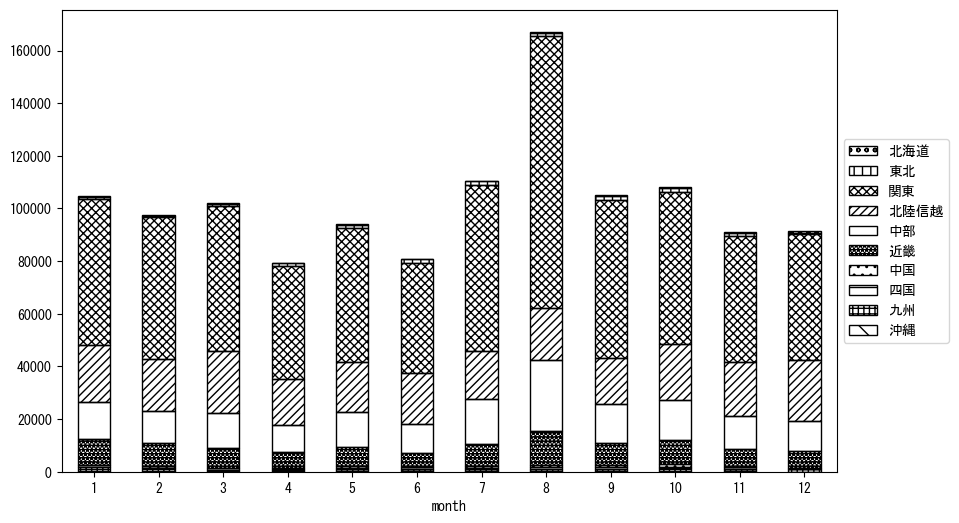
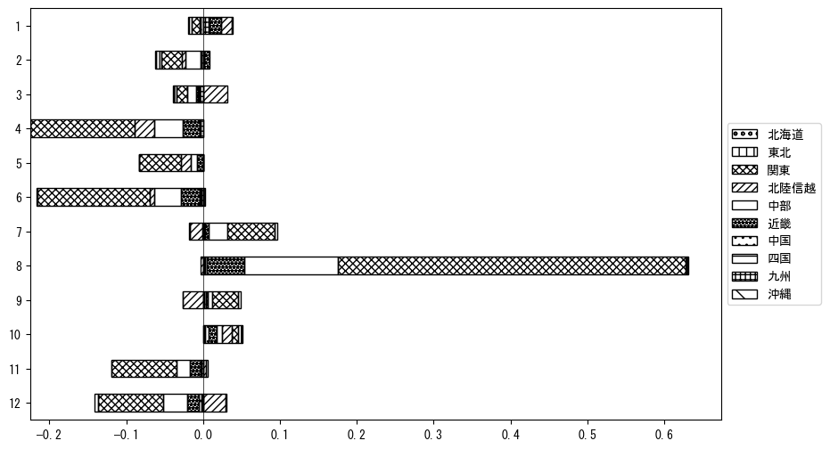

`<!DOCTYPE html>`{=html}
<html lang="ja">
<head>
    <meta charset="UTF-8">
    <meta name="description" content="">
    <link rel="stylesheet" href="../css/style.css">
    <title>宿泊者数の重心 | 長野県</title>
</head>    
<body>
<body>
<nav id ="global_navi">
    <ul>
        <li>[トップ](../index.html)</li>
        <li>[使い方](../how_to_use.html)</li>
        <li>[データについて](../on_data.html)</li>
        <li>[算出方法について](../method.html)</li>
        <li>[発展的な使い方](../developer.html)</li>
        <li>[サイトポリシー](../policy.html)</li>
    </ul>
</nav>
<ol class="breadcrumb">
    <li>[トップ](../index.html)</li>
    <li>長野県</li>
</ol>
<h1 id="h1_0">長野県</h1>

<ul>
  <li> **[１．延べ宿泊者（総数、月次）の推移](#h1_1)** 
    <ul>
      <li> [時系列グラフ](#h2_1) </li>
      <li> [基本統計量](#h2_2) </li>
    </ul>
  </li>  
</ul>

<ul>
  <li> **[２．宿泊者数の重心（年平均の推移）](#h1_2)** 
  <ul>
  <li> [重心の前年平均からの移動距離と方位、および緯度・経度](#h2_4) </li>
  <li> [運輸局別延べ宿泊者数](#h2_5) 
  <ul>
  <li> [時系列（年平均）](#h3_1) </li>
  <li> [寄与度（前年からの変化率に対する）](#h3_2) </li>
  </ul>
  </li>
  </ul>
  </li>
</ul>

<ul>
  <li> **[３．宿泊者数の重心（月別）](#h1_3)** 
  <ul>
  <li> [全期間（2008年1月～2023年12月）の平均と月別平均の比較](#h2_6) </li>
  <li> [運輸局別延べ宿泊者数](#h2_7) 
  <ul>
  <li> [月別平均（2008年1月～2023年12月）](#h3_3) </li>
  <li> [寄与度（全期間の平均から月別平均への変化率に対する）](#h3_4) </li>
  </ul>
  </li>
  </ul>
  </li>
</ul>

<ul>
<li> **[４．データのダウンロード](#h1_4)** </li>
</ul>

<h1 id="h1_1">１．延べ宿泊者（総数）の推移</h1>
<h2 id="h2_1">時系列グラフ</h2>

<figcaption>図１：長野県内の従業員数100人以上の宿泊施設での延べ宿泊者数（国外、居住地不詳を含む総数）。</figcaption>

<h2 id="h2_2">基本統計量</h2>
|  | 平均 | 標準偏差 | 最小値 | 最大値 |
|:----:|:----:|:----:|:----:|:----:|
| 2008年 | 130,185 | 32,287 | 98,714 (6月) | 222,977 (8月) |
| 2009年 | 124,061 | 29,071 | 94,343 (6月) | 202,907 (8月) |
| 2010年 | 112,764 | 28,178 | 85,080 (4月) | 190,313 (8月) |
| 2011年 | 110,075 | 35,614 | 67,386 (4月) | 200,863 (8月) |
| 2012年 | 130,176 | 33,189 | 100,405 (2月) | 222,650 (8月) |
| 2013年 | 167,757 | 36,682 | 134,394 (11月) | 266,664 (8月) |
| 2014年 | 133,072 | 24,501 | 109,193 (11月) | 198,154 (8月) |
| 2015年 | 134,371 | 26,014 | 87,502 (6月) | 190,668 (8月) |
| 2016年 | 150,331 | 26,587 | 124,191 (6月) | 223,203 (8月) |
| 2017年 | 148,895 | 33,838 | 103,867 (6月) | 226,197 (8月) |
| 2018年 | 147,064 | 36,858 | 99,823 (11月) | 235,361 (8月) |
| 2019年 | 138,687 | 32,051 | 93,436 (9月) | 210,113 (8月) |
| 2020年 | 84,341 | 56,348 | 3,893 (5月) | 196,699 (1月) |
| 2021年 | 79,712 | 28,119 | 41,272 (1月) | 133,533 (8月) |
| 2022年 | 112,595 | 24,505 | 81,395 (4月) | 170,961 (8月) |
| 2023年 | 122,993 | 22,243 | 97,158 (6月) | 162,469 (8月) |
: 表１：従業員数100人以上の宿泊施設での延べ宿泊者の総数（国外、および居住地不詳を含む）に関する基本統計量。単位は人泊。平均は１か月あたりの平均値を表す。図１に対応。

<h1 id="h1_2">２．宿泊者数の重心（年平均の推移）</h1>

<iframe src="../html/annual/長野県.html" width="1200" height="600"></iframe>
<figcaption>図２：長野県内の従業員数100人以上の宿泊施設での宿泊者数（国外、居住地不詳を除く）の重心（年平均の推移）。</figcaption>

[全画面表示](../html/annual/長野県.html)

<h2 id="h2_4">重心の前年平均からの移動距離と方位、および緯度・経度</h2>
|  | 方位 | 距離 | 緯度 | 経度 |
|:----:|:----:|:----:|:----:|:----:|
| 2008年 | --- | --- | 35.7727 | 138.5172 |
| 2009年 | 西南西 | 19.6km | 35.7279 | 138.3071 |
| 2010年 | 東 | 21.3km | 35.7651 | 138.5382 |
| 2011年 | 東北東 | 8.4km | 35.7944 | 138.6243 |
| 2012年 | 西南西 | 16.8km | 35.7320 | 138.4555 |
| 2013年 | 北北東 | 8.2km | 35.8044 | 138.4764 |
| 2014年 | 南南東 | 5.8km | 35.7572 | 138.5040 |
| 2015年 | 北北東 | 4.2km | 35.7935 | 138.5164 |
| 2016年 | 西 | 4.4km | 35.7950 | 138.4680 |
| 2017年 | 東南東 | 4.6km | 35.7756 | 138.5135 |
| 2018年 | 東 | 14.3km | 35.7846 | 138.6714 |
| 2019年 | 北北東 | 2.7km | 35.8083 | 138.6797 |
| 2020年 | 北西 | 4.7km | 35.8369 | 138.6416 |
| 2021年 | 北東 | 7.0km | 35.8770 | 138.7008 |
| 2022年 | 南南西 | 14.6km | 35.7663 | 138.6137 |
| 2023年 | 南東 | 2.6km | 35.7482 | 138.6313 |
: 表２：重心の前年平均からの移動距離と方位、および緯度・経度。図２に対応。

<h2 id="h2_5">運輸局別延べ宿泊者数</h2>
<h3 id="h3_1">時系列（年平均）</h3>

<figcaption>図３：長野県内の従業員数100人以上の宿泊施設での１か月あたり平均宿泊者数（国外、居住地不詳を除く）の運輸局別内訳。</figcaption>

<h3 id="h3_2">寄与度（前年からの変化率に対する）</h3>

<figcaption>図４：長野県内の従業員数100人以上の宿泊施設での運輸局別宿泊者数（国外、居住地不詳を除く）から求めた寄与度。</figcaption>

<h1 id="h1_3">３．宿泊者数の重心（月別）</h3>

<iframe src="../html/monthly/長野県.html" width="1200" height="600"></iframe>
<figcaption>図５：長野県内の従業員数100人以上の宿泊施設での宿泊者数（国外、居住地不詳を除く）の重心（月別）。観測期間は2008年1月から2023年12月まで。</figcaption>

[全画面表示](../html/monthly/長野県.html)

<h2 id="h2_6">全期間（2008年1月～2023年12月）の平均と月別平均の比較</h2>
|  | 方位 | 距離 | 緯度 | 経度 |
|:----:|:----:|:----:|:----:|:----:|
| 全期間 | --- | --- | 35.7837 | 138.5537 |
| 1月 | 西 | 9.1km | 35.7693 | 138.4544 |
| 2月 | 南南西 | 6.7km | 35.7296 | 138.5212 |
| 3月 | 北東 | 3.8km | 35.8050 | 138.5872 |
| 4月 | 北北東 | 5.4km | 35.8286 | 138.5768 |
| 5月 | 西北西 | 2.4km | 35.7954 | 138.5315 |
| 6月 | 北 | 8.5km | 35.8602 | 138.5488 |
| 7月 | 南南東 | 4.5km | 35.7450 | 138.5689 |
| 8月 | 南東 | 15.1km | 35.6777 | 138.6586 |
| 9月 | 南東 | 3.8km | 35.7564 | 138.5792 |
| 10月 | 西 | 6.0km | 35.7770 | 138.4879 |
| 11月 | 北 | 4.8km | 35.8272 | 138.5521 |
| 12月 | 北北東 | 5.9km | 35.8328 | 138.5776 |
: 表３：全期間の平均から月別平均までの移動距離と方位、および緯度・経度。図５に対応。

<h2 id="h2_7">運輸局別延べ宿泊者数</h2>
<h3 id="h3_3">月別平均（2008年1月～2023年12月）</h3>

<figcaption>図６：長野県内の従業員数100人以上の宿泊施設での宿泊者数（国外、居住地不詳を除く）の運輸局別内訳（月別）。</figcaption>

<h3 id="h3_4">寄与度（全期間の平均から月別平均への変化率に対する）</h3>

<figcaption>図７：長野県内の従業員数100人以上の宿泊施設での運輸局別宿泊者数（国外、居住地不詳を除く）から求めた寄与度（月別）。</figcaption>

</body>

<h1 id="h1_4">４．データのダウンロード</h1>
 <ul>
  <li> <a href="../csv/data_by_pref/延べ宿泊者数および重心（長野県）.csv" download>延べ宿泊者数および重心の緯度経度</a> </li>
  <li> <a href="../csv/bar_chart/運輸局別_年平均（長野県）.csv" download>運輸局別延べ宿泊者数（年平均）</a></li>
  <li> <a href="../csv/bar_chart_month/運輸局別_月別（長野県）.csv" download>運輸局別延べ宿泊者数（月別）</a></li>
  <li> <a href="../csv/contrib/前年からの変化率に対する寄与度（長野県）.csv" download>前年からの変化率に対する寄与度</a></li>
  <li> <a href="../csv/contrib_month/月別平均への変化率に対する寄与度（長野県）.csv" download>月別平均への変化率に対する寄与度</a></li>
</ul>

出典：観光庁「宿泊旅行統計調査」に収録された「施設所在地、居住地別延べ宿泊者数（従業員数100人以上の施設）」

国土地理院「白地図（[地理院タイル](https://maps.gsi.go.jp/development/ichiran.html)）」（図２と図５）

