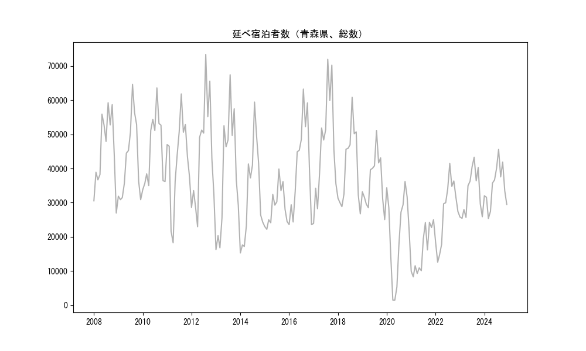
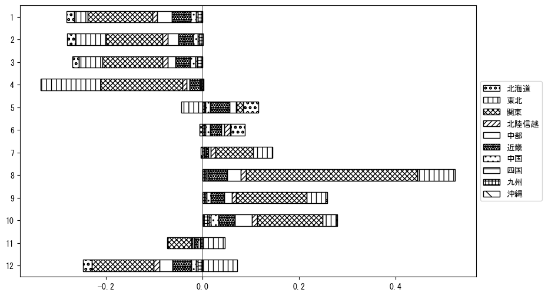

`<!DOCTYPE html>`{=html}
<html lang="ja">
<head>
    <meta charset="UTF-8">
    <meta name="description" content="">
    <link rel="stylesheet" href="../css/style.css">
    <title>宿泊者数の重心 | 青森県</title>
</head>    
<body>
<body>
<nav id ="global_navi">
    <ul>
        <li>[トップ](../index.html)</li>
        <li>[使い方](../how_to_use.html)</li>
        <li>[データについて](../on_data.html)</li>
        <li>[算出方法について](../method.html)</li>
        <li>[発展的な使い方](../developer.html)</li>
        <li>[サイトポリシー](../policy.html)</li>
    </ul>
</nav>
<ol class="breadcrumb">
    <li>[トップ](../index.html)</li>
    <li>青森県</li>
</ol>
<h1 id="h1_0">青森県</h1>

<ul>
  <li> **[１．延べ宿泊者（総数、月次）の推移](#h1_1)** 
    <ul>
      <li> [時系列グラフ](#h2_1) </li>
      <li> [基本統計量](#h2_2) </li>
    </ul>
  </li>  
</ul>

<ul>
  <li> **[２．宿泊者数の重心（年平均の推移）](#h1_2)** 
  <ul>
  <li> [重心の前年平均からの移動距離と方位、および緯度・経度](#h2_4) </li>
  <li> [運輸局別延べ宿泊者数](#h2_5) 
  <ul>
  <li> [時系列（年平均）](#h3_1) </li>
  <li> [寄与度（前年からの変化率に対する）](#h3_2) </li>
  </ul>
  </li>
  </ul>
  </li>
</ul>

<ul>
  <li> **[３．宿泊者数の重心（月別）](#h1_3)** 
  <ul>
  <li> [全期間（2008年1月～2023年12月）の平均と月別平均の比較](#h2_6) </li>
  <li> [運輸局別延べ宿泊者数](#h2_7) 
  <ul>
  <li> [月別平均（2008年1月～2023年12月）](#h3_3) </li>
  <li> [寄与度（全期間の平均から月別平均への変化率に対する）](#h3_4) </li>
  </ul>
  </li>
  </ul>
  </li>
</ul>

<ul>
<li> **[４．データのダウンロード](#h1_4)** </li>
</ul>

<h1 id="h1_1">１．延べ宿泊者（総数）の推移</h1>
<h2 id="h2_1">時系列グラフ</h2>

<figcaption>図１：青森県内の従業員数100人以上の宿泊施設での延べ宿泊者数（国外、居住地不詳を含む総数）。</figcaption>

<h2 id="h2_2">基本統計量</h2>
|  | 平均 | 標準偏差 | 最小値 | 最大値 |
|:----:|:----:|:----:|:----:|:----:|
| 2008年 | 45,189 | 10,967 | 26,972 (12月) | 59,231 (8月) |
| 2009年 | 42,601 | 11,491 | 30,878 (12月) | 64,601 (8月) |
| 2010年 | 45,129 | 10,182 | 33,806 (1月) | 63,578 (8月) |
| 2011年 | 42,591 | 12,576 | 18,279 (4月) | 61,811 (8月) |
| 2012年 | 44,495 | 15,738 | 22,971 (4月) | 73,373 (8月) |
| 2013年 | 38,894 | 17,116 | 16,294 (1月) | 67,394 (8月) |
| 2014年 | 32,848 | 14,164 | 15,289 (1月) | 59,439 (8月) |
| 2015年 | 29,034 | 5,604 | 22,207 (2月) | 39,848 (8月) |
| 2016年 | 40,574 | 13,878 | 23,568 (12月) | 63,229 (8月) |
| 2017年 | 46,651 | 15,425 | 23,938 (1月) | 71,932 (8月) |
| 2018年 | 40,153 | 11,113 | 26,736 (12月) | 60,822 (8月) |
| 2019年 | 36,276 | 7,576 | 25,054 (12月) | 51,118 (8月) |
| 2020年 | 20,816 | 12,607 | 1,502 (5月) | 36,211 (10月) |
| 2021年 | 15,993 | 6,707 | 8,303 (2月) | 25,029 (12月) |
| 2022年 | 27,399 | 9,330 | 12,595 (2月) | 41,471 (8月) |
| 2023年 | 32,681 | 6,671 | 25,431 (2月) | 43,306 (8月) |
: 表１：従業員数100人以上の宿泊施設での延べ宿泊者の総数（国外、および居住地不詳を含む）に関する基本統計量。単位は人泊。平均は１か月あたりの平均値を表す。図１に対応。

<h1 id="h1_2">２．宿泊者数の重心（年平均の推移）</h1>

<iframe src="../html/annual/青森県.html" width="1200" height="600"></iframe>
<figcaption>図２：青森県内の従業員数100人以上の宿泊施設での宿泊者数（国外、居住地不詳を除く）の重心（年平均の推移）。</figcaption>

[全画面表示](../html/annual/青森県.html)

<h2 id="h2_4">重心の前年平均からの移動距離と方位、および緯度・経度</h2>
|  | 方位 | 距離 | 緯度 | 経度 |
|:----:|:----:|:----:|:----:|:----:|
| 2008年 | --- | --- | 38.2181 | 139.7437 |
| 2009年 | 南西 | 41.1km | 37.9188 | 139.4689 |
| 2010年 | 南南西 | 45.8km | 37.5304 | 139.2934 |
| 2011年 | 北東 | 57.7km | 37.8593 | 139.8006 |
| 2012年 | 南南西 | 29.7km | 37.6286 | 139.6309 |
| 2013年 | 西南西 | 6.0km | 37.6044 | 139.5699 |
| 2014年 | 南南西 | 16.4km | 37.4787 | 139.4734 |
| 2015年 | 北北東 | 23.8km | 37.6887 | 139.5285 |
| 2016年 | 南西 | 63.3km | 37.2305 | 139.1026 |
| 2017年 | 南 | 3.7km | 37.1973 | 139.0997 |
| 2018年 | 東南東 | 16.8km | 37.1369 | 139.2726 |
| 2019年 | 南西 | 11.0km | 37.0686 | 139.1825 |
| 2020年 | 北北東 | 62.2km | 37.5696 | 139.4980 |
| 2021年 | 北北東 | 52.9km | 38.0264 | 139.6707 |
| 2022年 | 南南西 | 88.7km | 37.3061 | 139.2362 |
| 2023年 | 南南西 | 39.6km | 37.0089 | 138.9894 |
: 表２：重心の前年平均からの移動距離と方位、および緯度・経度。図２に対応。

<h2 id="h2_5">運輸局別延べ宿泊者数</h2>
<h3 id="h3_1">時系列（年平均）</h3>

<figcaption>図３：青森県内の従業員数100人以上の宿泊施設での１か月あたり平均宿泊者数（国外、居住地不詳を除く）の運輸局別内訳。</figcaption>

<h3 id="h3_2">寄与度（前年からの変化率に対する）</h3>

<figcaption>図４：青森県内の従業員数100人以上の宿泊施設での運輸局別宿泊者数（国外、居住地不詳を除く）から求めた寄与度。</figcaption>

<h1 id="h1_3">３．宿泊者数の重心（月別）</h3>

<iframe src="../html/monthly/青森県.html" width="1200" height="600"></iframe>
<figcaption>図５：青森県内の従業員数100人以上の宿泊施設での宿泊者数（国外、居住地不詳を除く）の重心（月別）。観測期間は2008年1月から2023年12月まで。</figcaption>

[全画面表示](../html/monthly/青森県.html)

<h2 id="h2_6">全期間（2008年1月～2023年12月）の平均と月別平均の比較</h2>
|  | 方位 | 距離 | 緯度 | 経度 |
|:----:|:----:|:----:|:----:|:----:|
| 全期間 | --- | --- | 37.5295 | 139.4101 |
| 1月 | 北北東 | 63.8km | 38.0300 | 139.7656 |
| 2月 | 北北東 | 25.9km | 37.7263 | 139.5683 |
| 3月 | 北北東 | 40.1km | 37.8321 | 139.6593 |
| 4月 | 西北西 | 14.0km | 37.5708 | 139.2602 |
| 5月 | 南西 | 31.2km | 37.3352 | 139.1558 |
| 6月 | 西 | 14.6km | 37.5252 | 139.2444 |
| 7月 | 南 | 20.8km | 37.3436 | 139.3827 |
| 8月 | 南 | 61.6km | 36.9787 | 139.3258 |
| 9月 | 南南西 | 46.3km | 37.1359 | 139.2355 |
| 10月 | 南南西 | 68.4km | 37.0042 | 139.0055 |
| 11月 | 北北東 | 18.0km | 37.6793 | 139.4894 |
| 12月 | 北北東 | 82.2km | 38.1921 | 139.8282 |
: 表３：全期間の平均から月別平均までの移動距離と方位、および緯度・経度。図５に対応。

<h2 id="h2_7">運輸局別延べ宿泊者数</h2>
<h3 id="h3_3">月別平均（2008年1月～2023年12月）</h3>

<figcaption>図６：青森県内の従業員数100人以上の宿泊施設での宿泊者数（国外、居住地不詳を除く）の運輸局別内訳（月別）。</figcaption>

<h3 id="h3_4">寄与度（全期間の平均から月別平均への変化率に対する）</h3>

<figcaption>図７：青森県内の従業員数100人以上の宿泊施設での運輸局別宿泊者数（国外、居住地不詳を除く）から求めた寄与度（月別）。</figcaption>

</body>

<h1 id="h1_4">４．データのダウンロード</h1>
 <ul>
  <li> <a href="../csv/data_by_pref/延べ宿泊者数および重心（青森県）.csv" download>延べ宿泊者数および重心の緯度経度</a> </li>
  <li> <a href="../csv/bar_chart/運輸局別_年平均（青森県）.csv" download>運輸局別延べ宿泊者数（年平均）</a></li>
  <li> <a href="../csv/bar_chart_month/運輸局別_月別（青森県）.csv" download>運輸局別延べ宿泊者数（月別）</a></li>
  <li> <a href="../csv/contrib/前年からの変化率に対する寄与度（青森県）.csv" download>前年からの変化率に対する寄与度</a></li>
  <li> <a href="../csv/contrib_month/月別平均への変化率に対する寄与度（青森県）.csv" download>月別平均への変化率に対する寄与度</a></li>
</ul>

出典：観光庁「宿泊旅行統計調査」に収録された「施設所在地、居住地別延べ宿泊者数（従業員数100人以上の施設）」

国土地理院「白地図（[地理院タイル](https://maps.gsi.go.jp/development/ichiran.html)）」（図２と図５）

