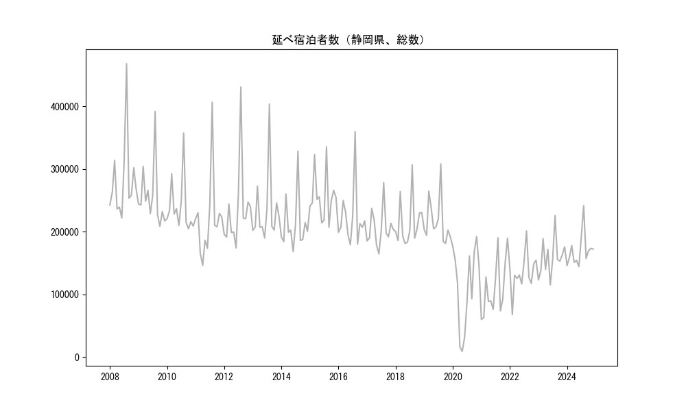
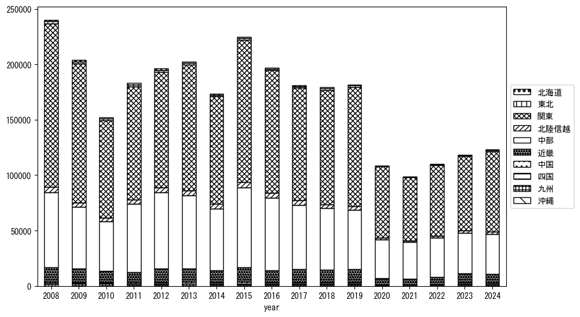
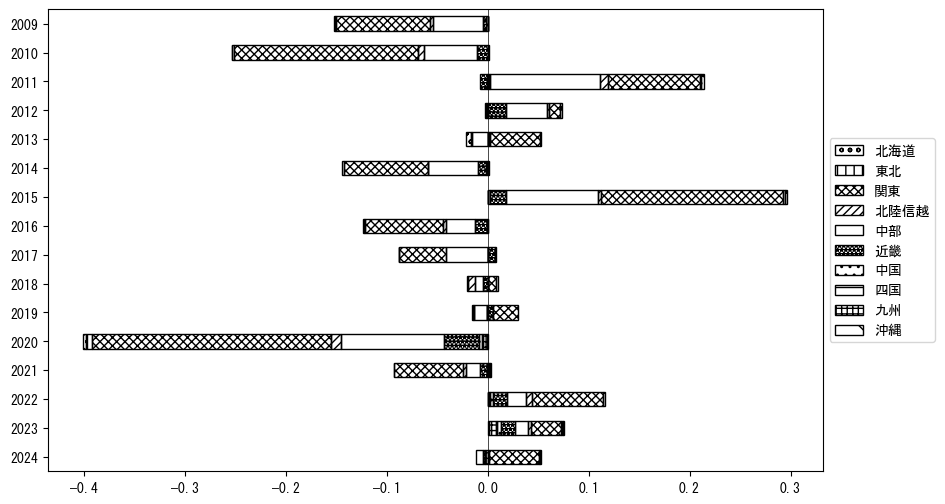
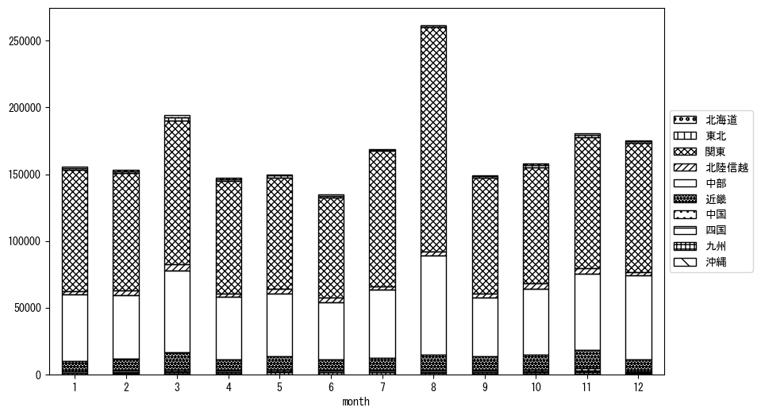
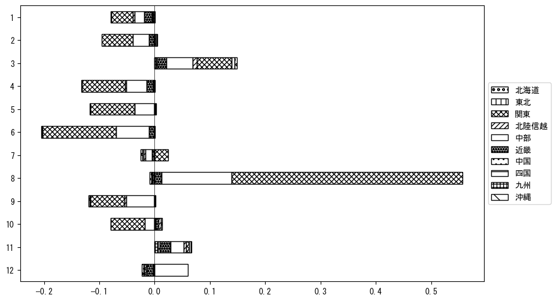

`<!DOCTYPE html>`{=html}
<html lang="ja">
<head>
    <meta charset="UTF-8">
    <meta name="description" content="">
    <link rel="stylesheet" href="../css/style.css">
    <title>宿泊者数の重心 | 静岡県</title>
</head>    
<body>
<body>
<nav id ="global_navi">
    <ul>
        <li>[トップ](../index.html)</li>
        <li>[使い方](../how_to_use.html)</li>
        <li>[データについて](../on_data.html)</li>
        <li>[算出方法について](../method.html)</li>
        <li>[発展的な使い方](../developer.html)</li>
        <li>[サイトポリシー](../policy.html)</li>
    </ul>
</nav>
<ol class="breadcrumb">
    <li>[トップ](../index.html)</li>
    <li>静岡県</li>
</ol>
<h1 id="h1_0">静岡県</h1>

<ul>
  <li> **[１．延べ宿泊者（総数、月次）の推移](#h1_1)** 
    <ul>
      <li> [時系列グラフ](#h2_1) </li>
      <li> [基本統計量](#h2_2) </li>
    </ul>
  </li>  
</ul>

<ul>
  <li> **[２．宿泊者数の重心（年平均の推移）](#h1_2)** 
  <ul>
  <li> [重心の前年平均からの移動距離と方位、および緯度・経度](#h2_4) </li>
  <li> [運輸局別延べ宿泊者数](#h2_5) 
  <ul>
  <li> [時系列（年平均）](#h3_1) </li>
  <li> [寄与度（前年からの変化率に対する）](#h3_2) </li>
  </ul>
  </li>
  </ul>
  </li>
</ul>

<ul>
  <li> **[３．宿泊者数の重心（月別）](#h1_3)** 
  <ul>
  <li> [全期間（2008年1月～2023年12月）の平均と月別平均の比較](#h2_6) </li>
  <li> [運輸局別延べ宿泊者数](#h2_7) 
  <ul>
  <li> [月別平均（2008年1月～2023年12月）](#h3_3) </li>
  <li> [寄与度（全期間の平均から月別平均への変化率に対する）](#h3_4) </li>
  </ul>
  </li>
  </ul>
  </li>
</ul>

<ul>
<li> **[４．データのダウンロード](#h1_4)** </li>
</ul>

<h1 id="h1_1">１．延べ宿泊者（総数）の推移</h1>
<h2 id="h2_1">時系列グラフ</h2>

<figcaption>図１：静岡県内の従業員数100人以上の宿泊施設での延べ宿泊者数（国外、居住地不詳を含む総数）。</figcaption>

<h2 id="h2_2">基本統計量</h2>
|  | 平均 | 標準偏差 | 最小値 | 最大値 |
|:----:|:----:|:----:|:----:|:----:|
| 2008年 | 281,854 | 66,016 | 222,035 (6月) | 468,195 (8月) |
| 2009年 | 256,002 | 49,671 | 208,803 (10月) | 391,979 (8月) |
| 2010年 | 239,530 | 44,151 | 204,944 (10月) | 357,541 (8月) |
| 2011年 | 220,473 | 65,644 | 146,509 (4月) | 406,697 (8月) |
| 2012年 | 235,703 | 66,983 | 174,231 (6月) | 430,896 (8月) |
| 2013年 | 234,353 | 58,167 | 190,114 (6月) | 403,972 (8月) |
| 2014年 | 211,443 | 43,321 | 168,490 (6月) | 328,672 (8月) |
| 2015年 | 255,457 | 39,197 | 207,303 (9月) | 335,814 (8月) |
| 2016年 | 222,261 | 47,877 | 179,290 (6月) | 359,978 (8月) |
| 2017年 | 205,405 | 29,905 | 164,778 (6月) | 278,683 (8月) |
| 2018年 | 214,432 | 38,005 | 181,348 (5月) | 306,791 (8月) |
| 2019年 | 216,996 | 37,074 | 181,578 (10月) | 308,384 (8月) |
| 2020年 | 113,349 | 64,831 | 9,274 (5月) | 192,329 (11月) |
| 2021年 | 110,848 | 46,035 | 60,195 (1月) | 190,515 (8月) |
| 2022年 | 134,676 | 31,066 | 68,102 (2月) | 201,333 (8月) |
| 2023年 | 159,061 | 29,981 | 115,330 (6月) | 225,870 (8月) |
: 表１：従業員数100人以上の宿泊施設での延べ宿泊者の総数（国外、および居住地不詳を含む）に関する基本統計量。単位は人泊。平均は１か月あたりの平均値を表す。図１に対応。

<h1 id="h1_2">２．宿泊者数の重心（年平均の推移）</h1>

<iframe src="../html/annual/静岡県.html" width="1200" height="600"></iframe>
<figcaption>図２：静岡県内の従業員数100人以上の宿泊施設での延べ宿泊者数（国外、居住地不詳を除く）の重心（年平均の推移）。</figcaption>

[全画面表示](../html/annual/静岡県.html)

<h2 id="h2_4">重心の前年平均からの移動距離と方位、および緯度・経度</h2>
|  | 方位 | 距離 | 緯度 | 経度 |
|:----:|:----:|:----:|:----:|:----:|
| 2008年 | --- | --- | 35.4988 | 138.7722 |
| 2009年 | 南東 | 0.9km | 35.4925 | 138.7782 |
| 2010年 | 西 | 10.7km | 35.4770 | 138.6623 |
| 2011年 | 北西 | 2.5km | 35.4934 | 138.6436 |
| 2012年 | 西南西 | 5.7km | 35.4765 | 138.5841 |
| 2013年 | 東南東 | 6.1km | 35.4508 | 138.6436 |
| 2014年 | 東北東 | 2.8km | 35.4635 | 138.6702 |
| 2015年 | 東北東 | 2.5km | 35.4683 | 138.6973 |
| 2016年 | 東北東 | 0.4km | 35.4697 | 138.7010 |
| 2017年 | 西北西 | 7.1km | 35.4826 | 138.6244 |
| 2018年 | 東南東 | 4.0km | 35.4741 | 138.6670 |
| 2019年 | 南東 | 0.4km | 35.4718 | 138.6697 |
| 2020年 | 南東 | 7.5km | 35.4241 | 138.7289 |
| 2021年 | 東 | 1.4km | 35.4227 | 138.7440 |
| 2022年 | 西北西 | 6.3km | 35.4446 | 138.6796 |
| 2023年 | 西 | 11.7km | 35.4293 | 138.5521 |
: 表２：重心の前年平均からの移動距離と方位、および緯度・経度。図２に対応。

<h2 id="h2_5">運輸局別延べ宿泊者数</h2>
<h3 id="h3_1">時系列（年平均）</h3>

<figcaption>図３：静岡県内の従業員数100人以上の宿泊施設での１か月あたり平均延べ宿泊者数（国外、居住地不詳を除く）の運輸局別内訳。</figcaption>

<h3 id="h3_2">寄与度（前年からの変化率に対する）</h3>

<figcaption>図４：静岡県内の従業員数100人以上の宿泊施設での運輸局別延べ宿泊者数（国外、居住地不詳を除く）から求めた寄与度。</figcaption>

<h1 id="h1_3">３．宿泊者数の重心（月別）</h3>

<iframe src="../html/monthly/静岡県.html" width="1200" height="600"></iframe>
<figcaption>図５：静岡県内の従業員数100人以上の宿泊施設での延べ宿泊者数（国外、居住地不詳を除く）の重心（月別）。観測期間は2008年1月から2023年12月まで。</figcaption>

[全画面表示](../html/monthly/静岡県.html)

<h2 id="h2_6">全期間（2008年1月～2023年12月）の平均と月別平均の比較</h2>
|  | 方位 | 距離 | 緯度 | 経度 |
|:----:|:----:|:----:|:----:|:----:|
| 全期間 | --- | --- | 35.4650 | 138.6761 |
| 1月 | 東北東 | 8.6km | 35.4837 | 138.7681 |
| 2月 | 北東 | 6.0km | 35.5067 | 138.7188 |
| 3月 | 北西 | 5.8km | 35.5064 | 138.6379 |
| 4月 | 南東 | 1.2km | 35.4574 | 138.6863 |
| 5月 | 西 | 6.0km | 35.4600 | 138.6099 |
| 6月 | 西 | 3.6km | 35.4674 | 138.6371 |
| 7月 | 東南東 | 4.4km | 35.4476 | 138.7192 |
| 8月 | 東 | 15.1km | 35.4609 | 138.8429 |
| 9月 | 南西 | 2.9km | 35.4447 | 138.6564 |
| 10月 | 西 | 7.3km | 35.4702 | 138.5963 |
| 11月 | 西 | 12.1km | 35.4570 | 138.5437 |
| 12月 | 南南東 | 5.6km | 35.4175 | 138.6972 |
: 表３：全期間の平均から月別平均までの移動距離と方位、および緯度・経度。図５に対応。

<h2 id="h2_7">運輸局別延べ宿泊者数</h2>
<h3 id="h3_3">月別平均（2008年1月～2023年12月）</h3>

<figcaption>図６：静岡県内の従業員数100人以上の宿泊施設での延べ宿泊者数（国外、居住地不詳を除く）の運輸局別内訳（月別）。</figcaption>

<h3 id="h3_4">寄与度（全期間の平均から月別平均への変化率に対する）</h3>

<figcaption>図７：静岡県内の従業員数100人以上の宿泊施設での運輸局別延べ宿泊者数（国外、居住地不詳を除く）から求めた寄与度（月別）。</figcaption>

</body>

<h1 id="h1_4">４．データのダウンロード</h1>
 <ul>
  <li> <a href="../csv/data_by_pref/延べ宿泊者数および重心（静岡県）.csv" download>延べ宿泊者数および重心の緯度経度</a> </li>
  <li> <a href="../csv/bar_chart/運輸局別_年平均（静岡県）.csv" download>運輸局別延べ宿泊者数（年平均）</a></li>
  <li> <a href="../csv/bar_chart_month/運輸局別_月別（静岡県）.csv" download>運輸局別延べ宿泊者数（月別）</a></li>
  <li> <a href="../csv/contrib/前年からの変化率に対する寄与度（静岡県）.csv" download>前年からの変化率に対する寄与度</a></li>
  <li> <a href="../csv/contrib_month/月別平均への変化率に対する寄与度（静岡県）.csv" download>月別平均への変化率に対する寄与度</a></li>
</ul>

出典：観光庁「宿泊旅行統計調査」に収録された「施設所在地、居住地別延べ宿泊者数（従業員数100人以上の施設）」

国土地理院「白地図（[地理院タイル](https://maps.gsi.go.jp/development/ichiran.html)）」（図２と図５）

