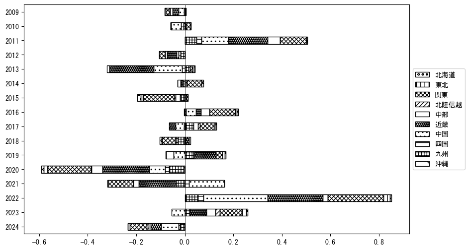

`<!DOCTYPE html>`{=html}
<html lang="ja">
<head>
    <meta charset="UTF-8">
    <meta name="description" content="">
    <link rel="stylesheet" href="../css/style.css">
    <title>宿泊者数の重心 | 鳥取県</title>
</head>    
<body>
<body>
<nav id ="global_navi">
    <ul>
        <li>[トップ](../index.html)</li>
        <li>[使い方](../how_to_use.html)</li>
        <li>[データについて](../on_data.html)</li>
        <li>[算出方法について](../method.html)</li>
        <li>[発展的な使い方](../developer.html)</li>
        <li>[サイトポリシー](../policy.html)</li>
    </ul>
</nav>
<ol class="breadcrumb">
    <li>[トップ](../index.html)</li>
    <li>鳥取県</li>
</ol>
<h1 id="h1_0">鳥取県</h1>

<ul>
  <li> **[１．延べ宿泊者（総数、月次）の推移](#h1_1)** 
    <ul>
      <li> [時系列グラフ](#h2_1) </li>
      <li> [基本統計量](#h2_2) </li>
    </ul>
  </li>  
</ul>

<ul>
  <li> **[２．宿泊者数の重心（年平均の推移）](#h1_2)** 
  <ul>
  <li> [重心の前年平均からの移動距離と方位、および緯度・経度](#h2_4) </li>
  <li> [運輸局別延べ宿泊者数](#h2_5) 
  <ul>
  <li> [時系列（年平均）](#h3_1) </li>
  <li> [寄与度（前年からの変化率に対する）](#h3_2) </li>
  </ul>
  </li>
  </ul>
  </li>
</ul>

<ul>
  <li> **[３．宿泊者数の重心（月別）](#h1_3)** 
  <ul>
  <li> [全期間（2008年1月～2024年12月）の平均と月別平均の比較](#h2_6) </li>
  <li> [運輸局別延べ宿泊者数](#h2_7) 
  <ul>
  <li> [月別平均（2008年1月～2024年12月）](#h3_3) </li>
  <li> [寄与度（全期間の平均から月別平均への変化率に対する）](#h3_4) </li>
  </ul>
  </li>
  </ul>
  </li>
</ul>

<ul>
<li> **[４．データのダウンロード](#h1_4)** </li>
</ul>

<h1 id="h1_1">１．延べ宿泊者（総数）の推移</h1>
<h2 id="h2_1">時系列グラフ</h2>

<figcaption>図１：鳥取県内の従業員数100人以上の宿泊施設での延べ宿泊者数（国外、居住地不詳を含む総数）。</figcaption>

<h2 id="h2_2">基本統計量</h2>
|  | 平均 | 標準偏差 | 最小値 | 最大値 |
|:----:|:----:|:----:|:----:|:----:|
| 2008年 | 22,913 | 3,170 | 20,561 (2月) | 31,143 (8月) |
| 2009年 | 20,416 | 5,059 | 13,849 (6月) | 30,357 (8月) |
| 2010年 | 21,688 | 6,240 | 15,295 (6月) | 36,808 (8月) |
| 2011年 | 28,884 | 10,044 | 14,529 (1月) | 49,798 (8月) |
| 2012年 | 26,390 | 6,639 | 20,562 (10月) | 44,673 (8月) |
| 2013年 | 18,233 | 8,414 | 10,629 (4月) | 33,725 (10月) |
| 2014年 | 19,128 | 6,537 | 8,994 (1月) | 28,358 (11月) |
| 2015年 | 16,086 | 5,948 | 4,110 (7月) | 27,418 (3月) |
| 2016年 | 19,309 | 7,495 | 11,701 (6月) | 36,430 (8月) |
| 2017年 | 21,005 | 6,121 | 9,769 (2月) | 33,281 (8月) |
| 2018年 | 19,691 | 10,181 | 8,666 (1月) | 39,824 (8月) |
| 2019年 | 20,473 | 4,159 | 12,878 (7月) | 26,381 (8月) |
| 2020年 | 8,044 | 5,100 | 308 (5月) | 15,599 (11月) |
| 2021年 | 6,704 | 4,923 | 1,387 (2月) | 17,929 (11月) |
| 2022年 | 12,546 | 5,375 | 3,273 (2月) | 21,209 (11月) |
| 2023年 | 15,773 | 4,092 | 7,932 (1月) | 20,413 (5月) |
| 2024年 | 12,645 | 3,758 | 6,403 (2月) | 18,206 (8月) |
: 表１：従業員数100人以上の宿泊施設での延べ宿泊者の総数（国外、および居住地不詳を含む）に関する基本統計量。単位は人泊。平均は１か月あたりの平均値を表す。図１に対応。

<h1 id="h1_2">２．宿泊者数の重心（年平均の推移）</h1>

<iframe src="../html/annual/鳥取県.html" width="1200" height="600"></iframe>
<figcaption>図２：鳥取県内の従業員数100人以上の宿泊施設での延べ宿泊者数（国外、居住地不詳を除く）の重心（年平均の推移）。</figcaption>

[全画面表示](../html/annual/鳥取県.html)

<h2 id="h2_4">重心の前年平均からの移動距離と方位、および緯度・経度</h2>
|  | 方位 | 距離 | 緯度 | 経度 |
|:----:|:----:|:----:|:----:|:----:|
| 2008年 | --- | --- | 35.0008 | 135.3110 |
| 2009年 | 西南西 | 5.6km | 34.9843 | 135.2529 |
| 2010年 | 東 | 20.4km | 35.0054 | 135.4743 |
| 2011年 | 西南西 | 5.3km | 34.9812 | 135.4248 |
| 2012年 | 東北東 | 8.6km | 35.0192 | 135.5073 |
| 2013年 | 東北東 | 25.9km | 35.1277 | 135.7590 |
| 2014年 | 東北東 | 28.3km | 35.2125 | 136.0517 |
| 2015年 | 西南西 | 58.1km | 35.0161 | 135.4603 |
| 2016年 | 東北東 | 39.9km | 35.1425 | 135.8703 |
| 2017年 | 東 | 15.3km | 35.1592 | 136.0371 |
| 2018年 | 西南西 | 16.4km | 35.1115 | 135.8664 |
| 2019年 | 東南東 | 9.8km | 35.0822 | 135.9674 |
| 2020年 | 西 | 38.4km | 35.0883 | 135.5468 |
| 2021年 | 西北西 | 52.4km | 35.1812 | 134.9826 |
| 2022年 | 東 | 33.3km | 35.1692 | 135.3479 |
| 2023年 | 東 | 40.4km | 35.2027 | 135.7899 |
| 2024年 | 北西 | 3.9km | 35.2286 | 135.7614 |
: 表２：重心の前年平均からの移動距離と方位、および緯度・経度。図２に対応。

<h2 id="h2_5">運輸局別延べ宿泊者数</h2>
<h3 id="h3_1">時系列（年平均）</h3>

<figcaption>図３：鳥取県内の従業員数100人以上の宿泊施設での１か月あたり平均延べ宿泊者数（国外、居住地不詳を除く）の運輸局別内訳。</figcaption>

<h3 id="h3_2">寄与度（前年からの変化率に対する）</h3>

<figcaption>図４：鳥取県内の従業員数100人以上の宿泊施設での運輸局別延べ宿泊者数（国外、居住地不詳を除く）から求めた寄与度。</figcaption>

<h1 id="h1_3">３．宿泊者数の重心（月別）</h3>

<iframe src="../html/monthly/鳥取県.html" width="1200" height="600"></iframe>
<figcaption>図５：鳥取県内の従業員数100人以上の宿泊施設での延べ宿泊者数（国外、居住地不詳を除く）の重心（月別）。観測期間は2008年1月から2024年12月まで。</figcaption>

[全画面表示](../html/monthly/鳥取県.html)

<h2 id="h2_6">全期間（2008年1月～2024年12月）の平均と月別平均の比較</h2>
|  | 方位 | 距離 | 緯度 | 経度 |
|:----:|:----:|:----:|:----:|:----:|
| 全期間 | --- | --- | 35.1007 | 135.6124 |
| 1月 | 西南西 | 35.2km | 34.9607 | 135.2668 |
| 2月 | 西南西 | 30.0km | 34.9905 | 135.3122 |
| 3月 | 西南西 | 17.1km | 35.0528 | 135.4345 |
| 4月 | 北 | 7.0km | 35.1632 | 135.6227 |
| 5月 | 東北東 | 14.3km | 35.1607 | 135.7508 |
| 6月 | 東北東 | 28.0km | 35.2285 | 135.8780 |
| 7月 | 南西 | 6.7km | 35.0556 | 135.5633 |
| 8月 | 南南西 | 15.3km | 34.9706 | 135.5568 |
| 9月 | 東北東 | 23.9km | 35.1526 | 135.8673 |
| 10月 | 北東 | 12.6km | 35.1691 | 135.7222 |
| 11月 | 東北東 | 21.6km | 35.1978 | 135.8181 |
| 12月 | 西 | 5.2km | 35.1071 | 135.5561 |
: 表３：全期間の平均から月別平均までの移動距離と方位、および緯度・経度。図５に対応。

<h2 id="h2_7">運輸局別延べ宿泊者数</h2>
<h3 id="h3_3">月別平均（2008年1月～2024年12月）</h3>

<figcaption>図６：鳥取県内の従業員数100人以上の宿泊施設での延べ宿泊者数（国外、居住地不詳を除く）の運輸局別内訳（月別）。</figcaption>

<h3 id="h3_4">寄与度（全期間の平均から月別平均への変化率に対する）</h3>

<figcaption>図７：鳥取県内の従業員数100人以上の宿泊施設での運輸局別延べ宿泊者数（国外、居住地不詳を除く）から求めた寄与度（月別）。</figcaption>

</body>

<h1 id="h1_4">４．データのダウンロード</h1>
 <ul>
  <li> <a href="../csv/data_by_pref/延べ宿泊者数および重心（鳥取県）.csv" download>延べ宿泊者数および重心の緯度経度</a> </li>
  <li> <a href="../csv/bar_chart/運輸局別_年平均（鳥取県）.csv" download>運輸局別延べ宿泊者数（年平均）</a></li>
  <li> <a href="../csv/bar_chart_month/運輸局別_月別（鳥取県）.csv" download>運輸局別延べ宿泊者数（月別）</a></li>
  <li> <a href="../csv/contrib/前年からの変化率に対する寄与度（鳥取県）.csv" download>前年からの変化率に対する寄与度</a></li>
  <li> <a href="../csv/contrib_month/月別平均への変化率に対する寄与度（鳥取県）.csv" download>月別平均への変化率に対する寄与度</a></li>
</ul>

出典：観光庁「宿泊旅行統計調査」に収録された「施設所在地、居住地別延べ宿泊者数（従業員数100人以上の施設）」

国土地理院「白地図（[地理院タイル](https://maps.gsi.go.jp/development/ichiran.html)）」（図２と図５）

