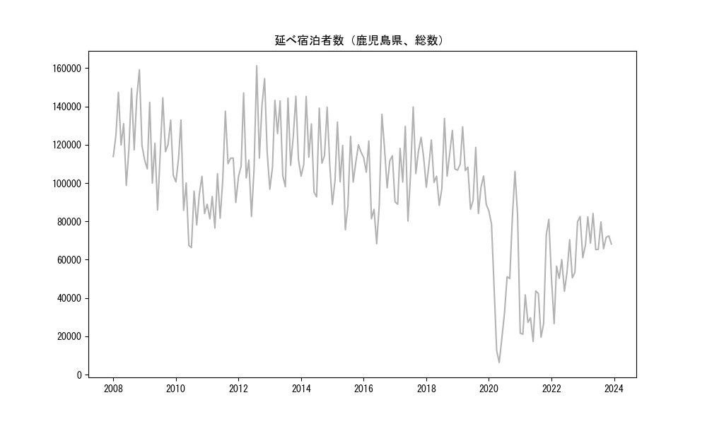
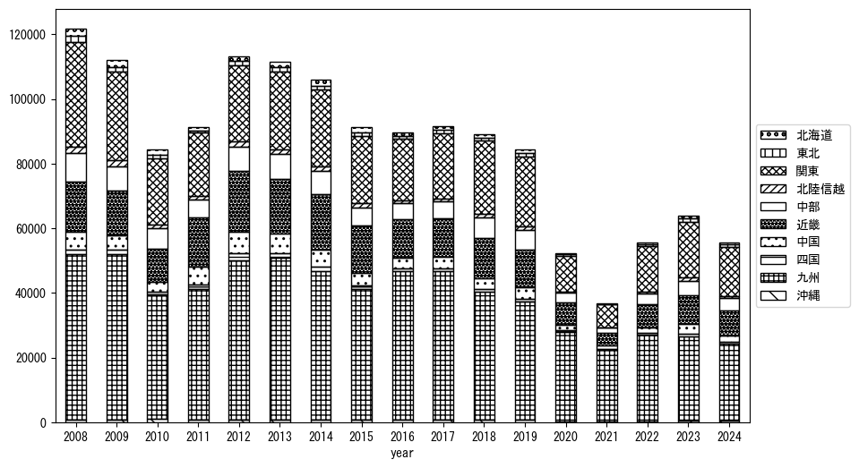
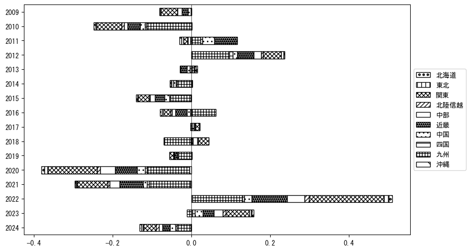
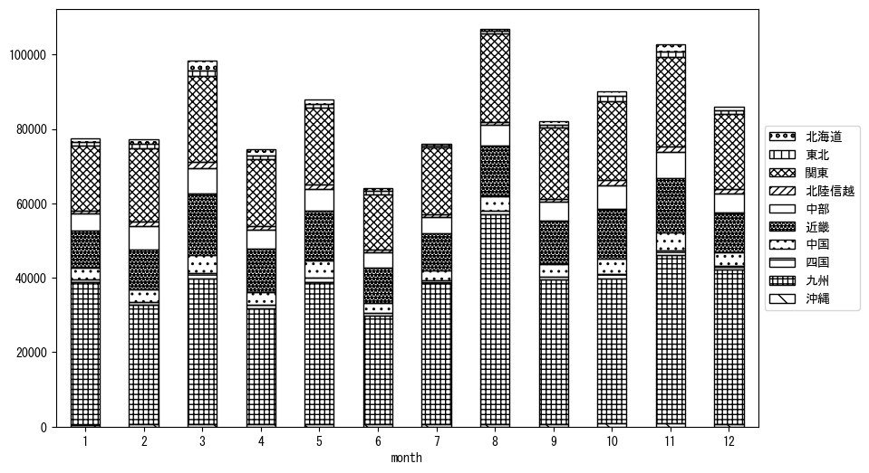
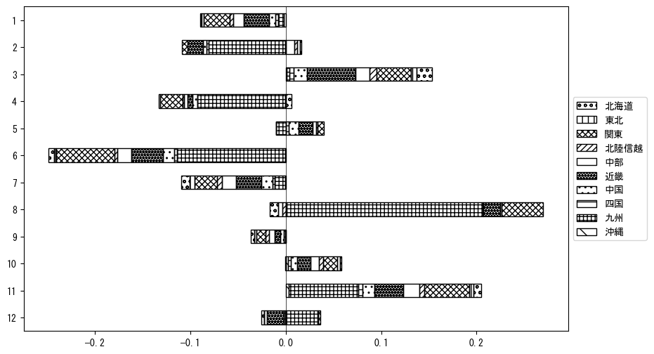

`<!DOCTYPE html>`{=html}
<html lang="ja">
<head>
    <meta charset="UTF-8">
    <meta name="description" content="">
    <link rel="stylesheet" href="../css/style.css">
    <title>宿泊者数の重心 | 鹿児島県</title>
</head>    
<body>
<body>
<nav id ="global_navi">
    <ul>
        <li>[トップ](../index.html)</li>
        <li>[使い方](../how_to_use.html)</li>
        <li>[データについて](../on_data.html)</li>
        <li>[算出方法について](../method.html)</li>
        <li>[発展的な使い方](../developer.html)</li>
        <li>[サイトポリシー](../policy.html)</li>
    </ul>
</nav>
<ol class="breadcrumb">
    <li>[トップ](../index.html)</li>
    <li>鹿児島県</li>
</ol>
<h1 id="h1_0">鹿児島県</h1>

<ul>
  <li> **[１．延べ宿泊者（総数、月次）の推移](#h1_1)** 
    <ul>
      <li> [時系列グラフ](#h2_1) </li>
      <li> [基本統計量](#h2_2) </li>
    </ul>
  </li>  
</ul>

<ul>
  <li> **[２．宿泊者数の重心（年平均の推移）](#h1_2)** 
  <ul>
  <li> [重心の前年平均からの移動距離と方位、および緯度・経度](#h2_4) </li>
  <li> [運輸局別延べ宿泊者数](#h2_5) 
  <ul>
  <li> [時系列（年平均）](#h3_1) </li>
  <li> [寄与度（前年からの変化率に対する）](#h3_2) </li>
  </ul>
  </li>
  </ul>
  </li>
</ul>

<ul>
  <li> **[３．宿泊者数の重心（月別）](#h1_3)** 
  <ul>
  <li> [全期間（2008年1月～2023年12月）の平均と月別平均の比較](#h2_6) </li>
  <li> [運輸局別延べ宿泊者数](#h2_7) 
  <ul>
  <li> [月別平均（2008年1月～2023年12月）](#h3_3) </li>
  <li> [寄与度（全期間の平均から月別平均への変化率に対する）](#h3_4) </li>
  </ul>
  </li>
  </ul>
  </li>
</ul>

<ul>
<li> **[４．データのダウンロード](#h1_4)** </li>
</ul>

<h1 id="h1_1">１．延べ宿泊者（総数）の推移</h1>
<h2 id="h2_1">時系列グラフ</h2>

<figcaption>図１：鹿児島県内の従業員数100人以上の宿泊施設での延べ宿泊者数（国外、居住地不詳を含む総数）。</figcaption>

<h2 id="h2_2">基本統計量</h2>
|  | 平均 | 標準偏差 | 最小値 | 最大値 |
|:----:|:----:|:----:|:----:|:----:|
| 2008年 | 128,644 | 17,873 | 98,784 (6月) | 159,156 (11月) |
| 2009年 | 116,741 | 17,083 | 85,946 (6月) | 144,508 (8月) |
| 2010年 | 93,471 | 18,931 | 66,298 (7月) | 132,951 (3月) |
| 2011年 | 99,249 | 17,531 | 76,496 (4月) | 137,555 (8月) |
| 2012年 | 120,769 | 24,161 | 82,547 (6月) | 161,282 (8月) |
| 2013年 | 121,196 | 18,877 | 96,737 (1月) | 145,369 (11月) |
| 2014年 | 117,027 | 17,583 | 92,793 (7月) | 145,274 (3月) |
| 2015年 | 106,492 | 16,888 | 75,619 (6月) | 131,872 (3月) |
| 2016年 | 103,548 | 19,472 | 68,315 (6月) | 135,932 (8月) |
| 2017年 | 109,229 | 17,716 | 80,166 (6月) | 139,772 (8月) |
| 2018年 | 108,907 | 13,529 | 88,352 (6月) | 133,748 (8月) |
| 2019年 | 102,598 | 13,645 | 84,101 (9月) | 129,370 (3月) |
| 2020年 | 54,408 | 32,663 | 6,275 (5月) | 106,102 (11月) |
| 2021年 | 37,028 | 20,820 | 17,249 (6月) | 81,062 (12月) |
| 2022年 | 56,411 | 15,466 | 26,580 (2月) | 82,560 (12月) |
| 2023年 | 71,005 | 7,372 | 61,025 (1月) | 84,134 (5月) |
: 表１：従業員数100人以上の宿泊施設での延べ宿泊者の総数（国外、および居住地不詳を含む）に関する基本統計量。単位は人泊。平均は１か月あたりの平均値を表す。図１に対応。

<h1 id="h1_2">２．宿泊者数の重心（年平均の推移）</h1>

<iframe src="../html/annual/鹿児島県.html" width="1200" height="600"></iframe>
<figcaption>図２：鹿児島県内の従業員数100人以上の宿泊施設での宿泊者数（国外、居住地不詳を除く）の重心（年平均の推移）。</figcaption>

[全画面表示](../html/annual/鹿児島県.html)

<h2 id="h2_4">重心の前年平均からの移動距離と方位、および緯度・経度</h2>
|  | 方位 | 距離 | 緯度 | 経度 |
|:----:|:----:|:----:|:----:|:----:|
| 2008年 | --- | --- | 34.2592 | 134.6135 |
| 2009年 | 西南西 | 28.8km | 34.1205 | 134.3495 |
| 2010年 | 南南西 | 10.4km | 34.0346 | 134.3041 |
| 2011年 | 西 | 17.4km | 34.0405 | 134.1160 |
| 2012年 | 東北東 | 7.5km | 34.0776 | 134.1846 |
| 2013年 | 南南東 | 1.8km | 34.0616 | 134.1888 |
| 2014年 | 東北東 | 13.5km | 34.0974 | 134.3290 |
| 2015年 | 南南西 | 3.1km | 34.0718 | 134.3170 |
| 2016年 | 南西 | 50.1km | 33.7928 | 133.8906 |
| 2017年 | 東北東 | 7.3km | 33.8268 | 133.9576 |
| 2018年 | 東北東 | 48.8km | 34.0346 | 134.4234 |
| 2019年 | 北東 | 5.3km | 34.0648 | 134.4676 |
| 2020年 | 西南西 | 124.4km | 33.4746 | 133.3262 |
| 2021年 | 南南西 | 6.8km | 33.4164 | 133.3032 |
| 2022年 | 東北東 | 100.9km | 33.9139 | 134.2144 |
| 2023年 | 北東 | 50.0km | 34.1650 | 134.6642 |
: 表２：重心の前年平均からの移動距離と方位、および緯度・経度。図２に対応。

<h2 id="h2_5">運輸局別延べ宿泊者数</h2>
<h3 id="h3_1">時系列（年平均）</h3>

<figcaption>図３：鹿児島県内の従業員数100人以上の宿泊施設での１か月あたり平均宿泊者数（国外、居住地不詳を除く）の運輸局別内訳。</figcaption>

<h3 id="h3_2">寄与度（前年からの変化率に対する）</h3>

<figcaption>図４：鹿児島県内の従業員数100人以上の宿泊施設での運輸局別宿泊者数（国外、居住地不詳を除く）から求めた寄与度。</figcaption>

<h1 id="h1_3">３．宿泊者数の重心（月別）</h3>

<iframe src="../html/monthly/鹿児島県.html" width="1200" height="600"></iframe>
<figcaption>図５：鹿児島県内の従業員数100人以上の宿泊施設での宿泊者数（国外、居住地不詳を除く）の重心（月別）。観測期間は2008年1月から2023年12月まで。</figcaption>

[全画面表示](../html/monthly/鹿児島県.html)

<h2 id="h2_6">全期間（2008年1月～2023年12月）の平均と月別平均の比較</h2>
|  | 方位 | 距離 | 緯度 | 経度 |
|:----:|:----:|:----:|:----:|:----:|
| 全期間 | --- | --- | 33.9658 | 134.1656 |
| 1月 | 南西 | 20.6km | 33.8488 | 133.9932 |
| 2月 | 東北東 | 42.0km | 34.1617 | 134.5545 |
| 3月 | 北東 | 41.4km | 34.2217 | 134.4919 |
| 4月 | 北東 | 26.3km | 34.1189 | 134.3825 |
| 5月 | 西南西 | 3.4km | 33.9589 | 134.1300 |
| 6月 | 南西 | 14.5km | 33.8784 | 134.0484 |
| 7月 | 南西 | 34.5km | 33.7549 | 133.8920 |
| 8月 | 南西 | 54.4km | 33.6583 | 133.7085 |
| 9月 | 西南西 | 11.5km | 33.9359 | 134.0464 |
| 10月 | 北東 | 16.9km | 34.0657 | 134.3043 |
| 11月 | 北東 | 21.1km | 34.0920 | 134.3366 |
| 12月 | 南西 | 10.1km | 33.8939 | 134.0991 |
: 表３：全期間の平均から月別平均までの移動距離と方位、および緯度・経度。図５に対応。

<h2 id="h2_7">運輸局別延べ宿泊者数</h2>
<h3 id="h3_3">月別平均（2008年1月～2023年12月）</h3>

<figcaption>図６：鹿児島県内の従業員数100人以上の宿泊施設での宿泊者数（国外、居住地不詳を除く）の運輸局別内訳（月別）。</figcaption>

<h3 id="h3_4">寄与度（全期間の平均から月別平均への変化率に対する）</h3>

<figcaption>図７：鹿児島県内の従業員数100人以上の宿泊施設での運輸局別宿泊者数（国外、居住地不詳を除く）から求めた寄与度（月別）。</figcaption>

</body>

<h1 id="h1_4">４．データのダウンロード</h1>
 <ul>
  <li> <a href="../csv/data_by_pref/延べ宿泊者数および重心（鹿児島県）.csv" download>延べ宿泊者数および重心の緯度経度</a> </li>
  <li> <a href="../csv/bar_chart/運輸局別_年平均（鹿児島県）.csv" download>運輸局別延べ宿泊者数（年平均）</a></li>
  <li> <a href="../csv/bar_chart_month/運輸局別_月別（鹿児島県）.csv" download>運輸局別延べ宿泊者数（月別）</a></li>
  <li> <a href="../csv/contrib/前年からの変化率に対する寄与度（鹿児島県）.csv" download>前年からの変化率に対する寄与度</a></li>
  <li> <a href="../csv/contrib_month/月別平均への変化率に対する寄与度（鹿児島県）.csv" download>月別平均への変化率に対する寄与度</a></li>
</ul>

出典：観光庁「宿泊旅行統計調査」に収録された「施設所在地、居住地別延べ宿泊者数（従業員数100人以上の施設）」

国土地理院「白地図（[地理院タイル](https://maps.gsi.go.jp/development/ichiran.html)）」（図２と図５）

