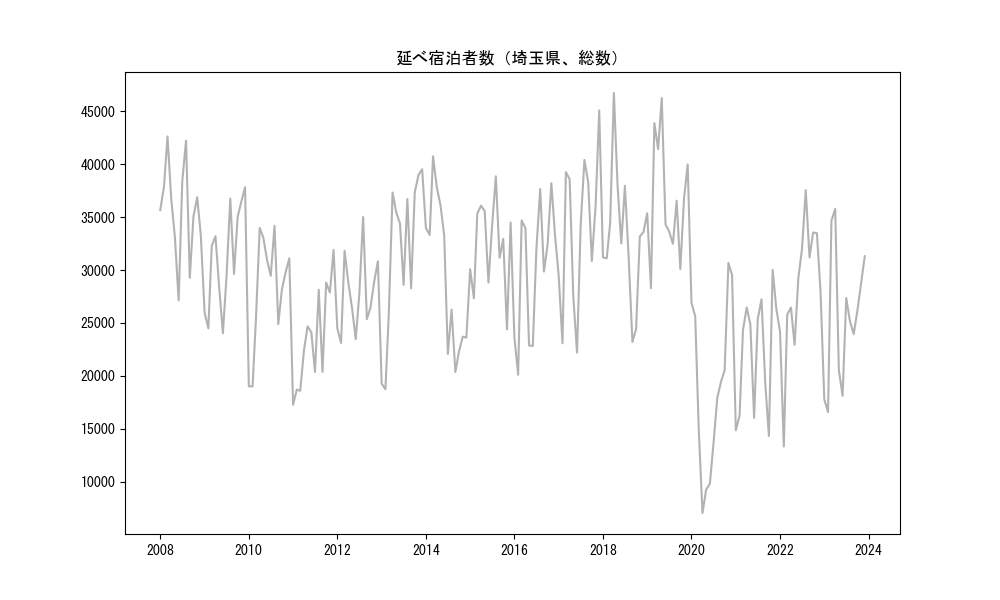
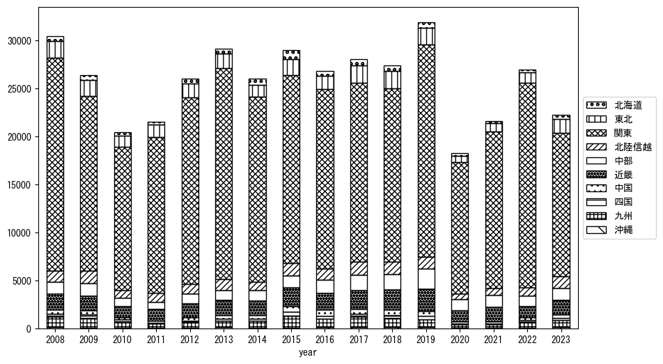
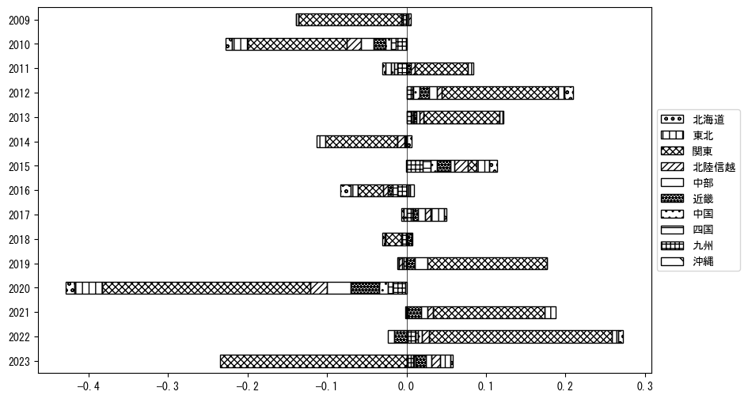
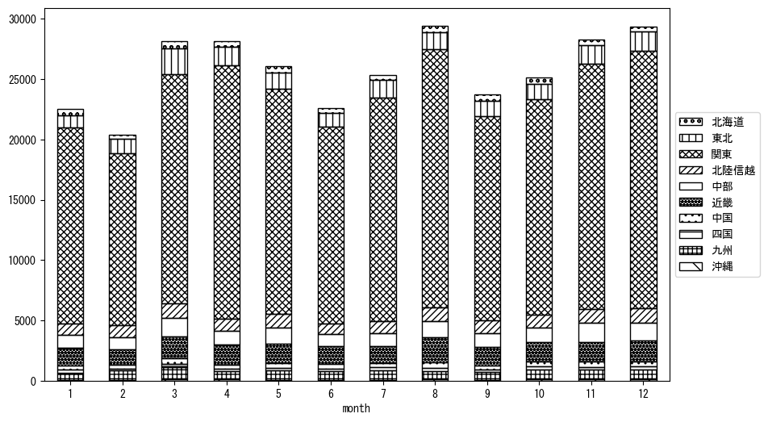
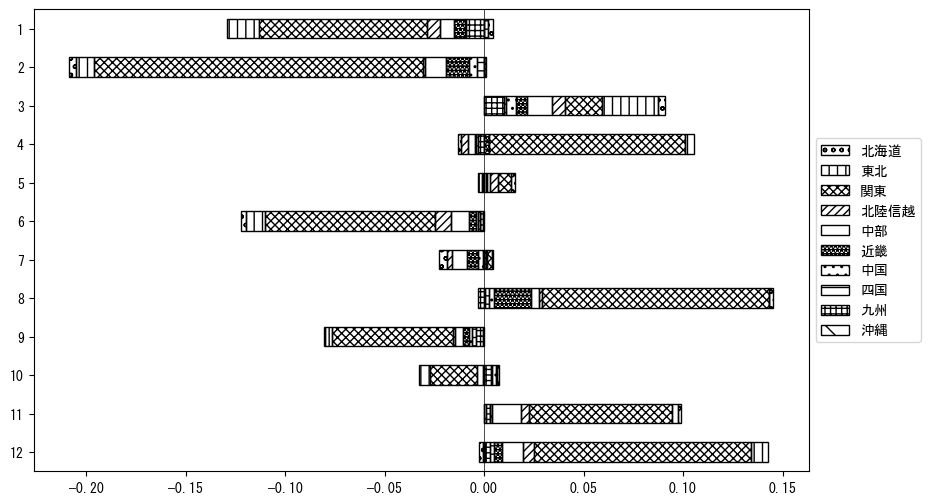

`<!DOCTYPE html>`{=html}
<html lang="ja">
<head>
    <meta charset="UTF-8">
    <meta name="description" content="">
    <link rel="stylesheet" href="../css/style.css">
    <title>宿泊者数の重心 | 埼玉県</title>
</head>    
<body>
<body>
<nav id ="global_navi">
    <ul>
        <li>[トップ](../index.html)</li>
        <li>[使い方](../how_to_use.html)</li>
        <li>[データについて](../on_data.html)</li>
        <li>[算出方法について](../method.html)</li>
        <li>[発展的な使い方](../developer.html)</li>
        <li>[サイトポリシー](../policy.html)</li>
    </ul>
</nav>
<ol class="breadcrumb">
    <li>[トップ](../index.html)</li>
    <li>埼玉県</li>
</ol>
<h1 id="h1_0">埼玉県</h1>

<ul>
  <li> **[１．延べ宿泊者（総数、月次）の推移](#h1_1)** 
    <ul>
      <li> [時系列グラフ](#h2_1) </li>
      <li> [基本統計量](#h2_2) </li>
    </ul>
  </li>  
</ul>

<ul>
  <li> **[２．宿泊者数の重心（年平均の推移）](#h1_2)** 
  <ul>
  <li> [重心の前年平均からの移動距離と方位、および緯度・経度](#h2_4) </li>
  <li> [運輸局別延べ宿泊者数](#h2_5) 
  <ul>
  <li> [時系列（年平均）](#h3_1) </li>
  <li> [寄与度（前年からの変化率に対する）](#h3_2) </li>
  </ul>
  </li>
  </ul>
  </li>
</ul>

<ul>
  <li> **[３．宿泊者数の重心（月別）](#h1_3)** 
  <ul>
  <li> [全期間（2008年1月～2023年12月）の平均と月別平均の比較](#h2_6) </li>
  <li> [運輸局別延べ宿泊者数](#h2_7) 
  <ul>
  <li> [月別平均（2008年1月～2023年12月）](#h3_3) </li>
  <li> [寄与度（全期間の平均から月別平均への変化率に対する）](#h3_4) </li>
  </ul>
  </li>
  </ul>
  </li>
</ul>

<ul>
<li> **[４．データのダウンロード](#h1_4)** </li>
</ul>

<h1 id="h1_1">１．延べ宿泊者（総数）の推移</h1>
<h2 id="h2_1">時系列グラフ</h2>

<figcaption>図１：埼玉県内の従業員数100人以上の宿泊施設での延べ宿泊者数（国外、居住地不詳を含む総数）。</figcaption>

<h2 id="h2_2">基本統計量</h2>
|  | 平均 | 標準偏差 | 最小値 | 最大値 |
|:----:|:----:|:----:|:----:|:----:|
| 2008年 | 35,690 | 4,600 | 27,138 (6月) | 42,635 (3月) |
| 2009年 | 31,134 | 4,861 | 24,033 (6月) | 37,831 (12月) |
| 2010年 | 28,257 | 5,225 | 19,007 (2月) | 34,185 (8月) |
| 2011年 | 23,601 | 4,748 | 17,268 (1月) | 31,907 (12月) |
| 2012年 | 27,719 | 3,578 | 23,111 (2月) | 35,014 (8月) |
| 2013年 | 31,717 | 7,399 | 18,736 (2月) | 39,538 (12月) |
| 2014年 | 29,469 | 7,127 | 20,361 (9月) | 40,760 (3月) |
| 2015年 | 32,440 | 4,175 | 24,384 (11月) | 38,866 (8月) |
| 2016年 | 30,138 | 6,218 | 20,104 (2月) | 38,217 (11月) |
| 2017年 | 33,753 | 7,180 | 22,198 (6月) | 45,100 (12月) |
| 2018年 | 33,128 | 6,188 | 23,207 (9月) | 46,742 (4月) |
| 2019年 | 36,597 | 5,439 | 28,283 (2月) | 46,265 (5月) |
| 2020年 | 18,779 | 8,120 | 7,034 (4月) | 30,679 (11月) |
| 2021年 | 22,115 | 5,577 | 14,321 (10月) | 30,026 (11月) |
| 2022年 | 28,137 | 6,346 | 13,319 (2月) | 37,554 (8月) |
| 2023年 | 25,513 | 6,462 | 16,563 (2月) | 35,777 (4月) |
: 表１：従業員数100人以上の宿泊施設での延べ宿泊者の総数（国外、および居住地不詳を含む）に関する基本統計量。単位は人。平均は１か月あたりの平均値を表す。図１に対応。

<h1 id="h1_2">２．宿泊者数の重心（年平均の推移）</h1>

<iframe src="../html/annual/埼玉県.html" width="1200" height="600"></iframe>
<figcaption>図２：埼玉県内の従業員数100人以上の宿泊施設での宿泊者数（国外、居住地不詳を除く）の重心（年平均の推移）。</figcaption>

[全画面表示](../html/annual/埼玉県.html)

<h2 id="h2_4">重心の前年平均からの移動距離と方位、および緯度・経度</h2>
|  | 方位 | 距離 | 緯度 | 経度 |
|:----:|:----:|:----:|:----:|:----:|
| 2008年 | --- | --- | 35.8896 | 138.8254 |
| 2009年 | 西北西 | 8.2km | 35.9184 | 138.7417 |
| 2010年 | 東南東 | 11.8km | 35.8798 | 138.8630 |
| 2011年 | 東 | 19.4km | 35.9052 | 139.0761 |
| 2012年 | 西北西 | 5.6km | 35.9212 | 139.0174 |
| 2013年 | 南西 | 2.2km | 35.9063 | 139.0016 |
| 2014年 | 北西 | 9.8km | 35.9609 | 138.9161 |
| 2015年 | 西 | 24.4km | 35.9827 | 138.6468 |
| 2016年 | 南南東 | 12.4km | 35.8797 | 138.6991 |
| 2017年 | 西北西 | 5.7km | 35.9078 | 138.6465 |
| 2018年 | 西南西 | 0.9km | 35.9048 | 138.6372 |
| 2019年 | 東南東 | 12.4km | 35.8734 | 138.7687 |
| 2020年 | 東南東 | 20.0km | 35.8341 | 138.9849 |
| 2021年 | 北北東 | 0.7km | 35.8398 | 138.9875 |
| 2022年 | 北東 | 10.5km | 35.9151 | 139.0581 |
| 2023年 | 西 | 31.8km | 35.9324 | 138.7059 |
: 表２：重心の前年平均からの移動距離と方位、および緯度・経度。図２に対応。

<h2 id="h2_5">運輸局別延べ宿泊者数</h2>
<h3 id="h3_1">時系列（年平均）</h3>

<figcaption>図３：埼玉県内の従業員数100人以上の宿泊施設での１か月あたり平均宿泊者数（国外、居住地不詳を除く）の運輸局別内訳。</figcaption>

<h3 id="h3_2">寄与度（前年からの変化率に対する）</h3>

<figcaption>図４：埼玉県内の従業員数100人以上の宿泊施設での運輸局別宿泊者数（国外、居住地不詳を除く）から求めた寄与度。</figcaption>

<h1 id="h1_3">３．宿泊者数の重心（月別）</h3>

<iframe src="../html/monthly/埼玉県.html" width="1200" height="600"></iframe>
<figcaption>図５：埼玉県内の従業員数100人以上の宿泊施設での宿泊者数（国外、居住地不詳を除く）の重心（月別）。観測期間は2008年1月から2023年12月まで。</figcaption>

[全画面表示](../html/monthly/埼玉県.html)

<h2 id="h2_6">全期間（2008年1月～2023年12月）の平均と月別平均の比較</h2>
|  | 方位 | 距離 | 緯度 | 経度 |
|:----:|:----:|:----:|:----:|:----:|
| 全期間 | --- | --- | 35.9032 | 138.8485 |
| 1月 | 北東 | 2.3km | 35.9175 | 138.8670 |
| 2月 | 西 | 7.2km | 35.9025 | 138.7688 |
| 3月 | 北西 | 9.5km | 35.9737 | 138.7895 |
| 4月 | 東 | 11.3km | 35.8953 | 138.9737 |
| 5月 | 西北西 | 2.9km | 35.9099 | 138.8177 |
| 6月 | 南西 | 3.3km | 35.8832 | 138.8209 |
| 7月 | 東南東 | 5.6km | 35.8906 | 138.9090 |
| 8月 | 南東 | 5.8km | 35.8678 | 138.8953 |
| 9月 | 北東 | 3.7km | 35.9297 | 138.8726 |
| 10月 | 西 | 7.9km | 35.8967 | 138.7613 |
| 11月 | 南西 | 2.1km | 35.8923 | 138.8298 |
| 12月 | 南東 | 3.7km | 35.8791 | 138.8765 |
: 表３：全期間の平均から月別平均までの移動距離と方位、および緯度・経度。図５に対応。

<h2 id="h2_7">運輸局別延べ宿泊者数</h2>
<h3 id="h3_3">月別平均（2008年1月～2023年12月）</h3>

<figcaption>図６：埼玉県内の従業員数100人以上の宿泊施設での宿泊者数（国外、居住地不詳を除く）の運輸局別内訳（月別）。</figcaption>

<h3 id="h3_4">寄与度（全期間の平均から月別平均への変化率に対する）</h3>

<figcaption>図７：埼玉県内の従業員数100人以上の宿泊施設での運輸局別宿泊者数（国外、居住地不詳を除く）から求めた寄与度（月別）。</figcaption>

</body>

<h1 id="h1_4">４．データのダウンロード</h1>
 <ul>
  <li> <a href="../csv/data_by_pref/延べ宿泊者数および重心（埼玉県）.csv" download>延べ宿泊者数および重心の緯度経度</a> </li>
  <li> <a href="../csv/bar_chart/運輸局別_年平均（埼玉県）.csv" download>運輸局別延べ宿泊者数（年平均）</a></li>
  <li> <a href="../csv/bar_chart_month/運輸局別_月別（埼玉県）.csv" download>運輸局別延べ宿泊者数（月別）</a></li>
  <li> <a href="../csv/contrib/前年からの変化率に対する寄与度（埼玉県）.csv" download>前年からの変化率に対する寄与度</a></li>
  <li> <a href="../csv/contrib_month/月別平均への変化率に対する寄与度（埼玉県）.csv" download>月別平均への変化率に対する寄与度</a></li>
</ul>

出典：観光庁「宿泊旅行統計調査」に収録された「施設所在地別、居住地別延べ宿泊者数（従業員数100人以上の施設）」

国土地理院「白地図（[地理院タイル](https://maps.gsi.go.jp/development/ichiran.html)）」（図２と図５）

