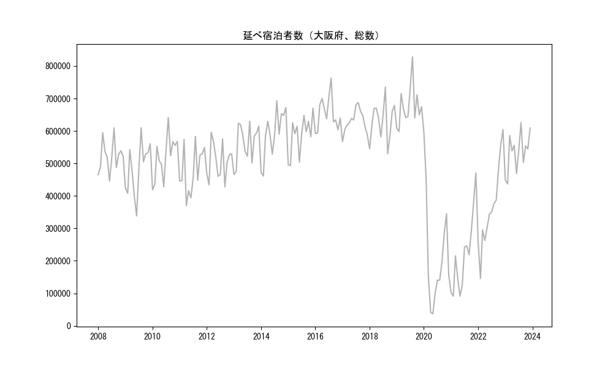
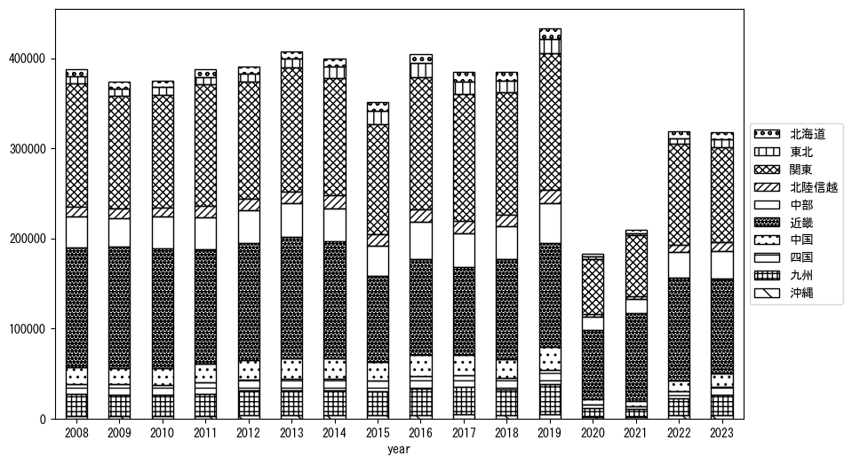
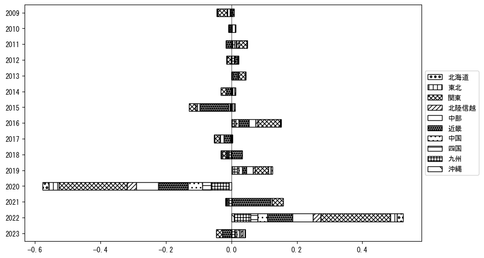
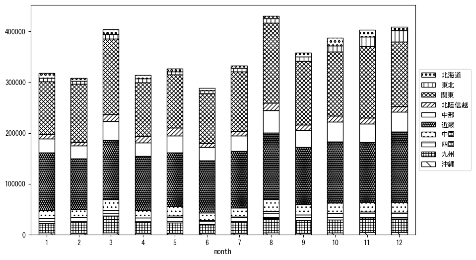
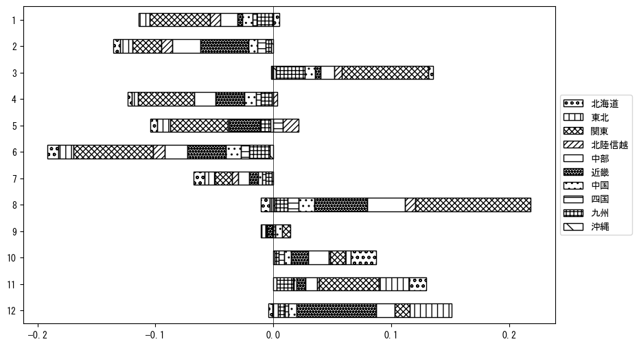

`<!DOCTYPE html>`{=html}
<html lang="ja">
<head>
    <meta charset="UTF-8">
    <meta name="description" content="">
    <link rel="stylesheet" href="../css/style.css">
    <title>宿泊者数の重心 | 大阪府</title>
</head>    
<body>
<body>
<nav id ="global_navi">
    <ul>
        <li>[トップ](../index.html)</li>
        <li>[使い方](../how_to_use.html)</li>
        <li>[データについて](../on_data.html)</li>
        <li>[算出方法について](../method.html)</li>
        <li>[発展的な使い方](../developer.html)</li>
        <li>[サイトポリシー](../policy.html)</li>
    </ul>
</nav>
<ol class="breadcrumb">
    <li>[トップ](../index.html)</li>
    <li>大阪府</li>
</ol>
<h1 id="h1_0">大阪府</h1>

<ul>
  <li> **[１．延べ宿泊者（総数、月次）の推移](#h1_1)** 
    <ul>
      <li> [時系列グラフ](#h2_1) </li>
      <li> [基本統計量](#h2_2) </li>
    </ul>
  </li>  
</ul>

<ul>
  <li> **[２．宿泊者数の重心（年平均の推移）](#h1_2)** 
  <ul>
  <li> [重心の前年平均からの移動距離と方位、および緯度・経度](#h2_4) </li>
  <li> [運輸局別延べ宿泊者数](#h2_5) 
  <ul>
  <li> [時系列（年平均）](#h3_1) </li>
  <li> [寄与度（前年からの変化率に対する）](#h3_2) </li>
  </ul>
  </li>
  </ul>
  </li>
</ul>

<ul>
  <li> **[３．宿泊者数の重心（月別）](#h1_3)** 
  <ul>
  <li> [全期間（2008年1月～2023年12月）の平均と月別平均の比較](#h2_6) </li>
  <li> [運輸局別延べ宿泊者数](#h2_7) 
  <ul>
  <li> [月別平均（2008年1月～2023年12月）](#h3_3) </li>
  <li> [寄与度（全期間の平均から月別平均への変化率に対する）](#h3_4) </li>
  </ul>
  </li>
  </ul>
  </li>
</ul>

<ul>
<li> **[４．データのダウンロード](#h1_4)** </li>
</ul>

<h1 id="h1_1">１．延べ宿泊者（総数）の推移</h1>
<h2 id="h2_1">時系列グラフ</h2>

<figcaption>図１：大阪府内の従業員数100人以上の宿泊施設での延べ宿泊者数（国外、居住地不詳を含む総数）。</figcaption>

<h2 id="h2_2">基本統計量</h2>
|  | 平均 | 標準偏差 | 最小値 | 最大値 |
|:----:|:----:|:----:|:----:|:----:|
| 2008年 | 521,381 | 47,474 | 445,751 (6月) | 609,567 (8月) |
| 2009年 | 484,122 | 78,496 | 338,474 (6月) | 610,110 (8月) |
| 2010年 | 519,558 | 66,264 | 419,119 (1月) | 641,761 (8月) |
| 2011年 | 477,997 | 71,616 | 369,782 (4月) | 583,214 (8月) |
| 2012年 | 506,429 | 55,853 | 427,635 (9月) | 596,001 (3月) |
| 2013年 | 562,737 | 59,628 | 465,861 (1月) | 629,986 (8月) |
| 2014年 | 592,251 | 74,155 | 461,225 (2月) | 693,343 (8月) |
| 2015年 | 586,910 | 59,419 | 493,075 (2月) | 670,356 (12月) |
| 2016年 | 653,726 | 51,412 | 592,394 (1月) | 763,311 (8月) |
| 2017年 | 630,189 | 35,835 | 567,179 (1月) | 687,494 (8月) |
| 2018年 | 630,198 | 60,185 | 529,650 (9月) | 735,414 (8月) |
| 2019年 | 675,926 | 63,193 | 598,355 (2月) | 828,201 (8月) |
| 2020年 | 220,112 | 169,333 | 37,004 (5月) | 597,003 (1月) |
| 2021年 | 218,716 | 119,276 | 91,030 (2月) | 470,619 (12月) |
| 2022年 | 363,614 | 131,009 | 145,589 (2月) | 604,481 (12月) |
| 2023年 | 534,429 | 60,068 | 436,892 (2月) | 625,857 (8月) |
: 表１：従業員数100人以上の宿泊施設での延べ宿泊者の総数（国外、および居住地不詳を含む）に関する基本統計量。単位は人。平均は１か月あたりの平均値を表す。図１に対応。

<h1 id="h1_2">２．宿泊者数の重心（年平均の推移）</h1>

<iframe src="../html/annual/大阪府.html" width="1200" height="600"></iframe>
<figcaption>図２：大阪府内の従業員数100人以上の宿泊施設での宿泊者数（国外、居住地不詳を除く）の重心（年平均の推移）。</figcaption>

[全画面表示](../html/annual/大阪府.html)

<h2 id="h2_4">重心の前年平均からの移動距離と方位、および緯度・経度</h2>
|  | 方位 | 距離 | 緯度 | 経度 |
|:----:|:----:|:----:|:----:|:----:|
| 2008年 | --- | --- | 35.2244 | 136.8218 |
| 2009年 | 西南西 | 9.5km | 35.1892 | 136.7269 |
| 2010年 | 東 | 1.5km | 35.1909 | 136.7431 |
| 2011年 | 北東 | 4.9km | 35.2234 | 136.7789 |
| 2012年 | 西南西 | 9.3km | 35.1923 | 136.6846 |
| 2013年 | 東北東 | 3.1km | 35.1982 | 136.7174 |
| 2014年 | 北 | 4.2km | 35.2357 | 136.7101 |
| 2015年 | 北東 | 18.3km | 35.3556 | 136.8490 |
| 2016年 | 東 | 5.4km | 35.3471 | 136.9071 |
| 2017年 | 西南西 | 4.7km | 35.3254 | 136.8626 |
| 2018年 | 南西 | 3.4km | 35.3001 | 136.8408 |
| 2019年 | 西 | 2.8km | 35.3047 | 136.8104 |
| 2020年 | 南南西 | 29.0km | 35.0833 | 136.6415 |
| 2021年 | 東 | 5.3km | 35.0798 | 136.6992 |
| 2022年 | 北東 | 18.7km | 35.2017 | 136.8412 |
| 2023年 | 西北西 | 10.1km | 35.2257 | 136.7344 |
: 表２：重心の前年平均からの移動距離と方位、および緯度・経度。図２に対応。

<h2 id="h2_5">運輸局別延べ宿泊者数</h2>
<h3 id="h3_1">時系列（年平均）</h3>

<figcaption>図３：大阪府内の従業員数100人以上の宿泊施設での１か月あたり平均宿泊者数（国外、居住地不詳を除く）の運輸局別内訳。</figcaption>

<h3 id="h3_2">寄与度（前年からの変化率に対する）</h3>

<figcaption>図４：大阪府内の従業員数100人以上の宿泊施設での運輸局別宿泊者数（国外、居住地不詳を除く）から求めた寄与度。</figcaption>

<h1 id="h1_3">３．宿泊者数の重心（月別）</h3>

<iframe src="../html/monthly/大阪府.html" width="1200" height="600"></iframe>
<figcaption>図５：大阪府内の従業員数100人以上の宿泊施設での宿泊者数（国外、居住地不詳を除く）の重心（月別）。観測期間は2008年1月から2023年12月まで。</figcaption>

[全画面表示](../html/monthly/大阪府.html)

<h2 id="h2_6">全期間（2008年1月～2023年12月）の平均と月別平均の比較</h2>
|  | 方位 | 距離 | 緯度 | 経度 |
|:----:|:----:|:----:|:----:|:----:|
| 全期間 | --- | --- | 35.2299 | 136.7731 |
| 1月 | 北西 | 3.3km | 35.2520 | 136.7482 |
| 2月 | 南 | 5.8km | 35.1782 | 136.7841 |
| 3月 | 東 | 3.6km | 35.2314 | 136.8129 |
| 4月 | 南西 | 3.5km | 35.2088 | 136.7446 |
| 5月 | 西南西 | 15.7km | 35.1651 | 136.6202 |
| 6月 | 南南西 | 10.3km | 35.1461 | 136.7254 |
| 7月 | 南南西 | 10.1km | 35.1436 | 136.7366 |
| 8月 | 南南東 | 8.8km | 35.1564 | 136.8087 |
| 9月 | 南西 | 1.1km | 35.2235 | 136.7645 |
| 10月 | 北北東 | 18.2km | 35.3866 | 136.8332 |
| 11月 | 北東 | 24.1km | 35.3972 | 136.9417 |
| 12月 | 北北西 | 4.6km | 35.2695 | 136.7568 |
: 表３：全期間の平均から月別平均までの移動距離と方位、および緯度・経度。図５に対応。

<h2 id="h2_7">運輸局別延べ宿泊者数</h2>
<h3 id="h3_3">月別平均（2008年1月～2023年12月）</h3>

<figcaption>図６：大阪府内の従業員数100人以上の宿泊施設での宿泊者数（国外、居住地不詳を除く）の運輸局別内訳（月別）。</figcaption>

<h3 id="h3_4">寄与度（全期間の平均から月別平均への変化率に対する）</h3>

<figcaption>図７：大阪府内の従業員数100人以上の宿泊施設での運輸局別宿泊者数（国外、居住地不詳を除く）から求めた寄与度（月別）。</figcaption>

</body>

<h1 id="h1_4">４．データのダウンロード</h1>
 <ul>
  <li> <a href="../csv/data_by_pref/延べ宿泊者数および重心（大阪府）.csv" download>延べ宿泊者数および重心の緯度経度</a> </li>
  <li> <a href="../csv/bar_chart/運輸局別_年平均（大阪府）.csv" download>運輸局別延べ宿泊者数（年平均）</a></li>
  <li> <a href="../csv/bar_chart_month/運輸局別_月別（大阪府）.csv" download>運輸局別延べ宿泊者数（月別）</a></li>
  <li> <a href="../csv/contrib/前年からの変化率に対する寄与度（大阪府）.csv" download>前年からの変化率に対する寄与度</a></li>
  <li> <a href="../csv/contrib_month/月別平均への変化率に対する寄与度（大阪府）.csv" download>月別平均への変化率に対する寄与度</a></li>
</ul>

出典：観光庁「宿泊旅行統計調査」に収録された「施設所在地別、居住地別延べ宿泊者数（従業員数100人以上の施設）」

国土地理院「白地図（[地理院タイル](https://maps.gsi.go.jp/development/ichiran.html)）」（図２と図５）

