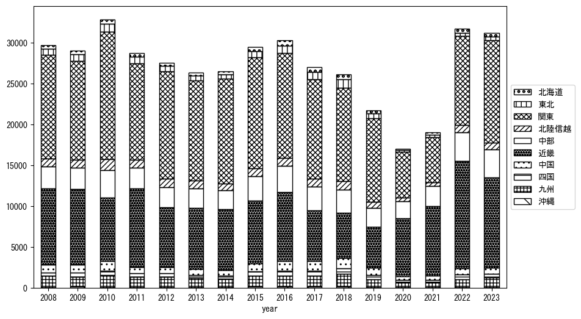
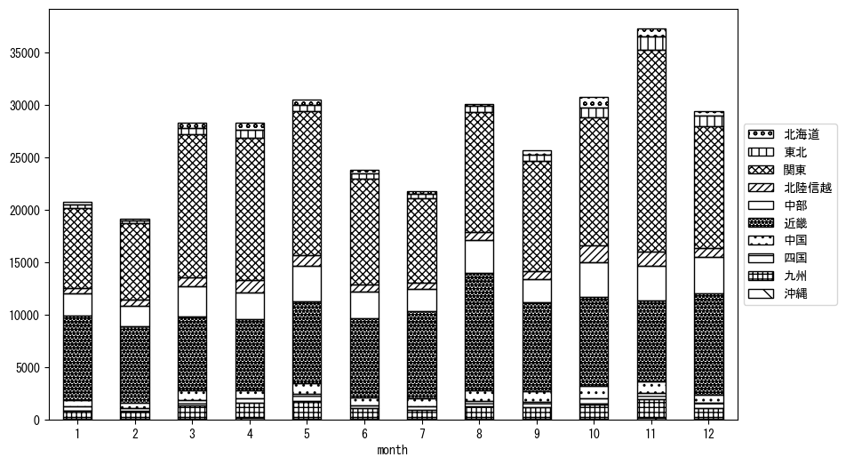

`<!DOCTYPE html>`{=html}
<html lang="ja">
<head>
    <meta charset="UTF-8">
    <meta name="description" content="">
    <link rel="stylesheet" href="../css/style.css">
    <title>宿泊者数の重心 | 奈良県</title>
</head>    
<body>
<body>
<nav id ="global_navi">
    <ul>
        <li>[トップ](../index.html)</li>
        <li>[使い方](../how_to_use.html)</li>
        <li>[データについて](../on_data.html)</li>
        <li>[算出方法について](../method.html)</li>
        <li>[発展的な使い方](../developer.html)</li>
        <li>[サイトポリシー](../policy.html)</li>
    </ul>
</nav>
<ol class="breadcrumb">
    <li>[トップ](../index.html)</li>
    <li>奈良県</li>
</ol>
<h1 id="h1_0">奈良県</h1>

<ul>
  <li> **[１．延べ宿泊者（総数、月次）の推移](#h1_1)** 
    <ul>
      <li> [時系列グラフ](#h2_1) </li>
      <li> [基本統計量](#h2_2) </li>
    </ul>
  </li>  
</ul>

<ul>
  <li> **[２．宿泊者数の重心（年平均の推移）](#h1_2)** 
  <ul>
  <li> [重心の前年平均からの移動距離と方位、および緯度・経度](#h2_4) </li>
  <li> [運輸局別延べ宿泊者数](#h2_5) 
  <ul>
  <li> [時系列（年平均）](#h3_1) </li>
  <li> [寄与度（前年からの変化率に対する）](#h3_2) </li>
  </ul>
  </li>
  </ul>
  </li>
</ul>

<ul>
  <li> **[３．宿泊者数の重心（月別）](#h1_3)** 
  <ul>
  <li> [全期間（2008年1月～2023年12月）の平均と月別平均の比較](#h2_6) </li>
  <li> [運輸局別延べ宿泊者数](#h2_7) 
  <ul>
  <li> [月別平均（2008年1月～2023年12月）](#h3_3) </li>
  <li> [寄与度（全期間の平均から月別平均への変化率に対する）](#h3_4) </li>
  </ul>
  </li>
  </ul>
  </li>
</ul>

<ul>
<li> **[４．データのダウンロード](#h1_4)** </li>
</ul>

<h1 id="h1_1">１．延べ宿泊者（総数）の推移</h1>
<h2 id="h2_1">時系列グラフ</h2>

<figcaption>図１：奈良県内の従業員数100人以上の宿泊施設での延べ宿泊者数（国外、居住地不詳を含む総数）。</figcaption>

<h2 id="h2_2">基本統計量</h2>
|  | 平均 | 標準偏差 | 最小値 | 最大値 |
|:----:|:----:|:----:|:----:|:----:|
| 2008年 | 31,845 | 8,092 | 18,897 (2月) | 44,299 (11月) |
| 2009年 | 30,388 | 7,906 | 19,461 (6月) | 43,620 (11月) |
| 2010年 | 36,698 | 9,509 | 19,762 (1月) | 49,988 (5月) |
| 2011年 | 29,539 | 5,864 | 19,737 (1月) | 39,902 (8月) |
| 2012年 | 28,966 | 8,380 | 14,912 (1月) | 40,983 (4月) |
| 2013年 | 30,215 | 6,075 | 19,118 (1月) | 37,328 (11月) |
| 2014年 | 29,784 | 6,213 | 21,414 (1月) | 40,005 (11月) |
| 2015年 | 37,810 | 7,015 | 24,260 (1月) | 46,041 (11月) |
| 2016年 | 38,136 | 4,306 | 31,753 (1月) | 43,885 (8月) |
| 2017年 | 32,196 | 5,906 | 22,736 (2月) | 43,473 (11月) |
| 2018年 | 32,079 | 6,630 | 24,158 (10月) | 42,622 (5月) |
| 2019年 | 26,688 | 5,348 | 17,486 (2月) | 32,386 (11月) |
| 2020年 | 17,864 | 10,451 | 2,442 (5月) | 34,741 (11月) |
| 2021年 | 19,487 | 9,883 | 8,073 (2月) | 37,786 (12月) |
| 2022年 | 32,422 | 9,024 | 16,654 (2月) | 45,430 (12月) |
| 2023年 | 35,085 | 4,264 | 27,303 (7月) | 40,985 (1月) |
: 表１：従業員数100人以上の宿泊施設での延べ宿泊者の総数（国外、および居住地不詳を含む）に関する基本統計量。単位は人。平均は１か月あたりの平均値を表す。図１に対応。

<h1 id="h1_2">２．宿泊者数の重心（年平均の推移）</h1>

<iframe src="../html/annual/奈良県.html" width="1200" height="600"></iframe>
<figcaption>図２：奈良県内の従業員数100人以上の宿泊施設での宿泊者数（国外、居住地不詳を除く）の重心（年平均の推移）。</figcaption>

[全画面表示](../html/annual/奈良県.html)

<h2 id="h2_4">重心の前年平均からの移動距離と方位、および緯度・経度</h2>
|  | 方位 | 距離 | 緯度 | 経度 |
|:----:|:----:|:----:|:----:|:----:|
| 2008年 | --- | --- | 35.3513 | 137.3679 |
| 2009年 | 西南西 | 4.5km | 35.3364 | 137.3216 |
| 2010年 | 東北東 | 32.4km | 35.4535 | 137.6478 |
| 2011年 | 西南西 | 23.8km | 35.3635 | 137.4100 |
| 2012年 | 東北東 | 21.0km | 35.4029 | 137.6363 |
| 2013年 | 西 | 6.0km | 35.3990 | 137.5702 |
| 2014年 | 東南東 | 6.5km | 35.3757 | 137.6363 |
| 2015年 | 西北西 | 9.1km | 35.4050 | 137.5425 |
| 2016年 | 西 | 10.2km | 35.4122 | 137.4309 |
| 2017年 | 北東 | 8.9km | 35.4627 | 137.5071 |
| 2018年 | 西北西 | 6.4km | 35.4791 | 137.4396 |
| 2019年 | 東南東 | 11.3km | 35.4432 | 137.5562 |
| 2020年 | 西南西 | 73.2km | 35.1466 | 136.8375 |
| 2021年 | 西北西 | 4.9km | 35.1695 | 136.7915 |
| 2022年 | 東北東 | 26.7km | 35.2414 | 137.0713 |
| 2023年 | 東北東 | 22.6km | 35.3091 | 137.3053 |
: 表２：重心の前年平均からの移動距離と方位、および緯度・経度。図２に対応。

<h2 id="h2_5">運輸局別延べ宿泊者数</h2>
<h3 id="h3_1">時系列（年平均）</h3>

<figcaption>図３：奈良県内の従業員数100人以上の宿泊施設での１か月あたり平均宿泊者数（国外、居住地不詳を除く）の運輸局別内訳。</figcaption>

<h3 id="h3_2">寄与度（前年からの変化率に対する）</h3>

<figcaption>図４：奈良県内の従業員数100人以上の宿泊施設での運輸局別宿泊者数（国外、居住地不詳を除く）から求めた寄与度。</figcaption>

<h1 id="h1_3">３．宿泊者数の重心（月別）</h3>

<iframe src="../html/monthly/奈良県.html" width="1200" height="600"></iframe>
<figcaption>図５：奈良県内の従業員数100人以上の宿泊施設での宿泊者数（国外、居住地不詳を除く）の重心（月別）。観測期間は2008年1月から2023年12月まで。</figcaption>

[全画面表示](../html/monthly/奈良県.html)

<h2 id="h2_6">全期間（2008年1月～2023年12月）の平均と月別平均の比較</h2>
|  | 方位 | 距離 | 緯度 | 経度 |
|:----:|:----:|:----:|:----:|:----:|
| 全期間 | --- | --- | 35.3594 | 137.3795 |
| 1月 | 西南西 | 26.1km | 35.2415 | 137.1310 |
| 2月 | 南西 | 21.3km | 35.2500 | 137.1869 |
| 3月 | 東北東 | 20.3km | 35.4195 | 137.5905 |
| 4月 | 東北東 | 23.1km | 35.4732 | 137.5920 |
| 5月 | 南南西 | 4.1km | 35.3234 | 137.3685 |
| 6月 | 南南西 | 7.8km | 35.3005 | 137.3333 |
| 7月 | 西南西 | 24.4km | 35.2595 | 137.1410 |
| 8月 | 南西 | 25.7km | 35.2199 | 137.1544 |
| 9月 | 西南西 | 10.1km | 35.3246 | 137.2766 |
| 10月 | 北北東 | 25.9km | 35.5794 | 137.4746 |
| 11月 | 東北東 | 45.5km | 35.5327 | 137.8341 |
| 12月 | 東北東 | 9.0km | 35.3892 | 137.4711 |
: 表３：全期間の平均から月別平均までの移動距離と方位、および緯度・経度。図５に対応。

<h2 id="h2_7">運輸局別延べ宿泊者数</h2>
<h3 id="h3_3">月別平均（2008年1月～2023年12月）</h3>

<figcaption>図６：奈良県内の従業員数100人以上の宿泊施設での宿泊者数（国外、居住地不詳を除く）の運輸局別内訳（月別）。</figcaption>

<h3 id="h3_4">寄与度（全期間の平均から月別平均への変化率に対する）</h3>

<figcaption>図７：奈良県内の従業員数100人以上の宿泊施設での運輸局別宿泊者数（国外、居住地不詳を除く）から求めた寄与度（月別）。</figcaption>

</body>

<h1 id="h1_4">４．データのダウンロード</h1>
 <ul>
  <li> <a href="../csv/data_by_pref/延べ宿泊者数および重心（奈良県）.csv" download>延べ宿泊者数および重心の緯度経度</a> </li>
  <li> <a href="../csv/bar_chart/運輸局別_年平均（奈良県）.csv" download>運輸局別延べ宿泊者数（年平均）</a></li>
  <li> <a href="../csv/bar_chart_month/運輸局別_月別（奈良県）.csv" download>運輸局別延べ宿泊者数（月別）</a></li>
  <li> <a href="../csv/contrib/前年からの変化率に対する寄与度（奈良県）.csv" download>前年からの変化率に対する寄与度</a></li>
  <li> <a href="../csv/contrib_month/月別平均への変化率に対する寄与度（奈良県）.csv" download>月別平均への変化率に対する寄与度</a></li>
</ul>

出典：観光庁「宿泊旅行統計調査」に収録された「施設所在地別、居住地別延べ宿泊者数（従業員数100人以上の施設）」

国土地理院「白地図（[地理院タイル](https://maps.gsi.go.jp/development/ichiran.html)）」（図２と図５）

