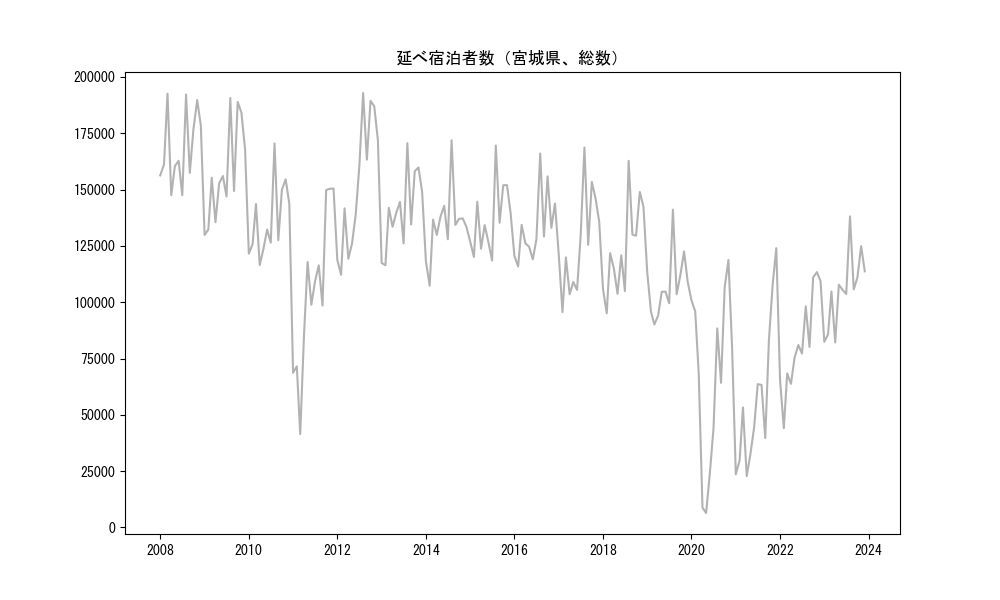
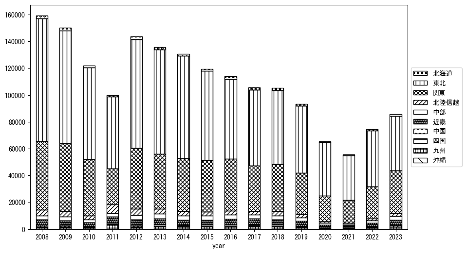
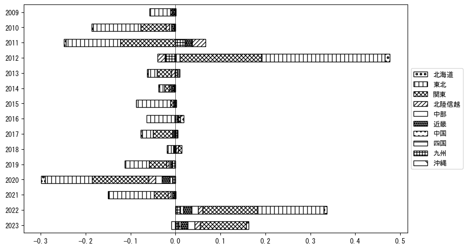
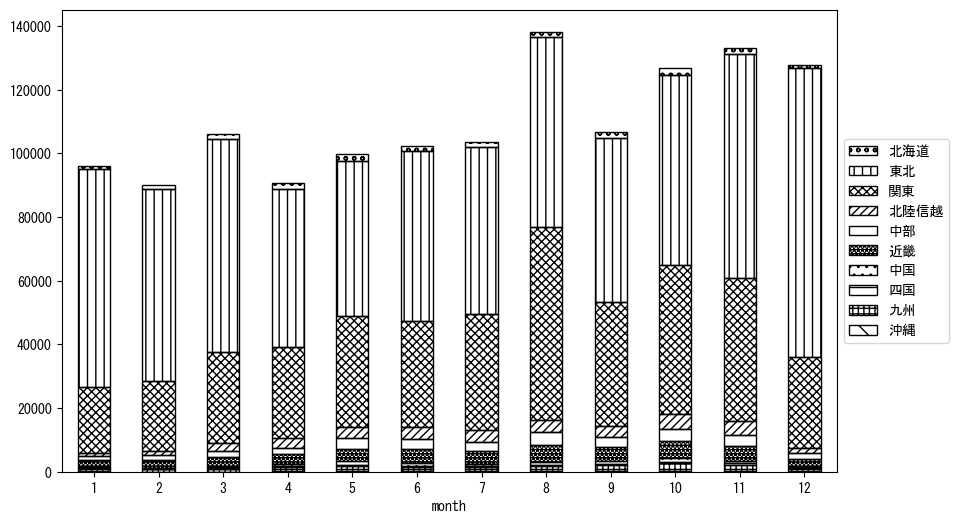
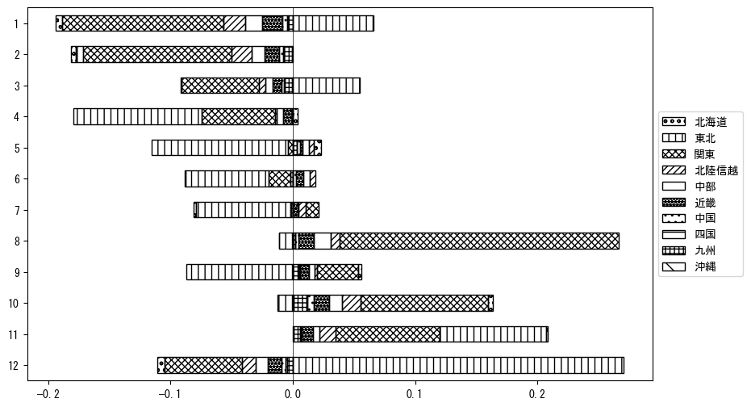

`<!DOCTYPE html>`{=html}
<html lang="ja">
<head>
    <meta charset="UTF-8">
    <meta name="description" content="">
    <link rel="stylesheet" href="../css/style.css">
    <title>宿泊者数の重心 | 宮城県</title>
</head>    
<body>
<body>
<nav id ="global_navi">
    <ul>
        <li>[トップ](../index.html)</li>
        <li>[使い方](../how_to_use.html)</li>
        <li>[データについて](../on_data.html)</li>
        <li>[算出方法について](../method.html)</li>
        <li>[発展的な使い方](../developer.html)</li>
        <li>[サイトポリシー](../policy.html)</li>
    </ul>
</nav>
<ol class="breadcrumb">
    <li>[トップ](../index.html)</li>
    <li>宮城県</li>
</ol>
<h1 id="h1_0">宮城県</h1>

<ul>
  <li> **[１．延べ宿泊者（総数、月次）の推移](#h1_1)** 
    <ul>
      <li> [時系列グラフ](#h2_1) </li>
      <li> [基本統計量](#h2_2) </li>
    </ul>
  </li>  
</ul>

<ul>
  <li> **[２．宿泊者数の重心（年平均の推移）](#h1_2)** 
  <ul>
  <li> [重心の前年平均からの移動距離と方位、および緯度・経度](#h2_4) </li>
  <li> [運輸局別延べ宿泊者数](#h2_5) 
  <ul>
  <li> [時系列（年平均）](#h3_1) </li>
  <li> [寄与度（前年からの変化率に対する）](#h3_2) </li>
  </ul>
  </li>
  </ul>
  </li>
</ul>

<ul>
  <li> **[３．宿泊者数の重心（月別）](#h1_3)** 
  <ul>
  <li> [全期間（2008年1月～2023年12月）の平均と月別平均の比較](#h2_6) </li>
  <li> [運輸局別延べ宿泊者数](#h2_7) 
  <ul>
  <li> [月別平均（2008年1月～2023年12月）](#h3_3) </li>
  <li> [寄与度（全期間の平均から月別平均への変化率に対する）](#h3_4) </li>
  </ul>
  </li>
  </ul>
  </li>
</ul>

<ul>
<li> **[４．データのダウンロード](#h1_4)** </li>
</ul>

<h1 id="h1_1">１．延べ宿泊者（総数）の推移</h1>
<h2 id="h2_1">時系列グラフ</h2>

<figcaption>図１：宮城県内の従業員数100人以上の宿泊施設での延べ宿泊者数（国外、居住地不詳を含む総数）。</figcaption>

<h2 id="h2_2">基本統計量</h2>
|  | 平均 | 標準偏差 | 最小値 | 最大値 |
|:----:|:----:|:----:|:----:|:----:|
| 2008年 | 168,550 | 16,699 | 147,461 (7月) | 192,556 (3月) |
| 2009年 | 157,438 | 21,295 | 129,828 (1月) | 190,614 (8月) |
| 2010年 | 136,314 | 16,157 | 116,492 (4月) | 170,482 (8月) |
| 2011年 | 104,838 | 34,898 | 41,443 (3月) | 150,449 (12月) |
| 2012年 | 151,793 | 29,530 | 112,161 (2月) | 192,852 (8月) |
| 2013年 | 140,929 | 16,741 | 116,398 (2月) | 170,557 (8月) |
| 2014年 | 134,540 | 15,269 | 107,327 (2月) | 171,879 (8月) |
| 2015年 | 136,905 | 15,362 | 118,467 (7月) | 169,549 (8月) |
| 2016年 | 133,025 | 15,168 | 115,819 (2月) | 166,019 (8月) |
| 2017年 | 126,113 | 21,904 | 95,614 (2月) | 168,669 (8月) |
| 2018年 | 123,391 | 20,358 | 95,079 (2月) | 162,760 (8月) |
| 2019年 | 107,500 | 13,901 | 90,121 (3月) | 141,069 (8月) |
| 2020年 | 67,220 | 38,468 | 6,427 (5月) | 118,760 (11月) |
| 2021年 | 57,295 | 32,940 | 22,777 (4月) | 123,978 (12月) |
| 2022年 | 82,268 | 21,608 | 44,083 (2月) | 113,339 (11月) |
| 2023年 | 105,422 | 16,555 | 82,126 (4月) | 138,096 (8月) |
: 表１：従業員数100人以上の宿泊施設での延べ宿泊者の総数（国外、および居住地不詳を含む）に関する基本統計量。単位は人。平均は１か月あたりの平均値を表す。図１に対応。

<h1 id="h1_2">２．宿泊者数の重心（年平均の推移）</h1>

<iframe src="../html/annual/宮城県.html" width="1200" height="600"></iframe>
<figcaption>図２：宮城県内の従業員数100人以上の宿泊施設での宿泊者数（国外、居住地不詳を除く）の重心（年平均の推移）。</figcaption>

[全画面表示](../html/annual/宮城県.html)

<h2 id="h2_4">重心の前年平均からの移動距離と方位、および緯度・経度</h2>
|  | 方位 | 距離 | 緯度 | 経度 |
|:----:|:----:|:----:|:----:|:----:|
| 2008年 | --- | --- | 37.3833 | 140.0157 |
| 2009年 | 東北東 | 1.0km | 37.3874 | 140.0256 |
| 2010年 | 南 | 1.3km | 37.3756 | 140.0257 |
| 2011年 | 西南西 | 38.2km | 37.2373 | 139.6311 |
| 2012年 | 東北東 | 34.5km | 37.3843 | 139.9742 |
| 2013年 | 西南西 | 6.5km | 37.3615 | 139.9066 |
| 2014年 | 北東 | 6.1km | 37.3969 | 139.9596 |
| 2015年 | 南西 | 11.6km | 37.3149 | 139.8789 |
| 2016年 | 南西 | 9.1km | 37.2653 | 139.7977 |
| 2017年 | 北西 | 4.0km | 37.2935 | 139.7703 |
| 2018年 | 南 | 2.2km | 37.2736 | 139.7746 |
| 2019年 | 北東 | 6.8km | 37.3129 | 139.8341 |
| 2020年 | 北東 | 26.3km | 37.4559 | 140.0715 |
| 2021年 | 南南西 | 8.6km | 37.3815 | 140.0459 |
| 2022年 | 西南西 | 14.4km | 37.3242 | 139.8998 |
| 2023年 | 南西 | 31.6km | 37.1203 | 139.6510 |
: 表２：重心の前年平均からの移動距離と方位、および緯度・経度。図２に対応。

<h2 id="h2_5">運輸局別延べ宿泊者数</h2>
<h3 id="h3_1">時系列（年平均）</h3>

<figcaption>図３：宮城県内の従業員数100人以上の宿泊施設での１か月あたり平均宿泊者数（国外、居住地不詳を除く）の運輸局別内訳。</figcaption>

<h3 id="h3_2">寄与度（前年からの変化率に対する）</h3>

<figcaption>図４：宮城県内の従業員数100人以上の宿泊施設での運輸局別宿泊者数（国外、居住地不詳を除く）から求めた寄与度。</figcaption>

<h1 id="h1_3">３．宿泊者数の重心（月別）</h3>

<iframe src="../html/monthly/宮城県.html" width="1200" height="600"></iframe>
<figcaption>図５：宮城県内の従業員数100人以上の宿泊施設での宿泊者数（国外、居住地不詳を除く）の重心（月別）。観測期間は2008年1月から2023年12月まで。</figcaption>

[全画面表示](../html/monthly/宮城県.html)

<h2 id="h2_6">全期間（2008年1月～2023年12月）の平均と月別平均の比較</h2>
|  | 方位 | 距離 | 緯度 | 経度 |
|:----:|:----:|:----:|:----:|:----:|
| 全期間 | --- | --- | 37.3293 | 139.8914 |
| 1月 | 北東 | 47.9km | 37.6744 | 140.2162 |
| 2月 | 北東 | 38.5km | 37.6026 | 140.1587 |
| 3月 | 北東 | 29.1km | 37.5423 | 140.0840 |
| 4月 | 西 | 4.7km | 37.3253 | 139.8389 |
| 5月 | 南西 | 19.6km | 37.2131 | 139.7248 |
| 6月 | 西南西 | 11.9km | 37.2740 | 139.7760 |
| 7月 | 南西 | 14.9km | 37.2181 | 139.7982 |
| 8月 | 南南西 | 41.5km | 36.9755 | 139.7408 |
| 9月 | 南西 | 27.8km | 37.1456 | 139.6776 |
| 10月 | 南西 | 36.6km | 37.0803 | 139.6218 |
| 11月 | 南西 | 11.5km | 37.2436 | 139.8176 |
| 12月 | 北東 | 47.8km | 37.6565 | 140.2421 |
: 表３：全期間の平均から月別平均までの移動距離と方位、および緯度・経度。図５に対応。

<h2 id="h2_7">運輸局別延べ宿泊者数</h2>
<h3 id="h3_3">月別平均（2008年1月～2023年12月）</h3>

<figcaption>図６：宮城県内の従業員数100人以上の宿泊施設での宿泊者数（国外、居住地不詳を除く）の運輸局別内訳（月別）。</figcaption>

<h3 id="h3_4">寄与度（全期間の平均から月別平均への変化率に対する）</h3>

<figcaption>図７：宮城県内の従業員数100人以上の宿泊施設での運輸局別宿泊者数（国外、居住地不詳を除く）から求めた寄与度（月別）。</figcaption>

</body>

<h1 id="h1_4">４．データのダウンロード</h1>
 <ul>
  <li> <a href="../csv/data_by_pref/延べ宿泊者数および重心（宮城県）.csv" download>延べ宿泊者数および重心の緯度経度</a> </li>
  <li> <a href="../csv/bar_chart/運輸局別_年平均（宮城県）.csv" download>運輸局別延べ宿泊者数（年平均）</a></li>
  <li> <a href="../csv/bar_chart_month/運輸局別_月別（宮城県）.csv" download>運輸局別延べ宿泊者数（月別）</a></li>
  <li> <a href="../csv/contrib/前年からの変化率に対する寄与度（宮城県）.csv" download>前年からの変化率に対する寄与度</a></li>
  <li> <a href="../csv/contrib_month/月別平均への変化率に対する寄与度（宮城県）.csv" download>月別平均への変化率に対する寄与度</a></li>
</ul>

出典：観光庁「宿泊旅行統計調査」に収録された「施設所在地別、居住地別延べ宿泊者数（従業員数100人以上の施設）」

国土地理院「白地図（[地理院タイル](https://maps.gsi.go.jp/development/ichiran.html)）」（図２と図５）

