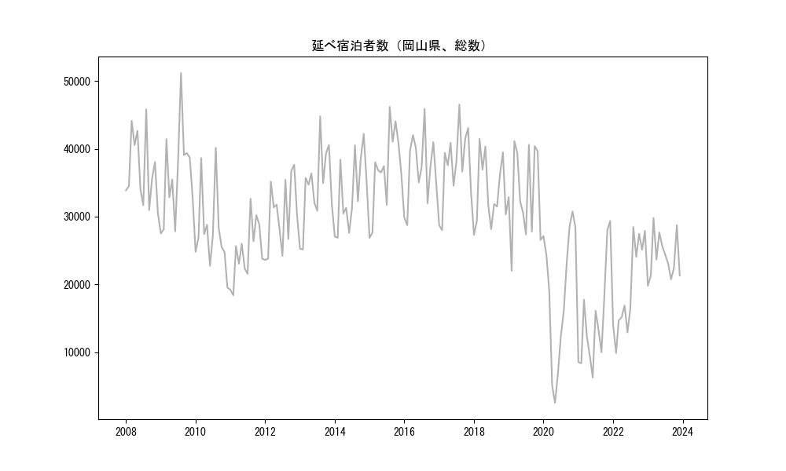
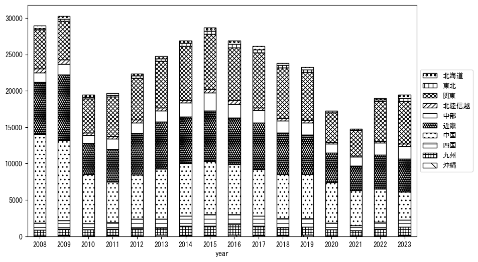
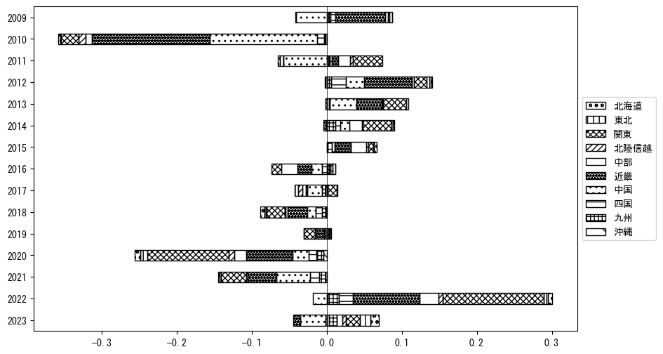
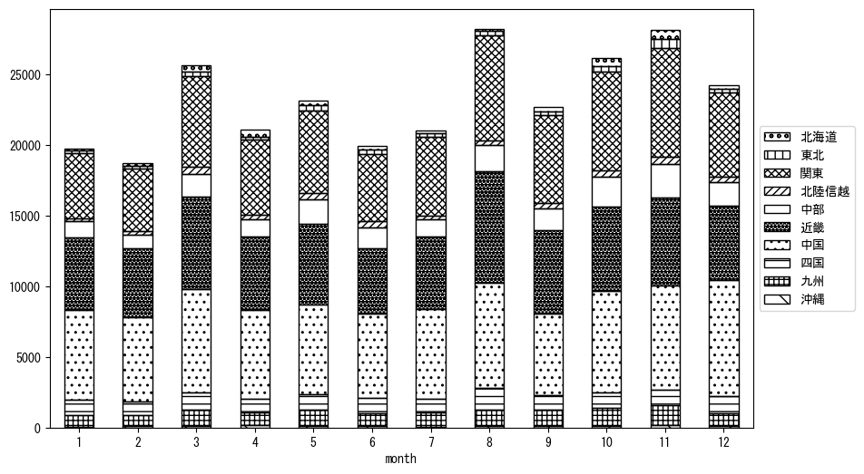

`<!DOCTYPE html>`{=html}
<html lang="ja">
<head>
    <meta charset="UTF-8">
    <meta name="description" content="">
    <link rel="stylesheet" href="../css/style.css">
    <title>宿泊者数の重心 | 岡山県</title>
</head>    
<body>
<body>
<nav id ="global_navi">
    <ul>
        <li>[トップ](../index.html)</li>
        <li>[使い方](../how_to_use.html)</li>
        <li>[データについて](../on_data.html)</li>
        <li>[算出方法について](../method.html)</li>
        <li>[発展的な使い方](../developer.html)</li>
        <li>[サイトポリシー](../policy.html)</li>
    </ul>
</nav>
<ol class="breadcrumb">
    <li>[トップ](../index.html)</li>
    <li>岡山県</li>
</ol>
<h1 id="h1_0">岡山県</h1>

<ul>
  <li> **[１．延べ宿泊者（総数、月次）の推移](#h1_1)** 
    <ul>
      <li> [時系列グラフ](#h2_1) </li>
      <li> [基本統計量](#h2_2) </li>
    </ul>
  </li>  
</ul>

<ul>
  <li> **[２．宿泊者数の重心（年平均の推移）](#h1_2)** 
  <ul>
  <li> [重心の前年平均からの移動距離と方位、および緯度・経度](#h2_4) </li>
  <li> [運輸局別延べ宿泊者数](#h2_5) 
  <ul>
  <li> [時系列（年平均）](#h3_1) </li>
  <li> [寄与度（前年からの変化率に対する）](#h3_2) </li>
  </ul>
  </li>
  </ul>
  </li>
</ul>

<ul>
  <li> **[３．宿泊者数の重心（月別）](#h1_3)** 
  <ul>
  <li> [全期間（2008年1月～2023年12月）の平均と月別平均の比較](#h2_6) </li>
  <li> [運輸局別延べ宿泊者数](#h2_7) 
  <ul>
  <li> [月別平均（2008年1月～2023年12月）](#h3_3) </li>
  <li> [寄与度（全期間の平均から月別平均への変化率に対する）](#h3_4) </li>
  </ul>
  </li>
  </ul>
  </li>
</ul>

<ul>
<li> **[４．データのダウンロード](#h1_4)** </li>
</ul>

<h1 id="h1_1">１．延べ宿泊者（総数）の推移</h1>
<h2 id="h2_1">時系列グラフ</h2>

<figcaption>図１：岡山県内の従業員数100人以上の宿泊施設での延べ宿泊者数（国外、居住地不詳を含む総数）。</figcaption>

<h2 id="h2_2">基本統計量</h2>
|  | 平均 | 標準偏差 | 最小値 | 最大値 |
|:----:|:----:|:----:|:----:|:----:|
| 2008年 | 36,872 | 5,279 | 30,614 (12月) | 45,825 (8月) |
| 2009年 | 36,043 | 6,827 | 27,515 (1月) | 51,175 (8月) |
| 2010年 | 27,898 | 5,947 | 19,536 (12月) | 40,143 (8月) |
| 2011年 | 24,842 | 4,310 | 18,396 (2月) | 32,655 (8月) |
| 2012年 | 30,398 | 5,137 | 23,601 (1月) | 37,646 (11月) |
| 2013年 | 34,306 | 5,791 | 25,157 (2月) | 44,789 (8月) |
| 2014年 | 33,486 | 5,382 | 26,883 (2月) | 42,195 (11月) |
| 2015年 | 36,953 | 5,915 | 26,870 (1月) | 46,189 (8月) |
| 2016年 | 36,995 | 5,140 | 28,746 (2月) | 45,889 (8月) |
| 2017年 | 37,390 | 5,509 | 28,011 (2月) | 46,523 (8月) |
| 2018年 | 33,709 | 4,946 | 27,302 (1月) | 41,458 (3月) |
| 2019年 | 33,385 | 6,673 | 22,007 (2月) | 41,121 (3月) |
| 2020年 | 18,718 | 9,964 | 2,568 (5月) | 30,764 (11月) |
| 2021年 | 14,828 | 7,522 | 6,281 (6月) | 29,370 (12月) |
| 2022年 | 19,427 | 6,674 | 9,894 (2月) | 28,466 (8月) |
| 2023年 | 24,056 | 3,281 | 19,796 (1月) | 29,801 (3月) |
: 表１：従業員数100人以上の宿泊施設での延べ宿泊者の総数（国外、および居住地不詳を含む）に関する基本統計量。単位は人。平均は１か月あたりの平均値を表す。図１に対応。

<h1 id="h1_2">２．宿泊者数の重心（年平均の推移）</h1>

<iframe src="../html/annual/岡山県.html" width="1200" height="600"></iframe>
<figcaption>図２：岡山県内の従業員数100人以上の宿泊施設での宿泊者数（国外、居住地不詳を除く）の重心（年平均の推移）。</figcaption>

[全画面表示](../html/annual/岡山県.html)

<h2 id="h2_4">重心の前年平均からの移動距離と方位、および緯度・経度</h2>
|  | 方位 | 距離 | 緯度 | 経度 |
|:----:|:----:|:----:|:----:|:----:|
| 2008年 | --- | --- | 34.9965 | 135.4319 |
| 2009年 | 南東 | 4.0km | 34.9757 | 135.4675 |
| 2010年 | 東北東 | 27.7km | 35.0558 | 135.7551 |
| 2011年 | 東 | 17.4km | 35.0321 | 135.9438 |
| 2012年 | 西 | 5.0km | 35.0389 | 135.8895 |
| 2013年 | 西南西 | 8.0km | 35.0016 | 135.8149 |
| 2014年 | 東北東 | 14.9km | 35.0426 | 135.9702 |
| 2015年 | 北東 | 4.4km | 35.0703 | 136.0051 |
| 2016年 | 北西 | 2.9km | 35.0865 | 135.9803 |
| 2017年 | 東 | 10.5km | 35.1034 | 136.0931 |
| 2018年 | 南南西 | 3.8km | 35.0718 | 136.0767 |
| 2019年 | 西南西 | 4.9km | 35.0579 | 136.0261 |
| 2020年 | 西南西 | 40.8km | 34.9353 | 135.6047 |
| 2021年 | 東 | 4.5km | 34.9388 | 135.6540 |
| 2022年 | 東北東 | 40.0km | 35.0402 | 136.0741 |
| 2023年 | 北東 | 24.9km | 35.1768 | 136.2914 |
: 表２：重心の前年平均からの移動距離と方位、および緯度・経度。図２に対応。

<h2 id="h2_5">運輸局別延べ宿泊者数</h2>
<h3 id="h3_1">時系列（年平均）</h3>

<figcaption>図３：岡山県内の従業員数100人以上の宿泊施設での１か月あたり平均宿泊者数（国外、居住地不詳を除く）の運輸局別内訳。</figcaption>

<h3 id="h3_2">寄与度（前年からの変化率に対する）</h3>

<figcaption>図４：岡山県内の従業員数100人以上の宿泊施設での運輸局別宿泊者数（国外、居住地不詳を除く）から求めた寄与度。</figcaption>

<h1 id="h1_3">３．宿泊者数の重心（月別）</h3>

<iframe src="../html/monthly/岡山県.html" width="1200" height="600"></iframe>
<figcaption>図５：岡山県内の従業員数100人以上の宿泊施設での宿泊者数（国外、居住地不詳を除く）の重心（月別）。観測期間は2008年1月から2023年12月まで。</figcaption>

[全画面表示](../html/monthly/岡山県.html)

<h2 id="h2_6">全期間（2008年1月～2023年12月）の平均と月別平均の比較</h2>
|  | 方位 | 距離 | 緯度 | 経度 |
|:----:|:----:|:----:|:----:|:----:|
| 全期間 | --- | --- | 35.0390 | 135.8799 |
| 1月 | 西南西 | 22.9km | 34.9369 | 135.6619 |
| 2月 | 西南西 | 18.8km | 34.9699 | 135.6924 |
| 3月 | 北 | 2.5km | 35.0613 | 135.8844 |
| 4月 | 北西 | 3.7km | 35.0655 | 135.8551 |
| 5月 | 東北東 | 1.8km | 35.0462 | 135.8974 |
| 6月 | 西 | 10.1km | 35.0279 | 135.7696 |
| 7月 | 南 | 4.7km | 34.9975 | 135.8724 |
| 8月 | 南南東 | 6.9km | 34.9794 | 135.9019 |
| 9月 | 東 | 12.4km | 35.0565 | 136.0144 |
| 10月 | 北東 | 20.3km | 35.1486 | 136.0584 |
| 11月 | 東北東 | 28.7km | 35.1694 | 136.1524 |
| 12月 | 西南西 | 8.2km | 35.0090 | 135.7984 |
: 表３：全期間の平均から月別平均までの移動距離と方位、および緯度・経度。図５に対応。

<h2 id="h2_7">運輸局別延べ宿泊者数</h2>
<h3 id="h3_3">月別平均（2008年1月～2023年12月）</h3>

<figcaption>図６：岡山県内の従業員数100人以上の宿泊施設での宿泊者数（国外、居住地不詳を除く）の運輸局別内訳（月別）。</figcaption>

<h3 id="h3_4">寄与度（全期間の平均から月別平均への変化率に対する）</h3>

<figcaption>図７：岡山県内の従業員数100人以上の宿泊施設での運輸局別宿泊者数（国外、居住地不詳を除く）から求めた寄与度（月別）。</figcaption>

</body>

<h1 id="h1_4">４．データのダウンロード</h1>
 <ul>
  <li> <a href="../csv/data_by_pref/延べ宿泊者数および重心（岡山県）.csv" download>延べ宿泊者数および重心の緯度経度</a> </li>
  <li> <a href="../csv/bar_chart/運輸局別_年平均（岡山県）.csv" download>運輸局別延べ宿泊者数（年平均）</a></li>
  <li> <a href="../csv/bar_chart_month/運輸局別_月別（岡山県）.csv" download>運輸局別延べ宿泊者数（月別）</a></li>
  <li> <a href="../csv/contrib/前年からの変化率に対する寄与度（岡山県）.csv" download>前年からの変化率に対する寄与度</a></li>
  <li> <a href="../csv/contrib_month/月別平均への変化率に対する寄与度（岡山県）.csv" download>月別平均への変化率に対する寄与度</a></li>
</ul>

出典：観光庁「宿泊旅行統計調査」に収録された「施設所在地別、居住地別延べ宿泊者数（従業員数100人以上の施設）」

国土地理院「白地図（[地理院タイル](https://maps.gsi.go.jp/development/ichiran.html)）」（図２と図５）

