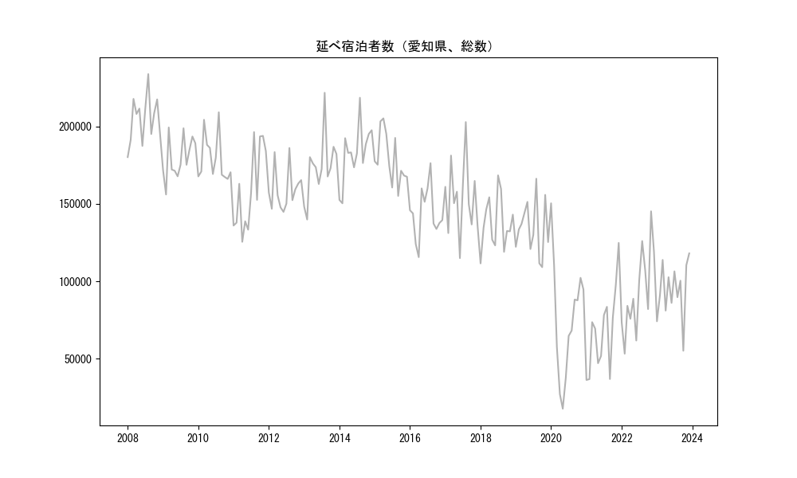
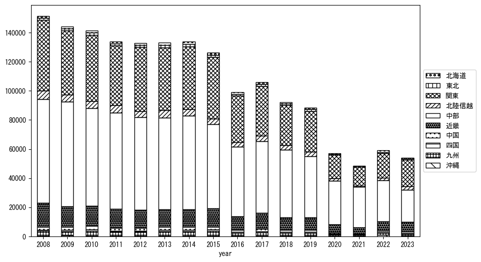
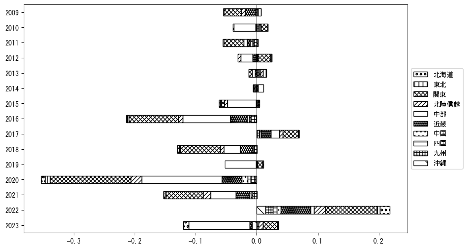
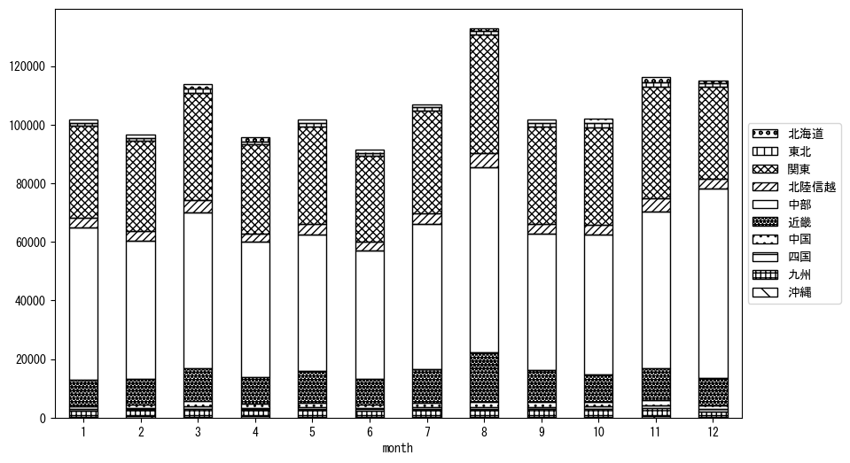
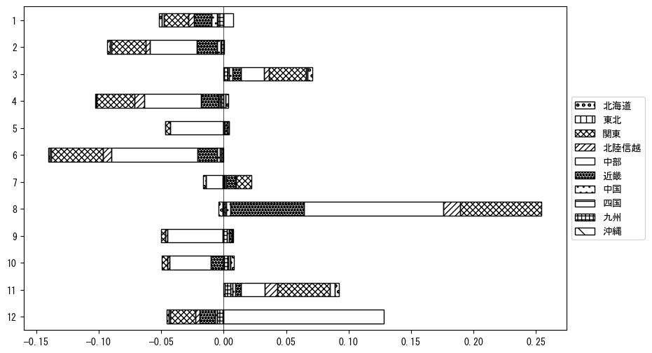

`<!DOCTYPE html>`{=html}
<html lang="ja">
<head>
    <meta charset="UTF-8">
    <meta name="description" content="">
    <link rel="stylesheet" href="../css/style.css">
    <title>宿泊者数の重心 | 愛知県</title>
</head>    
<body>
<body>
<nav id ="global_navi">
    <ul>
        <li>[トップ](../index.html)</li>
        <li>[使い方](../how_to_use.html)</li>
        <li>[データについて](../on_data.html)</li>
        <li>[算出方法について](../method.html)</li>
        <li>[発展的な使い方](../developer.html)</li>
        <li>[サイトポリシー](../policy.html)</li>
    </ul>
</nav>
<ol class="breadcrumb">
    <li>[トップ](../index.html)</li>
    <li>愛知県</li>
</ol>
<h1 id="h1_0">愛知県</h1>

<ul>
  <li> **[１．延べ宿泊者（総数、月次）の推移](#h1_1)** 
    <ul>
      <li> [時系列グラフ](#h2_1) </li>
      <li> [基本統計量](#h2_2) </li>
    </ul>
  </li>  
</ul>

<ul>
  <li> **[２．宿泊者数の重心（年平均の推移）](#h1_2)** 
  <ul>
  <li> [重心の前年平均からの移動距離と方位、および緯度・経度](#h2_4) </li>
  <li> [運輸局別延べ宿泊者数](#h2_5) 
  <ul>
  <li> [時系列（年平均）](#h3_1) </li>
  <li> [寄与度（前年からの変化率に対する）](#h3_2) </li>
  </ul>
  </li>
  </ul>
  </li>
</ul>

<ul>
  <li> **[３．宿泊者数の重心（月別）](#h1_3)** 
  <ul>
  <li> [全期間（2008年1月～2023年12月）の平均と月別平均の比較](#h2_6) </li>
  <li> [運輸局別延べ宿泊者数](#h2_7) 
  <ul>
  <li> [月別平均（2008年1月～2023年12月）](#h3_3) </li>
  <li> [寄与度（全期間の平均から月別平均への変化率に対する）](#h3_4) </li>
  </ul>
  </li>
  </ul>
  </li>
</ul>

<ul>
<li> **[４．データのダウンロード](#h1_4)** </li>
</ul>

<h1 id="h1_1">１．延べ宿泊者（総数）の推移</h1>
<h2 id="h2_1">時系列グラフ</h2>

<figcaption>図１：愛知県内の従業員数100人以上の宿泊施設での延べ宿泊者数（国外、居住地不詳を含む総数）。</figcaption>

<h2 id="h2_2">基本統計量</h2>
|  | 平均 | 標準偏差 | 最小値 | 最大値 |
|:----:|:----:|:----:|:----:|:----:|
| 2008年 | 204,844 | 15,293 | 180,253 (1月) | 233,871 (8月) |
| 2009年 | 179,654 | 13,451 | 156,083 (2月) | 199,401 (3月) |
| 2010年 | 179,061 | 14,934 | 166,144 (11月) | 209,218 (8月) |
| 2011年 | 159,368 | 26,413 | 125,503 (4月) | 196,421 (8月) |
| 2012年 | 159,392 | 13,486 | 144,850 (6月) | 186,134 (8月) |
| 2013年 | 173,775 | 20,358 | 139,910 (2月) | 221,808 (8月) |
| 2014年 | 182,858 | 18,763 | 150,385 (2月) | 218,593 (8月) |
| 2015年 | 178,901 | 16,454 | 155,164 (9月) | 205,273 (4月) |
| 2016年 | 143,791 | 16,590 | 115,606 (4月) | 176,345 (8月) |
| 2017年 | 154,005 | 23,485 | 114,990 (6月) | 202,884 (8月) |
| 2018年 | 137,679 | 17,139 | 111,573 (1月) | 168,439 (7月) |
| 2019年 | 133,955 | 17,721 | 109,143 (10月) | 166,299 (8月) |
| 2020年 | 75,545 | 37,954 | 17,711 (5月) | 150,417 (1月) |
| 2021年 | 67,718 | 27,324 | 36,257 (1月) | 124,826 (12月) |
| 2022年 | 93,093 | 27,313 | 53,248 (2月) | 145,232 (11月) |
| 2023年 | 94,090 | 18,271 | 55,144 (10月) | 118,051 (12月) |
: 表１：従業員数100人以上の宿泊施設での延べ宿泊者の総数（国外、および居住地不詳を含む）に関する基本統計量。単位は人。平均は１か月あたりの平均値を表す。図１に対応。

<h1 id="h1_2">２．宿泊者数の重心（年平均の推移）</h1>

<iframe src="../html/annual/愛知県.html" width="1200" height="600"></iframe>
<figcaption>図２：愛知県内の従業員数100人以上の宿泊施設での宿泊者数（国外、居住地不詳を除く）の重心（年平均の推移）。</figcaption>

[全画面表示](../html/annual/愛知県.html)

<h2 id="h2_4">重心の前年平均からの移動距離と方位、および緯度・経度</h2>
|  | 方位 | 距離 | 緯度 | 経度 |
|:----:|:----:|:----:|:----:|:----:|
| 2008年 | --- | --- | 35.3824 | 137.5461 |
| 2009年 | 西南西 | 4.0km | 35.3662 | 137.5069 |
| 2010年 | 東北東 | 2.5km | 35.3716 | 137.5334 |
| 2011年 | 南 | 0.2km | 35.3697 | 137.5333 |
| 2012年 | 東北東 | 7.8km | 35.4076 | 137.6056 |
| 2013年 | 北西 | 2.8km | 35.4249 | 137.5826 |
| 2014年 | 南西 | 1.2km | 35.4169 | 137.5742 |
| 2015年 | 南南西 | 3.3km | 35.3906 | 137.5583 |
| 2016年 | 北北東 | 2.8km | 35.4136 | 137.5714 |
| 2017年 | 西南西 | 2.1km | 35.4073 | 137.5495 |
| 2018年 | 西南西 | 6.3km | 35.3825 | 137.4875 |
| 2019年 | 東北東 | 6.0km | 35.4078 | 137.5453 |
| 2020年 | 南西 | 11.3km | 35.3450 | 137.4478 |
| 2021年 | 南西 | 3.1km | 35.3215 | 137.4286 |
| 2022年 | 西 | 8.4km | 35.3273 | 137.3368 |
| 2023年 | 東北東 | 16.1km | 35.3750 | 137.5042 |
: 表２：重心の前年平均からの移動距離と方位、および緯度・経度。図２に対応。

<h2 id="h2_5">運輸局別延べ宿泊者数</h2>
<h3 id="h3_1">時系列（年平均）</h3>

<figcaption>図３：愛知県内の従業員数100人以上の宿泊施設での１か月あたり平均宿泊者数（国外、居住地不詳を除く）の運輸局別内訳。</figcaption>

<h3 id="h3_2">寄与度（前年からの変化率に対する）</h3>

<figcaption>図４：愛知県内の従業員数100人以上の宿泊施設での運輸局別宿泊者数（国外、居住地不詳を除く）から求めた寄与度。</figcaption>

<h1 id="h1_3">３．宿泊者数の重心（月別）</h3>

<iframe src="../html/monthly/愛知県.html" width="1200" height="600"></iframe>
<figcaption>図５：愛知県内の従業員数100人以上の宿泊施設での宿泊者数（国外、居住地不詳を除く）の重心（月別）。観測期間は2008年1月から2023年12月まで。</figcaption>

[全画面表示](../html/monthly/愛知県.html)

<h2 id="h2_6">全期間（2008年1月～2023年12月）の平均と月別平均の比較</h2>
|  | 方位 | 距離 | 緯度 | 経度 |
|:----:|:----:|:----:|:----:|:----:|
| 全期間 | --- | --- | 35.3819 | 137.5194 |
| 1月 | 東南東 | 3.2km | 35.3703 | 137.5521 |
| 2月 | 南東 | 1.9km | 35.3683 | 137.5312 |
| 3月 | 北北東 | 5.0km | 35.4224 | 137.5428 |
| 4月 | 西南西 | 2.4km | 35.3768 | 137.4941 |
| 5月 | 北北東 | 0.7km | 35.3876 | 137.5221 |
| 6月 | 東北東 | 0.9km | 35.3852 | 137.5286 |
| 7月 | 南南東 | 1.6km | 35.3686 | 137.5258 |
| 8月 | 南西 | 6.0km | 35.3395 | 137.4788 |
| 9月 | 北西 | 1.5km | 35.3922 | 137.5086 |
| 10月 | 北北東 | 2.4km | 35.4019 | 137.5287 |
| 11月 | 北東 | 4.8km | 35.4152 | 137.5532 |
| 12月 | 西南西 | 5.6km | 35.3545 | 137.4673 |
: 表３：全期間の平均から月別平均までの移動距離と方位、および緯度・経度。図５に対応。

<h2 id="h2_7">運輸局別延べ宿泊者数</h2>
<h3 id="h3_3">月別平均（2008年1月～2023年12月）</h3>

<figcaption>図６：愛知県内の従業員数100人以上の宿泊施設での宿泊者数（国外、居住地不詳を除く）の運輸局別内訳（月別）。</figcaption>

<h3 id="h3_4">寄与度（全期間の平均から月別平均への変化率に対する）</h3>

<figcaption>図７：愛知県内の従業員数100人以上の宿泊施設での運輸局別宿泊者数（国外、居住地不詳を除く）から求めた寄与度（月別）。</figcaption>

</body>

<h1 id="h1_4">４．データのダウンロード</h1>
 <ul>
  <li> <a href="../csv/data_by_pref/延べ宿泊者数および重心（愛知県）.csv" download>延べ宿泊者数および重心の緯度経度</a> </li>
  <li> <a href="../csv/bar_chart/運輸局別_年平均（愛知県）.csv" download>運輸局別延べ宿泊者数（年平均）</a></li>
  <li> <a href="../csv/bar_chart_month/運輸局別_月別（愛知県）.csv" download>運輸局別延べ宿泊者数（月別）</a></li>
  <li> <a href="../csv/contrib/前年からの変化率に対する寄与度（愛知県）.csv" download>前年からの変化率に対する寄与度</a></li>
  <li> <a href="../csv/contrib_month/月別平均への変化率に対する寄与度（愛知県）.csv" download>月別平均への変化率に対する寄与度</a></li>
</ul>

出典：観光庁「宿泊旅行統計調査」に収録された「施設所在地別、居住地別延べ宿泊者数（従業員数100人以上の施設）」

国土地理院「白地図（[地理院タイル](https://maps.gsi.go.jp/development/ichiran.html)）」（図２と図５）

