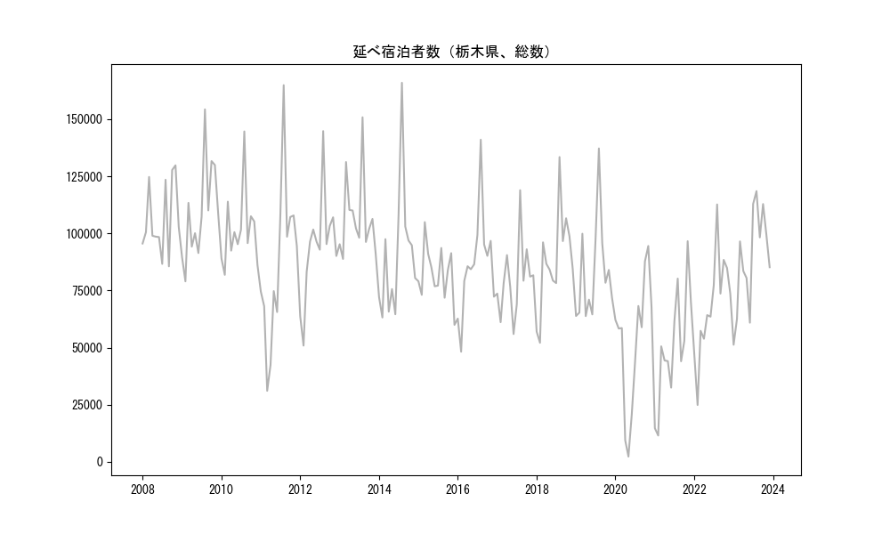
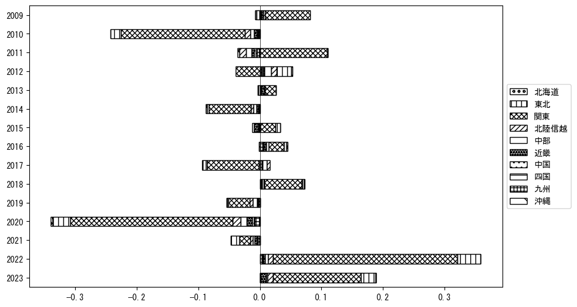
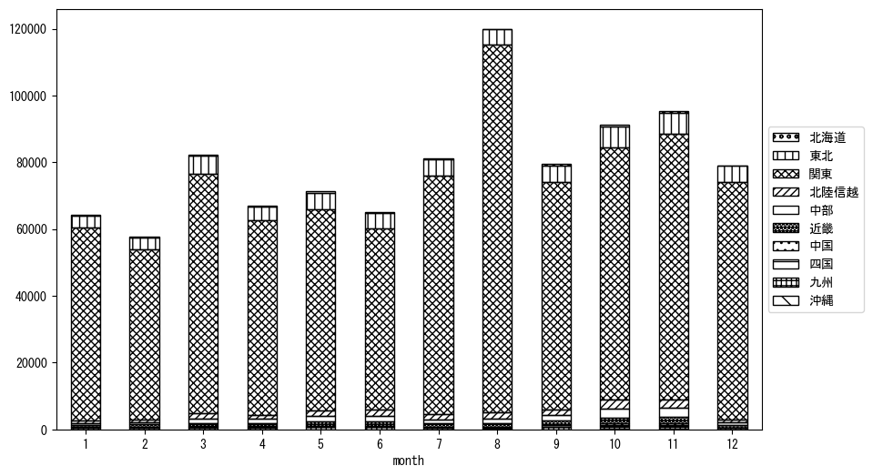
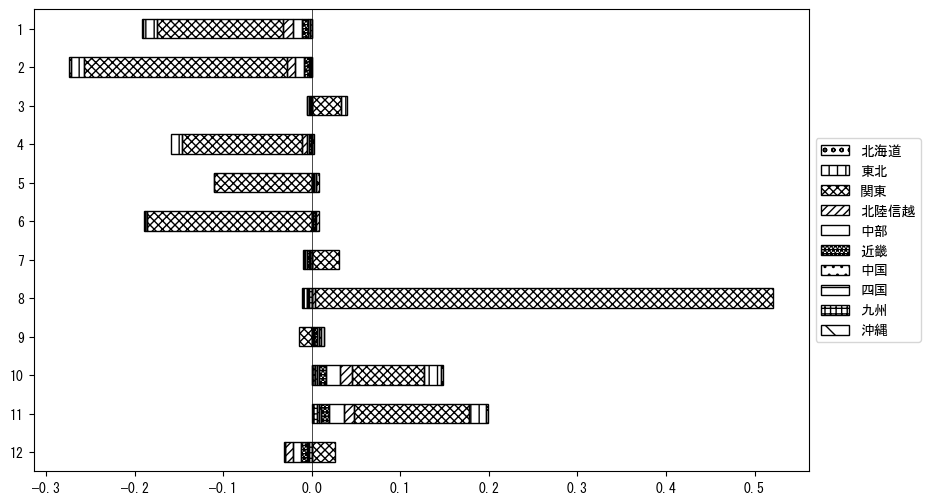

`<!DOCTYPE html>`{=html}
<html lang="ja">
<head>
    <meta charset="UTF-8">
    <meta name="description" content="">
    <link rel="stylesheet" href="../css/style.css">
    <title>宿泊者数の重心 | 栃木県</title>
</head>    
<body>
<body>
<nav id ="global_navi">
    <ul>
        <li>[トップ](../index.html)</li>
        <li>[使い方](../how_to_use.html)</li>
        <li>[データについて](../on_data.html)</li>
        <li>[算出方法について](../method.html)</li>
        <li>[発展的な使い方](../developer.html)</li>
        <li>[サイトポリシー](../policy.html)</li>
    </ul>
</nav>
<ol class="breadcrumb">
    <li>[トップ](../index.html)</li>
    <li>栃木県</li>
</ol>
<h1 id="h1_0">栃木県</h1>

<ul>
  <li> **[１．延べ宿泊者（総数、月次）の推移](#h1_1)** 
    <ul>
      <li> [時系列グラフ](#h2_1) </li>
      <li> [基本統計量](#h2_2) </li>
    </ul>
  </li>  
</ul>

<ul>
  <li> **[２．宿泊者数の重心（年平均の推移）](#h1_2)** 
  <ul>
  <li> [重心の前年平均からの移動距離と方位、および緯度・経度](#h2_4) </li>
  <li> [運輸局別延べ宿泊者数](#h2_5) 
  <ul>
  <li> [時系列（年平均）](#h3_1) </li>
  <li> [寄与度（前年からの変化率に対する）](#h3_2) </li>
  </ul>
  </li>
  </ul>
  </li>
</ul>

<ul>
  <li> **[３．宿泊者数の重心（月別）](#h1_3)** 
  <ul>
  <li> [全期間（2008年1月～2023年12月）の平均と月別平均の比較](#h2_6) </li>
  <li> [運輸局別延べ宿泊者数](#h2_7) 
  <ul>
  <li> [月別平均（2008年1月～2023年12月）](#h3_3) </li>
  <li> [寄与度（全期間の平均から月別平均への変化率に対する）](#h3_4) </li>
  </ul>
  </li>
  </ul>
  </li>
</ul>

<ul>
<li> **[４．データのダウンロード](#h1_4)** </li>
</ul>

<h1 id="h1_1">１．延べ宿泊者（総数）の推移</h1>
<h2 id="h2_1">時系列グラフ</h2>

<figcaption>図１：栃木県内の従業員数100人以上の宿泊施設での延べ宿泊者数（国外、居住地不詳を含む総数）。</figcaption>

<h2 id="h2_2">基本統計量</h2>
|  | 平均 | 標準偏差 | 最小値 | 最大値 |
|:----:|:----:|:----:|:----:|:----:|
| 2008年 | 106,064 | 15,953 | 85,557 (9月) | 129,800 (11月) |
| 2009年 | 109,150 | 21,141 | 78,989 (2月) | 154,293 (8月) |
| 2010年 | 101,151 | 16,503 | 81,842 (2月) | 144,641 (8月) |
| 2011年 | 86,416 | 35,383 | 31,053 (3月) | 164,905 (8月) |
| 2012年 | 93,795 | 22,994 | 50,856 (2月) | 144,789 (8月) |
| 2013年 | 106,849 | 17,835 | 88,806 (2月) | 150,834 (8月) |
| 2014年 | 90,653 | 28,544 | 63,162 (2月) | 165,949 (8月) |
| 2015年 | 82,325 | 11,955 | 59,931 (12月) | 104,929 (3月) |
| 2016年 | 86,754 | 22,613 | 48,185 (2月) | 141,019 (8月) |
| 2017年 | 79,895 | 16,271 | 55,919 (6月) | 118,912 (8月) |
| 2018年 | 87,801 | 21,564 | 52,092 (2月) | 133,426 (8月) |
| 2019年 | 82,722 | 21,903 | 63,771 (4月) | 137,191 (8月) |
| 2020年 | 52,674 | 28,844 | 2,261 (5月) | 94,480 (11月) |
| 2021年 | 50,223 | 24,799 | 11,480 (2月) | 96,578 (11月) |
| 2022年 | 68,478 | 22,310 | 24,851 (2月) | 112,675 (8月) |
| 2023年 | 88,497 | 21,929 | 51,234 (1月) | 118,508 (8月) |
: 表１：従業員数100人以上の宿泊施設での延べ宿泊者の総数（国外、および居住地不詳を含む）に関する基本統計量。単位は人。平均は１か月あたりの平均値を表す。図１に対応。

<h1 id="h1_2">２．宿泊者数の重心（年平均の推移）</h1>

<iframe src="../html/annual/栃木県.html" width="1200" height="600"></iframe>
<figcaption>図２：栃木県内の従業員数100人以上の宿泊施設での宿泊者数（国外、居住地不詳を除く）の重心（年平均の推移）。</figcaption>

[全画面表示](../html/annual/栃木県.html)

<h2 id="h2_4">重心の前年平均からの移動距離と方位、および緯度・経度</h2>
|  | 方位 | 距離 | 緯度 | 経度 |
|:----:|:----:|:----:|:----:|:----:|
| 2008年 | --- | --- | 36.0961 | 139.5440 |
| 2009年 | 南 | 3.4km | 36.0653 | 139.5440 |
| 2010年 | 南南東 | 1.1km | 36.0562 | 139.5494 |
| 2011年 | 東 | 14.5km | 36.0785 | 139.7079 |
| 2012年 | 西北西 | 7.5km | 36.1017 | 139.6296 |
| 2013年 | 南西 | 4.8km | 36.0765 | 139.5863 |
| 2014年 | 東北東 | 3.6km | 36.0870 | 139.6240 |
| 2015年 | 東北東 | 7.5km | 36.1234 | 139.6947 |
| 2016年 | 西 | 6.1km | 36.1165 | 139.6280 |
| 2017年 | 西南西 | 9.1km | 36.0902 | 139.5321 |
| 2018年 | 南西 | 1.7km | 36.0784 | 139.5208 |
| 2019年 | 東北東 | 2.6km | 36.0871 | 139.5472 |
| 2020年 | 東 | 10.7km | 36.0841 | 139.6664 |
| 2021年 | 東 | 8.2km | 36.0744 | 139.7569 |
| 2022年 | 西 | 1.3km | 36.0737 | 139.7421 |
| 2023年 | 北西 | 4.5km | 36.1035 | 139.7074 |
: 表２：重心の前年平均からの移動距離と方位、および緯度・経度。図２に対応。

<h2 id="h2_5">運輸局別延べ宿泊者数</h2>
<h3 id="h3_1">時系列（年平均）</h3>

<figcaption>図３：栃木県内の従業員数100人以上の宿泊施設での１か月あたり平均宿泊者数（国外、居住地不詳を除く）の運輸局別内訳。</figcaption>

<h3 id="h3_2">寄与度（前年からの変化率に対する）</h3>

<figcaption>図４：栃木県内の従業員数100人以上の宿泊施設での運輸局別宿泊者数（国外、居住地不詳を除く）から求めた寄与度。</figcaption>

<h1 id="h1_3">３．宿泊者数の重心（月別）</h3>

<iframe src="../html/monthly/栃木県.html" width="1200" height="600"></iframe>
<figcaption>図５：栃木県内の従業員数100人以上の宿泊施設での宿泊者数（国外、居住地不詳を除く）の重心（月別）。観測期間は2008年1月から2023年12月まで。</figcaption>

[全画面表示](../html/monthly/栃木県.html)

<h2 id="h2_6">全期間（2008年1月～2023年12月）の平均と月別平均の比較</h2>
|  | 方位 | 距離 | 緯度 | 経度 |
|:----:|:----:|:----:|:----:|:----:|
| 全期間 | --- | --- | 36.0870 | 139.6238 |
| 1月 | 東北東 | 6.3km | 36.1068 | 139.6895 |
| 2月 | 北東 | 4.0km | 36.1111 | 139.6567 |
| 3月 | 東北東 | 4.7km | 36.1105 | 139.6672 |
| 4月 | 北北西 | 2.5km | 36.1084 | 139.6142 |
| 5月 | 西北西 | 4.5km | 36.1083 | 139.5818 |
| 6月 | 西北西 | 8.1km | 36.1159 | 139.5406 |
| 7月 | 東南東 | 4.4km | 36.0656 | 139.6650 |
| 8月 | 南南東 | 17.0km | 35.9491 | 139.7058 |
| 9月 | 南西 | 5.0km | 36.0527 | 139.5872 |
| 10月 | 西 | 8.1km | 36.0899 | 139.5343 |
| 11月 | 西 | 10.3km | 36.0758 | 139.5099 |
| 12月 | 北東 | 12.1km | 36.1504 | 139.7335 |
: 表３：全期間の平均から月別平均までの移動距離と方位、および緯度・経度。図５に対応。

<h2 id="h2_7">運輸局別延べ宿泊者数</h2>
<h3 id="h3_3">月別平均（2008年1月～2023年12月）</h3>

<figcaption>図６：栃木県内の従業員数100人以上の宿泊施設での宿泊者数（国外、居住地不詳を除く）の運輸局別内訳（月別）。</figcaption>

<h3 id="h3_4">寄与度（全期間の平均から月別平均への変化率に対する）</h3>

<figcaption>図７：栃木県内の従業員数100人以上の宿泊施設での運輸局別宿泊者数（国外、居住地不詳を除く）から求めた寄与度（月別）。</figcaption>

</body>

<h1 id="h1_4">４．データのダウンロード</h1>
 <ul>
  <li> <a href="../csv/data_by_pref/延べ宿泊者数および重心（栃木県）.csv" download>延べ宿泊者数および重心の緯度経度</a> </li>
  <li> <a href="../csv/bar_chart/運輸局別_年平均（栃木県）.csv" download>運輸局別延べ宿泊者数（年平均）</a></li>
  <li> <a href="../csv/bar_chart_month/運輸局別_月別（栃木県）.csv" download>運輸局別延べ宿泊者数（月別）</a></li>
  <li> <a href="../csv/contrib/前年からの変化率に対する寄与度（栃木県）.csv" download>前年からの変化率に対する寄与度</a></li>
  <li> <a href="../csv/contrib_month/月別平均への変化率に対する寄与度（栃木県）.csv" download>月別平均への変化率に対する寄与度</a></li>
</ul>

出典：観光庁「宿泊旅行統計調査」に収録された「施設所在地別、居住地別延べ宿泊者数（従業員数100人以上の施設）」

国土地理院「白地図（[地理院タイル](https://maps.gsi.go.jp/development/ichiran.html)）」（図２と図５）

