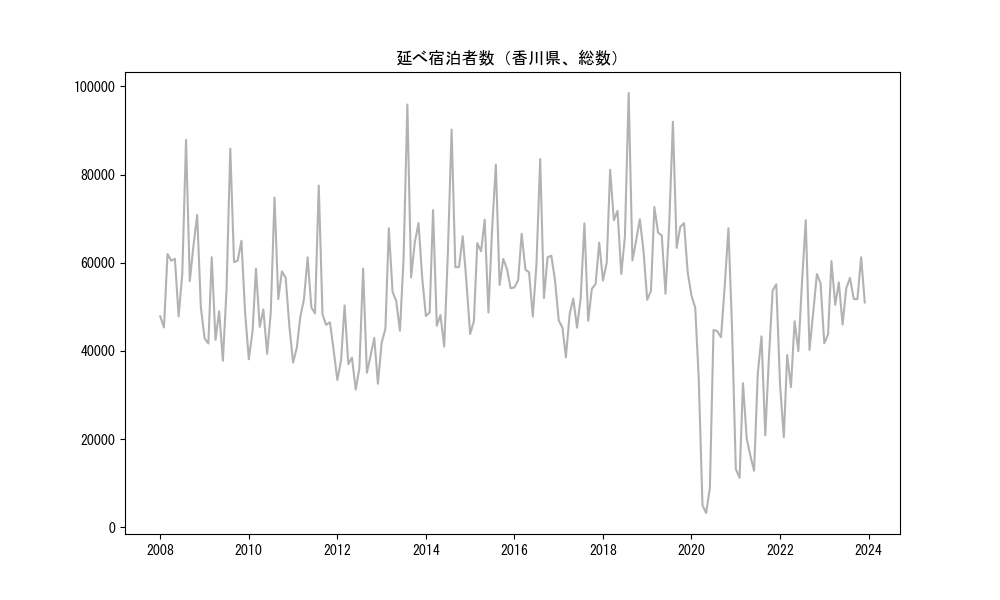
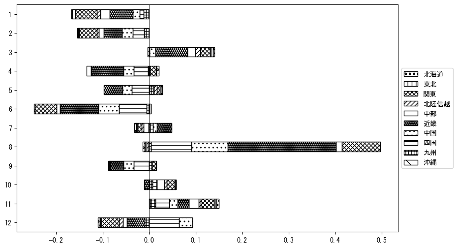

`<!DOCTYPE html>`{=html}
<html lang="ja">
<head>
    <meta charset="UTF-8">
    <meta name="description" content="">
    <link rel="stylesheet" href="../css/style.css">
    <title>宿泊者数の重心 | 香川県</title>
</head>    
<body>
<body>
<nav id ="global_navi">
    <ul>
        <li>[トップ](../index.html)</li>
        <li>[使い方](../how_to_use.html)</li>
        <li>[データについて](../on_data.html)</li>
        <li>[算出方法について](../method.html)</li>
        <li>[発展的な使い方](../developer.html)</li>
        <li>[サイトポリシー](../policy.html)</li>
    </ul>
</nav>
<ol class="breadcrumb">
    <li>[トップ](../index.html)</li>
    <li>香川県</li>
</ol>
<h1 id="h1_0">香川県</h1>

<ul>
  <li> **[１．延べ宿泊者（総数、月次）の推移](#h1_1)** 
    <ul>
      <li> [時系列グラフ](#h2_1) </li>
      <li> [基本統計量](#h2_2) </li>
    </ul>
  </li>  
</ul>

<ul>
  <li> **[２．宿泊者数の重心（年平均の推移）](#h1_2)** 
  <ul>
  <li> [重心の前年平均からの移動距離と方位、および緯度・経度](#h2_4) </li>
  <li> [運輸局別延べ宿泊者数](#h2_5) 
  <ul>
  <li> [時系列（年平均）](#h3_1) </li>
  <li> [寄与度（前年からの変化率に対する）](#h3_2) </li>
  </ul>
  </li>
  </ul>
  </li>
</ul>

<ul>
  <li> **[３．宿泊者数の重心（月別）](#h1_3)** 
  <ul>
  <li> [全期間（2008年1月～2023年12月）の平均と月別平均の比較](#h2_6) </li>
  <li> [運輸局別延べ宿泊者数](#h2_7) 
  <ul>
  <li> [月別平均（2008年1月～2023年12月）](#h3_3) </li>
  <li> [寄与度（全期間の平均から月別平均への変化率に対する）](#h3_4) </li>
  </ul>
  </li>
  </ul>
  </li>
</ul>

<ul>
<li> **[４．データのダウンロード](#h1_4)** </li>
</ul>

<h1 id="h1_1">１．延べ宿泊者（総数）の推移</h1>
<h2 id="h2_1">時系列グラフ</h2>

<figcaption>図１：香川県内の従業員数100人以上の宿泊施設での延べ宿泊者数（国外、居住地不詳を含む総数）。</figcaption>

<h2 id="h2_2">基本統計量</h2>
|  | 平均 | 標準偏差 | 最小値 | 最大値 |
|:----:|:----:|:----:|:----:|:----:|
| 2008年 | 59,187 | 11,840 | 45,322 (2月) | 87,888 (8月) |
| 2009年 | 54,107 | 13,462 | 37,779 (6月) | 85,905 (8月) |
| 2010年 | 50,934 | 10,077 | 38,111 (1月) | 74,807 (8月) |
| 2011年 | 49,641 | 10,710 | 37,391 (1月) | 77,519 (8月) |
| 2012年 | 39,374 | 7,932 | 31,240 (6月) | 58,688 (8月) |
| 2013年 | 58,996 | 14,679 | 41,864 (1月) | 95,893 (8月) |
| 2014年 | 57,954 | 13,631 | 40,983 (6月) | 90,212 (8月) |
| 2015年 | 59,545 | 10,853 | 43,831 (1月) | 82,249 (8月) |
| 2016年 | 59,591 | 8,952 | 47,792 (6月) | 83,519 (8月) |
| 2017年 | 51,479 | 8,495 | 38,555 (3月) | 68,932 (8月) |
| 2018年 | 68,217 | 11,817 | 55,973 (1月) | 98,501 (8月) |
| 2019年 | 65,217 | 11,024 | 51,594 (1月) | 91,991 (8月) |
| 2020年 | 37,764 | 20,971 | 3,245 (5月) | 67,835 (11月) |
| 2021年 | 29,380 | 15,866 | 11,215 (2月) | 55,111 (12月) |
| 2022年 | 44,761 | 13,537 | 20,451 (2月) | 69,649 (8月) |
| 2023年 | 52,029 | 6,087 | 41,734 (1月) | 61,257 (11月) |
: 表１：従業員数100人以上の宿泊施設での延べ宿泊者の総数（国外、および居住地不詳を含む）に関する基本統計量。単位は人。平均は１か月あたりの平均値を表す。図１に対応。

<h1 id="h1_2">２．宿泊者数の重心（年平均の推移）</h1>

<iframe src="../html/annual/香川県.html" width="1200" height="600"></iframe>
<figcaption>図２：香川県内の従業員数100人以上の宿泊施設での宿泊者数（国外、居住地不詳を除く）の重心（年平均の推移）。</figcaption>

[全画面表示](../html/annual/香川県.html)

<h2 id="h2_4">重心の前年平均からの移動距離と方位、および緯度・経度</h2>
|  | 方位 | 距離 | 緯度 | 経度 |
|:----:|:----:|:----:|:----:|:----:|
| 2008年 | --- | --- | 35.0042 | 135.9044 |
| 2009年 | 西南西 | 7.4km | 34.9695 | 135.8355 |
| 2010年 | 東 | 3.8km | 34.9722 | 135.8767 |
| 2011年 | 西南西 | 16.5km | 34.8915 | 135.7250 |
| 2012年 | 東北東 | 36.3km | 34.9914 | 136.1028 |
| 2013年 | 西南西 | 55.2km | 34.8134 | 135.5386 |
| 2014年 | 東北東 | 27.3km | 34.9213 | 135.8070 |
| 2015年 | 西南西 | 30.5km | 34.8275 | 135.4938 |
| 2016年 | 西南西 | 27.3km | 34.7589 | 135.2072 |
| 2017年 | 東北東 | 43.3km | 34.9217 | 135.6380 |
| 2018年 | 西南西 | 41.2km | 34.7865 | 135.2183 |
| 2019年 | 東 | 5.9km | 34.7880 | 135.2826 |
| 2020年 | 南西 | 18.7km | 34.6656 | 135.1417 |
| 2021年 | 北東 | 11.1km | 34.7220 | 135.2417 |
| 2022年 | 東北東 | 10.5km | 34.7584 | 135.3472 |
| 2023年 | 西 | 15.1km | 34.7334 | 135.1851 |
: 表２：重心の前年平均からの移動距離と方位、および緯度・経度。図２に対応。

<h2 id="h2_5">運輸局別延べ宿泊者数</h2>
<h3 id="h3_1">時系列（年平均）</h3>

<figcaption>図３：香川県内の従業員数100人以上の宿泊施設での１か月あたり平均宿泊者数（国外、居住地不詳を除く）の運輸局別内訳。</figcaption>

<h3 id="h3_2">寄与度（前年からの変化率に対する）</h3>

<figcaption>図４：香川県内の従業員数100人以上の宿泊施設での運輸局別宿泊者数（国外、居住地不詳を除く）から求めた寄与度。</figcaption>

<h1 id="h1_3">３．宿泊者数の重心（月別）</h3>

<iframe src="../html/monthly/香川県.html" width="1200" height="600"></iframe>
<figcaption>図５：香川県内の従業員数100人以上の宿泊施設での宿泊者数（国外、居住地不詳を除く）の重心（月別）。観測期間は2008年1月から2023年12月まで。</figcaption>

[全画面表示](../html/monthly/香川県.html)

<h2 id="h2_6">全期間（2008年1月～2023年12月）の平均と月別平均の比較</h2>
|  | 方位 | 距離 | 緯度 | 経度 |
|:----:|:----:|:----:|:----:|:----:|
| 全期間 | --- | --- | 34.8453 | 135.5341 |
| 1月 | 西南西 | 19.8km | 34.7643 | 135.3415 |
| 2月 | 西南西 | 4.9km | 34.8221 | 135.4884 |
| 3月 | 東北東 | 17.0km | 34.9291 | 135.6902 |
| 4月 | 東北東 | 18.7km | 34.9278 | 135.7126 |
| 5月 | 東北東 | 15.1km | 34.9117 | 135.6782 |
| 6月 | 北東 | 5.0km | 34.8712 | 135.5792 |
| 7月 | 西南西 | 12.8km | 34.7833 | 135.4159 |
| 8月 | 南西 | 9.1km | 34.7785 | 135.4768 |
| 9月 | 東北東 | 11.5km | 34.8718 | 135.6562 |
| 10月 | 北東 | 6.4km | 34.8801 | 135.5897 |
| 11月 | 北東 | 4.6km | 34.8790 | 135.5633 |
| 12月 | 西南西 | 31.9km | 34.7252 | 135.2171 |
: 表３：全期間の平均から月別平均までの移動距離と方位、および緯度・経度。図５に対応。

<h2 id="h2_7">運輸局別延べ宿泊者数</h2>
<h3 id="h3_3">月別平均（2008年1月～2023年12月）</h3>

<figcaption>図６：香川県内の従業員数100人以上の宿泊施設での宿泊者数（国外、居住地不詳を除く）の運輸局別内訳（月別）。</figcaption>

<h3 id="h3_4">寄与度（全期間の平均から月別平均への変化率に対する）</h3>

<figcaption>図７：香川県内の従業員数100人以上の宿泊施設での運輸局別宿泊者数（国外、居住地不詳を除く）から求めた寄与度（月別）。</figcaption>

</body>

<h1 id="h1_4">４．データのダウンロード</h1>
 <ul>
  <li> <a href="../csv/data_by_pref/延べ宿泊者数および重心（香川県）.csv" download>延べ宿泊者数および重心の緯度経度</a> </li>
  <li> <a href="../csv/bar_chart/運輸局別_年平均（香川県）.csv" download>運輸局別延べ宿泊者数（年平均）</a></li>
  <li> <a href="../csv/bar_chart_month/運輸局別_月別（香川県）.csv" download>運輸局別延べ宿泊者数（月別）</a></li>
  <li> <a href="../csv/contrib/前年からの変化率に対する寄与度（香川県）.csv" download>前年からの変化率に対する寄与度</a></li>
  <li> <a href="../csv/contrib_month/月別平均への変化率に対する寄与度（香川県）.csv" download>月別平均への変化率に対する寄与度</a></li>
</ul>

出典：観光庁「宿泊旅行統計調査」に収録された「施設所在地別、居住地別延べ宿泊者数（従業員数100人以上の施設）」

国土地理院「白地図（[地理院タイル](https://maps.gsi.go.jp/development/ichiran.html)）」（図２と図５）

