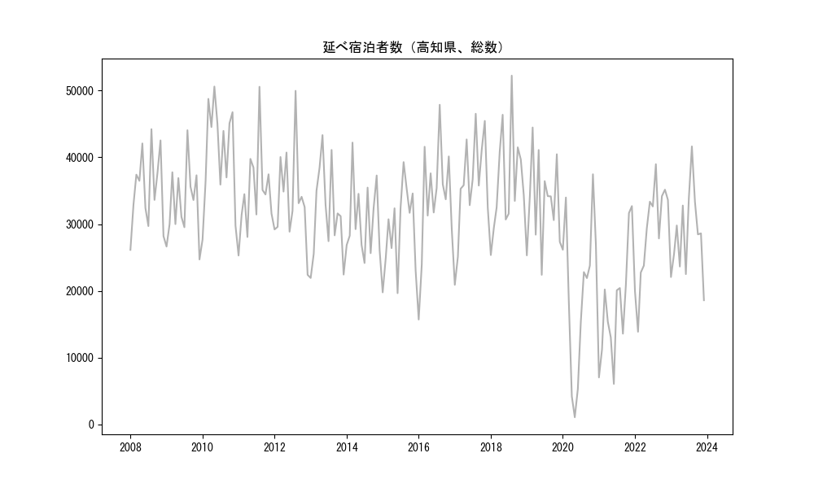
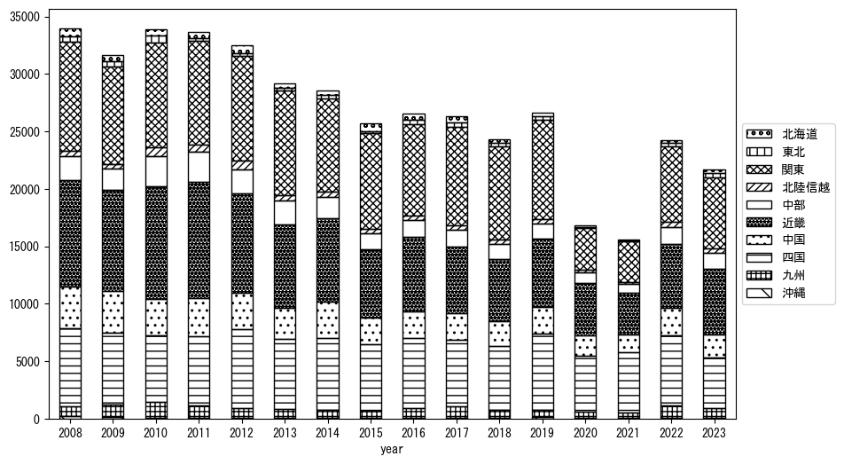
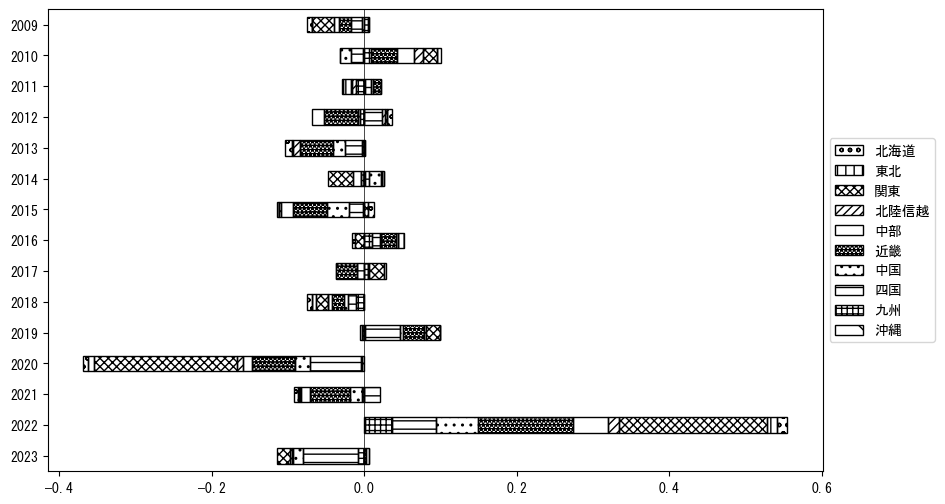
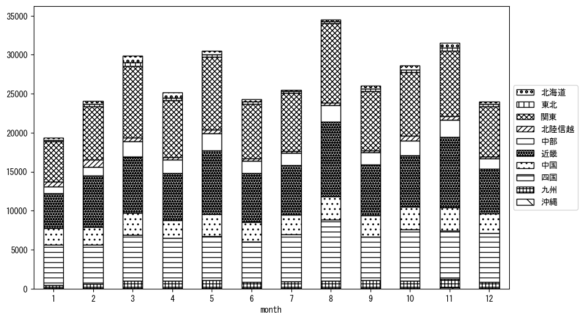
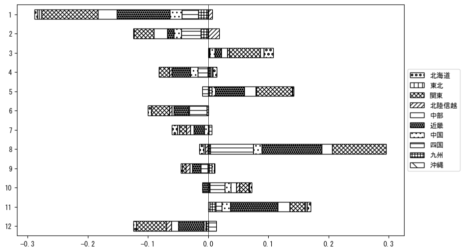

`<!DOCTYPE html>`{=html}
<html lang="ja">
<head>
    <meta charset="UTF-8">
    <meta name="description" content="">
    <link rel="stylesheet" href="../css/style.css">
    <title>宿泊者数の重心 | 高知県</title>
</head>    
<body>
<body>
<nav id ="global_navi">
    <ul>
        <li>[トップ](../index.html)</li>
        <li>[使い方](../how_to_use.html)</li>
        <li>[データについて](../on_data.html)</li>
        <li>[算出方法について](../method.html)</li>
        <li>[発展的な使い方](../developer.html)</li>
        <li>[サイトポリシー](../policy.html)</li>
    </ul>
</nav>
<ol class="breadcrumb">
    <li>[トップ](../index.html)</li>
    <li>高知県</li>
</ol>
<h1 id="h1_0">高知県</h1>

<ul>
  <li> **[１．延べ宿泊者（総数、月次）の推移](#h1_1)** 
    <ul>
      <li> [時系列グラフ](#h2_1) </li>
      <li> [基本統計量](#h2_2) </li>
    </ul>
  </li>  
</ul>

<ul>
  <li> **[２．宿泊者数の重心（年平均の推移）](#h1_2)** 
  <ul>
  <li> [重心の前年平均からの移動距離と方位、および緯度・経度](#h2_4) </li>
  <li> [運輸局別延べ宿泊者数](#h2_5) 
  <ul>
  <li> [時系列（年平均）](#h3_1) </li>
  <li> [寄与度（前年からの変化率に対する）](#h3_2) </li>
  </ul>
  </li>
  </ul>
  </li>
</ul>

<ul>
  <li> **[３．宿泊者数の重心（月別）](#h1_3)** 
  <ul>
  <li> [全期間（2008年1月～2023年12月）の平均と月別平均の比較](#h2_6) </li>
  <li> [運輸局別延べ宿泊者数](#h2_7) 
  <ul>
  <li> [月別平均（2008年1月～2023年12月）](#h3_3) </li>
  <li> [寄与度（全期間の平均から月別平均への変化率に対する）](#h3_4) </li>
  </ul>
  </li>
  </ul>
  </li>
</ul>

<ul>
<li> **[４．データのダウンロード](#h1_4)** </li>
</ul>

<h1 id="h1_1">１．延べ宿泊者（総数）の推移</h1>
<h2 id="h2_1">時系列グラフ</h2>

<figcaption>図１：高知県内の従業員数100人以上の宿泊施設での延べ宿泊者数（国外、居住地不詳を含む総数）。</figcaption>

<h2 id="h2_2">基本統計量</h2>
|  | 平均 | 標準偏差 | 最小値 | 最大値 |
|:----:|:----:|:----:|:----:|:----:|
| 2008年 | 35,280 | 5,810 | 26,143 (1月) | 44,218 (8月) |
| 2009年 | 33,099 | 5,467 | 24,704 (12月) | 44,061 (8月) |
| 2010年 | 40,966 | 7,417 | 27,684 (1月) | 50,602 (5月) |
| 2011年 | 34,840 | 6,488 | 25,296 (1月) | 50,566 (8月) |
| 2012年 | 33,951 | 7,055 | 22,402 (12月) | 49,963 (8月) |
| 2013年 | 31,605 | 6,942 | 21,931 (1月) | 43,331 (5月) |
| 2014年 | 30,753 | 5,584 | 24,173 (7月) | 42,211 (3月) |
| 2015年 | 29,181 | 6,332 | 19,657 (6月) | 39,287 (8月) |
| 2016年 | 33,683 | 8,401 | 15,707 (1月) | 47,873 (8月) |
| 2017年 | 35,893 | 7,635 | 20,907 (1月) | 46,527 (8月) |
| 2018年 | 36,499 | 7,747 | 25,365 (1月) | 52,235 (8月) |
| 2019年 | 33,270 | 6,731 | 22,405 (6月) | 44,473 (3月) |
| 2020年 | 19,804 | 11,515 | 1,075 (5月) | 37,463 (11月) |
| 2021年 | 17,694 | 8,443 | 6,071 (6月) | 32,700 (12月) |
| 2022年 | 28,793 | 7,358 | 13,877 (2月) | 38,971 (8月) |
| 2023年 | 28,402 | 6,411 | 18,600 (12月) | 41,634 (8月) |
: 表１：従業員数100人以上の宿泊施設での延べ宿泊者の総数（国外、および居住地不詳を含む）に関する基本統計量。単位は人。平均は１か月あたりの平均値を表す。図１に対応。

<h1 id="h1_2">２．宿泊者数の重心（年平均の推移）</h1>

<iframe src="../html/annual/高知県.html" width="1200" height="600"></iframe>
<figcaption>図２：高知県内の従業員数100人以上の宿泊施設での宿泊者数（国外、居住地不詳を除く）の重心（年平均の推移）。</figcaption>

[全画面表示](../html/annual/高知県.html)

<h2 id="h2_4">重心の前年平均からの移動距離と方位、および緯度・経度</h2>
|  | 方位 | 距離 | 緯度 | 経度 |
|:----:|:----:|:----:|:----:|:----:|
| 2008年 | --- | --- | 34.9896 | 136.1112 |
| 2009年 | 西南西 | 8.0km | 34.9704 | 136.0267 |
| 2010年 | 東北東 | 11.4km | 35.0237 | 136.1331 |
| 2011年 | 南南西 | 6.9km | 34.9643 | 136.1097 |
| 2012年 | 北東 | 7.6km | 35.0209 | 136.1563 |
| 2013年 | 東南東 | 10.0km | 34.9777 | 136.2521 |
| 2014年 | 西南西 | 15.3km | 34.9419 | 136.0907 |
| 2015年 | 東北東 | 25.4km | 35.0631 | 136.3265 |
| 2016年 | 西南西 | 12.5km | 35.0231 | 136.1981 |
| 2017年 | 東 | 7.3km | 35.0305 | 136.2773 |
| 2018年 | 南東 | 6.5km | 34.9958 | 136.3344 |
| 2019年 | 南西 | 12.4km | 34.9289 | 136.2250 |
| 2020年 | 西南西 | 69.6km | 34.7057 | 135.5141 |
| 2021年 | 東南東 | 4.7km | 34.6847 | 135.5588 |
| 2022年 | 東北東 | 42.7km | 34.8933 | 135.9509 |
| 2023年 | 東北東 | 19.5km | 34.9865 | 136.1323 |
: 表２：重心の前年平均からの移動距離と方位、および緯度・経度。図２に対応。

<h2 id="h2_5">運輸局別延べ宿泊者数</h2>
<h3 id="h3_1">時系列（年平均）</h3>

<figcaption>図３：高知県内の従業員数100人以上の宿泊施設での１か月あたり平均宿泊者数（国外、居住地不詳を除く）の運輸局別内訳。</figcaption>

<h3 id="h3_2">寄与度（前年からの変化率に対する）</h3>

<figcaption>図４：高知県内の従業員数100人以上の宿泊施設での運輸局別宿泊者数（国外、居住地不詳を除く）から求めた寄与度。</figcaption>

<h1 id="h1_3">３．宿泊者数の重心（月別）</h3>

<iframe src="../html/monthly/高知県.html" width="1200" height="600"></iframe>
<figcaption>図５：高知県内の従業員数100人以上の宿泊施設での宿泊者数（国外、居住地不詳を除く）の重心（月別）。観測期間は2008年1月から2023年12月まで。</figcaption>

[全画面表示](../html/monthly/高知県.html)

<h2 id="h2_6">全期間（2008年1月～2023年12月）の平均と月別平均の比較</h2>
|  | 方位 | 距離 | 緯度 | 経度 |
|:----:|:----:|:----:|:----:|:----:|
| 全期間 | --- | --- | 34.9500 | 136.0873 |
| 1月 | 西 | 8.7km | 34.9511 | 135.9924 |
| 2月 | 北東 | 23.8km | 35.0886 | 136.2862 |
| 3月 | 北東 | 25.6km | 35.1010 | 136.2990 |
| 4月 | 北東 | 6.6km | 34.9992 | 136.1277 |
| 5月 | 東 | 9.4km | 34.9661 | 136.1888 |
| 6月 | 南西 | 10.9km | 34.8823 | 136.0003 |
| 7月 | 南西 | 15.8km | 34.8342 | 135.9862 |
| 8月 | 南南西 | 12.2km | 34.8441 | 136.0524 |
| 9月 | 西南西 | 3.5km | 34.9367 | 136.0520 |
| 10月 | 北 | 2.1km | 34.9692 | 136.0876 |
| 11月 | 西北西 | 2.9km | 34.9625 | 136.0592 |
| 12月 | 西南西 | 18.3km | 34.8652 | 135.9161 |
: 表３：全期間の平均から月別平均までの移動距離と方位、および緯度・経度。図５に対応。

<h2 id="h2_7">運輸局別延べ宿泊者数</h2>
<h3 id="h3_3">月別平均（2008年1月～2023年12月）</h3>

<figcaption>図６：高知県内の従業員数100人以上の宿泊施設での宿泊者数（国外、居住地不詳を除く）の運輸局別内訳（月別）。</figcaption>

<h3 id="h3_4">寄与度（全期間の平均から月別平均への変化率に対する）</h3>

<figcaption>図７：高知県内の従業員数100人以上の宿泊施設での運輸局別宿泊者数（国外、居住地不詳を除く）から求めた寄与度（月別）。</figcaption>

</body>

<h1 id="h1_4">４．データのダウンロード</h1>
 <ul>
  <li> <a href="../csv/data_by_pref/延べ宿泊者数および重心（高知県）.csv" download>延べ宿泊者数および重心の緯度経度</a> </li>
  <li> <a href="../csv/bar_chart/運輸局別_年平均（高知県）.csv" download>運輸局別延べ宿泊者数（年平均）</a></li>
  <li> <a href="../csv/bar_chart_month/運輸局別_月別（高知県）.csv" download>運輸局別延べ宿泊者数（月別）</a></li>
  <li> <a href="../csv/contrib/前年からの変化率に対する寄与度（高知県）.csv" download>前年からの変化率に対する寄与度</a></li>
  <li> <a href="../csv/contrib_month/月別平均への変化率に対する寄与度（高知県）.csv" download>月別平均への変化率に対する寄与度</a></li>
</ul>

出典：観光庁「宿泊旅行統計調査」に収録された「施設所在地別、居住地別延べ宿泊者数（従業員数100人以上の施設）」

国土地理院「白地図（[地理院タイル](https://maps.gsi.go.jp/development/ichiran.html)）」（図２と図５）

